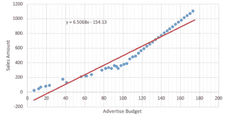
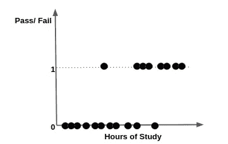
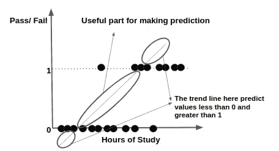
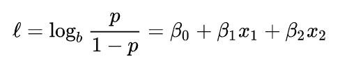
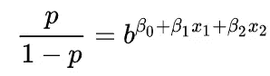
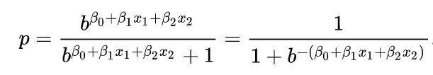
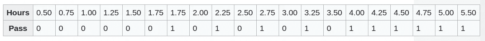
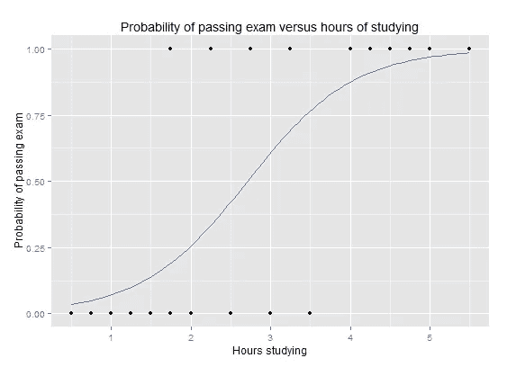

# 机器学习:从线性回归到逻辑回归的旅程

> 原文：<https://medium.com/analytics-vidhya/machine-learning-a-journey-from-linear-regression-to-logistic-regression-741c4236e3cd?source=collection_archive---------14----------------------->

**线性和逻辑回归。来源:谷歌图片。**

> **逻辑回归**，机器学习的重要组成部分之一，详细了解它以及模型如何工作非常重要？当我们读到与回归有关的话题时，第一个问题总是出现，那就是**什么是回归？**
> 
> **回归分析**是一组统计过程，用于估计因变量(通常称为“结果变量”)和一个或多个自变量(通常称为“预测值”、“协变量”或“特征”)之间的关系。

***线性回归:***

> 现在，让我们先讨论一下**线性回归**，因为它是建立逻辑回归的基础。
> 
> 这里，我们处理两种技术简单线性回归和多元线性回归，多元线性回归基本上试图使用最小二乘法找出最佳拟合线。为了获得最佳拟合直线，回归模型会找到各种回归直线，并找到数据集中所有数据实例的最小和。具有最小总和值的一条被认为是最符合数据的最终趋势线。

简单线性回归的例子。来源:谷歌图片。

*我举一个简单线性回归的例子来详细解释这个话题。*

*我们知道* ***一元线性回归*** *起作用的方程是:****y = bo+B1 * x****。该方程找出拟合数据集的最佳拟合线，并根据广告预算预测销售额。*

*这里预测超过 0 和 1 的值。但是，如果我们的数据集点发生了一些变化，并且我们希望预测结果，比如通过/失败、是/否等等，该怎么办呢？那么，线性回归的概念就失效了，无法处理这样的情况。*

**数据集点的例子。**

*正如您在图表中观察到的趋势分析，学生在学习特定小时数后是不及格还是及格。*

你能想到在这样的图上画一条线性回归线吗？

我想你会想到一句类似的话。但是，您是否观察到趋势线的下部和上部，趋势线预测小于 0 的值和大于 1 的值，这是没有用的，会降低模型的准确性。趋势线的中间部分有助于预测。

> **现在，逻辑回归的作用来了，它克服了线性回归的缺点。**

> *在统计学中，逻辑模型用于预测某一类或某一事件存在的概率，如通过/失败、赢/输等。*
> 
> *逻辑回归是一种统计模型，其基本形式是使用逻辑函数来模拟二元因变量。数学上，二进制逻辑模型有一个因变量，该因变量有两个可能的值，例如通过/失败，这由逻辑模型中标记为“0”和“1”的两个值来表示。*
> 
> *标记为“1”的值的相应概率可以在 0(当然是值“0”)和 1(当然是值“1”)之间变化，因此进行标记；将对数概率转换为概率的函数是逻辑函数，因此得名。对数比尺的测量单位被称为 **logit** ，来自**log**ist un**it**，因此有了其他的名字。*

****逻辑回归的数学解释:****

> *让我们通过考虑一个具有给定参数的逻辑回归模型来理解逻辑回归，然后看看如何从数据中估计系数。考虑一个具有两个预测值 x1 和 x2 以及一个二元结果 Y 的模型，我们表示为 p=P(Y=1)。我们假设预测变量和 Y=1 事件的对数优势之间存在线性关系。*

**

***线性关系。***

> *我们可以通过对对数赔率求幂来恢复赔率:*

**

***求幂运算***

> *通过简单的代数运算，Y=1 的概率为:*

**

***概率***

> *上述公式表明，一旦𝝱 **1** 固定，我们可以很容易地计算出给定观测值的 **Y=1** 的对数几率，或者给定观测值的 **Y=0** 的概率。*

****举例:通过考试的概率与学习时间:****

> *一组 20 名学生花 0 到 6 个小时准备考试。学习时间的长短如何影响学生通过考试的概率？*
> 
> *对这个问题使用逻辑回归的原因是，因变量的值，通过和失败，而用“1”和“0”表示。*
> 
> *表格显示了每个学生花在学习上的时间，以及他们是通过(1)还是不及格(0)。*

**

*这张表显示了每个学生花在学习上的时间，以及他们是通过(1)还是不及格(0)。*

> *该图显示了通过考试的概率与学习小时数的关系，数据拟合了逻辑回归曲线。*

**

***显示通过考试的概率与学习时间的逻辑回归曲线图。***

> ****结论:*******Logistic 回归*** *是一种基于一个或多个自变量预测二元响应概率的统计技术。这意味着，在给定某个因素的情况下，* ***逻辑回归*** *用于预测一个结果，该结果具有两个值，如 0 或 1、通过或失败、是或否等。logit 函数绘制最佳拟合线。***

# **"感谢您在宝贵的时间阅读这个关于机器学习算法之一的博客."**