# 基于决策树的学生成绩预测和可视化机器学习算法

> 原文：<https://medium.com/analytics-vidhya/machine-learning-algorithm-for-student-grade-prediction-and-visualization-using-decision-tree-7bfeb10c2ee8?source=collection_archive---------6----------------------->

迈克尔·克里斯滕森在 [Unsplash](https://unsplash.com?utm_source=medium&utm_medium=referral) 上的照片

本文是[第一部分](/@bayyaraghu08/data-science-techniques-to-predict-students-grade-step-by-step-using-machine-learning-algorithms-3c839c9c8ff7)的延续

用决策树来看，学生缺课的小时数会如何对学生的成绩进行分类。

对于任何机器学习模式，准备数据集都非常重要。如果您没有清理和预处理您的数据集，您的模型将无法工作。

> **初始步骤是导入包(库)**

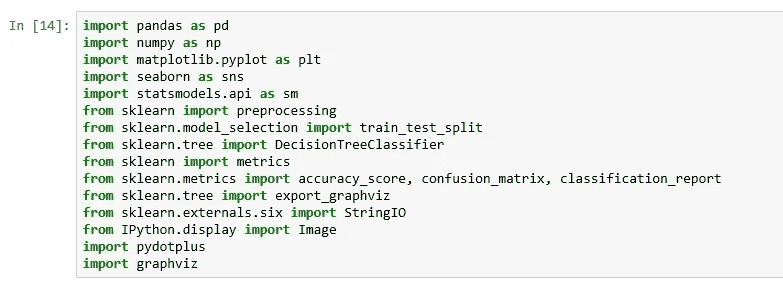

来源:Jupyter 笔记本

从顶部的 **pandas** 库用于导入数据，管理和存储数据集作为数据帧， **Numpy** 用于所有数学事物， **matplotlib** 用于将**数据虚拟化为不同的条形图和图表，同样，为了更好地可视化，seaborn 库是最合适的。为了进一步在数据集上执行机器学习操作，它使用来自子程序包的 **sklearn** 库。**

> **导入和读取数据集**

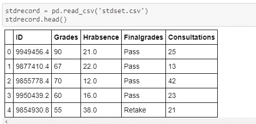

来源:Jupyter 笔记本

数据集 stdset.csv 已经保存到 pandas pd 变量 stdrecord 中，现在您可以在 python jupyter 笔记本中访问任何内容。

> **万一！缺失值**

在数据集中存在缺失值的机器学习算法中，无法给出预期的结果，填补缺失值非常重要。但是删除缺失值的完整行并不是一个明智的想法。这很容易引起问题。最常见的解决方案是取列的平均值，并用平均值替换缺失值。

使用包含强大机器学习模型的 Sklearn 包进行预处理。[用于数据清理技术](https://github.com/bayyaraghu/Data-Cleaning)。

*as，从 sklearn 导入预处理*

> **万一！分类数据**

在数值的情况下，我们可以找到平均值，清除丢失的值，并执行其他数学运算。机器学习只能读取和理解数值。但不能取“及格”、“重做”、“重考”的平均值。我们可以将分类值编码成数值，但是要使用[标签编码器](https://scikit-learn.org/stable/modules/generated/sklearn.preprocessing.LabelEncoder.html)、[一个热编码器](https://scikit-learn.org/stable/modules/generated/sklearn.preprocessing.OneHotEncoder.html) (sklearn 库)和[哑元](https://pandas.pydata.org/pandas-docs/stable/reference/api/pandas.get_dummies.html)(熊猫库)。

将 encoder 应用到需要的列，并将标签名调用到 encoder 中。

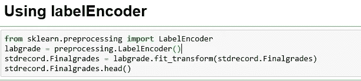

来源:Jupyter 笔记本

使用 Label Encoder，它会将分类值“通过”转换为 0，“重做”转换为 1，“重取”转换为 2，并从我们的数据集转换为一列 Finalgrades。

Pandas dummy 类似于标签编码器，但它分裂到每个单独的列。来自 **sklearn 库** **的一个热编码器**对分类值进行类似的工作。

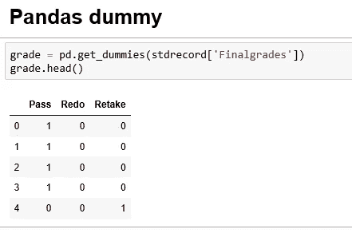

来源:Jupyter 笔记本

使用 pandas 库将虚拟数据连接到实际数据集以观察差异。并申请机器学习模型。

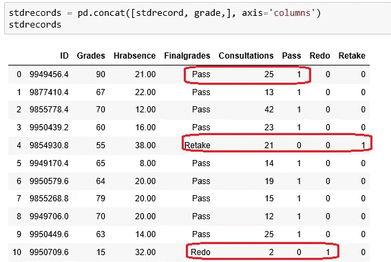

来源:Jupyter 笔记本

**将数据集拆分为训练集、验证集和测试集**

> **培训模式**

使用[*sk learn . model _ selection . train _ test _ split*](https://scikit-learn.org/stable/modules/generated/sklearn.model_selection.train_test_split.html)将可用数据集拆分为训练和测试

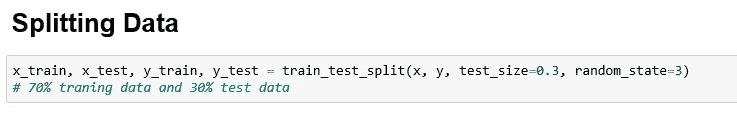

来源:Jupyter 笔记本

在使用机器学习算法之前，我们必须在做任何事情之前分割数据，这是获得模型性能可靠估计的最佳方式。拆分数据后，在准备好选择最终模型之前，不应该使用测试数据集。

训练集用于拟合和调整您的模型。测试集被放在一边，以便评估您模型，看看它如何实时工作。

另一方面，我们可以从我们的训练集中分离验证数据集。这用于在训练过程中验证我们的模型，有助于提供调整超参数的信息。

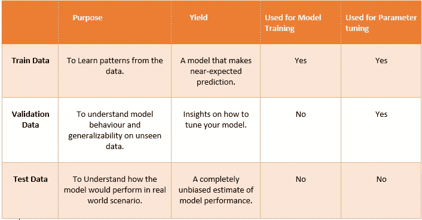

为模型训练、验证和测试拆分数据。

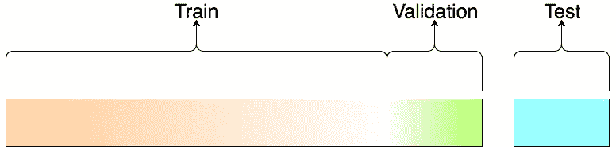

数据集分割比

> **机器学习算法**

将数据分为训练和测试后，现在是将训练数据与模型相匹配的时候了。使用[决策树分类器()](https://scikit-learn.org/stable/modules/generated/sklearn.tree.DecisionTreeClassifier.html)。

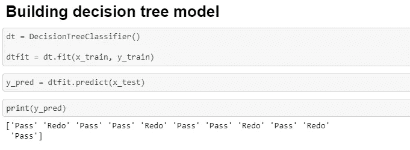

来源:Jupyter 笔记本

一旦模式被拟合，我们就可以在测试数据集上使用 dtfit.predict(x_test)来预测结果。

> **绩效评估**

**评价**

在模型评估中，我们尝试使用 metrics.accuracy_scoure(y_test，y_pred)来查看算法的性能。比较 y_test 和 y_pred 数据集。

*来自 sklearn.metrics 导入准确度 _ 得分、混淆 _ 矩阵、分类 _ 报告*

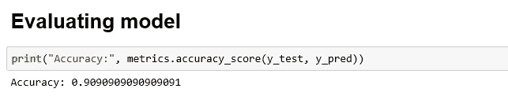

来源:Jupyter 笔记本

> **混乱矩阵**

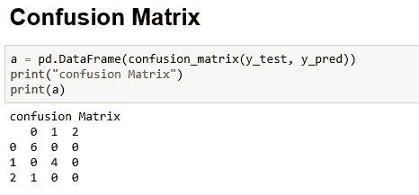

来源:Jupyter 笔记本

> **分类报告**

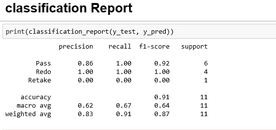

来源:Jupyter 笔记本

> **可视化决策树**

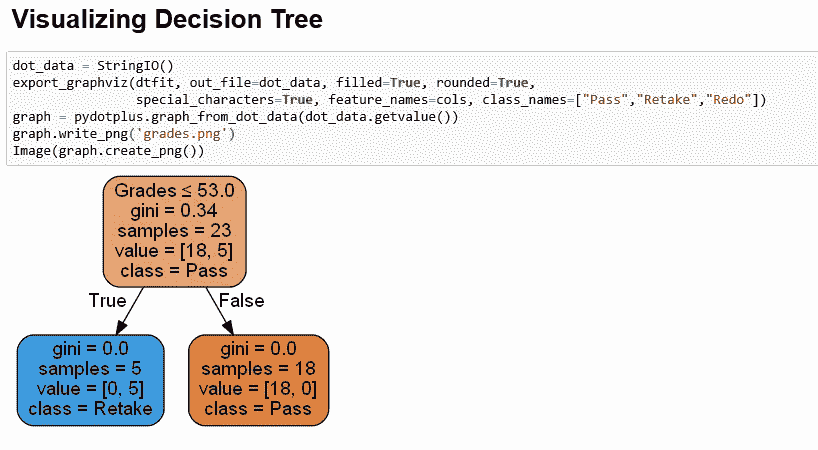

来源:Jupyter 笔记本

> **优化决策树**

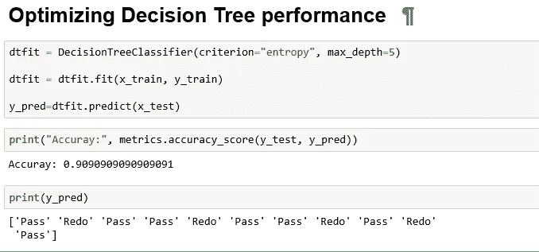

来源:Jupyter 笔记本

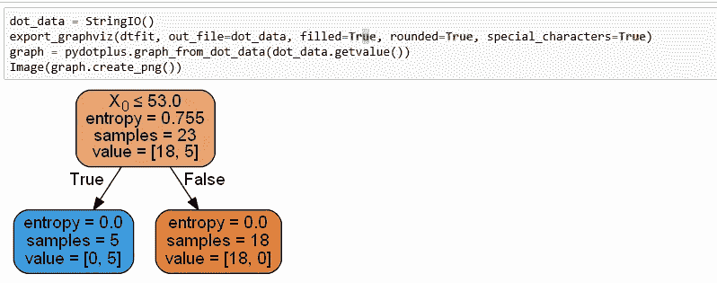

来源:Jupyter 笔记本

第二部分: [Github/JupyterNotebook 来源](https://github.com/bayyaraghu/Usecase/blob/master/Untitled2.ipynb)

在下一篇文章的第 3 部分，神经网络使用影响学生表现的**缺课小时数**和**咨询**来预测学生成绩。使用 keras 和 Tenserflow。

**关于作者** : Raghu Bayya，数据科学家 ML/Deep Learning。

大数据专家