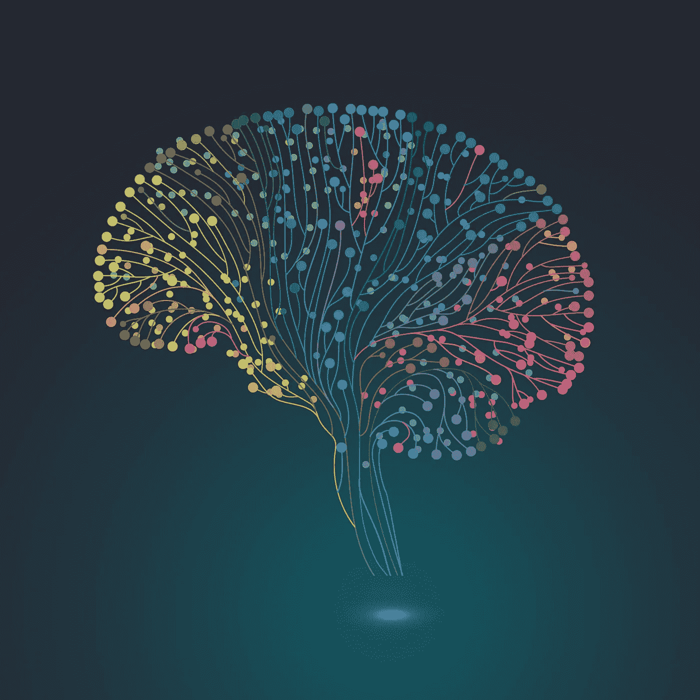

# 机器学习算法— 2

> 原文：<https://medium.com/analytics-vidhya/machine-learning-algorithms-2-b4abc3c06b43?source=collection_archive---------24----------------------->

# (代码部分)

HMM python 使用隐马尔可夫模型代替 RNN(递归神经网络)的文本预测

是不是一直要用神经网络？答案是否定的！还有其他算法可能优于神经网络。

本文是[上一篇文章](/machine-learning-key-algorithms/hmm-markov-chain-machine-learning-algorithms-2-39c62b00a198?source=friends_link&sk=389be58d121577a3f21ba4deecc4987e)关于 HMM 和 RNN 以及它们之间的混合模型的编码部分。