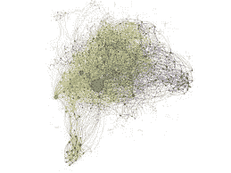
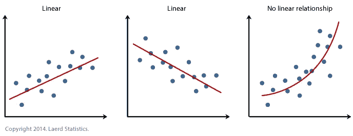

# 机器学习算法— 1

> 原文：<https://medium.com/analytics-vidhya/machine-learning-algorithms-57e8e5e26ed?source=collection_archive---------33----------------------->

> ***线性回归***

机器学习。让我们用一种更简单的方式来说。让机器学习。机器学习是一个巨大的领域，有助于跟踪最新技术。

让我们进入正题。机器是如何工作的？这是一种简单而直接的方式，将算法输入机器，并对其进行更多的训练。

什么是算法？算法是机器为了找到想要的结果而遵循的路径。

新出生的婴儿会一步一步地走路。我们告诉他们靠墙走，教他们“行走的算法”。机器开始学习新算法和产生新结果是一回事。

那么，最重要的算法是什么呢？我们将从最近也是最有趣的回归开始

这一切始于 19 世纪的弗朗西斯·高尔顿。高尔顿是一位分析父母和孩子之间关系的科学家。更具体地说，高尔顿正在研究父亲身高和儿子身高的关系。

起初，高尔顿意识到儿子的身高与父亲如此接近。经过进一步研究，他发现了更有意义的东西，即儿子的身高更接近所有人的“平均”身高，而不是他的父亲。

回归的想法就是从这里产生的，回归本身就是一个长域！高尔顿最后得出结论，儿子的身高“回归”了“平均”身高，这表明他接近所有人的平均身高。

有趣吧？今天，回归是一种算法，被认为是机器学习的基本方法。

从技术上讲，线性回归是在给定 x 的情况下预测值 y。

就这么简单！

线性回归关系

我希望你觉得这篇文章很有趣。敬请关注更多关于机器学习算法的故事。