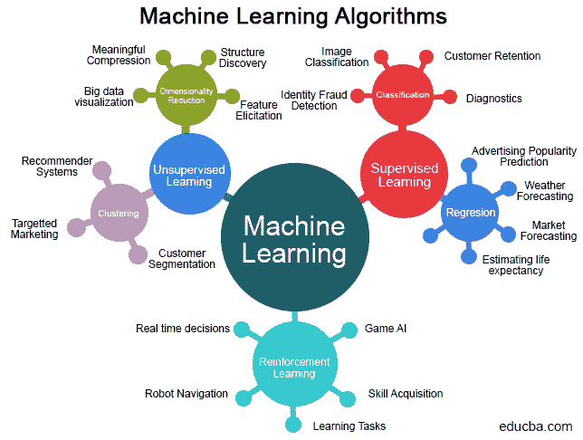
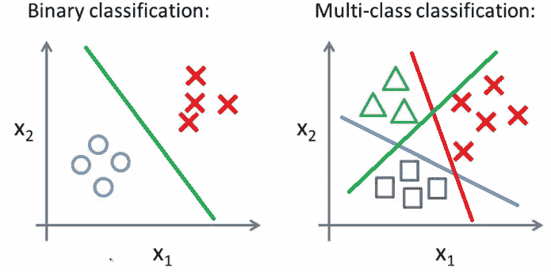
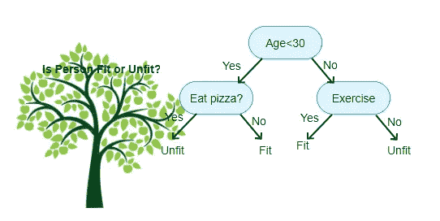
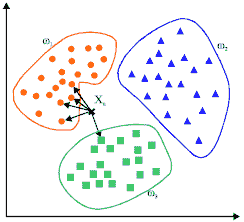
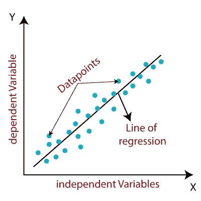
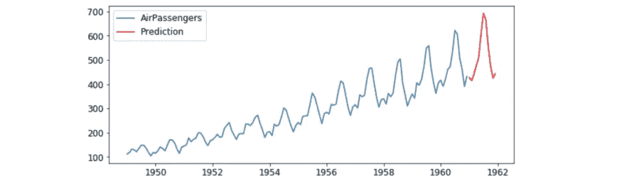
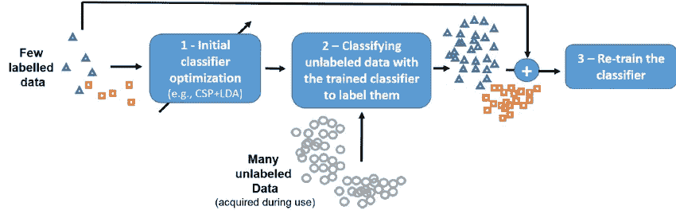
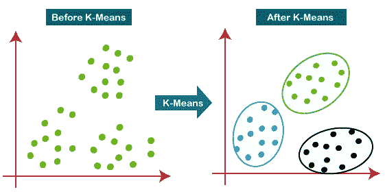
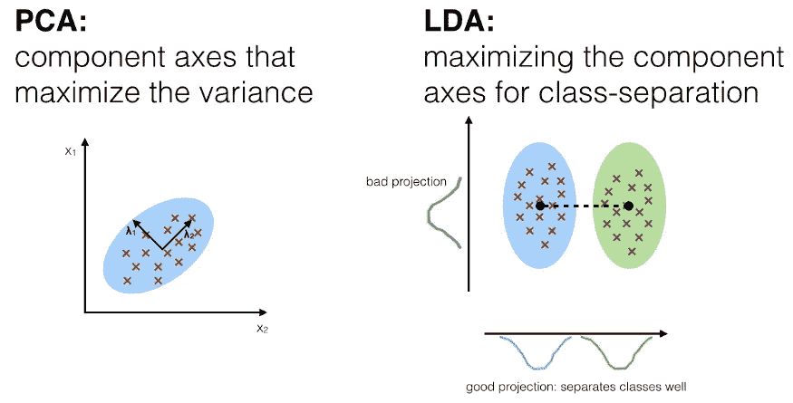
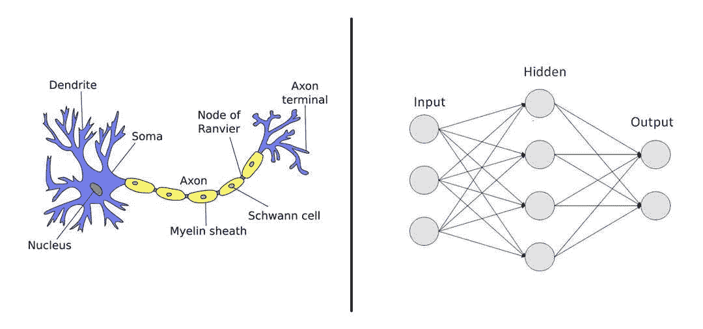

# 机器学习算法

> 原文：<https://medium.com/analytics-vidhya/machine-learning-algorithms-b8e182cbdf94?source=collection_archive---------8----------------------->

**-简要概述**

# **什么是机器学习？**

阿瑟·塞缪尔(1959):“给予计算机无需明确编程就能学习的能力的研究领域”。

Tom Mitchel (1997):“一个计算机程序可以学习它在任务 T 中的表现，用表现 P 来衡量，是否随着经验 E 而提高”。

# **使用什么类型的机器学习算法？**

选择正确的机器学习算法取决于几个因素，包括数据的大小、质量和性质。选择正确的算法是业务需求、规格、实验和可用时间的结合。这里我们将探讨不同的机器学习算法。

有四种类型的机器学习算法，它们是:

*   监督学习
*   半监督学习
*   无监督学习
*   强化学习

# 监督学习:

在监督学习中，我们提供包括输入和期望输出的已知数据集。机器找到一种方法来确定给定输入集的输出。

监督学习算法的类型有:

**A .分类:**这种机器学习算法会从观测值中得出结论，并确定新观测值属于哪一类。

以下是不同的分类算法:

**1。逻辑回归:**逻辑回归用于预测目标变量的概率。目标或因变量的性质是二分的，这意味着只有两种可能的类别(0 或 1)。

> 逻辑回归的类型:
> 
> **a .二元或二项式:**因变量将只有两种可能的类型(0 或 1)。
> 
> **b .多项式:**因变量可以有三种或三种以上可能的无序类型或无数量意义的类型。比如“A 型”或者“B 型”或者“C 型”。
> 
> **c .序数:**此处因变量可以有三种或三种以上可能的有序类型或具有数量意义的类型。例如 t 恤尺寸，“小号”、“中号”、“大号”、“特大号”等。

**2。朴素贝叶斯分类器算法:**朴素贝叶斯分类器基于贝叶斯定理，将每个值独立于任何其他值进行分类。它允许我们基于一组给定的特征，使用概率来预测一个类别。

**3。支持向量机:** SVM 本质上是将数据过滤成类别，这是通过提供训练样本来实现的，每组样本被标记为属于两个类别中的一个或另一个。然后，该算法构建一个模型，为一个类别或另一个类别分配新值。

**4。决策树**:决策树可以用来解决回归和分类问题。流程图像树结构一样，使用分支方法来说明决策的每一个可能的结果。树中的每个节点代表对特定变量的测试，每个分支都是该测试的结果。

来源:aitimejournal

**5。随机森林:**它是一种集成学习方法，结合多种算法，为分类、回归等任务生成更好的结果。

来源:Javapoint

**6。最近邻:**K 最近邻算法估计一个数据点成为一个组或另一个组的成员的可能性。它主要是查看单个数据点周围的数据点，以确定它实际上属于哪个组。

**B .回归:**回归分析由一套机器学习方法组成，允许我们根据一个或多个预测变量的值来预测变量的连续结果。

**C .预测:**这里我们根据过去和现在的数据进行未来的预测。

# **半监督学习:**

半监督学习是一种在训练过程中结合少量已标记数据和大量未标记数据的机器学习方法。机器将从给定的标记数据中理解并开发算法，并尝试预测新数据的标签。

# **无监督学习:**

无监督的机器学习算法从数据集推断模式，而不参考已知或标记的结果。与监督学习不同，非监督学习不能应用于回归或分类问题，因为我们没有关于输出数据的信息。因此，无监督学习用于确定数据的潜在模式。

无监督学习的类型有:

1.  **聚类:**聚类是将一组观察值分配到子集中，使得同一聚类中的观察值是相似类型的。
2.  **K 表示聚类算法:**用于对未标记的数据进行分类，即没有定义类别或组的数据。该算法通过在数据中寻找组来工作，组的数量由变量 K 表示。然后，它迭代地工作，以基于所提供的特征将每个数据点分配到 K 个组中的一个。

**3。降维:**降维减少了寻找所需信息所考虑的变量数量。

# **强化学习:**

强化学习是一种动态编程，它使用奖励和惩罚系统来训练算法。强化学习算法或代理通过与其环境交互来学习。代理通过正确执行获得奖励，通过错误执行获得惩罚。因此，它从经验中学习，并开始根据情况调整其方法，以实现最佳的潜在结果。

**人工神经网络(ann):**这些是受人类生物神经网络启发的计算系统。人工神经网络是基于称为人工神经元的连接单元或节点的集合，它松散地模拟生物大脑中的神经元。每个连接就像生物大脑中的突触一样，可以向其他神经元传递信号。人工神经网络还可以通过实例和经验进行学习，对于高维数据中的非线性关系建模或输入变量之间的关系难以理解的情况，人工神经网络非常有用。

