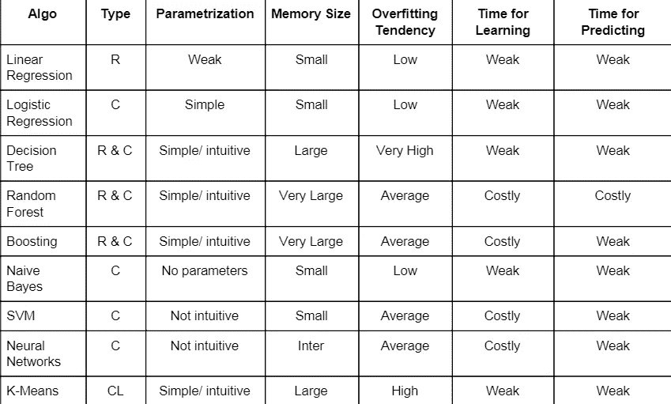

# 机器学习算法

> 原文：<https://medium.com/analytics-vidhya/machine-learning-algorithms-c3a5e0162351?source=collection_archive---------41----------------------->

机器学习是人工智能的一个分支，它允许计算机系统直接从例子、数据和经验中学习。它有许多算法，不幸的是，我们无法为正确的问题选择正确的算法。以下是帮助我们选择正确算法的因素

## 因素有助于选择算法

1-算法类型

2-参数化

3-内存大小

4-过度拟合趋势

5-学习时间

6 次预测

## 算法类型

**1。回归**

它是一种用于预测自变量集合中因变量的技术。回归下的算法有

一元线性回归

2-决策树

3-随机森林

4-升压

**2** 。**分类**

它是一种用于从输入变量(X)到离散输出变量(y)逼近映射函数(f)的技术。归入分类的算法有

1-逻辑回归

2-朴素贝叶斯

3-SVM

4-神经网络

5-决策树

6-随机森林

6-升压

**3** 。**聚类**

它是一种将群体或数据点分成多个组的技术，使得同一组中的数据点与同一组中的其他数据点更相似，而与其他组中的数据点不相似。K-means 是用于聚类的重要算法

注意决策树、随机森林和 Boosting 是可用于分类和回归的算法

## 参数化

参数是机器学习算法的关键。它们是从历史训练数据中学习的模型的一部分。参数是机器学习算法的关键。它们是从历史训练数据中学习的模型的一部分。我们将参数分类为

1-无参数

2-弱

3-简单/直观

4-不直观

## 存储容量

这是我们存储数据和变量所需的空间。研究人员正在努力解决 DRAM 设备的有限内存带宽，今天的系统必须使用这些设备来存储 dnn 中的大量权重和激活。GPU 和其他为矩阵代数设计的机器也在神经网络的权重和激活上遭受另一个内存乘数。我们将所需的内存大小分类为

1-小型

2-大号

3-非常大

## 过度拟合趋势

当模型试图预测数据中的趋势时，噪音太大。过度拟合是具有太多参数的过于复杂的模型的结果。过度拟合的模型是不准确的，因为趋势不能反映数据的真实情况。有许多技术可以用来减轻过拟合，包括交叉验证、正则化、早期停止、修剪、贝叶斯先验、丢弃和模型比较。我们将过度拟合趋势分类为

1-低

2-平均值

3-高

4-非常高

## 学习时间到了

学习时间是与数据集训练相关的时间。它随着数据的大小和我们使用的算法而变化。我们将学习时间分为

1-弱

2-成本高

3-非常昂贵

## 预测的时间

预测时间是与数据集测试相关的时间。它随着数据的大小和我们使用的算法而变化。我们将学习时间分为

1-弱

2-成本高

