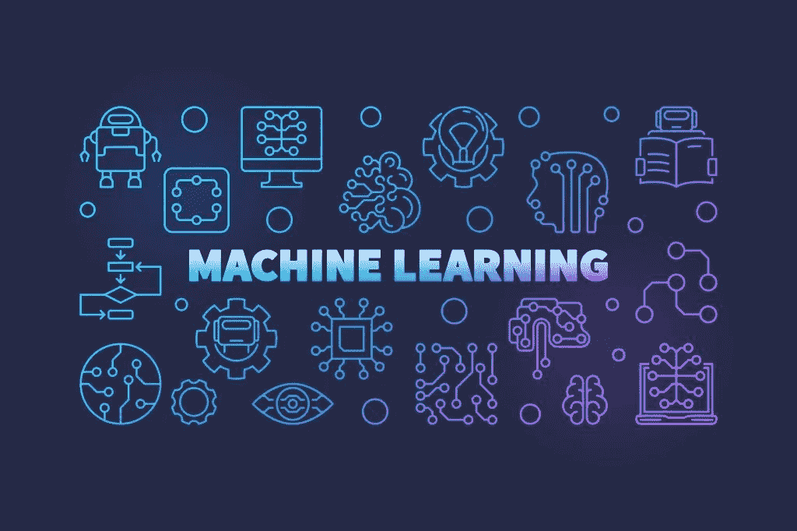

# 机器学习算法-详尽列表

> 原文：<https://medium.com/analytics-vidhya/machine-learning-algorithms-exhaustive-list-e69df578c883?source=collection_archive---------11----------------------->

图片来源:[https://hacker noon . com/5-types-of-machine-learning-algorithms-you-should-know-kz2dx 2002](https://hackernoon.com/5-types-of-machine-learning-algorithms-you-should-know-kz2dx2002)

了解和理解大多数机器学习算法是极其重要的。有很多机器学习算法的应用，如**回归**、**分类**、**聚类**、**维数**、**约简**、**集成方法**、**神经网络**、**深度学习**、**迁移学习**、**强化学习**、**自然语言处理**、&、**单词**