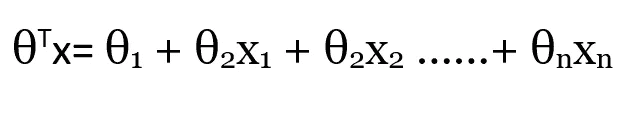
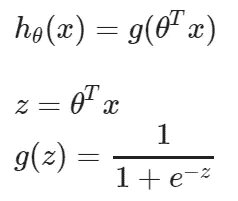
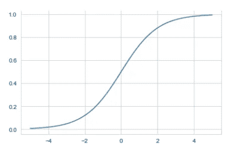
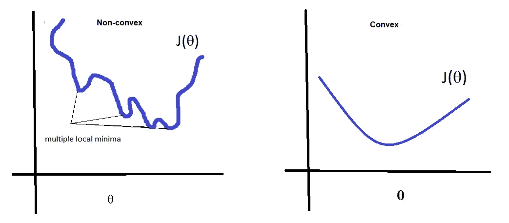
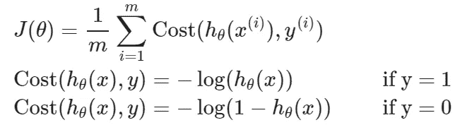
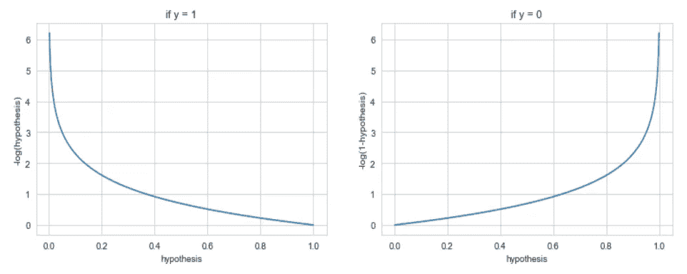
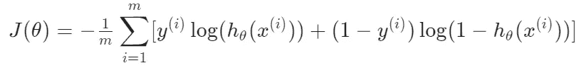

# 机器学习算法:逻辑回归

> 原文：<https://medium.com/analytics-vidhya/machine-learning-algorithms-logistics-regression-8ba38af531b3?source=collection_archive---------24----------------------->

Tom Mitchell 的一个最著名的定义将机器学习表述为“当性能 P 随着任务 T 超过经验 E 而提高时，性能 P 的计算机程序据说从一组任务 T 和经验 E 中学习”。构建和训练可以学习手头问题的算法，基本上就是机器学习的全部思路。它们分为回归和分类问题。当输出在连续范围内时，例如汽车价格、降雨量等。那么就是一个回归问题。然而，当输出是分类的，比如说，它是一个欺诈交易或不是，那么它被称为分类问题。在这一系列文章中，我将直观地介绍广泛用于解决问题的不同类型的算法。我们将在本文中讨论最常用的分类算法之一逻辑回归。开始分类吧！☺

威尔·弗朗西斯在 [Unsplash](https://unsplash.com?utm_source=medium&utm_medium=referral) 上的照片

# 逻辑回归

线性回归算法是做什么的？它试图得到一个本质上是数字的输出，以便与实际值相比，损失或剩余尽可能低。逻辑回归几乎是根据这个原理工作的。但是我们希望输出介于 0 和 1 之间，而不是任何数值。为了解决这个问题，让我们改变假设的形式，以满足条件 0≤ *hθ* ( *x* )≤1。Sigmoid 函数是一种帮助将线性函数转换为 0 到 1 之间的值的函数。因为该值在 0 和 1 之间，所以它可以与和特定类别相关联的概率值相关。让我们考虑一个有 n 个变量 x1 到 xn 的线性函数。设θ是与线性函数中的变量相关的系数或权重。

下图解释了 s 形曲线的样子。

梯度下降算法是线性回归中最常用的方法，用于获得与独立变量相关的最佳权重。梯度下降根据实际值计算与预测值相关的损失。该算法以相关损失尽可能低的方式操作系数。从图形上看，梯度下降算法以尽可能接近全局最小值的方式工作。但是当涉及到物流回归时，这种方法是一个死胡同。损失的非线性使得梯度下降法不方便。它们形成了如下左图所示的非凸函数。因此，为了以凸形式获得我们的损失，我们使用对数损失函数来获得合适的系数以减少损失。

逻辑回归的对数损失函数分为两部分。一个用于标签 y=0，另一个用于标签 y=1。

那么为什么要使用对数函数呢？从下面的图表中可以清楚地看到，错误的分配所带来的惩罚是非常巨大的。当预测值接近 0 而不是 1 时，对数损失的值接近无穷大。类似地，当预测值接近 1 而不是 0 时产生的惩罚也是巨大的。因此，对数损失函数显然满足目的，并且因此对于分类算法来说工作良好。

当 y 等于 0 和 1 时，上述两个对数损失函数可以组合在一起形成单个对数损失函数。

赞成的意见

1.  物流回归算法简单，易于解释。
2.  它们可以很容易地扩展到多个类的问题。

骗局

1.当数据不能线性分离时，逻辑回归表现不佳。因此，决策界限将很难构建。

希望你读得不错。请鼓掌以示支持，并关注我以获取更多文章☺