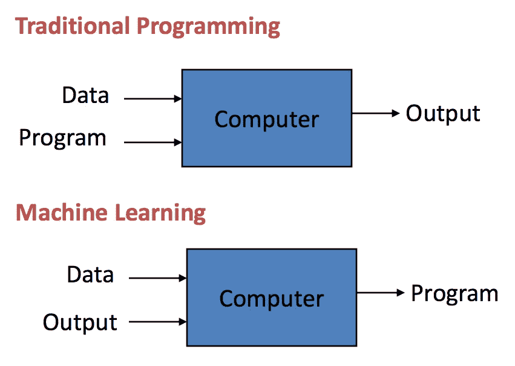
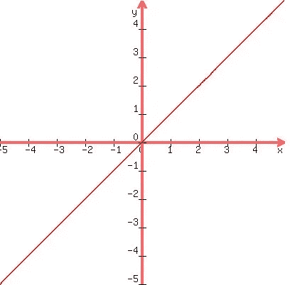

# 机器学习:导论

> 原文：<https://medium.com/analytics-vidhya/machine-learning-an-introduction-4397ae8fc078?source=collection_archive---------23----------------------->

“机器学习”，当你踏入这个科技时代的那一刻，你可能会听到最流行的词汇之一。

我们每个人都在有意或无意地使用这项伟大的技术。你不相信我吗？？？

让我们来看看机器学习最著名的实现:“谷歌”。

惊讶吗？？？

你如何看待谷歌搜索并根据你的搜索为你提供最相关的链接？或者您的电子邮件如何将一些邮件归类为垃圾邮件，而将一些归类为主要邮件？？

嗯，这些都是机器学习的应用。但问题是机器学习到底是什么？？

机器学习的第一个定义是阿瑟·塞缪尔在 1959 年给出的:

> **“
> 研究领域，赋予计算机无需明确编程就能学习
> 的能力。”**

现在让我们深入探究这意味着什么。

我们知道，计算机是人类开发的最聪明的机器，能够执行程序员编写的任何任务。但是这里有一个限制。为执行特定任务而对机器进行编程的限制。

让我们举一个例子。假设您获得了以下数据:

x = 1，y = 2；x = 2，y = 4；x = 3，y =？

现在，你可以清楚地看到，关系是 y = 2 * x。你现在可以很容易地对机器编程，以产生给定 x 的 y。

但是假设用户将数据更改为:

x = 1，y = 3；x = 2，y = 6；x = 3，y =？

这里你可以看到，关系是 y = 3 *x，但是这里有一个问题。你需要再次给机器编程，找到对应于 x 的 y 的值，而随着用户不断更改数据，你需要一次又一次地给机器重新编程，才能相应地工作。

但是如果机器自己识别出这种关系呢？

假设你输入任何数据，机器本身会找到数据之间的关系，并提供相应的输出。这不会使工作变得容易得多吗？？？

这就是机器学习发挥作用的地方。它帮助计算机根据提供给它的数据进行自我编程，并相应地产生输出。

现在，您可以将传统编程与上面的例子联系起来，在上面的例子中，给定了不同的 x 和 y 值，您必须用适当的关系对机器进行编程，以便接收输出。

但在机器学习的情况下，你只需要给机器提供 x 和 y 的值，根据这些数据，机器会自己编程并产生所需的输出。

现在让我们看看机器学习的一般定义。

***“机器学习是人工智能的一个子领域，涉及允许计算机自主学习的算法”***

术语“算法”在这里指的是计算机用来进行自我编程并根据所提供的输入产生所需输出的过程。

让我们继续深入，看看机器学习实际上是如何工作的。

机器学习可以分为以下几个阶段:

1.  培训用数据
2.  建模数据
3.  预测产量

在**第一阶段**中，我们的工作是为机器提供**训练数据**，即机器用来训练自己开发有效程序以产生正确输出的数据。

让我们举个例子:x=1，y = 1；x=2，y = 2；x=3，y = 3；x=4，y=？

现在，上面的 x = 1，2，3 及其相应的 y 值将构成我们的训练数据，机器将使用这些数据来训练自己。

现在是**的第二阶段**，机器将自己建模，或者更清楚地说是程序本身。为此，我们有几种算法，可以让机器自己编程。但是这里我们将只讨论基本程序，它是大多数算法的基础。

根据收到的数据，机器将绘制一条最佳拟合直线，如下所示:

现在，根据这条绘制的线，机器将预测进一步的输出，即**最后阶段(预测)。**

假设最初询问 x=4，那么为了预测它的 y，机器将在图上画出 x = 4，并使用上面显示的最佳拟合线来预测与之对应的 y，从上面的图可以清楚地看出 y=4。

正如你所看到的，在提供的数据的帮助下，我们的机器本身给了我们想要的输出。

这只是机器学习，在给定数据(训练数据)的帮助下，机器自己编程(创建模型例如。此处为图表)来预测最终输出。

现在你一定想知道，我们在这里很容易地形成了图形，因为我们有坐标。如果我们没有这种类型的数据怎么办？或者你可能认为绘制这些点是可以理解的，但是机器是如何绘制出最佳拟合直线的呢？

好吧，如果这些是困扰你的问题，那么恭喜你，你已经成功地通过了机器学习的介绍，并即将深入其中，你将看到机器学习实际上是如何工作的，以及它是如何实现的，在这里你将找到所有问题的答案。为此，请继续阅读我们的下一篇博客:(正在进行中，即将发表)。

敬请期待，祝阅读愉快！！！！！！