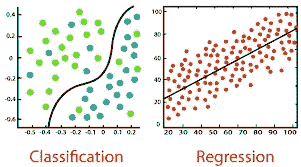
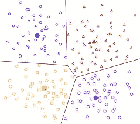

# 机器学习:概述(下)

> 原文：<https://medium.com/analytics-vidhya/machine-learning-an-overview-part-2-cb832e26b44a?source=collection_archive---------31----------------------->

这是机器学习概述系列的延续。如果你还没看过第一部分。找到下面的链接:

 [## 机器学习:概述(第一部分)

### 当我们说机器学习时，这是我们脑海中的视觉化图像。很多人把机器学习和…

medium.com](/@vinscoder1627/machine-learning-an-overview-part-1-2d7e31787e50) 

到目前为止，我们已经涵盖了机器学习的不同方面，例如:

1.  什么是机器学习？
2.  我们为什么需要机器学习？
3.  机器学习利用复杂的数学吗？
4.  哪里可以找到机器学习？
5.  哪里可以用机器学习？

我们现在将更进一步，将讨论机器学习技术的类型，并试图以直观的方式理解它们。

# 机器学习的类型:

因此，基于训练的方法和所提供的输入数据的类型和性质，机器学习大致分为 3 种类型。

数据是机器学习算法的燃料。我们周围有各种各样的数据，我们收集的大多数数据都是以原始形式出现的。

对于解释数据的机器学习模型，必须以机器学习模型可接受的形式提供数据。

> *“机器理解的只是 0 和 1”。*

机器学习技术包括基本的数学运算和计算。因此，我们要求数据用数值表示。

> 如果我们有“快乐”或“悲伤”这样的分类数据呢？我们如何对这些值进行编码？

嗯，我们有不同的编码方法。不要担心，我们将在接下来的部分中讨论所有这些术语。

# **1)监督学习**

[监督学习](https://en.wikipedia.org/wiki/Supervised_learning)描述了一类涉及使用模型来学习输入示例和目标变量之间的映射的问题。

> 当我们有一对输入和相应的输出值时，它被称为“标记数据”，如果我们只有输入值而没有特定的输出值，那么它被称为“未标记数据”。

监督学习利用“标签数据”即。我们为模型提供输入特征和输出值。例如:如果我必须教一个模型来区分狗和猫，我需要提供猫的特征作为输入，还需要将输出标记为猫，狗也是如此。同样，通过数学方程，模型学习这些特征中的每一个的相关性和权重，并学习概括差异。

如果我不提供标签，那么模型将无法作出最终裁决。之所以称之为有监督的，是因为我们也必须提供输出，因为当机器试图根据自己的计算来预测输出时，存在一个基础真值，机器可以用它来比较其输出。基于实际值和预测值之间的差异，模型会随着时间的推移不断自我完善。

> 这个改进的部分就是让机器学习这种广泛使用的技术。

两种最常见的监督学习技术是

## 1.预测连续值的回归。

示例包括房价预测或确定一段时间内新冠肺炎病例的数量。

## 2.分类，我们试图对事物进行分类

例子包括将 X 射线图像分类为新冠肺炎阳性或阴性，以及面部识别，在面部识别中，我们仅仅通过一张人的面部照片来识别其姓名。

听起来很酷吧！

# **2)无监督学习**

顾名思义，当我们有数据但没有特定的输出标签或值时，就使用无监督学习。

> 这就产生了一个非常有趣的问题，在我们事先不知道输出的情况下，为什么我们需要这样的机器学习技术？

好吧，让我们假设我们有访问一个特定商业站点的客户的数据。我们不知道在什么基础上执行分类任务，但如果我想让机器计算出客户是否可以根据共同的喜好或行为分组，该怎么办？这正是在客户细分和广告定位中发生的事情。

基于常见的行为，广告可以针对合适的受众，当利用这一特性时，它可以提高企业的收入，这是许多企业向在线模式过渡的主要原因之一，因为可以监控客户行为，以创建针对客户的定制网站或布局。一旦客户成功参与，客户就更有可能利用企业提供的服务。

因此，聚类是无监督学习下最重要的算法之一，这基本上是根据我们自己的要求进行分割。其他技术包括用于特征选择的主成分分析，我们将在本系列中介绍。

> *PS。K-意味着聚类，其中 K 是一个超参数！！！*

# 3)强化学习

你有没有想过，我们可以训练一个模型独自玩你最喜欢的游戏，比如“地铁冲浪者”。

嗯，这是非常可能的，强化学习就是训练机器人在一个从未有过的新环境中执行任务。

要完成上述任务，没有规则和结果。此外，中间的障碍完全是随机的。为了在如此复杂的环境中训练模型，我们选择了基于奖励的系统。

理解这一点的简单方法是，如果我们必须训练一个模型来避开障碍，如果它成功地避开了障碍，我们将给予它积极的奖励，否则我们将发出惩罚。在此基础上，bot 根据其制定的政策决定行动，即通过采取确保长期回报最大化的行动来最大化长期累积回报。

**让我们把事情简化一点**

1.  监督学习:给定“x”预测“y”[连续值/输出标签]

连续值→回归

输出标签→分类

2.无监督学习:给定“x”简化 x。

3.强化学习:在事先没有“x”的未知环境中，监督学习和非监督学习都不起作用。

强化学习的基本定义是“训练决策者在不确定的环境中采取行动以获得最大回报。”

强化学习的几个使用案例包括:

1.  自主导航机器人。
2.  文本挖掘，生成文本数据的摘要。
3.  医疗保健，优化药物剂量。

> 强化学习的简单规则是“如果你问了错误的问题，你将永远得不到正确的答案。”

别担心，我们稍后会深入讨论这些话题。起初，事情似乎有点棘手，我们往往会被吓倒，但随着一些研究和探索，我们习惯了这些新事物。

所以要不断学习，不断探索。

敬请期待！