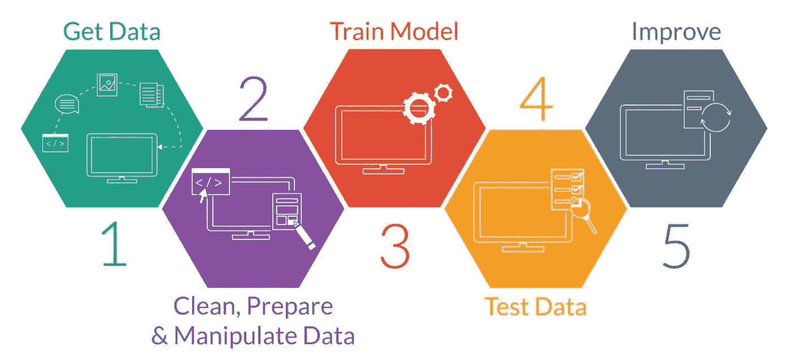

# 机器学习:概述(第三部分)

> 原文：<https://medium.com/analytics-vidhya/machine-learning-an-overview-part-3-515b560b8fc9?source=collection_archive---------26----------------------->

到目前为止，我们已经概述了什么是机器学习，它的实际使用案例以及我们如何利用机器学习的力量。我们还讨论了不同类型的机器学习技术。

我们现在将看看机器学习管道及其工作流程。

可以清楚地看到，这是一个简单的 5 步过程，但让我先告诉你，虽然这是一个连续的过程，但步骤本身有很多迭代，因此模型会随着时间的推移而改进。

# 1.检索数据

正如我们所知，数据是机器学习算法的最终燃料，因此开始的第一步是收集数据。

这取决于我们正在处理的问题的类型以及我们想要的输入和输出的类型。

> 例如:如果我想预测 Covid19 案例的数量，那么我的输出肯定应该是连续的实数，因此我可以利用基于回归的技术。
> 
> 如果我想做一个人脸识别，那么很明显，我希望输出一个绘制了边界框的视频。因此，我们将利用基于分类的技术。

因此，最重要的步骤是理解项目的动机，并确定输入和输出格式。我们建立机器学习模型的目的是获得有意义的见解和一致的结果。

一旦确定了动机，我们就需要开始寻找正确的数据。大多数时候，如果我们试图解决一个常见的用例，精选的数据集是现成的，我们可以很容易地导入它们。但是，让我们假设我们正在试图解决一个新的问题，这个问题的数据集是不可用的，那么我们需要使用网络抓取技术从各种网站提取原始数据。

> “获得正确的数据是整个机器学习工作流程中最困难的事情。”

# 2.清理、准备和操作数据

一旦获得/创建了数据集，下一步也是最重要的一步就是清理数据。

## 那么，清理数据意味着什么呢？

大多数情况下，我们会发现无法以原始形式使用的数据，因此需要清理/过滤数据，以便数据中存在适当的结构和一致性。

> 深入了解:
> 
> 用例:我想分析我的帖子上的 Instagram 评论，以便我可以了解我的粉丝的整体观点。
> 
> 输入:因为我想分析评论，我的输入将是评论 ie。文本数据。
> 
> 输出:我只想确定我的追随者是喜欢还是不喜欢我的帖子。我可以简单地使用
> 
> 1 →喜欢
> 
> 0 →不喜欢
> 
> 问题类型:这是分类问题的一个经典例子。

如果你不知道机器学习技术的类型，看看本文的前一部分。

 [## 机器学习:概述(下)

### 这是机器学习概述系列的延续。如果你还没看过第一部分。找到链接…

medium.com](/analytics-vidhya/machine-learning-an-overview-part-2-cb832e26b44a) 

因此，清理数据需要删除各种特殊字符，如(#、*、！….)以及空格和数字。

> 附注:出于清洁目的，请查看 [regex](https://docs.python.org/3.4/library/re.html) 。

一旦数据清理干净，我们就可以寻找数据中的异常。

这包括处理缺失值，在这种情况下，我们可以丢弃特定数据，也可以使用各种插补方法。我们将在接下来的文章中详细介绍它们。

不同输入要素中的数据值很有可能处于不同的范围内，即有些可能在[0，30]范围内，有些可能在[90000，1000000]范围内。对于这种情况，我们需要对数据进行缩放，以便将所有特征缩放到固定的比例上。这有助于我们很好地预测模型的系数。

现在，机器学习 ie 最好的部分来了，特征选择，一旦数据被预处理，我们现在需要寻找最佳特征来选择 ie。我们可能不需要所有的功能。

## 我需要手动操作吗？

不需要人工检查，同样有很多数学公式和理论。我们可以简单地利用方差阈值和相关性阈值来删除一些特征。

> 附注:我们可以做 PCA，RFE 和更多。

# 3.训练模型

你一定在想，训练模型会很难，这是最容易的事情，只需在 python 中输入 3 到 4 个命令，就可以了。

Python 有丰富多样的机器学习库:pandas、numpy、matplotlib 和 sklearn 是最好的、简单易用的库，可以马上上手。

训练一个模型需要使用复杂的数学计算，可能会很长，但是你在这期间什么都不用做，所以同时你可以放松和睡觉！

# 4.测试模型

使用一组正确的超参数和损失函数以及各种其他必需的字段需要一些知识和直觉。

现在甚至这些事情都可以很容易地自动完成。

你需要关注训练和测试数据集的准确性。

模型很有可能开始过拟合或欠拟合。

> 过度拟合基本上是指当你的模型试图学习你的数据时，它会很好地吸收数据，以至于忘记概括。如果我问一个模型训练过的问题，它会给我一个完美的答案，但如果我问一个几乎相似的问题，它会彻底失败。
> 
> 另一方面，欠拟合指的是完全相反的情况，模型甚至不能很好地学习数据。所以尽量增加数据量。

## “一个好的机器学习算法能够归纳其观察结果，从而在新的未知数据上表现出色。”

# 5.改进模型

嗯，这似乎是我们准备部署我们的机器学习模型之后的最后一步。但是，在此之前，我们需要改进模型，这是真正的知识和实践经验发挥作用的地方。

如果在不了解各种结果/测试分数的情况下进行，改进模型可能会成为一个无休止的循环。准确性不是评估模型的主要来源。

> “不管你有多完美，总有改进的余地。”

经过大量的迭代和新的方法和策略，你可以得到一个相当精确的模型。就如何改进模型进行头脑风暴。最好的方法是可视化学习曲线，看看问题发生在哪里。

> "如果有两个性能相似的型号，总是选择较简单的那个."

谢谢，将在下一部分介绍上述所有步骤的实际操作方法。敬请关注。

建议总是受欢迎的。