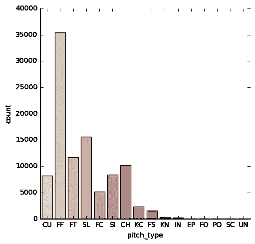
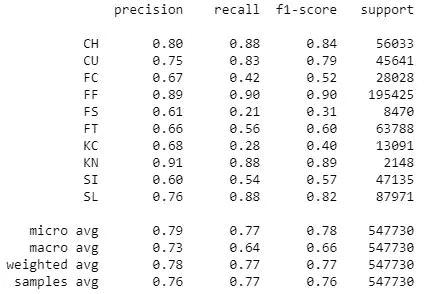
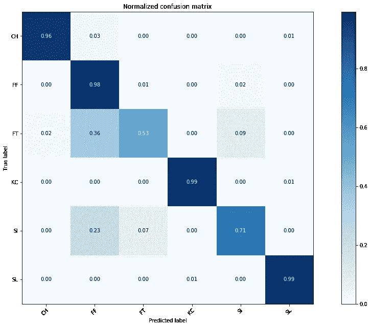

# 机器学习与棒球投球类型分类

> 原文：<https://medium.com/analytics-vidhya/machine-learning-and-baseball-pitch-types-classification-274ef0a3ba0f?source=collection_archive---------5----------------------->

这篇简短的文章是关于我如何将机器学习应用于 MLB 奥运会数据的。我想做的是使用音高 f/x 数据，包括速度，旋转速度，旋转方向或位置来分类音高类型。你可以访问我的 Github 来获得这个项目的详细信息、结果和代码。

**1。数据与可视化:**
数据来自 Kaggle 它包括 2015-2018 MLB 常规赛期间的每一次投球和击球。每个游戏的数据和每个玩家的名字可以在其他 csv 文件中找到。俯仰数据包含 40 列，记录速度、旋转速率、旋转方向、俯仰位置和场上情况。

图一。每种沥青类型的总量

这是一个关于每次投掷总量的数字。FF 是四缝线快速球，数量最多，而 FO，PO(投球)，EP (Eephus)，SC(螺旋球)在比赛中很少使用。因此，这些音调类型将在预处理期间被移除。IN(故意球)也将被移除，因为对这样的投球类型进行分类是没有意义的，并且它可能也没有足够的数据用于算法。由于计算成本，除了神经网络之外，我只将一部分数据输入到模型中。

**2。预处理和模型评估:**

正如我在上一部分提到的，由于数据量很小，罕见的音高将从数据中删除。基于相关性分析，排除了几个特征；例如，“结束速度”与“开始速度”高度共线性。最后，记录现场情况的特征也被移除。这些特征与棒球的运动毫无关联。

我使用管道来评估不同的分类器，包括 SVM，随机森林，高斯朴素贝叶斯和逻辑回归。神经网络模型是单独评估的。f1 得分约为 0.7，SVM 和兰登森林得分最高，为 0.75。相比之下，高斯朴素贝叶斯得分最低，为 0.65。

然而，我没有搜索这些模型的最佳超参数。神经网络的 f1 值最高，为 0.78。我尝试了神经网络的不同结构和模型的相关超参数。由于神经网络具有最佳性能，因此下面的讨论将只集中在神经网络上。

**3。结果:**

分类报告表明，一些音高类型具有相对较低的精确度和召回率。这些投球类型包括 FC(切割器)、FS(分裂球)、FT(双缝快速球)、KC(指节曲线)、SI(伸卡球)，报告显示他们的 f1 得分从 0.31(FS)到 0.60(FT)。显然，他们也降低了模型的整体准确性。似乎很难有明显的改善。即使我搜索了最佳的超参数并尝试了不同的神经网络结构或激活函数。

表 1。神经网络分类报告

然而，如果我们试图对一个投手而不是联盟中的所有投手进行分类会怎么样呢？

我选择了克莱顿·克肖、格里特·科尔和扎克·格林基来研究这个想法。事实证明这个模型有显著的改进。f1 总分至少为 0.93(Gerrit Cole)；凯利顿·克肖的模型有最好的 f1-得分 0.99！此外，扎克·格林基和 Gerrit Cole 的模型分别为 0.97 和 0.93。

图二。Gerrit Cole 的混淆矩阵

然而，一些基音类型仍然具有相当低的精确度和召回率。如果我们进一步研究 Gerrit Cole 的混淆矩阵，许多 FT (36%)和 SI (23%)被归类为 FF。即使我们能够在视频中识别它们，但该算法仍然不能成功地做到这一点。一个可能的解决方案是，我们可以将不同的特征组合成一些与球的轨迹或运动更相关的值。毕竟 FF 和 FT 的主要区别就是一些额外的动作。