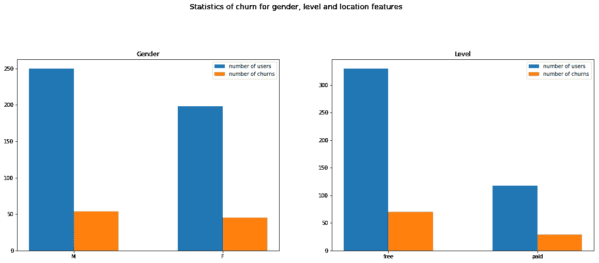
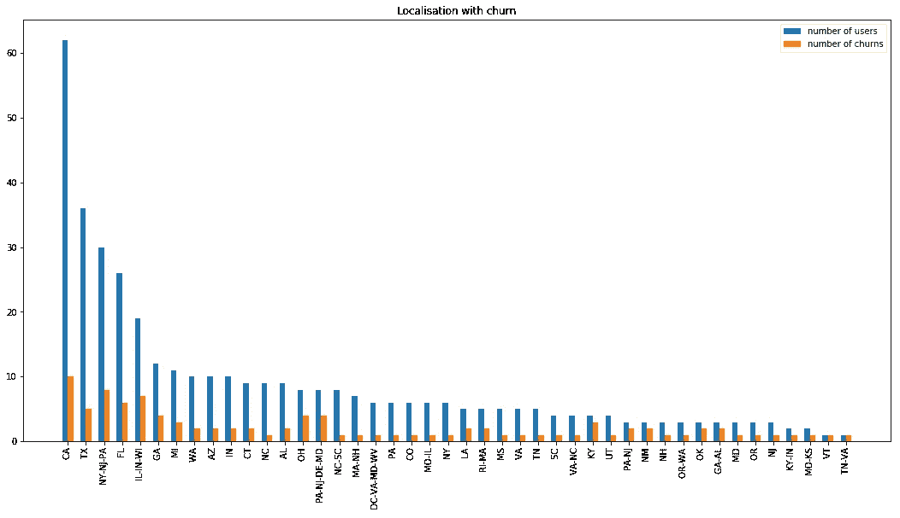
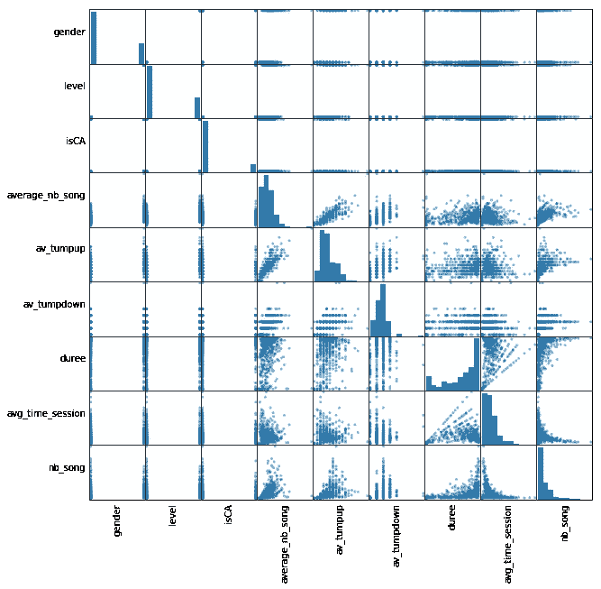

# 机器学习和大数据:一个闪亮的方法

> 原文：<https://medium.com/analytics-vidhya/machine-learning-and-big-data-a-sparkling-approach-d57a42919e0c?source=collection_archive---------43----------------------->

利用 Spark 使用机器学习分析大数据


随着廉价存储容量的发展，各行业正在产生越来越多与其活动相关的数据。一家公司可以通过建立流程来分析其产生的大量数据，从而获得竞争优势。然而，有效地使用这种数据需要大量的计算能力。

Spark 为愿意主动监控其业务并做出明智决策的公司提供了解决方案。Spark 的并行处理能力使其成为快速处理大规模数据的理想选择。Spark 还包括一个机器学习库，这使它成为数据科学家处理大数据有用工具。

在本文中，我们将使用来自音乐流媒体网站( **Sparkify** )的日志数据集来预测用户是否会流失。对于这个分析，我们将使用 Spark 和 IBM Watson 云解决方案平台。让我们看看 Spark 在数据集上的表现。

# **数据探索**

让我们从打开 Spark 会话开始分析，导入数据集并查看数据集中可用的数据:

```
**from** **pyspark.sql** **import** SparkSession
spark = SparkSession.builder.getOrCreate()
df = spark.read.json(cos.url('medium-sparkify-event-data.json', 'sparkify-donotdelete-pr-n3mm1l5ansd2bd'))
df.printSchema()root
 |-- artist: string (nullable = true)
 |-- auth: string (nullable = true)
 |-- firstName: string (nullable = true)
 |-- gender: string (nullable = true)
 |-- itemInSession: long (nullable = true)
 |-- lastName: string (nullable = true)
 |-- length: double (nullable = true)
 |-- level: string (nullable = true)
 |-- location: string (nullable = true)
 |-- method: string (nullable = true)
 |-- page: string (nullable = true)
 |-- registration: long (nullable = true)
 |-- sessionId: long (nullable = true)
 |-- song: string (nullable = true)
 |-- status: long (nullable = true)
 |-- ts: long (nullable = true)
 |-- userAgent: string (nullable = true)
 |-- userId: string (nullable = true)
```

数据集包含 **543 705** 行，快速检查 ***na*** 值显示它不包含自然空值。尽管如此，仍有用户标识为空的行。删除这些行后，数据集中还剩下 **528 005** 行。

用户在网站上的互动取决于他们访问的页面，所以让我们看看不同类型的页面:

```
df.select(df.page).dropDuplicates().sort(["page"]).show()+-------------------+
|                page|
+--------------------+
|               About|
|          Add Friend|
|     Add to Playlist|
|              Cancel|
|Cancellation Conf...|
|           Downgrade|
|               Error|
|                Help|
|                Home|
|              Logout|
|            NextSong|
|         Roll Advert|
|       Save Settings|
|            Settings|
|    Submit Downgrade|
|      Submit Upgrade|
|         Thumbs Down|
|           Thumbs Up|
|             Upgrade|
+--------------------+
```

查看可用页面，我们可以将客户流失定义为用户访问“取消确认”页面的行为。使用这些信息，让我们创建客户流失列:

```
churned_user=[x.userId for x in df.filter(df.page=='Cancellation Confirmation').select('userId').dropDuplicates().collect()]df=df.withColumn('churn',df.userId.isin(churned_user).cast('Integer'
))
```

***什么是流失分布？***

我们可以在下面看到，流失再分配分布是不平衡的:



# **数据争论和特性工程**

在开始构建我们的机器学习模型之前，我们将进行一些数据争论和特征工程:

***人口统计信息***

*   性别:M 或 F 我们编码为 0 或 1；
*   级别:免费或付费我们编码为 0 或 1；
*   isCA:如果用户位于加利福尼亚，则为 1，否则为 0；

```
df_user=df_user.withColumn("isCA",get_localisation(df_user.location_level1).cast(IntegerType()))
    df_user=df_user.replace(["M", "F"], ["0", "1"], "gender")
    df_user=df_user.replace(["free", "paid"], ["0", "1"], "level")
    df_user=df_user.withColumn("gender",df_user.level.cast(IntegerType()))
    df_user=df_user.withColumn("level",df_user.level.cast(IntegerType()))
```

***用户与网站的交互***

*   每次播放的平均歌曲数和播放的歌曲总数；
*   会话之间的平均时间；
*   每次会话的平均起伏；
*   第一次和最后一次会话之间的时间(小时)；

```
*#feature 2 - user's interactions*
    *# Average song played in one session and number of songs played*
    df_user_inter=df.filter((df.page=='NextSong')) \
            .groupBy('userID','sessionId') \
            .agg(count('sessionId').alias('nb_song')) \
            .groupBy('userID') \
            .agg(round(mean('nb_song'),0).alias('average_nb_song'),sum('nb_song').alias('nb_song'))
    *# average time  between sessions*
    df_time_session=df.select('userID','sessionId','duree').dropDuplicates() \
            .groupBy('userID','duree') \
            .agg(count('sessionId').alias('number_of_session'))

    df_time_session=df_time_session.withColumn('avg_time_session',df_time_session.duree/df_time_session.number_of_session)
    *# Tumps up/down and upvote/downvote*
    df_user_inter_tUP=df.filter((df.page=='Thumbs Up')) \
            .groupBy('userID','sessionId') \
            .agg(count('sessionId').alias('step')) \
            .groupBy('userID') \
            .agg(round(mean('step'),0).alias('av_tumpup'))
    df_user_inter_tDOWN=df.filter((df.page=='Thumbs Down')) \
            .groupBy('userID','sessionId') \
            .agg(count('sessionId').alias('step')) \
            .groupBy('userID') \
            .agg(round(mean('step'),0).alias('av_tumpdown'))
```

最终数据集包含以下数据:

```
root
 |-- label: integer (nullable = true)
 |-- gender: integer (nullable = true)
 |-- level: integer (nullable = true)
 |-- isCA: integer (nullable = true)
 |-- average_nb_song: double (nullable = true)
 |-- av_tumpup: double (nullable = false)
 |-- av_tumpdown: double (nullable = false)
 |-- duree: double (nullable = true)
 |-- avg_time_session: double (nullable = true)
 |-- nb_song: long (nullable = true)
```

让我们来看看这些功能是如何相互关联的:

```
df_pds = df_model.toPandas()[df_model.columns[1:]]
axs = pd.plotting.scatter_matrix(df_pds, figsize=(10, 10));
n = len(df_pds.columns)
**for** i **in** range(n):
    v = axs[i, 0]
    v.yaxis.label.set_rotation(0)
    v.yaxis.label.set_ha('right')
    v.set_yticks(())
    h = axs[n-1, i]
    h.xaxis.label.set_rotation(90)
    h.set_xticks(())
```



最后，我们用**标准缩放器**缩放特征，并用**矢量组装器**将所有特征合并到一列中。

```
assembler=VectorAssembler(inputCols=df_model.columns[1:],outputCol='features_int')
    scaler = StandardScaler(inputCol="features_int", outputCol="features", withStd=**True**)
```

# **训练和调整我们的模型**

我们将在数据集上测试五个模型:

*   逻辑回归；
*   决策树分类器；
*   随机森林分类器；
*   梯度推进树；和
*   朴素贝叶斯。

我们将数据集分为训练集、测试集和验证集:

```
train, test_valid=df_model.randomSplit([0.7, 0.3], seed=42)
    test, valid=test_valid.randomSplit([0.5, 0.5], seed=42)
```

每个模型都将使用管道和 CrossValidator 来调整参数:

```
*#Five model to test*
    models={
        'Logistic Regression':LogisticRegression(maxIter=10),
        'Decission Tree Classifier':DecisionTreeClassifier(),
        'Random Forest Classifier':RandomForestClassifier(),
        'Gradient Boosted Tree':GBTClassifier(maxIter=10),
        'Naive Bayes':NaiveBayes()
    }

    *#paramGrid for tuning*
    paramGrid={
        'Logistic Regression':ParamGridBuilder() \
            .addGrid( models['Logistic Regression'].regParam, [0,0.01,0.001,0.0001]) \
            .addGrid(models['Logistic Regression'].family, ['binomial','multinomial']) \
            .build(),
        'Decission Tree Classifier':ParamGridBuilder()
             .addGrid(models['Decission Tree Classifier'].maxDepth, [2,  10, 30])
             .addGrid(models['Decission Tree Classifier'].maxBins, [10, 40, 100])
             .build(),
        'Random Forest Classifier': ParamGridBuilder() \
            .addGrid(models['Random Forest Classifier'].numTrees, [10, 30, 50]) \
            .addGrid(models['Random Forest Classifier'].maxDepth, [2, 10, 30]) \
            .build(),
        'Gradient Boosted Tree':ParamGridBuilder() \
            .addGrid(models['Gradient Boosted Tree'].maxBins, [10, 40, 100]) \
            .addGrid(models['Gradient Boosted Tree'].maxDepth, [2, 10, 30]) \
            .build(),
        'Naive Bayes':ParamGridBuilder() \
            .addGrid(models['Naive Bayes'].smoothing, [0.0,0.6,1.0])\
            .build()
    }

    trainned_model={}
    **for** mdl **in** models:
        print('Trainning model ' + mdl)
        print('...')
        pipeline = Pipeline(stages = [assembler,scaler, models[mdl]])
        crossval= CrossValidator(estimator=pipeline,
                          estimatorParamMaps=paramGrid[mdl],
                          evaluator=MulticlassClassificationEvaluator(metricName='f1'),
                          numFolds=3)
        model_test = crossval.fit(train)
```

五个模型的精确度和 F 值如下所示:

```
Trainning model Logistic Regression
...
Logistic Regression metrics:
Train - Accuracy: 84.18% and F-1 Score: 82.71%
Test  - Accuracy: 78.12% and F-1 Score: 80.44%
Valid - Accuracy: 84.00% and F-1 Score: 82.81%Trainning model Decission Tree Classifier
...
Decission Tree Classifier metrics:
Train - Accuracy: 87.66% and F-1 Score: 87.25%
Test  - Accuracy: 84.38% and F-1 Score: 81.25%
Valid - Accuracy: 84.00% and F-1 Score: 84.00%Trainning model Random Forest Classifier
...
**Random Forest Classifier metrics:
Train - Accuracy: 98.10% and F-1 Score: 98.09%
Test  - Accuracy: 87.50% and F-1 Score: 84.26%
Valid - Accuracy: 87.00% and F-1 Score: 86.53%**Trainning model Gradient Boosted Tree
...
Gradient Boosted Tree metrics:
Train - Accuracy: 90.19% and F-1 Score: 89.64%
Test  - Accuracy: 81.25% and F-1 Score: 81.25%
Valid - Accuracy: 87.00% and F-1 Score: 87.38%Trainning model Naive Bayes
...
Naive Bayes metrics:
Train - Accuracy: 79.75% and F-1 Score: 73.28%
Test  - Accuracy: 65.62% and F-1 Score: 56.88%
Valid - Accuracy: 85.00% and F-1 Score: 80.27%
```

**随机森林分类器**在训练、测试和验证集上表现更好，因此我们将保持它为最佳模型。

Spark 使我们能够在大型数据集上相对快速地计算我们的五个机器学习模型。对于数据科学家来说，掌握这项技术基本知识是非常重要的，因为越来越多的公司愿意将它集成到他们的流程中。

感谢您阅读我的文章，如有任何意见或问题，请随时联系我。

你可以在我的 [Github](https://github.com/Savadogo/Sparkify-project) 上找到详细代码。