# 用 Python 进行机器学习和数据分析，泰坦尼克号数据集:第 1 部分，可视化

> 原文：<https://medium.com/analytics-vidhya/machine-learning-and-data-analysis-with-python-titanic-dataset-part-1-visualization-8a6e80732dd3?source=collection_archive---------7----------------------->

每一个伟大的机器学习和数据科学项目都是从定义问题开始的:你必须处理哪些数据，你试图用这些数据实现什么？

因此，常见的第一步是通过可视化或描述性分析来探索数据。在教程的这一部分，我将带你了解如何理解数据，以预测谁在泰坦尼克号灾难中幸存，谁没有。我还制作了一个视频，所以如果你通过视频和音频指南学得更好，或者想听更多为什么采取每一步的理由，请随意跳到这篇文章的底部，你会看到视频的链接。

现在让我们开始吧！

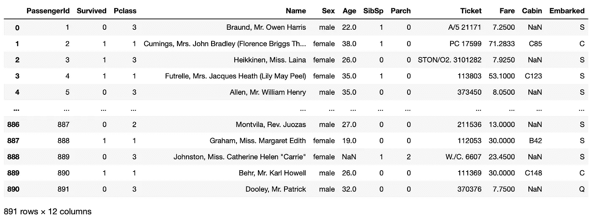

数据集概述

第一步是弄清楚什么是我们的 *X* 和 *y* ，以及它们是如何关联的。 *X* 包含了我们必须使用的特性。例如，在泰坦尼克号的数据集中，每个数据点都描述了一名乘客，它具有诸如姓名、年龄、性别、船舱号等特征。然后，这些特征由 *X* 中的向量表示。 *X* 基本上是所有乘客的这些特征向量的集合，然后形成一个矩阵。

对应于 *X* 矩阵中的每个特征向量，有一个我们试图预测的标签。我们把这个标签叫做 *y* 。来自所有向量的所有标签在 *X* 中的聚集给了我们最终的向量 *y* 。

为了将这一点纳入泰坦尼克号示例的语义中， *X* 是由描述每个乘客的特征向量组成的矩阵，y 是该乘客是否幸存的相应结果。由于结局只能是 1(活了下来)和 0(没活下来)，这就叫二进制分类问题。

我们试图发现的是 *X* 中的什么特征对应于标签中的生存。当我们从上图看 *X* 和特征描述时，我们有了这个特征*性别*。根据直觉，我们知道这将是一个非常重要的特征，因为泰坦尼克号上的大部分幸存者都是女性乘客。我们还有“Pclass”，其中 1 代表头等舱乘客，3 代表三等舱乘客。这也是非常好的，因为来自更高阶层的人可能有更好的机会首先获救。我们已经有了一些具有良好预测能力的特性，现在让我们进入代码。在本教程的第 0 部分，我讲述了如何设置我们将要使用的环境，所以如果你没有一个可以工作的 Jupyter 笔记本环境，你可能想看看:

 [## 使用 Python 进行机器学习和数据分析，Titanic 数据集:第 0 部分，设置

### 这是用 Python 进行机器学习和数据分析系列的第 0 部分，以真实世界为例，泰坦尼克号…

medium.com](/@qinchen.wang.personal/machine-learning-and-data-analysis-with-python-titanic-dataset-part-0-setting-up-94ba328ffeea) 

首先，我们将使用 Pandas 来读取从 Kaggle 下载的数据文件。

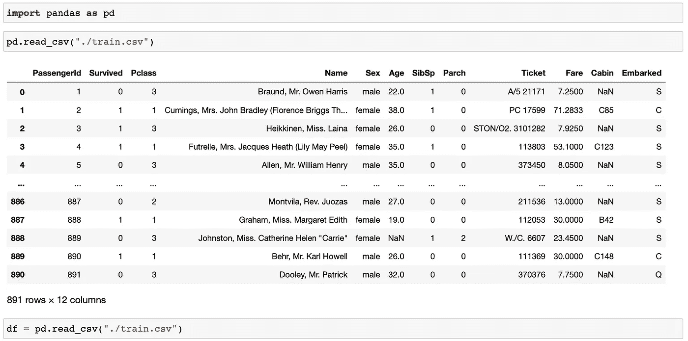

读入训练数据

PD . read _ csv({您的文件目录})将. CSV 文件作为熊猫数据帧读入。我们将把这个数据帧存储在一个名为 *df* 的 Python 变量中。

让我们来看看幸存者和死者的分布情况:

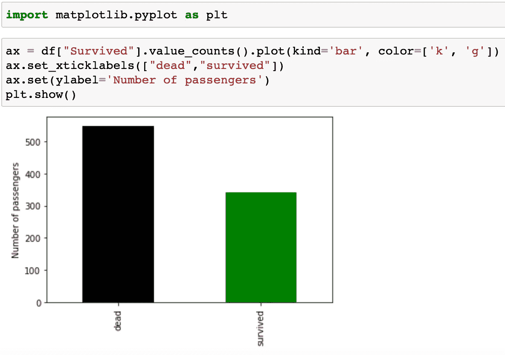

总存活分布

。value_counts()应用于列(技术术语是 Pandas 系列)时，是一个内置的 Pandas 方法，它返回系列中每个唯一值的频率。。plot(kind='bar ')将在条形图中显示此频率信息。

仅仅知道存活与死亡的总体分布并不那么有趣。我们想知道哪些属性描述了幸存下来的人。例如，如果我们想看看男性和女性的生存分布。我们可以定义一个条件(你可能会听到人们称之为*掩码*)，比如 df[" Sex "]= ' male '，它根据行中的性别条目是否满足条件，为数据帧中的每一行返回一个布尔值。如果我们使用这个条件对数据帧进行索引(在方括号中传递),我们将得到一个过滤后的数据帧，它只包含满足这个条件的行。因此当我们。value_counts()再次在列上显示仅男性或女性乘客的生存分布:

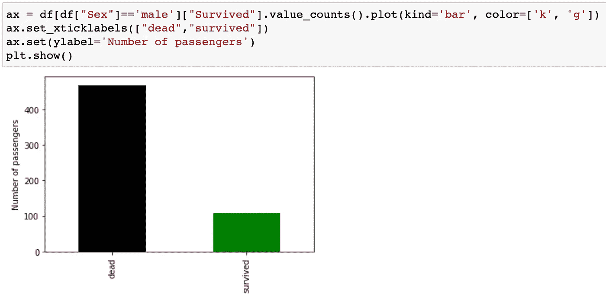

男性生存分布

与总生存分布相比，男性乘客的生存比率较小。

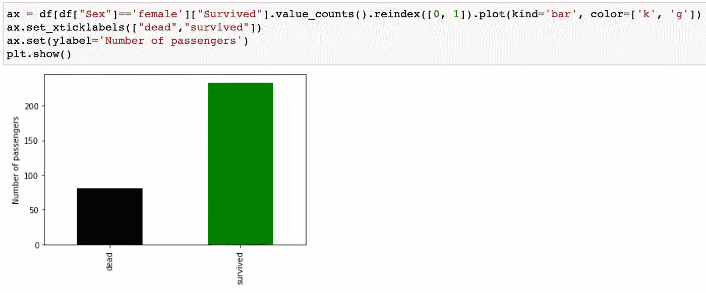

女性生存分布

与总存活分布相比，存活比率(标签 1)要大得多。它是死亡人口的两倍多，而在总分布中，死亡人数多于存活人数。

我们可以用 *Pclass* 做同样的事情。让我们先来看看这个 *Pclass* 变量可以取什么值:

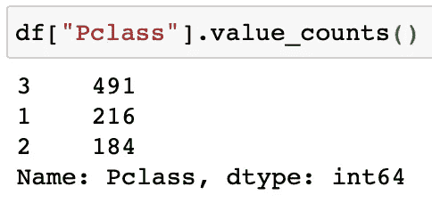

Pclass 中每个值的频率

每一类的生存分布分别为:

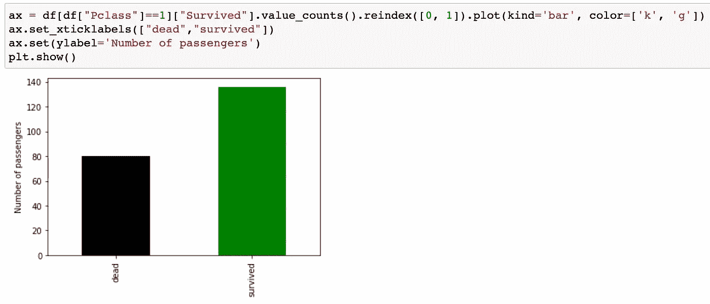

头等舱乘客的生存分布

头等舱乘客生还的机会比死亡的机会大。

二等舱乘客的生存分布

对于二等舱的乘客来说，这个比例稍差一些，但他们仍有相当大的生存机会。

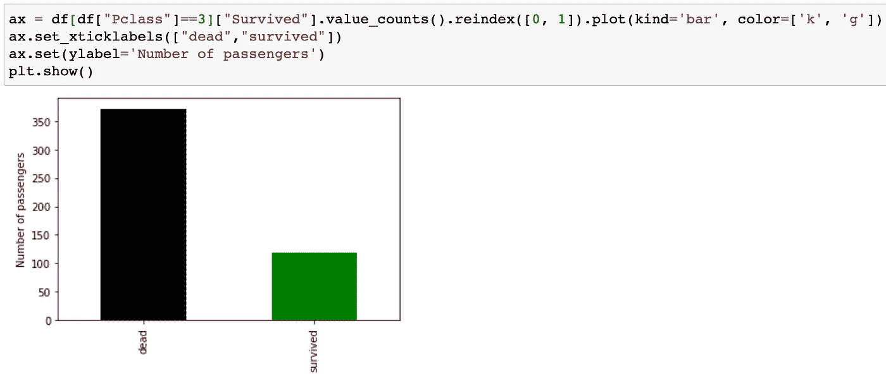

三等舱乘客的生存分布

对于三等舱的乘客来说，这个比例看起来并不太高。

我们可能已经开始看到一种趋势:更高级别的女性乘客更倾向于生存。让我们通过使用带有 AND 的 2 条件来验证这一点。将每个条件放在一个括号中，并在括号之间放置 *&* 将过滤数据帧中同时满足两个条件的行:

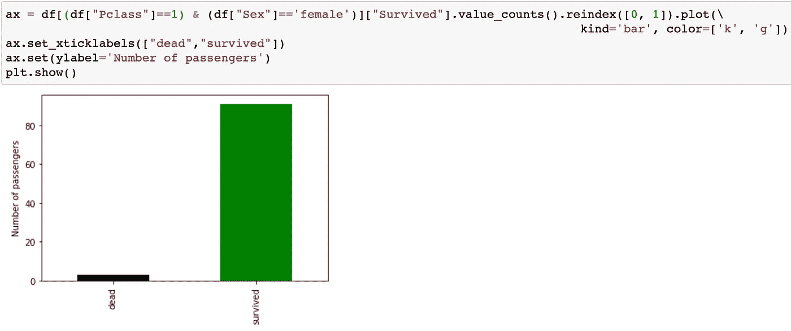

头等舱女性乘客的生存分布

向 1 的倾斜非常明显。所以从统计上来说，罗斯很有可能活下来。

关于这一点，让我们看看像杰克这样的乘客的生存统计数据:

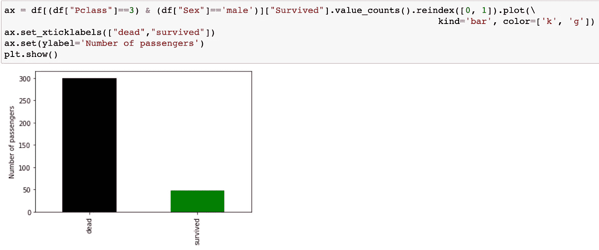

不幸的是…

图表是一种很好的表达技术，但是当你自己做分析时，也许你只想看数值。因此，从数字展示的角度来看，让我们看看使用我们刚刚学到的技术，S *ex* 和 *Pclass* 的每种组合的存活几率:

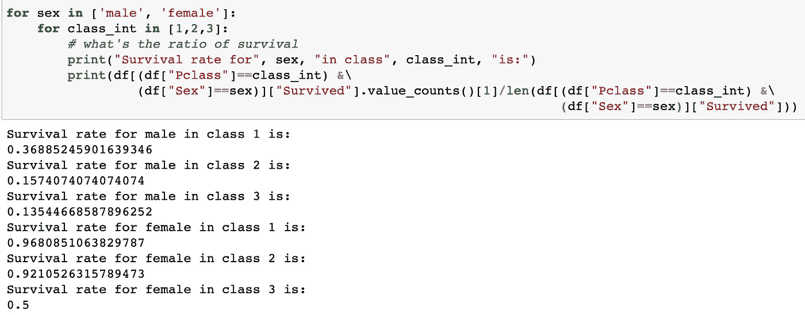

每个(性别，阶级)组合的生存机会

现在，在我们继续之前，我想给你指出一些已经盯着我们一段时间的东西:那些 NaN 条目是什么？

这些坏男孩代表的不是一个数字，而是我们所说的缺失数据。我们将不得不处理这些丢失的数据，因为许多模型不接受带有丢失值的数据。有两种方法可以解决这个问题:

*   删除所有缺少值的行
*   将缺少的条目填入合理的值

如果我们有 100，000 个数据点，并且只有 10 行缺少值，我们可以采用第一种方法。然而，泰坦尼克号数据集却不是这样。。dropna()将返回原始数据帧，其中只有没有丢失值的行:

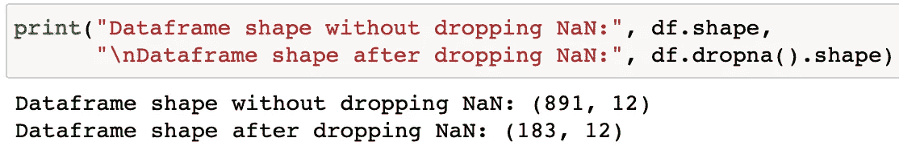

用 NaN 删除行的效果

在 df.dropna()之后，我们的大部分训练数据都没有了，这显然是不理想的，尤其是在这样一个小训练集的情况下。所以我们想采用第二种方法。

让我们以*年龄*栏目为例。

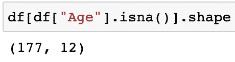

年龄列中缺少值

天真的方法是用 0 填充所有这些值，但这实际上没有意义。对于第一次迭代，我们可以用一些平均值填充这些条目:

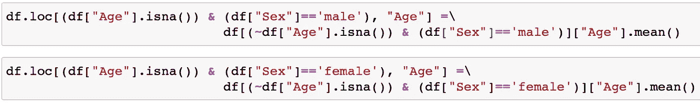

填写缺失的平均年龄值

df.loc[{some condition}，{a column name}] =将把满足条件的数据帧中的行的特定列中的值设置为等式右侧的任何值。在这种情况下，我们将数据帧中所有缺少*年龄*条目且*性别*为男性的行的*年龄*列设置为所有未缺少*年龄*条目的男性乘客的平均年龄。女乘客也一样。

现在特性列*年龄*中不会有任何缺失值。

在本系列的第 2 部分中，我将进行更多的预处理，然后继续构建基线模型。敬请关注！

现在链接到几分钟前承诺的视频…

关于我们上面讨论的更多细节