# 用 Python 进行机器学习和数据分析，Titanic 数据集:第 2 部分，数据预处理和基线模型

> 原文：<https://medium.com/analytics-vidhya/machine-learning-and-data-analysis-with-python-titanic-dataset-part-2-data-preprocessing-bc7a2f87588d?source=collection_archive---------10----------------------->

上次我们通过可视化和描述性分析做了一些初步的数据探索。最后，我们填充了*年龄*特性中缺失的值，作为数据预处理的介绍。在本系列的第 2 部分中，我们将继续进行数据预处理，以获得模型的输入，然后使用 scikit-learn 库中的 ExtraTreesClassifier 作为基线模型，并获得基线性能分数。这篇文章的内容也有视频格式，我会把链接放在底部。如果您有兴趣了解第 1 部分:

 [## 用 Python 进行机器学习和数据分析，泰坦尼克号数据集:第 1 部分，可视化

### 每一个伟大的机器学习和数据科学项目都是从定义问题开始的:你必须处理哪些数据…

medium.com](/@quinn.wang/machine-learning-and-data-analysis-with-python-titanic-dataset-part-1-visualization-8a6e80732dd3) 

现在让我们开始吧！

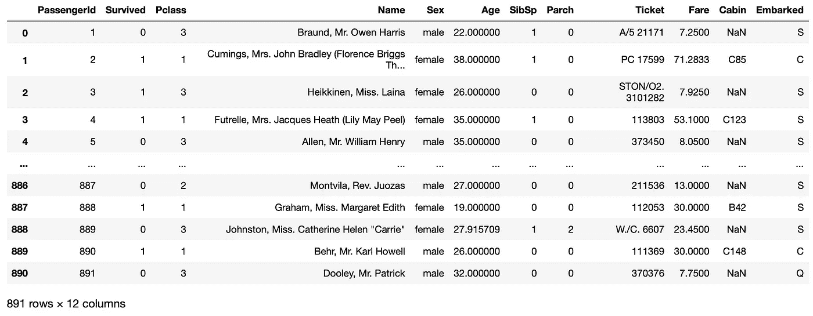

我们现在拥有的功能概述

先来看看我们有什么特色。肯定有一些功能是我们不想使用的。例如， *PassengerId* ，因为它只是被指定为每个乘客数据进入该数据集中的顺序，而该顺序与乘客生还的几率没有关系。我们有 *Pclass* ，我们可以不做任何处理就使用它，因为它是整数格式，而整数通常是作为模型输入可接受的格式。我们还不能使用 *Name* ，这就是我们所说的高基数特性，其中有许多唯一值。如果在训练集中有足够的例子(我们需要“足够”的例子来概括),表明该特征中的某个值或某个值范围将导致特定结果的高概率，则该特征通常是有用的。因此，太多的唯一值将会给我们一个非常低的概括能力。

在*姓名*一栏中可能会有一些有用的信息，例如，也许我们可以分辨出哪些乘客是一个家庭的成员，或者如果你已经注意到，每个乘客似乎都有一个头衔“先生”、“小姐”等等。但是现在这些听起来太多了。

*性别*列因为只有 2 个唯一值，所以可以很容易地作为二元特征，所以我们可以用 0 和 1 来表示男性和女性。*年龄*我们现在可以在填入缺失值后使用，同样的还有*票价*。 *SibSp* 、 *Parch* 也是我们可以马上使用的数字特征。

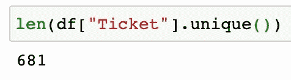

唯一票证值的数量

票列也包含许多唯一值，因此基数也很高。因此，可能会有一些有用的东西，但在我们建立任何模型之前，现在似乎有很多工作要处理。船舱号是一个有趣的数字:

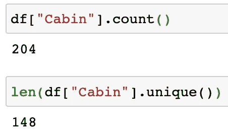

座舱立柱分析

。count()给出该列中非 NaN 的条目数(不是数字，也是我们的缺失值指示器)。因此，在 891 名乘客中，只有 204 名没有遗漏该条目。这个特性也是高基数的，但是进行了一些简单的处理:

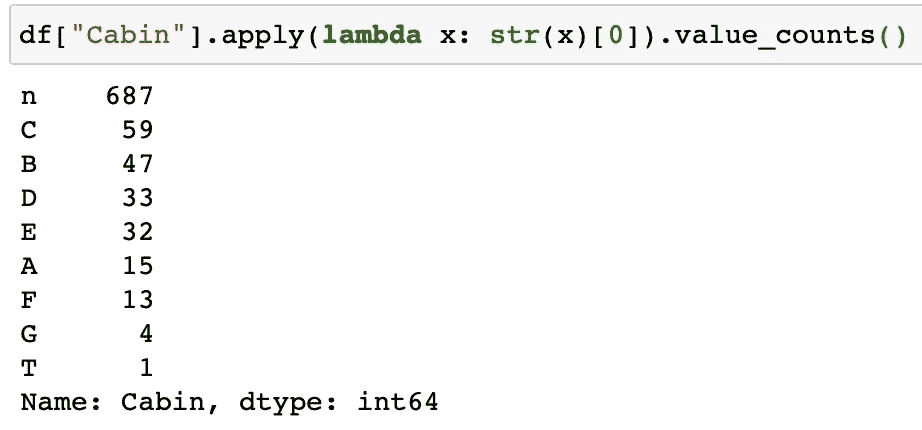

从客舱栏中提取第一个字母

。apply(lambda x:{ some transformation })将把列中的每个值视为 x，并用冒号后的函数对其进行转换。例如，cabin C85 将被转换为 str(C85)[0]，这就是 c。我们需要这个字符串转换，因为所有这些 NaN 值都是 float 类型，不可下标。(注:str(np.nan) == 'nan ')。由于有太多的缺失值，我们现在将把它留在这里，并将在我们的改进步骤中跳回到它(在本系列的后面，请继续关注我，lol)。

那么我们来看看*登上*栏目:

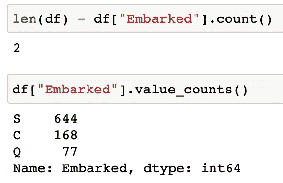

装船柱分析

就清洁度而言，这是一个很好的特性——只有 2 个缺失值和 3 个可能的变化。请注意，这是一个字符串类型的列，因此我们必须做一些处理，以便将信息编码为整数，这样它就是一个可接受的输入。我将使用 one-hot 编码(可能会有一篇文章解释为什么 one hot，而不是像*性别*列那样将其改为 1、2 和 3……)。

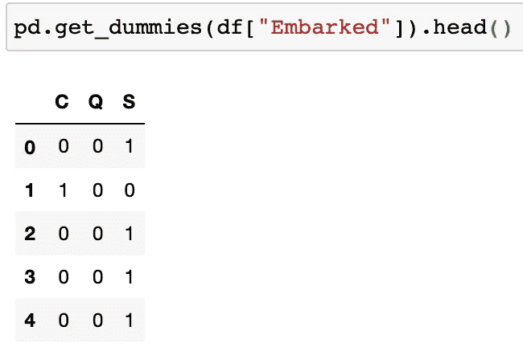

将已装船转换为单热

pd.get_dummies({Pandas series})将返回该系列的一个热编码版本的数据帧。PD . get _ dummies({ Pandas dataframe })将返回一个 dataframe，它将 data frame 中的所有字符串列转换为独热编码，并将它们与整数列连接在一起。

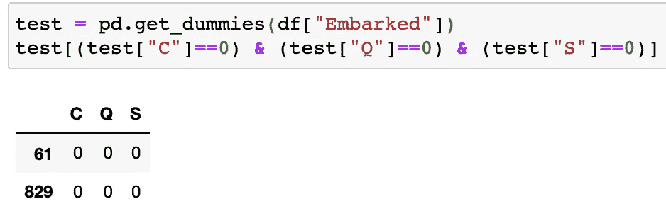

怎么会。傻瓜对待所有人

请注意。get_dummies 函数不会将 NaN 值放入其自身的另一列中，而是简单地将其编码为“不属于任何类别”,每个编码列中有 0。

我们终于知道了每个特性看起来是什么样的，以及我们将如何在基线模型中处理它们。

让我们创建一个新的笔记本文件来庆祝吧！

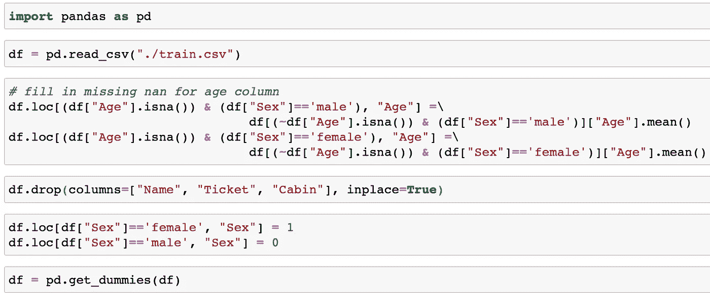

基线模型的所有预处理

通过上面简单的几行，我们已经将在分析步骤中获得的所有知识打包到一个可训练的输入数据框架中。您必须设置 inplace=True 或将 df 重新分配给之后返回的数据帧。drop(columns=…方法，否则这种更改不会在原始数据帧上发生。。当 loc 方法应用于数据帧时，将使用。loc[{condition}，{column name}]，并将该列中满足条件的每个条目设置为等于运算符右侧的值。我们选择对性别特征进行二进制编码，而不是将其留给 ger_dummies 函数，因为这将有助于降低模型的复杂性。我们实际上是告诉模型这是一个特性，而不是将它编码到一个男性和女性列中，让模型自己获取相关性。

现在，我们的数据帧将被删除，仅包含我们想要的功能:

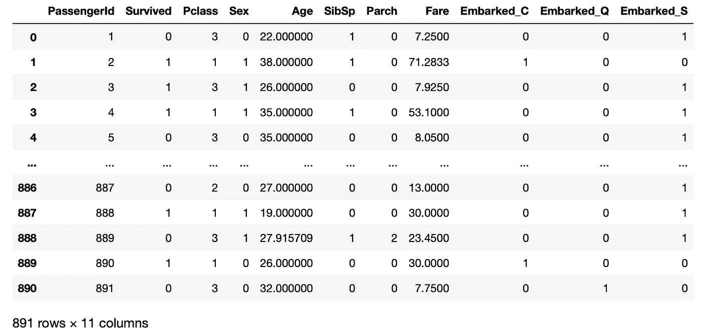

预处理后的数据帧

我们不会放弃 *PassengerId* ，尽管我们说过我们不会使用它，因为这是我们跟踪哪个乘客的方式。在提交的样本中，Kaggle 提供了:

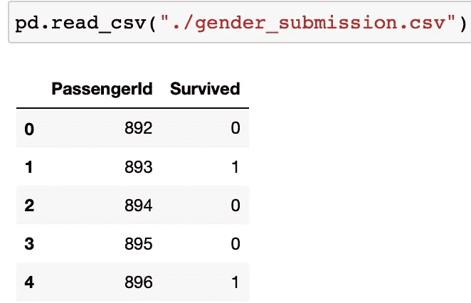

示例提交文件格式

我们将只保留*乘客 Id* 和我们对 Kaggle 的生存预测来评估我们的准确性。

开始模型制作！

我将介绍一个我非常喜欢的模型作为基线原型，树外分类器。我不打算深入探讨这是什么，以及为什么我更喜欢它而不是 RandomForestClassifier (woo 另一篇文章的想法……)。它本质上是一个 RandomForestClassifier，增加了一些随机性。

我们还想创建自己的测试集(不是 Kaggle 提供的那个)来评估我们的性能。我们可以通过使用 scikit-learn 的训练测试分割功能来实现这一点，并从我们的 891 行训练数据中随机截取 20%:

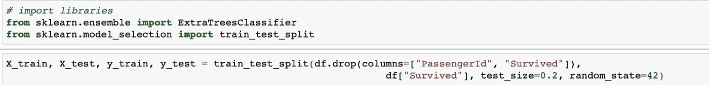

准备基线模型培训和评估

train_test_split 函数将首先接受 X 特性(如本系列的第 1 部分所述),然后接受 y 标签。我们的 X 是除了 *PassengerId* 列和标签(*幸存*)列之外的整个数据帧。然后，我们将 test_size 设置为我们希望测试集达到的分数。random_state 只是随机函数的一个种子，因此可以控制每次拆分的内容(因此 random_state 42 确保无论运行多少次，只要 random_state 设置为 42，随机拆分都是相同的)。该函数返回 4 个数据帧，我们将它们命名为 X_train、X_test、y_train 和 y_test。X_train 和 y_train 的长度是一样的，对于 X_test 和 y_test 也是一样的。

然后只使用默认的超参数定义我们的分类器——这些都是我们可以在模型中设置的属性，森林模型中的一些示例是 n_estimators、max_depth 等。简单打电话。在分类器上安装({系列 X}，{系列 y}):

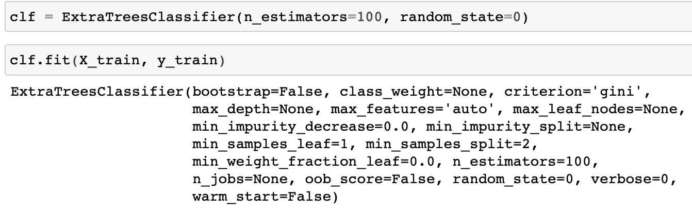

使用默认超参数的训练基线模型

然后。predict({test X})将使用我们用训练集拟合的模型对测试集进行预测:

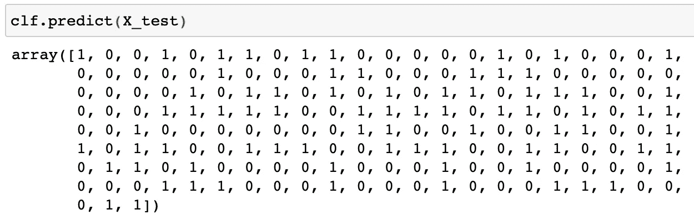

使用我们刚刚训练的模型进行预测

那么这意味着什么呢？有多种评估指标，如果您有兴趣深入了解评估指标，这里有一些我写的关于使用其中一些指标的优点和注意事项的文章:

 [## 为什么您可能希望使用曲线下面积而不是精确召回

### 模型选择很难，尤其是在现实世界中。然而，有没有一个单一的标量评估方法…

medium.com](/@quinn.wang/why-you-might-want-to-use-area-under-curve-instead-of-precision-recall-42cc631719d6)  [## 为什么你可能不想使用曲线下面积

### 上次我介绍了土豆先生和他解决小甜甜圈问题的方法。看起来曲线下的面积是…

medium.com](/@quinn.wang/why-you-might-not-want-to-use-area-under-curve-4ff3a95ea831)  [## 提出新的评估标准

### 最近，我一直在使用一些 AutoML 库，如 H2O 和 auto-sklearn，它们都让我感到困惑

medium.com](/@quinn.wang/proposing-a-new-evaluation-metric-59a23b03ad04) 

对于这个问题，由于数据相对平衡—整个训练集中大约 38%的存活率—我将使用准确性分数，这是非常基本的(正确预测总数)/(预测总数)，也作为参考打印出混淆矩阵:

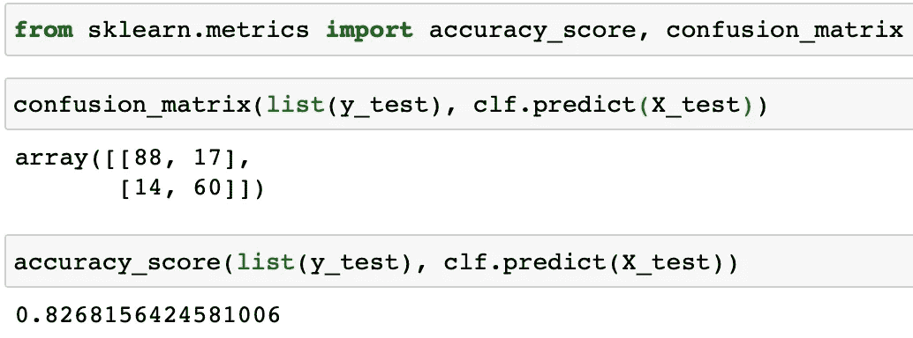

估价

scikit-learn 混淆矩阵的格式如下:

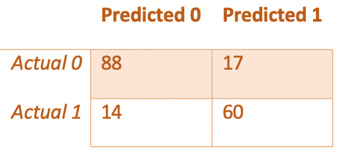

解读困惑矩阵

我们有 88 个真阴性，其中标签为 0，我们预测为 0；17 个误报，其中标签为 0，我们预测为 1；14 个假阴性，其中标签为 1，我们预测为 0；和 60 个真阳性，其中标签是 1，我们预测是 1。

这给了我们 82.68%的准确率。

在本系列的第 3 部分，我将带您了解如何使用该模型在 Kaggle 测试集上进行预测，并将其提交给 Kaggle，然后在排行榜上查看我们的分数。敬请关注！

现在链接到几分钟前承诺的视频…

关于我们上面讨论的更多细节