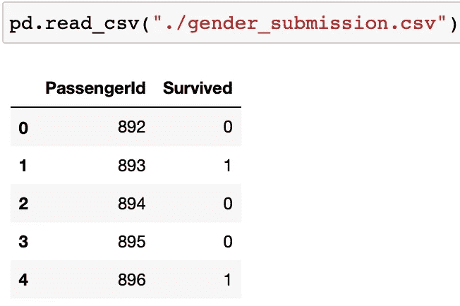
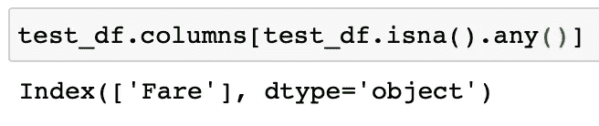

# 用 Python 进行机器学习和数据分析，泰坦尼克号数据集:第 3 部分，提交给 Kaggle

> 原文：<https://medium.com/analytics-vidhya/machine-learning-and-data-analysis-with-python-titanic-dataset-part-3-submit-to-kaggle-a63f98f29657?source=collection_archive---------15----------------------->

上次我们清理了我们的训练数据并建立了一个基线模型。在这个系列的这一部分，我们将对测试数据做同样的预处理，并通过 Kaggle 内核提交我们的预测。像往常一样，链接到视频版本将在底部。

我们开始吧！

让我们先再来看看提交文件的格式:

来自 Kaggle 的示例提交文件

然后进行与我们对训练集所做的相同的预处理:

预处理测试集上的数据

*   将测试数据作为 Pandas dataframe 读取，并将其存储在一个名为 test_df 的变量中。
*   为测试集填写缺失的*年龄*栏。由于训练集中有更多的数据，为了获得更有代表性的平均值，我们希望将缺失的*年龄*条目设置为训练数据帧中相同性别乘客的平均年龄值。请注意，我们在训练集 df 上使用的条件之一是 df["Sex"]==0，而不是 df[" Sex "]= ' male '，这是因为训练集中的*性别*列已经转换为整数表示。
*   然后把我们目前不使用的 3 个值*名*、*票*和*舱*去掉。
*   将*性别*列中的字符串值转换为 0 和 1。
*   在 test_df 上使用 pd.get_dummies 来获得已装载特性的一键编码。

我们现在已经执行了与训练集完全相同的预处理步骤，但是:

意外的楠

。isna()。any()为每一列返回一个布尔值，检查它是否包含任何 NaN 条目。使用这个条件对 dataframe 列进行索引，我们可以获得包含缺失值的所有列的列表。运行 test_df，我们知道在 Fare 列中有缺失的值。

但是坚持住…

我们不是刚刚清理了测试数据吗？

这是一个测试数据可能与训练数据有所不同的示例。仅仅因为我们在训练集中没有看到缺少*票价*条目的乘客，并不意味着我们可以安全地假设该特征对于所有要看到的数据都是填充的。

乘客缺失票价条目

幸运的是，我们只有一个实例丢失了 *Fare* 条目，这表明这是一个罕见的事件，因此可以理解为什么它没有在训练集中发生。如果丢失 *Fare* 条目的比率更高，我们将不得不检查为什么测试集中的这个特性似乎属于不同的分布。

我们的缺失- *票价-* 乘客登上了 *Pclass* 3，因此我们可以用所有 *Pclass* 3 乘客的平均值来填充缺失值，这与我们填充缺失*年龄*条目时使用的思路相同，只是我们假设*年龄*与*性别*更相关，而*票价*与 *Pclass* 更相关。

填写缺失的票价栏

现在我们准备好做预测了！

基于 Kaggle 测试集的预测

确保我们要对其进行预测的数据帧与我们用来定型模型的数据帧具有相同的列和相同的顺序。

这些预测的顺序将映射到数据帧中行的顺序。因此，如果我们创建另一个列，称其为*survives*，并将其设置为预测值，我们将根据需要将我们的预测映射到 *PassengerId* 。

绘制预测图并保存

我们希望通过使用 Pandas 方法将预测保存在一个. csv 文件中。to _ CSV({文件目录})。确保将 index 属性设置为 False，否则当 Kaggle 读取您的提交时，它将得到这个 *Unnamed: 0* 列，并将拒绝提交。

只需将此文件从您的本地计算机上传到 Kaggle 提交页面，然后等待结果！

这是一段视频中的相同内容:

本文视频教程