# 用 Python 进行机器学习和数据分析，Titanic 数据集:第 4 部分

> 原文：<https://medium.com/analytics-vidhya/machine-learning-and-data-analysis-with-python-titanic-dataset-part-4-92a985d7ad52?source=collection_archive---------15----------------------->

## 进行改进并重新提交

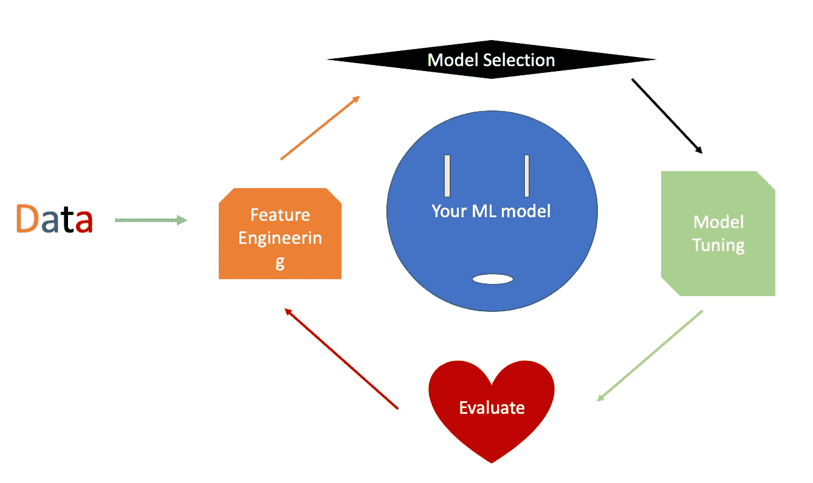

我们已经在第三部中向 Kaggle 提交了我们的第一次提交。在这个系列的最后一部分，我们将尝试对我们的预测进行改进，并重新提交以查看我们的结果。链接到本教程的视频版本将在底部。

我们开始吧！

当谈到改进我们的预测时，我们通常要考虑两件事:

*   进一步的特征工程
*   模型调整

但是在我们继续之前，让我们回顾一下使用基线模型的提交分数:

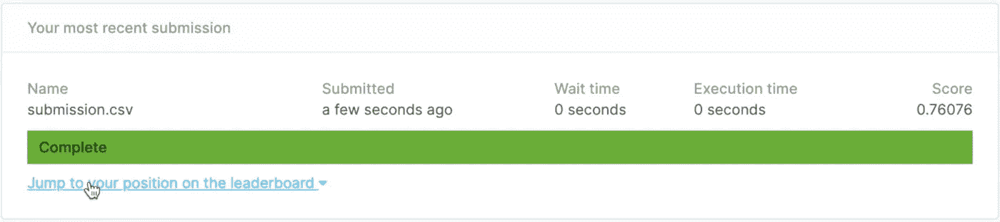

基线模型分数

你可能已经注意到了这里的一些差异。为什么我们 80-20 分割的测试集获得了 82.68%的准确率，而 Kaggle 测试集的预测只有 76%的准确率？

原因之一是这些模型预测的方式存在一定的随机性。与 Kaggle 提供的测试集相比，我们训练的 80%的数据可能恰好看起来更类似于我们作为模拟测试集留下的 20%的数据。结果，从这 80%的数据训练的模型将在 20%的模拟测试集上表现得更好。特别是当我们的训练集很小的时候，很有可能在一个随机选择的测试集上的预测比另一个稍微好一点。

让我向您展示我在 20%测试集的不同随机选择上运行一些测试的意思。

我们在训练测试分割函数中使用了随机状态 42:

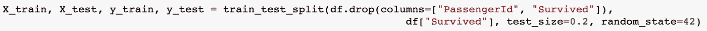

这个数字实质上决定了选取哪 20%的数据，所以每次我们运行这条线时，它都会使用相同的分割。这被称为随机种子，它在某种意义上是有用的，我们可以控制随机性，以便在不同的试验之间进行公平的比较。

让我们看看当我们把这个随机状态改为 0 时会发生什么:

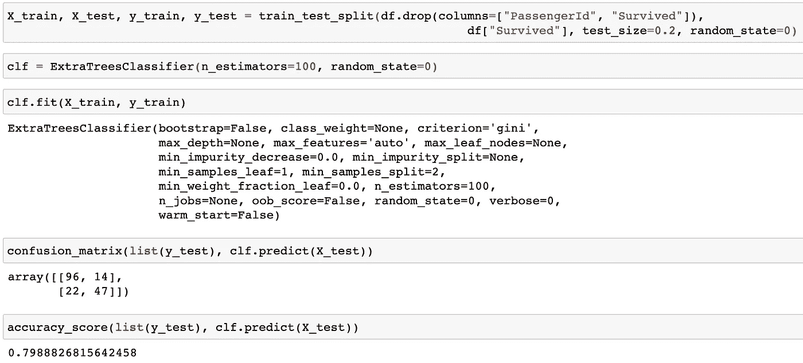

train_test_split 随机状态为 0 的结果

将此与随机状态为 42 时的结果进行比较:

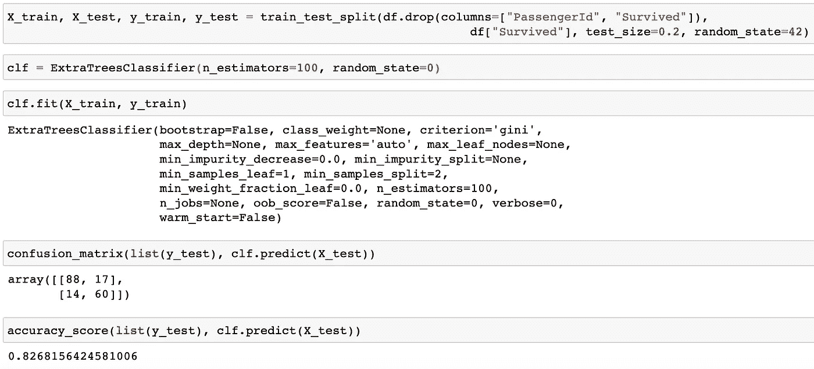

在 train_test_split 时随机状态为 42 的结果

我们准确率下降了 2%以上。

因此，在我们尝试创建更多要素或改进模型之前，为了比较任何两个模型之间的精度，我们可能需要取某种平均值来最小化这种随机性的影响。

要获得平均分:

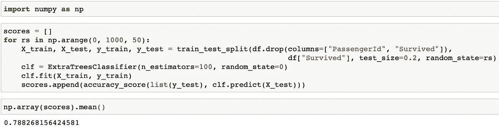

导入 numpy 库并使用。创建一个 50 个数字的列表作为我们的随机状态。使用这 50 个数字中的每一个作为随机状态，并取各自准确度分数的平均值。这平均有 78.8%的准确率。

现在，我们可以回到数据帧，看看我们可以使用哪些附加功能来提高性能。在基线模型中，我们删除了列*姓名*、*机票*和*舱位*，因此也许我们可以从这 3 列中提取一些有用的信息，并将它们合并回模型中。

我们知道在*舱*列中有很多缺失值，所以像我们在*年龄*列中所做的那样尝试填充它们可能不值得。然而，在某个乘客错过他/她的*舱*入口的背后可能有原因，并且这个原因可能与他/她是否幸存相关。我们可以通过打印出缺少*舱室*条目的人和没有这些条目的人的存活率来检查这种可能性:

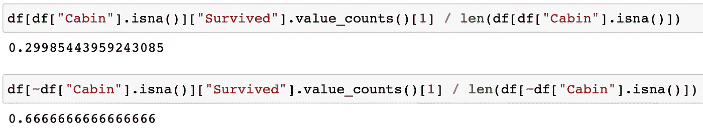

客舱失联与非失联乘客的存活率比较

存活率确实差别很大，所以看起来这是我们想要的特性。要使用此功能:

```
df["is missing cabin"] = df["Cabin"].isna()
```

请注意，布尔特征也被接受为我们的模型输入。

然后再次运行循环。这一次，我们的平均得分是 78.7%，这表明添加这个特性对模型没有任何改进。

让我们试着添加一些别的东西。

在 Kaggle 讨论区，经常有人分享对改进他们的模型有用的代码。您可以从这些讨论中找到灵感，并为您自己模型添加特性。例如，我在这里找到了一段处理 name 列的代码:

[](https://github.com/minsuk-heo/kaggle-titanic/blob/master/titanic-solution.ipynb) [## 闵素赫/卡格尔-泰坦尼克号

### permalink dissolve GitHub 是 4000 多万开发人员的家园，他们一起工作来托管和审查代码，管理…

github.com](https://github.com/minsuk-heo/kaggle-titanic/blob/master/titanic-solution.ipynb) 

实际上，在“姓名”列中，每个乘客的姓名后面都有一个头衔。一些常见的称呼是先生、夫人、小姐。，而这些标题后面总是跟着一个“.”性格。要提取标题:

```
df['Title'] = df['Name'].str.extract(' ([A-Za-z]+)\.', expand=False)
```

而我们的*标题*列将会是这样的:

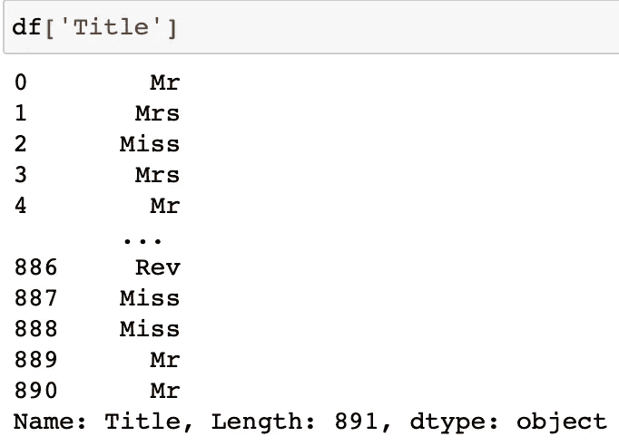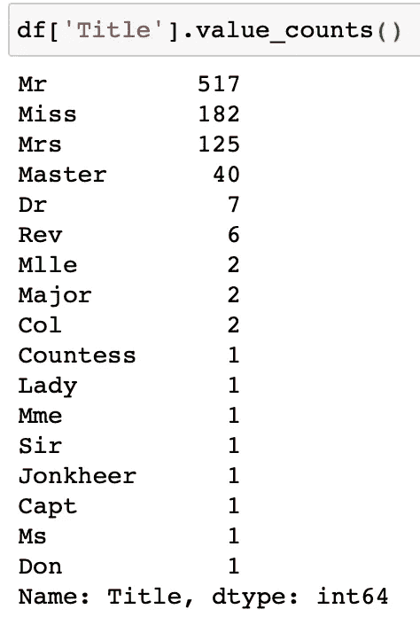

标题列及其分布

我们可以看到有一些常见的称呼如先生，小姐。、夫人，还有一些不常见的头衔如少校。先生。这些不太常见的头衔类似于高基数特征，在某种意义上，用它们进行训练不会提供可概括的信息。这就是为什么在讨论核心中，作者将所有不常见的标题映射到一个唯一的值，并将常见的标题映射到它们自己的唯一值:

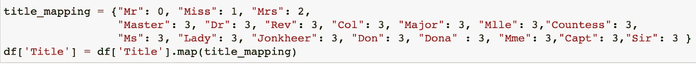

将标题映射到整数

如果我们使用 *Title* 特性再次运行循环，我们将获得 79.16%的准确率，这比我们的基线模型稍好。

我们现在已经试验了两个额外的特性。其中一个根本没有提高我们的分数，另一个只提高了不到 0.5%。在这里不要气馁。这有时表明模型设置不适合这个问题，这就把我们带到了提高性能的第二种方法:对模型进行调整。我们一直使用 ExtraTreesClassifier 的默认 hyper 参数，其中一个名为 max_depth 的参数被设置为 None。此参数限制了森林中的树可以生长到的最大深度，默认设置“无”允许每棵树尽可能深地生长，这可能会使模型过拟合。

让我们尝试给定最大深度限制为 10:

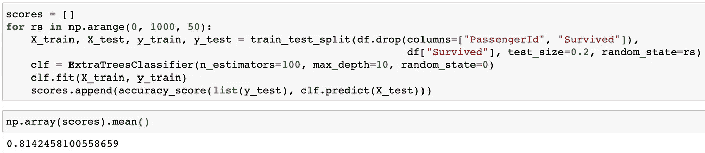

设置 max_depth = 10

正如预期的那样，平均准确度得分有了更显著的提高。

了解了限制 max_depth 的影响后，让我们回到基线模型，看看基线要素和 max_depth =10 时我们的平均精度得分是多少。如果您使用新的模型设置再次运行我们的基线设置，您应该会得到 81.7%的平均分，甚至更高。

不幸的是，在这一点上的结论是，我们的基线特征与参数{n_estimators=100，max_depth=10}配对给出了最好的性能。这是否意味着我们探索的 2 个额外特性完全没有用？添加这两个特性可能没有帮助，但在实践中，我们通常会在得出特性没有用的结论之前做更多的优化(这需要另一篇文章来解释)。只有当模型的超参数也适合这些特征时，一组特征才处于它们的最佳性能。我们已经看到了一个这样的例子:当我们将 max_depth 设置为 10 而不是缺省的 None 时，基线特性给出了更高的平均准确度分数。我将写一篇文章，介绍我使用过的超参数调优的常用方法，以及每种方法的优点和注意事项。有兴趣的敬请关注！

因为我们没有使用额外的特性，所以我们不需要对 Kaggle 测试集做任何预处理。只需使用新模型(max_depth=10)进行预测，并将我们的预测保存在 submission.csv 中，然后重新提交。你应该看到你的排名上升，通过添加这一个变化！

几分钟前承诺的视频…

本文视频教程