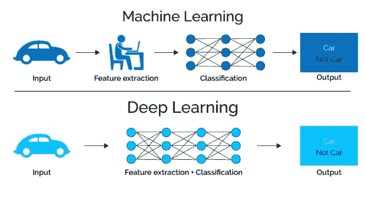
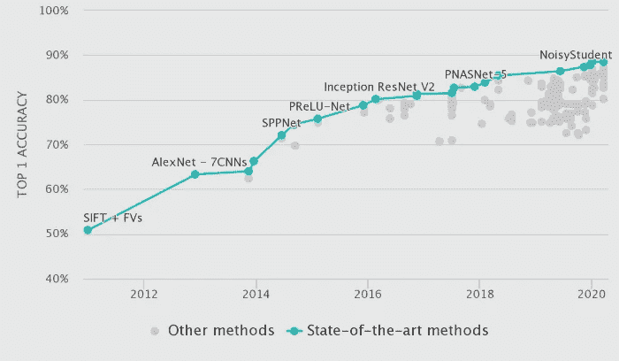

# #2 机器学习和深度学习

> 原文：<https://medium.com/analytics-vidhya/machine-learning-and-deep-learning-b70a85f0742b?source=collection_archive---------20----------------------->

这是我的几何深度学习之旅(GDL)的第二篇帖子。请阅读[第一帖](https://saiprabhat.medium.com/reasoning-and-machine-learning-f3e14078e17f)全面了解 GDL。另外，请注意，由于我还处于初级阶段，犯错误是很自然的。如果你发现一个，请告诉我。建设性的批评总是受欢迎的。我们开始吧！

**机器学习:简要概述**

机器学习(ML)使用算法来分析数据。ML 从这些数据中学习并做出明智的决策。它由一组模式识别的数学方法组成，随着时间的推移，当它们接触到更多的数据时，它们在决策方面会变得更好。现实世界中几乎所有的数据都可以分为两大类——结构化数据和非结构化数据。结构化数据可以是数据库或 Excel 表中的数据记录。各个数据字段具有目的和结构。而非结构化数据可以采用文本、图像、视频或音乐的形式。当提供结构化数据时，经典的 ML 算法寻找输入数据中隐藏的信息。然而，经典的 ML 方法(决策树、支持向量机)不能够以有意义的方式处理非结构化数据。例如，图像不能简单地用作输入数据来训练图像分类的算法。因此，特征工程——与开发特征和描述符以更好地执行其他 ML 任务有关的领域——总是必须由人来完成。

> 有没有办法完全绕过特征工程？

**深度学习和表征学习**

近年来，深度学习领域的受欢迎程度呈指数级增长，并取得了重大进展，这在很大程度上归功于高计算能力和大数据与新算法相结合的更好的可访问性。DL 的一个主要应用是在表示学习(也称为特征学习)领域，这是机器学习(ML)的一个子领域，涉及在没有外部干预的情况下为任务找到最佳数据表示的算法。它是前面讨论的特征工程的直接替代。

一个著名的例子是深度卷积神经网络(CNN)在图像分类等任务中的普遍使用，这导致了相对于传统 ML 算法的更好的性能基准。在深度 CNN 时代之前，执行图像分类的过程通常包括两个阶段。人们可以从图像中提取手工制作的特征，然后根据这些特征对图像进行分类。

机器学习 vs 深度学习([来源](https://www.google.com/search?q=machine%20learning%20deep%20learning&tbm=isch&tbs=rimg:CS-QJmarFg6nYdjSYuy6ktJv&hl=en&sa=X&ved=0CBsQuIIBahcKEwjwqLr5seTtAhUAAAAAHQAAAAAQKw&biw=1908&bih=944#imgrc=L7Eh2b446uBbsM&imgdii=CW2cVNmHjobDOM)

但是随着深度 CNN 的出现，出现了向端到端学习的范式转变——以完全数据驱动的方式(没有专家输入)学习输入数据的底层表示。深度学习(DL)中的“深度”是指神经网络内使用的连续层数。网络以端到端的方式学习的数据表示依赖于类似于专家所做的方面——识别浅层中的原始特征(边缘、拐角),以及深层中更具体的组成特征。

2012 年， [Krizhevsky 等人](http://www.cs.utoronto.ca/~ilya/pubs/2012/imgnet.pdf)在一般情况下演示了概念证明。2013 年，深度 CNN 的表现超过了基于特征工程的最先进(SOTA)模型——“SIFT+FVs”(见下图)。

深度 CNN 在 ImageNet 分类挑战([来源](https://paperswithcode.com/sota/image-classification-on-imagenet))

在下一篇文章中，我们将最终深入几何深度学习——一个最近蓬勃发展的研究领域，有着相似的起源。

感谢您对之前帖子的反馈。

你们中的大多数人认为从“推理”到“卷积神经网络”的过渡是突然的，太快了。我为此道歉，以后我会小心写作。然而，请注意，我假设大多数读者都熟悉广泛的定义— [人工智能](https://en.wikipedia.org/wiki/Artificial_intelligence)、[机器学习](https://en.wikipedia.org/wiki/Machine_learning)、[深度学习](https://en.wikipedia.org/wiki/Deep_learning)，以及[卷积神经网络](https://en.wikipedia.org/wiki/Convolutional_neural_network)的基础知识。

祝大家圣诞快乐！:D