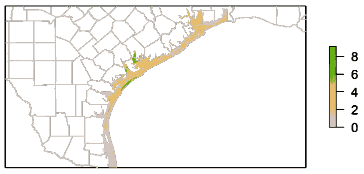
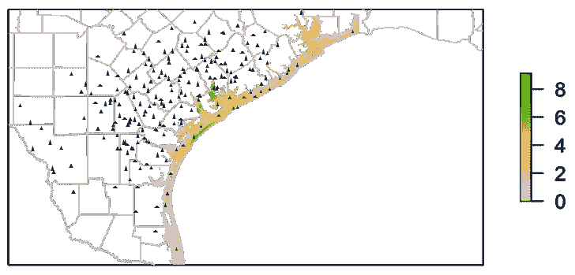
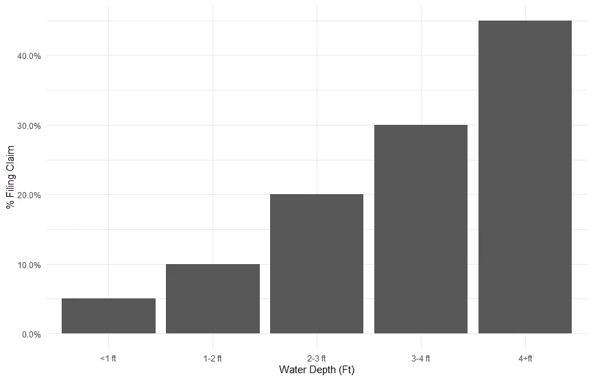
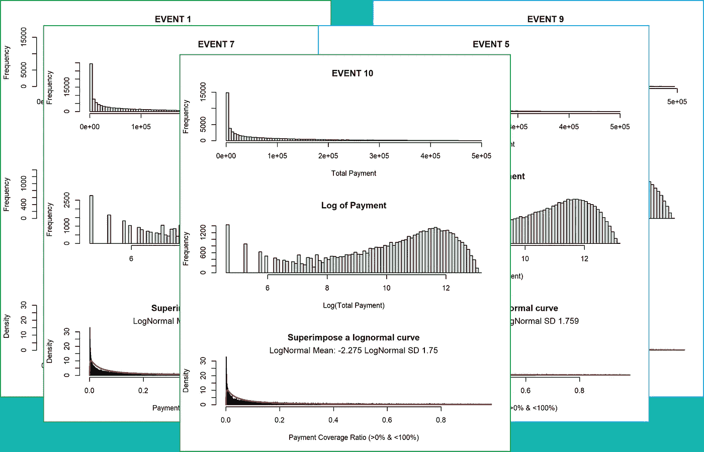
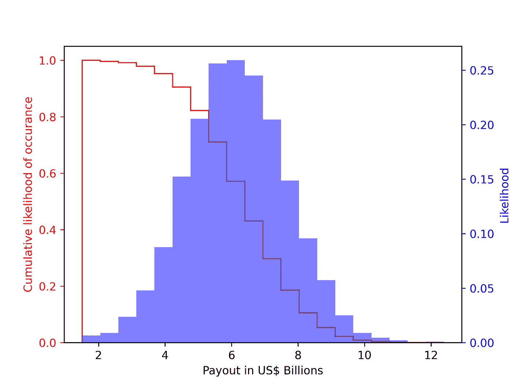
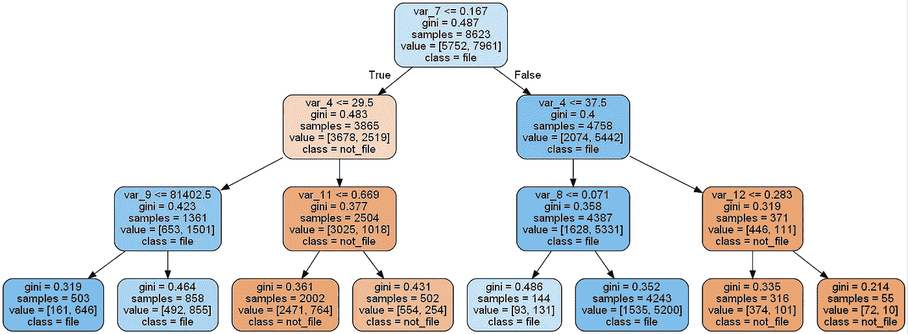
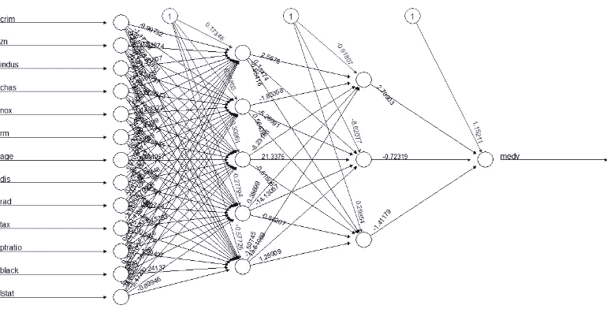

# 机器学习和保险索赔预测

> 原文：<https://medium.com/analytics-vidhya/machine-learning-and-insurance-claim-forecasts-94a5b6fe8778?source=collection_archive---------8----------------------->

## 增强保险索赔支出预测流程

对飓风、野火、洪水等导致大规模破坏的极端天气事件的保险索赔预测。对保险公司来说是一项重要的规划活动，任何可以提高预测准确性和质量的流程改进都应该受到欢迎。本文介绍了保险索赔支出的预测方法，然后讨论了机器学习技术在增强预测过程中的潜在用途。

# 一.导言

这篇文章介绍了预测保险索赔支出。我们特别关注导致大规模破坏的天气事件(*事件*)引起的索赔，如飓风、野火、洪水等。我们首先提供了传统方法的概述，然后讨论了机器学习(ML)技术的潜在用途，以增强预测过程。

虽然本文中提供的示例和网站参考是以美国为中心的，但这里提出的想法是通用的，可以应用于所有地方。在其他地区和国家，分析师需要用适当的数据源替代事件数据。

本文档的其余部分组织如下。在下一节中，我们将概述一般的模型结构以及建模框架中需要考虑的元素。在第三节中，我们将重点放在最适合使用 ML 技术的地方。在最后一节，我们讨论我们的结论。

请注意，本文中用于插图的所有数据都是模拟的，并不反映任何实际事件，除非另有说明。

# 二。建模概述

预测高影响天气事件影响的典型模型包括以下步骤(认识到具体情况需要对一般过程进行变更和/或调整)。

*   确定事件的影响范围。
*   确定受影响或可能受影响的财产的位置。
*   对于受影响的财产，确定提出索赔的可能性。
*   对于可能提出索赔的财产，确定支出金额。
*   以蒙特卡洛模拟的方式运行该流程，以生成索赔支出的分布。

在下面的小节中，我们将讨论这些步骤。

## 2.1 物业位置

分析师应该很容易得到被保险财产的地址。需要对地址进行正确的地理编码(即，具有地址的纬度和经度)，这对于大多数新发布的策略来说通常不是问题。但是，对于地址有一段时间没有更新的旧策略，可能会出现属性的纬度和经度没有正确确定的问题。

这里的主要目的是将属性地址转换成纬度和经度，以便在后续步骤中使用。要获得地址的纬度和经度，可以使用任何一个公开可用的地理编码器。美国人口普查局提供了一个优秀的地理编码器，可以免费使用。其他优秀的商业地理编码器由 ESRI、CoreLogic、Google 等提供。地理编码器还可以帮助标准化地址，这对一些公司来说是一个额外的好处。

请注意，没有一个地理编码器是完美的，每个都可能在正确识别某些地址方面存在问题(特别是如果地址不是标准的 USPS 格式)。分析师必须想出另一种方法来确定这种策略的位置，或者从分析中丢弃它们(不推荐)。

## 2.2 事件映射

流程的下一步是确定事件的影响范围。这通常可以通过几个美国政府机构和/或大学研究小组提供的详细地图和数据来完成。不同天气事件的一些来源包括:

*   **降水:**美国国家气象局的天气预报中心为全国提供降水预报。
*   **飓风:**飓风事件的风暴追踪、水位高度、风速和水位信息可从 CERA 获得。
*   **野火:**国家跨部门消防中心提供当前野火周边的数据。
*   美国国家气象局提供龙卷风地图。

图 1 显示了显示影响区域和事件强度等级的典型地图。该图显示了过去飓风事件的洪水淹没水平(数据来源:CERA)。

图 1:飓风哈维的最高淹没水位(英尺)。

一旦获得这样的地图，可以使用任何 GIS 工具或统计或编程软件叠加酒店地址。图 2 在地图上方显示了施政报告，显示了洪水泛滥的程度。使用这两条信息，分析师可以提取每个资产位置的事件强度级别。

图 2:洪水淹没水平(英尺)的政策位置-说明。

## 2.3 谁将提出索赔

大多数极端天气事件都有一个共同的主题，即使在事件的影响范围内，也不是每个地方都受到类似的影响。其中一部分纯粹是由于事件本身的特点(例如，飓风产生的风暴潮在一些地方非常危险，而在一些地方则比较温和)，另一部分是由于物业的位置(例如，位于斜坡道路顶部的物业与位于同一条道路底部的物业)，还有一部分是由于物业的特点(例如，排水良好的物业与排水不良的物业)。

这导致了一种情况，即在事件的影响范围内，并不是每个人都会提出索赔。然而，提出索赔的可能性通常会随着事件强度的增加而增加，并且这种增加通常会在某个点稳定下来。因此，如果一场风暴带来大量降雨，很可能会有更多的索赔要求在洪水水位较高的地方提出。

因此，重要的是要有一个好的模型，知道谁可能会提出索赔，以及这种可能性如何随着事件的强度而变化。这通常是作为过去事件的统计分析来完成的。

该模型可以是一个简单的交叉表，用于计算针对特定强度级别提出索赔的人的比例——这种模型如图 3 所示。

图 3:对洪水事件提出索赔的可能性(说明性的)。

更复杂的模型是逻辑回归/分类模型。有了足够的数据，可以分别为不同的过去事件估计逻辑分类模型，或者可以估计考虑多个过去事件的通用模型。

该模型的优势在于，它允许分析师了解不同预测因素之间的关系，或许还可以帮助保险公司主动与保单持有人合作，对其财产进行适当的变更，以限制/减少未来恶劣天气事件的影响。也可以考虑其他典型的计量经济学分类模型，例如概率单位回归和线性判别分析。

## 2.4 支付分配

此时，根据前面的步骤，分析师应该知道每个策略在事件影响范围内的位置、与事件相关的强度级别以及提出索赔的可能性。难题的最后一块是计算出如果投保人提出索赔，他们将得到多少赔偿。这可以通过对以前的事件进行统计分析来实现。过去事件的这种统计分析的目的是确定支出分配。

典型的情况是，有些索赔被拒绝，有些得到全部保险价值的赔偿(在财产完全毁坏的情况下)，其余的索赔得到零到全部保险价值之间的赔偿。根据事件的不同，这可能是一个平滑的分布，也可能是一个在末端有大峰值的情况(即大量被拒绝的索赔和大量全额支付)和一个中间范围的平滑分布。分析师可以查看几个过去的事件，并确定是否有一致的支出模式。图 4 显示了这样一个分析示例，其中事件的支出遵循对数正态分布模式。

图 4:使用大量过去事件的数据估计支出分配(示例)。

## 2.5 估计总支出

该流程的最后一步是将前面讨论的所有不同要素结合起来，以估计事件的总支出。这通常是通过多次迭代的蒙特卡罗模拟来完成的。

在每次迭代中，对于事件影响区域中的每个策略，策略地址的事件强度级别用于确定该策略是否将提出索赔，如果它提出索赔，则支出金额将是多少。总支出金额在迭代中累加。一旦执行了足够次数的迭代，就可以创建如图 5 所示的总支出分布。

图 5:假设事件的总索赔支出估计。

# 三。ML 技术的使用

上一节中描述的估算索赔支出的过程在很大程度上依赖于两个关键关系。一个是事件的强度与提出索赔的可能性之间的关系，另一个是赔付金额的分布。在前面概述的传统过程中，这是通过标准的计量经济学和统计建模来完成的。在本节中，我们将探讨如何使用非传统的机器学习技术来增强对这些关系的估计。请注意，在本文中，我们不会讨论用于事件映射的技术，因为它们是非常复杂的主题，不在本文的讨论范围之内。

出于本文的目的，我们将区分传统的计量经济学建模(如回归、logit 等)。)与非传统的机器学习技术(例如，决策树、神经网络等)相结合。)在理解多个变量之间的关系的典型问题的背景下，对于哪个模型是计量经济学模型，哪个是机器学习模型，没有明确的界限——这种区别通常是“文化的”，并且取决于分析师的培训背景(即，分析师是否主要接受经济学或计算机科学的培训)。在我们看来，两者之间的关键区别在于建模任务本身的目标。另一个重要的事实是，最大似然技术也可以应用于非计量经济的情况(例如，图像识别、语音识别等)。)—人们可以将最大似然法视为一套更大的潜在技术，既可以应用于计量经济学问题，也可以应用于非计量经济学问题。

标准计量经济学建模的典型目标是了解在解释因变量的行为时哪些自变量是重要的，以及该模型如何有助于解释基础理论模型。在这种方法中，人们通常更喜欢独立变量的估计系数符合预期的模型，而不是另一个拟合更好但独立变量的系数不符合预期的模型。

应用于经济计量问题的最大似然技术的焦点更多的是在执行的速度，编码的容易程度，最小化独立变量的数量和“动态学习”的能力上。这些技术非常有用，并且适用于数据流动非常快的情况，在这种情况下，模型需要快速提供结果，并且不断地进行自我调整。

在以下小节中，我们将讨论有助于增强索赔支出估算流程的 ML 技术。

## 3.1 索赔提交和事件强度

如前所述，索赔归档的典型模型是一个分类模型，它使用事件强度作为关键的独立变量。可以包括的其他变量是属性特征。

反映索赔申请、事件强度和财产特征之间关系的适当机器学习技术包括随机森林决策树(见图 6)或基于神经网络的算法(见图 7)。这些 ML 技术允许估计非线性关系。必须使用过去的数据集来“训练”模型，并且可以随着新数据的到来通过“学习”来改进模型。

图 6:随机森林决策树(示例)

图 7:神经网络模型(说明性的)。

## 3.2 估计支出分布

用机器学习的术语来说，估计支出分布本质上是一个模式识别问题。有些事件类型具有公认的支出分布模式，可以很容易地用标准统计分布(如正态或对数正态)来拟合，而有些事件的支出不符合标准分布。在这种情况下，机器学习技术，如神经网络、聚类方法(分层、k-均值、相关性)等。会很有帮助。

# 四。关闭

极端天气事件的保险索赔预测是保险公司的一项重要规划活动，任何能够提高预测准确性和质量的流程改进都应该受到欢迎。我们认为，机器学习技术在整体预测方法中提供了一些考虑领域。

欲了解包括参考文献在内的完整版本，请访问:

[http://www . rockcreekanalytics . com/machine-learning-and-insurance-claim-forecasts/](http://www.rockcreekanalytics.com/machine-learning-and-insurance-claim-forecasts/)