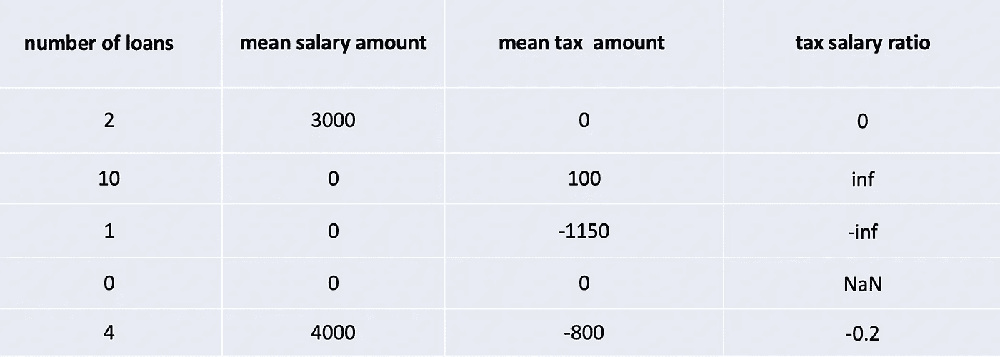

# 机器学习和多重处理。如何加快相关计算？

> 原文：<https://medium.com/analytics-vidhya/machine-learning-and-multiprocessing-4c24f4bfe568?source=collection_archive---------9----------------------->


弗兰基·查马基在 [Unsplash](https://unsplash.com?utm_source=medium&utm_medium=referral) 上拍摄的照片

**机器学习、数据科学和相关性共生共存，Python 是在这一领域工作的便捷工具。**数据集由包含多个变量的观察值组成，相关系数衡量这些变量之间的关联。在下面的例子中，我们看三个不同的特征(贷款数量、平均工资收入、平均税收收入)。


当我们选择最终模型的特征时，我们通常希望去除相关的特征，因此通常的做法是计算数据集的相关矩阵。解决方法之一是使用速度非常快的 *numpy.corroef* 方法。

但它会在所有情况下都有效吗？

# 具有 NaN 和 INF 的变量的相关性**计算**

假设我们开发了一个新的、非常有用的特性，即平均税额和平均工资额之间的比率。不幸的是，有些观察没有税务交易，有些没有工资交易。



我们以四个结果结束:

*   **-0.2** 正常浮动数:-800 / 4000
*   **inf** 平均工资金额为 0，平均税为正(纳税申报):100 / 0
*   **-inf** 平均税为负，没有工资:200 / 0
*   **南**无税无薪交易:0 / 0

姑且称之为 **NaN** 、 **inf** 和 **-inf** *特殊浮点值。*

我们仍然希望将这些变量与特殊的浮点值关联起来，但是默认的方式(使用 numpy)不起作用，因为它只返回 nan 作为结果。

在 *pandas* 库中有一个名为 *corr* 的方法，用于计算观察值与*特殊浮点值*的相关性，缺点是它只是单线程的，因此对于大表来说很慢。对于一个有 5000 个观察值和 5000 个变量的表来说 *corr* 需要 15 分钟。

# 用特殊浮点值加速计算关联

在 Kontomatik，我们关心的是缩短我们分析的反馈回路，所以我们希望加速计算与特殊浮点值的相关性，所以我的想法是使用多个内核进行计算。我们开发了一个名为 *NaNCorrMp* ( *NaN* 表示*特殊浮点值之一*， *Corr* 表示相关性，而 *Mp* 表示多处理，听起来像《星球大战》中的 Rancor)，它使用多处理器架构来执行那些类型的相关性计算。

对于一个有 5000 个观察值和 5000 个变量的表， *pandas* 方法需要 15 分钟。使用 *NaNCorrMp.calculate* 和 4 核时，需要 4.5 分钟。利用 Kontomatik 中的数据科学问题，可以在几个小时内而不是几天内计算出带有*特殊浮点值*的数万个观测值的相关表。这对于允许我们使用 16 或 32 个处理器的云来说尤其方便。

NaNCorrMp 可以简单地通过 pip 安装:

```
pip install nancorrmp
```

或者从存储库中克隆:

```
git clone git@github.com:bukson/nancorrmp.git
```

我们 Kontomatik 非常清楚开源是软件开发的基石，只有每个人都支持社区，开源才会存在。当我们偶然发现一些似乎还没有解决的问题，并且我们解决了，我们很乐意分享。因此，当我们开发了用于计算具有 NaN 和 infs 的变量的多个过程的相关性的模块时，我们正在与数据科学社区共享。

所有细节和代码都可以在这里找到:

[https://github.com/bukson/nancorrmp](https://github.com/bukson/nancorrmp)

如果您对 Kontomatik 如何使用机器学习进行财务数据分析并提高评分模型准确性的更多知识感兴趣，请查看 Kontomatik 网站。