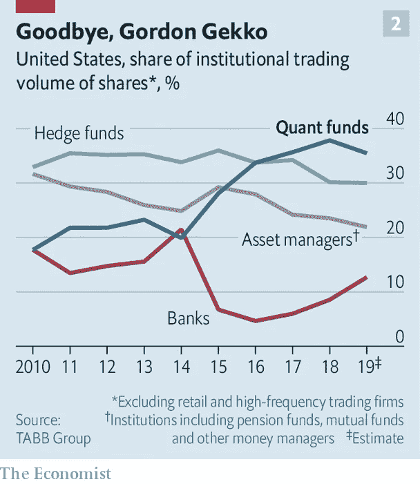

# 机器学习和股票市场

> 原文：<https://medium.com/analytics-vidhya/machine-learning-and-the-stock-market-f42917074388?source=collection_archive---------13----------------------->

[图片来源:经济学人](https://www.google.com/url?sa=i&source=images&cd=&cad=rja&uact=8&ved=2ahUKEwjoiIi5xrjlAhUPj54KHXUJBaEQjB16BAgBEAM&url=https%3A%2F%2Fwww.economist.com%2Fbriefing%2F2019%2F10%2F05%2Fthe-stockmarket-is-now-run-by-computers-algorithms-and-passive-managers&psig=AOvVaw0n6JYwmcG9Bw9t4dW6kxwn&ust=1572132050854260)

30 年前，如果你想投资几千美元，你会去找基金、对冲基金或任何其他基金经理。

快进到现在，你已经有了所谓的机器人应用程序和在线投资“经理”,它们可以自动化你投资的一切，通常只留给用户一个决策，即他们的风险状况。

机器学习正在以我们从未预料到的方式改变投资和货币市场的格局。但在我们开始之前，让我们深入了解机器学习以及它实际上是什么。

机器学习是人工智能的一个子领域，其底层机制在于它能够理解数据的结构，并将这些数据整理成人们可以理解的模型，以进行预测或决策。

随着时间的推移，机器学习在处理数据和学习数据的方式上已经发生了演变。有监督学习和无监督学习。这些方法最好由下面的机器例子来提供，这些机器是用来控制国际象棋比赛的。

1997 年，一台名为“深蓝”的 IBM 超级计算机已经“使用人类玩家编写的规则进行了编程”([《经济学人》，“机器的三月”，2019 年 10 月 5 日](https://www.economist.com/printedition/2019-10-05\))。这是一种监督学习，规则由人类输入计算机，机器能够以人类的方式演奏，但比任何人都更好更快。

跳到 2017 年，谷歌推出了“AlphaZero”，一台被赋予了国际象棋规则并能够自学下棋的计算机。这是无监督学习，学习算法能够使用输入数据找到模式和模型，并促进学习。花了四个小时的训练才打败了超级计算机 Stockfish，这是当时人类战术编程的最好的机器。

# 现在谈谈股票市场。

[量化基金(quant fund)是一种利用高级量化分析选择证券的投资基金](https://www.investopedia.com/terms/q/quantfund.asp)。管理人员使用编程软件建立定制化和专业化的模型，以确定基金投资组合的最佳投资。

量化基金也可以分为两组——一组使用人类策略，另一组自己创造策略。以前，投资者能够根据历史数据测试模型并做出判断，而现在，我们从数据开始，寻找一种模式或假设来做出预测，以帮助做出重大决策。

就股票市场而言，注意相关性和回归之间的区别是很重要的。[相关性是对影响市场的不同变量之间的关联性](https://www.digitalocean.com/community/tutorials/an-introduction-to-machine-learning)的度量，这些变量相互独立。然而，回归模型的不同之处在于，它们将因变量(如黑色债务)量化为随股价变化的自变量。

随着时间的推移，这些机器减少了人类在决策过程中的必要性。已经出现的一种担忧是，这些预测市场行为的算法可能会在市场中频繁引发更多突然的冲击，从而造成我们所说的“闪电危机”。2014 年，“债券价格在几分钟内再次大幅上涨 5%以上”(《经济学人》2019 年 10 月 5 日《机器的进军》)。这些因素中的许多是由于股票市场中的高交易量交易者提供的流动性加剧了交易波动性。

然而，从另一方面来说，可以认为市场更适合算法和模型，而不是人类来主宰市场。电脑毕竟缺乏人类情感，这导致个人投资出现一系列问题。

> 然而，人们确实担心，如果这些量化基金真的成功实现了它们的目标，会发生什么？

股票市场是国家经济不可或缺的一部分，它决定了哪些竞争者和哪些公司能够获得他们所需要的现金。这些机器学习算法能够精确定位我们人类尚未能够理解的模式和模型，这一点即将到来。在这种情况下，任何拥有这种技术的公司获得的任何优势，都将使他们比其他任何人都有一种潜在的优势。尽管这些优势最终会落入其他公司的手中，并使市场正常化，但这是不可避免的。

我们尚未涉足的一个方面是深度学习及其给所有者带来的巨大优势。深度学习试图 [*“模仿人脑如何将光和声音刺激处理成声音和听觉”*](https://www.digitalocean.com/community/tutorials/an-introduction-to-machine-learning) *。*它使用非线性处理来逐层提取大量数据，作为后续层的输入。

深度学习能够吸收最多的数据，并在历史上成功地在认知任务中击败了人类，特别是那些需要财务分析和有关财务决策的任务。

在这种情况下，深度学习将能够吸收大量的历史股票市场数据，包括以前的崩盘、危机、牛市/熊市，并能够将这些数据聚集到连续的变量类别中，然后在算法模型的背景下进行解释。然而，这里的问题是，有时在股票市场的指数中，需要人类的杠杆作用或控制来理解实际驱动股票市场的复杂性，而不是由计算机设计的实际上有意义的任意变量。

然而，随着时间的推移，这种趋势只会增加，我们将看到量化基金的市场主导地位。在文章开头的图片中，你可以看出，现在，几乎 40%的机构交易份额由量化基金持有，而不到十年前，这一比例还不到 20%。

为了解释这一点，我们必须理解金融是高度非线性的，甚至随着时间的推移，股票价格数据也可能看起来完全是随机的。在实时交易系统中实施传统算法模型并不能保证能够将新数据加入系统。这是由神经网络来对抗的，神经网络被设计成在发现数据之间的关系并使用它来预测新数据方面更加[有效。](https://towardsdatascience.com/neural-networks-to-predict-the-market-c4861b649371)

神经网络股票市场算法的工作流程有 5 个阶段。

1.  )数据采集
2.  )数据预处理
3.  )模型的开发和实现
4.  )回溯测试模型
5.  )优化

神经网络模型的一种简单形式是多层感知器(MLP ),其中简单数据作为输入被输入到模型中，并且对这些数据中的每一个使用特定的权重，这些值被提供给隐藏层以产生输出。

另一种形式或神经网络模型，是长期短期模型(LSTM)，或换句话说递归神经网络(RNN)。这些具有存储关于该数据的某些信息以供以后使用的能力，并且能够给予网络理解和分析股票价格数据和历史股票价格数据之间的关系结构的复杂性以及它们如何相互交织的能力。随着层数的增加，网络的学习能力或速度会增加几倍，并且能够降低市场异常的梯度。

为了实现这些模型， [keras 是一个常用的开源神经网络库，用 Python](https://en.wikipedia.org/wiki/Keras) 编写，因为它使用了连续向网络添加层的思想，而不是一次定义整个网络。这有助于打击市场的臭名昭著的能力，有时翻转，并能够加速快速改变的数据给出了这一点。

尽管存在各种担忧和顾虑，但市场不可避免地将越来越多地由量化基金/机构管理和运营，此时我们唯一能做的就是根据可以无缝整合到量化模型中的人类策略和行为模型来调整和帮助开发这些基金算法。