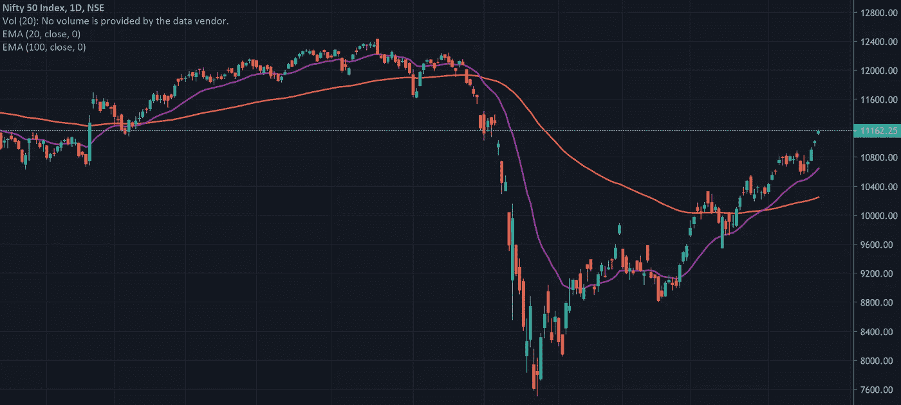
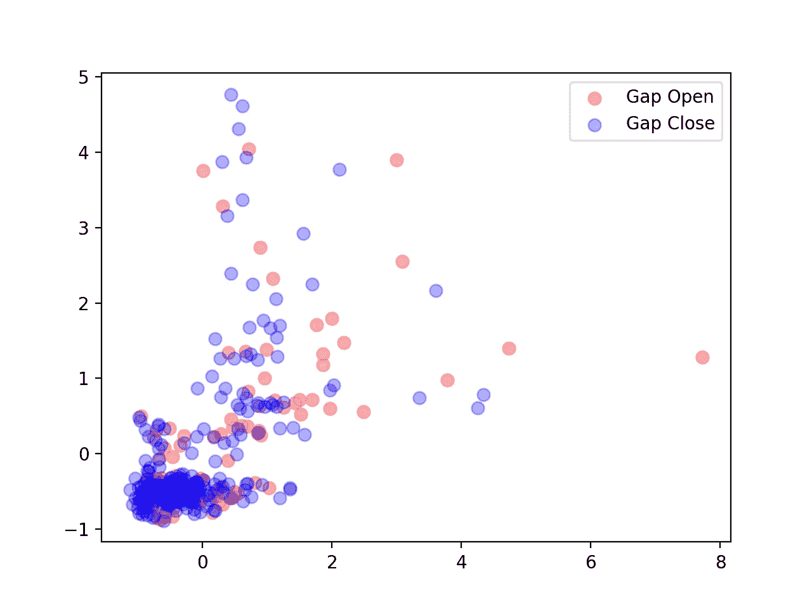

# 机器学习和交易

> 原文：<https://medium.com/analytics-vidhya/machine-learning-and-trading-6f47a083a531?source=collection_archive---------19----------------------->



# 间隙播放

约翰·f·卡特在*的《掌握交易*一书中，将他最简单的系统描述为“*缺口游戏*”，他在股票开盘时创造的缺口进行交易，并在收盘时记录利润。我将尝试使用**简单的分类和回归技术**来重现这种差距。交易术语会被随意使用，但如果幸运的话，这不会影响这篇文章的本质。然而，如果你想随时跟上速度，[这个](https://www.investopedia.com/articles/trading/05/playinggaps.asp)是解释这里所有基本概念的兔子洞的良好开端。

## 设置

卡特的设置包括*缩小股票价格的差距。他每天都这样做，并使用特定股票的盘前总成交量，他称之为“当天的大盘股”，提供当天市场状态的概览。他的设置包括基于他根据经验对这些代表性股票的盘前交易量定义的启发式阈值。他以 VIX 美元指数的值为基础来计算临界量的值。*

## *设置(没有行话)*

*卡特的设置包括从一天内的股价差异中赚钱。例如，如果在今天开市时，一只股票的交易价格低于昨天收市时的交易价格，那么根据某些指标，卡特购买该股票的股票，并在今天开市时和昨天收市时的价格差距关闭时卖出。这些指标是什么？卡特使用他挑选的某一组股票在开市前的交易量数据，并根据这些交易量定义阈值，他根据这些阈值做出买卖决定。这些阈值是根据另一个称为 VIX 的指标确定的，该指标的值决定了这些阈值应该是多少。这不是(或者至少在我看来不是)火箭科学，这是一个根据经验精心制作的设置。*

*我的目标是使用基本的机器学习技术重建这个设置。我将训练两种预测器:一个**回归器来预测缺口将被填充的百分比**和一个**分类器来预测缺口是否会闭合**。然而，在这篇文章中，我将只详述分类器的结果。*

# *数据*

*对于我的数据，我已经获得了从 2019 年 1 月 1 日到 2020 年 7 月 17 日所有[漂亮的](https://www1.nseindia.com/live_market/dynaContent/live_watch/equities_stock_watch.htm?cat=N)股票的 15 分钟内数据。这些数据以 CSV 文件的形式提供，我从更大的数据集中过滤出上市前的数据。这是通过在所有股票的数据中搜索 09:00–09:15(NSE 的盘前时段时间)的适当时间戳并将其收集到数据矩阵中来完成的。*

*该模型将提供对 NIFTY 缺口的预测(Carter 使用 S&P、道琼斯指数)，因此对于真相标签(缺口是否闭合)，我使用 NIFTY(以及$INDIAVIX)的每日数据，范围与之前相同。然后，我遍历数据，使用前一天和今天的 OHLC，形成 NIFTY 中的缺口是否闭合所需的标签。*

```
*# NIFTY OHLC data is in nifty_data# truth labels
binary_labels = []for i in range(nifty_data.shape[0]-1):
    yday_close = nifty_data[i, CLOSE]
    today_open = nifty_data[i+1, OPEN]
    today_low = nifty_data[i+1, LOW]
    today_high = nifty_data[i+1, HIGH]# gap at open, and gap at its smallest
if today_open > yday_close:
    gap = today_open - yday_close
    gap_close = today_low - yday_closeelif today_open < yday_close:
    gap = yday_close - today_open
    gap_close = yday_close - today_high# did the gap close?
if gap_close <= 0:
    binary_labels.append([i,1])
else:
    binary_labels.append([i,0])*
```

# *天真的基线*

*我们马上面临一个困境:**没有足够的数据。**我获取历史数据的来源仅提供了 2019 年 1 月 1 日的数据，这导致了 **≈** 350 个数据点。由于我们缺乏数据，让我们使用一个简单的**逻辑回归模型作为初始的原始基线。***

```
*clf = LogisticRegression()*
```

*使用具有 4 个分割的 K-fold 交叉验证方法，给出了可怕的结果:*

```
*Class   Metric     Score
0       Recall     0.064
1       Precision  0.67
--------------------------
Accuracy = 0.66*
```

***注:**我们感兴趣的是缺口未平仓(0 级)的召回分数，因为错误预测缺口将平仓(假阴性)的头寸后果严重。类似地，缺口闭合(类别 1)的精度更重要，因为我们想要尽可能多的缺口闭合的正确预测(真阳性),并且如果预测是缺口开放(假阳性),我们就不会进入该位置。*

*如果我们对模型做一个小小的改变:*

```
*clf = LogisticRegression(class_weight='balanced')*
```

*那么结果就更有希望了:*

```
*Class   Metric     Score
0       Recall     0.45
1       Precision  0.70
--------------------------
Accuracy = 0.59*
```

*从表面上看，我们已经取得了 45%的更好的召回分数，同时以整体准确性为代价略微提高了 70%的精确度，整体准确性从 66%降低到 59%。然而，**总体精度在这里并不重要。**为了理解原因，下面是整个数据集的曲线图:*

**

**“间隙闭合”*点的数量明显多于*“间隙打开”*点，只有 1/3 的数据对应于*“间隙打开”*点。这意味着您可以**通过预测差距将会缩小**获得 66%的准确度，这是第一个基线模型给出的准确度。***class _ weight = ' balanced '****参数允许我们抵消数据中的这种不平衡，结果很清楚。**

## **结论**

**通过使用在一年半的数据上训练的逻辑回归分类器，一个完全不必要的相当于约翰·f·卡特的 *gap play* 的数据科学是可能的。此外，有趣的是，人们可以通过简单地进入一个假设差距会缩小的位置来赚钱(也亏损了很多，但最终获得了利润)。**