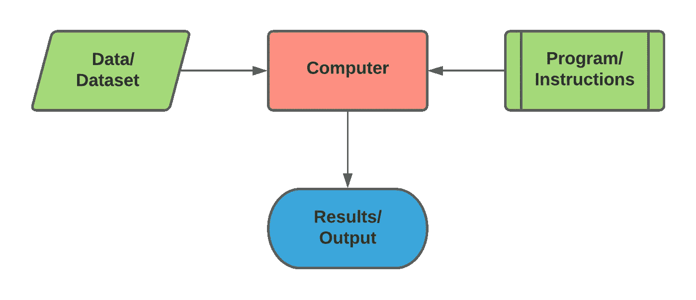
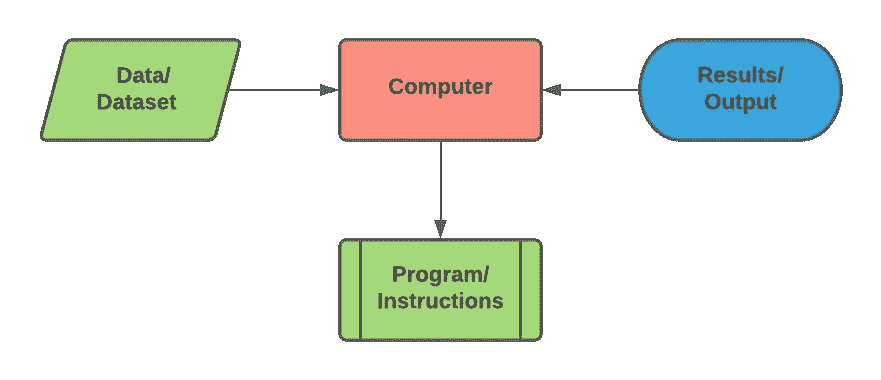
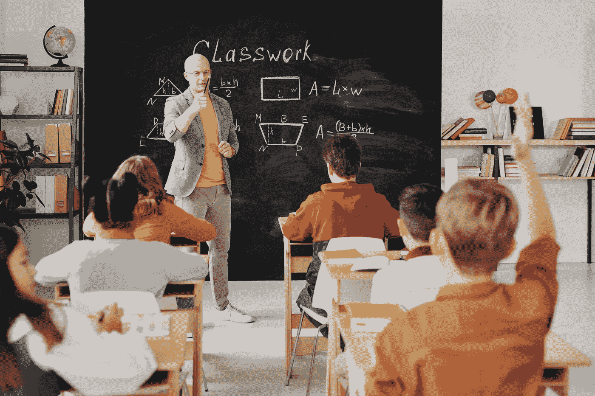
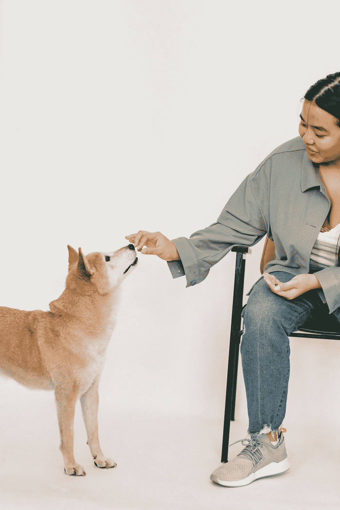
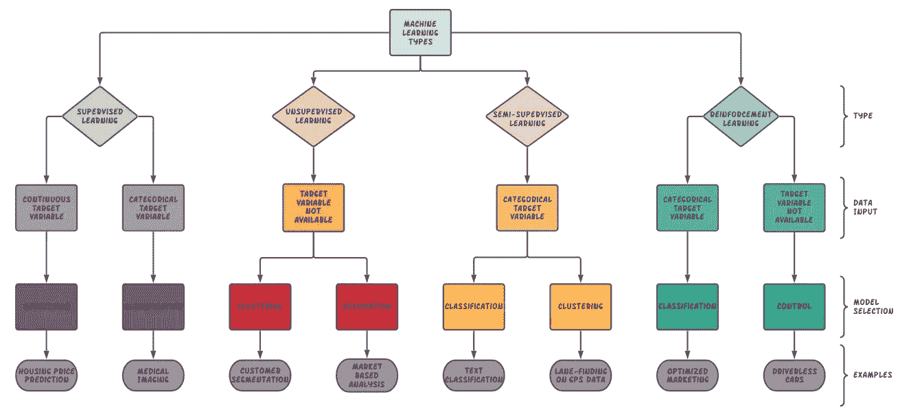

# 机器学习和从哪里开始！

> 原文：<https://medium.com/analytics-vidhya/machine-learning-and-where-to-start-2c00b157c114?source=collection_archive---------29----------------------->

如果你偶然发现了这个博客，你一定对计算机这个神奇的世界感到好奇或有点兴趣。像人工智能、机器学习、数据科学和深度学习这样的术语一定会在你的眼中点燃星光，你正在寻找一种方法来弄脏你的手！

图片来源:[亚历山大·奈特](https://www.pexels.com/@agk42?utm_content=attributionCopyText&utm_medium=referral&utm_source=pexels)来自 Pexels

首先，我们应该对什么是计算有一个基本的了解。计算只是从提供的数据中提取结果的一组明确定义的规则。为了简单起见，假设我们给计算机两个数字，让它相加，然后计算机研究加法规则并输出结果。

图一。传统计算

机器学习并没有太大的不同。从它的名字可以清楚地看出，在机器学习中，我们涉及计算机中的诱导智能。它可以被定义为计算机基于经验数据进化行为的能力。简单来说，计算机通过浏览提供的数据和应该从这些数据中得出的结果的例子，学会为自己形成一套规则。正如智能需要知识一样，计算机有必要获取这些知识。

> **模式识别领域关注的是通过使用计算机算法自动发现数据中的规律，并利用这些规律采取行动。 **—克里斯托弗·毕晓普****

********

****图二。传统 ML 算法****

# ****开始理解机器学习的方法****

****这个路线图是建立一个逐步成长成为一个 ML 天才。****

## ******步骤 1 —前提条件******

*   ******线性代数和微积分**
    虽然这是大多数 ML 初学者最难掌握的部分，但通过有条理的学习方法，可以掌握到你想要工作的水平所要求的程度，而不是更多。****
*   ******统计与概率**
    数据是机器学习的心脏和灵魂。事实上，表示、评估和优化包括大约 80%的机器学习算法。人们应该能够从原始数据中理解和推断观察结果。****
*   ******编程语言** 如果你的目标是创建自己的 ML 项目，那么绝对有必要掌握一门编程语言。有一些语言在 ML 程序员的世界里很有名，比如 Python，R，Scala 等等。掌握这些语言中的任何一种都会给你的 ML 实践经验带来很大的提升。****

## ****第二步——学习行话****

*   ******模型**
    这是一种由 ML 算法产生的类型伪代码，该算法已经被训练成从给定数据中识别某种模式。****
*   ******特征**特征是数据集的元组或可度量的量/属性。****
*   ******目标**
    一个目标或一个标签是模型在计算后想要达到值。****

## ****步骤 3-机器学习的类型****

*   ******监督学习**
    这种机器学习的方法包括在一个带有预先标记数据的数据集上进行训练。这意味着计算机已经被提供了正确或错误，它从给定的数据中理解模式。可以通过分类回归来实现。这可以被看作是通过告诉婴儿是或不是来训练他们做什么或不做什么，因为这是他们所能理解的。****

********

****图片来源:[来自 Pexels 的 Anastasia Shuraeva](https://www.pexels.com/@anastasia-shuraeva?utm_content=attributionCopyText&utm_medium=referral&utm_source=pexels) 。****

*   ******半监督学习**
    这种 ML 方法涉及使用由少量标记数据和大量未标记数据组成的训练数据。该模型比监督学习更具成本效益，因为它的属性是迭代较少数量的标记数据来预测结果。这就像一个老师在教室里用几个例子来讲述是非曲直。****

********

****图片来源:[来自 Pexels 的 Max Fischer](https://www.pexels.com/@max-fischer?utm_content=attributionCopyText&utm_medium=referral&utm_source=pexels) 。****

*   ******无监督学习**
    在无监督学习下，提供的数据是无标签的。由计算机在数据中寻找结构。通过因子分解和聚类方法来辅助无监督学习。这种方法就像学校的自助餐厅，同桌的学生比远桌的学生更倾向于彼此相似。****

********

****图片来源: [Arturo Rey](https://unsplash.com/photos/CgVqj1l-u44) 来自 Unsplash。****

*   ******强化学习**你给计算机一个要做的动作，通过反复试验，如果计算机成功了，你就给它提供了一种享受！在这种学习方法下，下一步是以未来步骤的回报最大化为基础来确定的。****

********

****图片来源:[Pexels 的 Sam Lion](https://www.pexels.com/@sam-lion?utm_content=attributionCopyText&utm_medium=referral&utm_source=pexels) 。****

## ****第 4 步—学习和实施****

*   ****这里有几本书可以帮助你继续学习机器。绝对初学者的机器学习——奥利弗·西奥博尔德
    **2。**面向假人的机器学习(Python 和 R 语言)——John Paul Mueller 和 Luca Massaron
    **3。**黑客的机器学习——德鲁·康威和约翰·迈尔斯
    **4。**机器学习:新的人工智能——Ethem Alpaydin****
*   ******您可能想要使用的 IDE/编辑器列表
    1。**[Google Colab](http://colab.research.google.com)
    **2。** [朱庇特笔记本](http://jupyter.org)
    **3。** [闲散](https://docs.python.org/3/library/idle.html)
    **4。**[syp der](https://www.spyder-ide.org/)
    **5。**[PyCharm](https://www.jetbrains.com/pycharm/) **6。** [原子](https://atom.io/)
    **7。** [Visual Studio](https://visualstudio.microsoft.com/)****
*   ******举例练习******

********

****图 3。示例概述****

*****制定这个计划时要记住，读者是一个完全的初学者，想要在 AI/ML 领域产生兴趣。遵循这个循序渐进的计划应该可以帮助任何人进入计算机智能的世界。你所需要的只是意志力和力量去练习，练习，练习你的基础，你将会成为一个学习机器的天才。*****

> ****感谢阅读。
> 别忘了点击👏！****