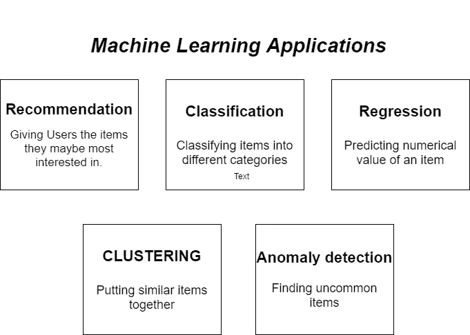

# 机器学习应用

> 原文：<https://medium.com/analytics-vidhya/machine-learning-applications-78b7808ab007?source=collection_archive---------13----------------------->

1.  建议
2.  分类
3.  回归
4.  使聚集
5.  异常检测

让我们来谈谈每一个

# 建议

*   推荐系统是根据许多不同的因素向用户推荐东西的系统。这些系统预示着用户最有可能购买和感兴趣的产品。像网飞、亚马逊等公司。利用推荐系统帮助用户识别适合他们的产品或电影。
*   简单地说，我们可以将推荐系统描述为

> "给你的用户他们可能最感兴趣的项目."

> **比如网飞的推荐系统，根据你的喜好、流派观看时间、收视率、地点等来建议看什么。**

# 分类

*   用于监督学习算法。
*   分类是将一组给定的数据分类的过程。
*   分类模型试图从观察值中得出一些结论。给定一个或多个输入，分类模型将尝试预测一个或多个结果的值。
*   分类将其输入分配给预定义的类。
*   简而言之，我们可以将分类描述为:

> 确定项目属于哪个类别

> **示例:过滤“垃圾邮件”或“非垃圾邮件”的电子邮件**

# 回归

*   当我们想要预测真实或连续的值作为输出时，使用回归。
*   回归分析有助于我们理解当其他自变量保持不变时，因变量的值是如何相对于自变量发生变化的。
*   它预测连续/真实值，如温度、年龄、工资、价格**、**等

> **例子:Zillow 的算法根据房屋的特点、位置、周围的房屋等来确定房屋的价格。**

# 使聚集

*   用于无监督学习算法。
*   它基本上是一种无监督学习方法。
*   聚类是一种涉及数据点分组的机器学习技术。
*   它可以被定义为“一种将数据点分组到由相似数据点组成的不同聚类中的方法。具有可能相似性的对象保留在与另一个组具有较少或没有相似性的组中。”

> 把相似的物品放在一起

> **示例:根据用户的推文内容和他们使用的标签，在 Twitter 上找到相似的用户和话题。**

> 分类将其输入分配给预定义的类。聚类识别相似性并将具有相似特征的输入分组，它在某种程度上构成了自己的类。

# 异常检测

*   异常检测(或异常值检测)是对罕见项目、事件或观察结果的识别，这些项目、事件或观察结果通过与大多数数据显著不同而引起怀疑。

> 查找不常见的项目

> **示例:**
> 
> **1。Amazon Fresh 的算法可以自动确定不再新鲜且不应出售给客户的产品。**
> 
> **2。多次失败的登录尝试表明可能存在可疑的网络活动。**
> 
> **3。金融交易中的欺诈检测**

参考:

[https://twitter.com/svpino?s=20](https://twitter.com/svpino?s=20)