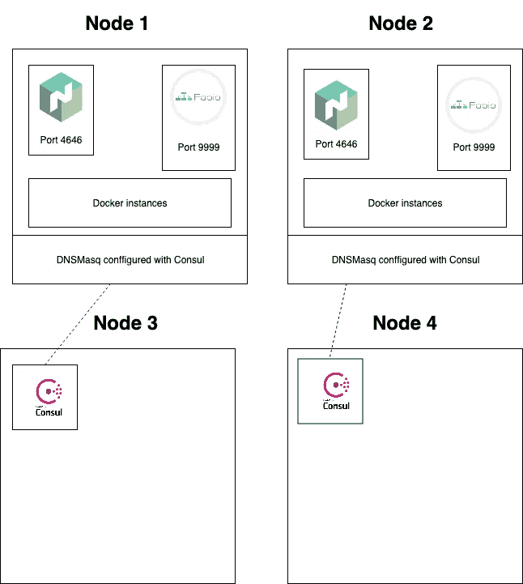
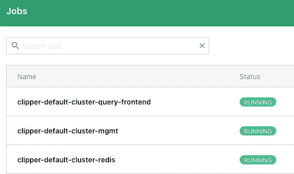
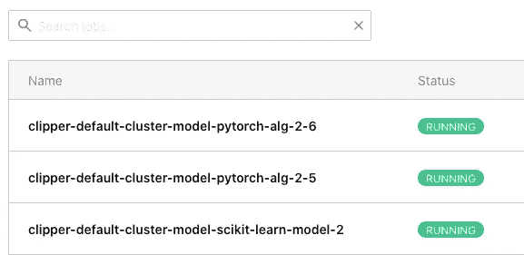
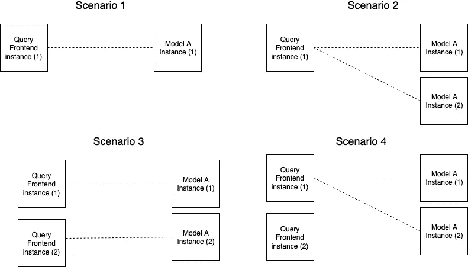

# 机器学习自动化(1):快船人工智能

> 原文：<https://medium.com/analytics-vidhya/machine-learning-automation-1-clipper-ai-7b896890695f?source=collection_archive---------16----------------------->

本文是探索机器学习平台系列的一部分，旨在了解它们提供的服务以及它们如何帮助您在生产中交付更好的模型。


clipper.ai

# 快船是什么？

Clipper 将自己定义为:

> 一种预测服务系统，位于面向用户的应用程序和各种常用的机器学习模型和框架之间。

所以 Clipper 是一个反向代理。它通过 REST Api 调用，并通过构建在 [zeromq](https://zeromq.org/) 之上的低开销协议与模型通信。

**它由三个建筑块组成**:

*   **Admin** (或管理):该服务保存配置并允许读取和更新。它需要一个简单的 Redis 数据库。它是用 Python 写的
*   **查询前端**:这是反向代理，为了性能和避免垃圾收集，用 C++写的。它实现 zeromq 协议，并以这种方式与模型通信。
*   **模型**:每个模型都封装在一个容器中，该容器处理来自查询前端的远程过程调用。

如果你使用一个支持的编排器(Docker Cli，Kubernetes ), clipper**极大地简化了部署步骤。不过支持其他编排器相对简单，我将在下面演示。**

# 从 Jupyter 笔记本到 Nomad 上的部署

以下示例基于目前仍在审核中的[PR。](https://github.com/ucbrise/clipper/pull/750)

先决条件:

*   您需要一个带有 Consul DNS 和 Fabio 负载平衡器的 Nomad 集群。你可以按照[这个教程](https://blog.scaleway.com/2016/build-your-infrastructure-with-terraform-nomad-and-consul-on-scaleway/)学习 Scaleway，并阅读 [Nomad](https://www.nomadproject.io/) 、[consult](https://www.consul.io/)和 [Fabio](https://fabiolb.net/) 可用的文档。
*   您需要在您的计算机上配置 Consul DNS，请确保您可以解析*.service.consul 地址。

您可以在这个 [Git 存储库](https://github.com/hyperplan-io/clipper-nomad-demo)上找到 nomad 部署的代码示例和资源。



我在这个演示中使用的架构

我们的目标是在我们的机器上训练一个简单的模型，并将其部署到我们的 Nomad 集群中。

我们首先用 Scikit-Learn 构建一个简单的模型。我们将在 Scikit Learn 的糖尿病数据集上训练一个简单的线性回归。这适合几行代码。

```
from sklearn import datasets
from sklearn.model_selection import train_test_split
from sklearn.linear_model import LinearRegressiondiabetes = datasets.load_diabetes()X_train, X_test, y_train, y_test = train_test_split(diabetes.data, diabetes.target, test_size=0.2, random_state=0)
clf = LinearRegression()
clf.fit(X_train, y_train)
```

## 部署

现在我们有了自己的模型，我们希望通过 REST API 将它提供给我们的用户。没有 Clipper，我们必须经历许多步骤，这些步骤大部分是由开发人员完成的。

*   创建一个 Flask 应用程序及其 API
*   创建指标和运行状况检查
*   将申请归档
*   写一个*。要部署的 nomad 脚本

Clipper 让我们用几行 Python 代码就可以避免所有这些步骤！

首先，我们创建一个到 Nomad 集群的连接，并设置一些参数，比如我们使用的 DNS(Consul)和负载平衡器(Fabio)。您需要[在一个端口上配置启用了 tcp 代理的 Fabio】。这是因为**查询前端**和**模型容器**与 TCP 协议通信。在我的例子中，我使用了端口 7000。](https://fabiolb.net/feature/tcp-proxy/)

```
from clipper_admin import ClipperConnection, DockerContainerManager, NomadContainerManager, ConsulDNS, FabioLoadBalancernomad_ip_addr = ‘10.65.30.43’dns = ConsulDNS() # We use Consul for DNS resolutioncontainer_manager = NomadContainerManager(
  nomad_ip=nomad_ip_addr,
  dns=dns,
  load_balancer=FabioLoadBalancer(
    address='fabio.service.consul', 
    http_proxy_port=9999, 
    tcp_proxy_port=7000
  )
)
clipper_conn = ClipperConnection(container_manager)
clipper_conn.start_clipper()# use clipper_conn.connect() later
```

一旦执行了这段代码，您应该会在 Nomad UI 中看到**三个任务**开始。



三个工作，数据库，管理和查询前端

为了服务于一个模型，你必须创建一个“应用程序”。你可以把它想象成一个项目，它将**重新组合**所有**完成同一个目标**的算法。您可以指定它的名称、它接收的输入数据类型、发生错误时它将输出的默认数据，以及服务级别目标，即您预期的预测交付速度。

Clipper 将尝试使用批处理等技巧，在**延迟**和**吞吐量**之间找到平衡。

```
my_application_name = 'app-1'

clipper_conn.register_application(
  name=my_application_name, 
  input_type="doubles", 
  default_output="-1.0", 
  slo_micros=10000000
)
```

一旦我们创建了我们的应用程序，我们可以查询它。这还不是很有用，因为我们还没有解决这个问题的模型。

```
{
  "query_id":13,
  "output":1.0,
  "default":true,
  "default_explanation":"No connected models found for query"
}
```

为了在我们的应用程序(或项目)上提供一个新的模型，我们使用一个可用的**部署器**。Clipper 为 TensorFlow、Keras、PyTorch 等许多框架提供了实现。他们还有一个标准的 Python 函数部署器，我们将使用它来部署我们的 Scikit 学习模型。您只需要访问 Docker 注册表(您可以使用 Docker Hub)。在这个例子中，我使用了一个托管在 Scaleway 上的私有注册中心。

```
from clipper_admin.deployers import python as python_deployermy_model_name='scikit-learn-model'
my_model_version = 1# I use a private registry hosted on Scaleway
container_registry = 'rg.fr-par.scw.cloud/hyperplan'python_deployer.deploy_python_closure(
  clipper_conn, 
  name=my_model_name, 
  version=my_model_version, 
  input_type="doubles", 
  func=clf.predict,
  pkgs_to_install=['scikit-learn'],
  registry=container_registry
)
```

如果需要一些预处理，可以修改 **func** 参数。

```
def my_prediction_func(model, inputs):
    return [model(x) for x in inputs]
```

deployer 函数将构建一个包含所有必需依赖项的 Docker 映像，将其推送到容器注册中心，并向 Nomad 提交一个新作业。您应该在 Nomad UI 中看到该实例。



提供各种型号

在使用我们的模型之前，还有最后一步，我们需要将它与我们的应用程序连接起来。

```
clipper_conn.link_model_to_app(
  app_name=my_application_name, 
  model_name=my_model_name
)
```

来测试一下吧！我们将通过 fabio 负载平衡器调用它(它监听端口 9999 上的 http 流量)。快船送达以下地址。

```
[http://fabio.service.consul:9999/clipper/](http://fabio.service.consul:9999/clipper/{app_name}/predict)
```

您可以在我们的应用程序(app-1)上创建预测，方法是在

```
[http://fabio.service.consul:9999/clipper/app-1/predict](http://fabio.service.consul:9999/clipper/{app_name}/predict)
```

这里有一个 python 的例子

```
import requests, json, numpy as np
headers = {"Content-type": "application/json"}
requests.post(
  "[http://fabio.service.consul:9999/clipper/{app_name}/predict](http://fabio.service.consul:9999/clipper/{app_name}/predict)".format(app_name=my_application_name), 
  headers=headers, 
  data=json.dumps({"input": list(np.random.random(10))})
).json() {'query_id': 12, 'output': 248.95820966558657, 'default': False}
```

# 我的建议

Clipper 是一个很棒的工具，我向任何有简单需求来服务机器学习模型的人推荐它。它易于使用，可扩展和高性能。我只是对一些设计决策有些担心:

*   **Clipper 宁愿不返回结果**也不愿返回超出容许 SLO 的结果。我更喜欢在这种情况发生时进行监控和报警。
*   **应用程序和模型之间的 1:1 关系**，使用 Clipper，您不能在模型上进行 AB 测试。这意味着你要么需要在查询前端添加另一个 Http 代理(很可能是 Flask ),如[本期](https://github.com/ucbrise/clipper/issues/628)所述，但是 Python 是一种垃圾收集语言，这将导致意外的延迟和整体性能下降。
*   **查询前端容器是有状态的**。It 需要来保持到每个模型的至少一个实例的连接。当您向网络中添加一个新的查询前端实例时，您可能会遇到这样一种情况，即它没有与每个模型保持连接。模型实例可以使用 DNS 来解析查询前端的 ip 地址，不保证模型 A 的两个实例将连接到查询前端的两个不同实例。这是一个潜在的问题。解决这个问题的一个方法是使用一个无状态的协议，比如 gRPC，但是这需要对 Clipper 的架构做一些重大的改变。



可能的不同场景，4 是我们想要避免的

[你可以在 Github](https://github.com/hyperplan-io/clipper-nomad-demo) 上找到我的代码，还有额外的代码样本和关于我的基础设施设置的信息。