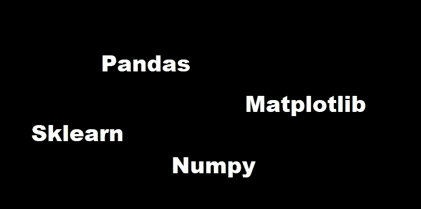

# 机器学习基础库摘要

> 原文：<https://medium.com/analytics-vidhya/machine-learning-basic-library-abstract-7440a3af0d8c?source=collection_archive---------23----------------------->

在开始机器学习之前，我正在使用 python 启动机器学习所需的库。

1.  熊猫
2.  Numpy
3.  matplotlib
4.  sklearn

# 熊猫图书馆:-

要安装熊猫，请使用

“pip 安装熊猫”

pandas 用于处理数据帧，并使用不同的函数加载数据，如

pd.load_csv()

pd.load_html()

pd.load_sql()

或者不同的功能，这些都是熊猫为数据集加载的。

当我们分析数据集时，我们使用丢弃数据、填充数据或估算这些函数来获得用于训练的完美数据集。

# 2.**Numpy 图书馆:-**

在 Python 语言出现的初期，开发人员开始需要执行数值计算，尤其是当这种语言开始被科学界所考虑的时候。

第一次尝试是由 Jim Hugunin 在 1995 年开发的 Numeric，随后是一个名为 Numarray 的替代包。

这两个包都是专门用于数组计算的，并且每个包都有各自的优势，这取决于它们的使用情况。

因此，它们被不同地使用，取决于它们在哪里表现得更有效。这种模糊性导致了统一这两个包的想法，因此 Travis Oliphant 开始开发 NumPy 库。

它的第一个版本(1.0 版)出现在 2006 年。从那一刻起，NumPy 就被证明是 Python 用于科学计算的扩展库，是目前应用最广泛的用于多维数组和大型数组计算的包。

此外，该软件包还附带了一系列函数，允许您以高效的方式对数组执行操作，并执行高级数学计算。

目前，NumPy 是开源的，并获得 BSD 许可。有许多贡献者在他们的支持下扩大了这个图书馆的潜力。

Numpy 用于数组。

当我们需要将图像转换成数组时，我们使用 numpy 函数。

在深度学习 CNN 模型中，所有图像被转换成矢量，这些矢量被存储成数组

要安装 numpy:

在 Linux 上(Ubuntu 和 Debian)

sudo apt-get 安装 python-numpy

在 Linux 上(Fedora)

sudo yum install numpy scipy

有蟒蛇的窗户上

康达安装数量

# **3。Matplotlib 库**

Matplotlib 是一个专门开发二维图表(包括三维图表)的 Python 库；

近年来在科学界和工程界广泛流传(http://matplolib.org)。

在使其成为数据图形化表示中最常用的工具的所有特性中，有几个非常突出:

*   使用极其简单
*   渐进式开发和交互式数据可视化 LaTeX 中的表达式和文本
*   更好地控制图形元素
*   以多种格式导出，如 PNG、PDF、SVG 和 EPS。

Matplotlib 的设计目的是尽可能多地再现一个在图形视图和语法形式方面类似于 Matlab 的环境

matplotlib 用于

可视化。

对于回归算法中的结果图，使用 matplot.lib 来理解输出

 [## Matplotlib: Python 绘图- Matplotlib 3.3.2 文档

### Matplotlib 是一个全面的库，用于在 Python 中创建静态、动画和交互式可视化…

matplotlib.org](https://matplotlib.org/) 

# 4.scikit-learn 库:-

scikit-learn 是一个集成了许多机器学习算法的 Python 模块。

这个库最初是由 Cournapeu 在 2007 年开发的，但是第一次真正的发布是在 2010 年。

这个库是 SciPy (Scientific Python)组的一部分，SciPy 组是为科学计算特别是数据分析而创建的一组库，本书中讨论了其中的许多库。

通常这些库被定义为 SciKits，因此是这个库的名字的第一部分。

库名的第二部分来源于机器学习，与这个库相关的学科。