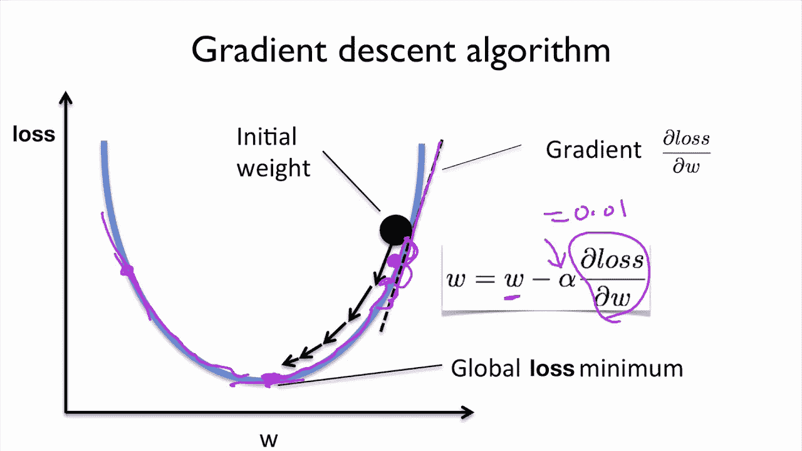
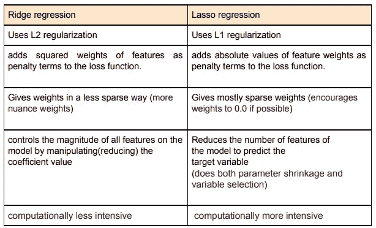

# 机器学习基础

> 原文：<https://medium.com/analytics-vidhya/machine-learning-basics-30ad0c2f739d?source=collection_archive---------25----------------------->

安迪·凯利在 [Unsplash](https://unsplash.com/s/photos/learning-machine?utm_source=unsplash&utm_medium=referral&utm_content=creditCopyText) 上的照片

机器学习带来的进步和机遇具有无限的价值。在回答这个问题之前，“什么是机器学习？”，我会从“为什么是机器学习？”的角度强调它的重要性。

假设你在*语法*团队做程序员，你被分配写一个程序，可以纠正在线作者犯的语法或拼写错误。你是处理英语词汇的专家吗？即使你是，你还得探索多少语法规则和单词，才能达到良好的准确性？机器学习的一个优势是它完成了分析模式和建立规则的困难部分，从而减少了编程的时间。如果你有一个丰富的例子集，机器可以从中学习，那么你已经具备了你所需要的。

既然你已经使用机器学习成功地构建了一个英语拼写/语法校正器，假设给你一个任务，为汉语创建一个拼写/语法校正器。如果你不知道机器学习的真正能力，你会在听这个的时候感到压力。你所要做的就是找到一个丰富的中文数据集，并为中国作家提供一个定制的语法产品。

在推出新产品时，您需要合并两个语法版本(英文和中文),以便为作者提供更大的灵活性。虽然你一眼就能从中文字母中轻松清晰地识别出英文字母，但你如何教会计算机做到这一点呢？同样，机器学习可以帮助解决这个看似不可编程的任务。

既然你对机器学习所能提供的服务感到惊讶，那么让我们深入研究一下基本概念。机器学习解决了这个问题，“如何建立一个计算机程序，通过经验自动改进工作？”。如果你仔细分析机器学习能够解决的问题，你会得出 3 个主要指标。

1.  工作
2.  经验
3.  表演

*任务*是“做”或期望掌握的技能。*体验*是获得的训练。*性能*是评估任务的标准。例如，垃圾邮件过滤器的任务*是*将任意邮件分类为垃圾邮件或非垃圾邮件。完成任务的*经验*是通过训练例子/实例获得的，这些例子/实例是带标签的电子邮件。Gmail 和 Yahoo 的垃圾邮件过滤器不仅根据预先存在的规则检查邮件，还会在继续分类的同时生成新的规则。当用户阅读他们的邮件并根据内容手动将其标记为垃圾邮件或不垃圾邮件时，可以检索该训练数据。这样做的性能可以用各种方法来衡量，其中一种方法是分类准确度(真实分类百分比)。

机器学习中的模型是一种使用数据训练的算法，以复制专家在给定相同信息的情况下做出的决策[2]。训练只是指从训练空间中检查许多例子，找到算法的最佳参数(权重和偏差)。“良好的训练”应该会减少模型所做决策的错误。误差或损失是一个数字，表明模型做出的决策有多糟糕。

你可能想知道的下一个问题是，“我们如何确定一个函数来评估这个损失？”。甚至在回答这个问题之前，我们如何知道模型实际上正在学习并改进它的行为呢？假设我们有一个计算损失的数学函数。为了知道模型的表现是好是坏，我们遵循一个名为**梯度下降**的迭代方法。这是基于一个观察:如果一个函数在一个点的邻域内是可微的，那么这个函数在函数的负梯度方向上下降最快[3]。或者另一方面，为了使损失最小化，我们必须沿着负梯度嗅，并采取与函数的负梯度成比例的步骤。由于模型算法是未知参数(权重和偏差)的函数，函数导数也是这些参数的函数。通过采取与负梯度成比例的步骤，这些参数被调整，并且我们可以确保新的参数导致减少的损失，这意味着模型现在学习/训练得更好。

图一。使用梯度下降调整模型权重

损失函数的选择取决于所选择的模型算法、训练空间中异常数据的程度以及计算导数的容易程度。

模型学习在数据中发现的模式，如果识别的模式过于简单或过于复杂，模型就会对看不见的数据做出错误或不正确的预测。如果模型试图完全拟合训练数据(**过拟合**)，通过考虑每个训练示例(**低偏差—**—*基于多数*)，模型做出与实际测试数据高度偏离(**高方差**)的不正确预测。如果模型稍微符合训练数据(**欠拟合**)，通过仅考虑几个训练示例(**高偏差—**—基于少数的*)，模型做出与实际测试数据偏离较少(**低方差**)的预测。任务是找到模型复杂性的最佳点，以检索模型算法的最佳参数。*

图二。偏差-方差权衡

找到正确的参数集通常具有挑战性，因为尽管模型对于训练数据表现良好，但是在存在看不见的测试数据的情况下，模型可能做出糟糕的决策/预测。原因是该模型从数据中过度学习，因此它完美地代表了训练空间，但它没有概括训练空间。这可能是由训练样本中存在的噪声数据造成的。如何确保模型吸收了数据中的主要模式，同时过滤掉/忽略了有噪声的数据？或者另一方面，“如何缓解过度拟合问题？”。为此，我们可以使用**交叉验证**或**正则化**技术。

交叉验证给人一种在看不见的测试数据上模型性能的感觉。一种简单的交叉验证技术是*维持交叉验证*，其中我们保留一部分数据用于验证，并在模型从剩余的训练数据中训练出来后获得该组的预测。通过计算验证集的损失，我们可以了解模型的泛化能力。然而，不能保证帮助识别模式的最重要的数据样本将总是保留在训练集中，并且由于训练数据量不足，模型可能从数据中学习很少。为了弥补这项技术的不足，我们可以使用 *K 倍交叉验证。*我们迭代地将训练集分成 K 个分区，并且在每次迭代中，留下一个分区用于验证，并且计算在留下的测试分区上的损失。通过对所有损失进行平均，我们可以看到该模型如何对看不见的数据进行归纳，并且它将在训练过程中的某个点从每个保留分区中学习。为了保证训练/验证分割中目标类别的公平分布，我们可以使用*分层* *K 倍交叉验证*，确保每个折叠包含来自目标类别的平衡样本。

另一种泛化技术是正则化。该方法试图将复杂度(模型权重的系数)向零收缩。复杂性通常来自训练样本中存在的噪声。根据减少权重的影响或使影响为零，我们有 2 种正则化技术。

1.  拉索回归(L1)
2.  岭回归(L2)

下表给出了这两种正则化技术的比较。

图 3。岭回归和套索回归的比较

由于这是对机器学习的基本介绍，我将推荐一篇直观的[文章](https://towardsdatascience.com/regularization-in-machine-learning-connecting-the-dots-c6e030bfaddd)来了解正则化的更多细节。

我希望你喜欢用直觉学习机器学习的基础知识！

**演职员表:**

[1][https://www . science direct . com/science/article/pii/s 2405844018353404](https://www.sciencedirect.com/science/article/pii/S2405844018353404)

[2][https://www . osprey data . com/2020/02/24/ai-ml-models-101-what-is-a-model/](https://www.ospreydata.com/2020/02/24/ai-ml-models-101-what-is-a-model/)

[3][https://en.wikipedia.org/wiki/Gradient_descent](https://en.wikipedia.org/wiki/Gradient_descent)

[4]关于正则化的详细信息:[https://towards data science . com/regulation-in-machine-learning-connecting-the-dots-c6e 030 BF addd](https://towardsdatascience.com/regularization-in-machine-learning-connecting-the-dots-c6e030bfaddd)