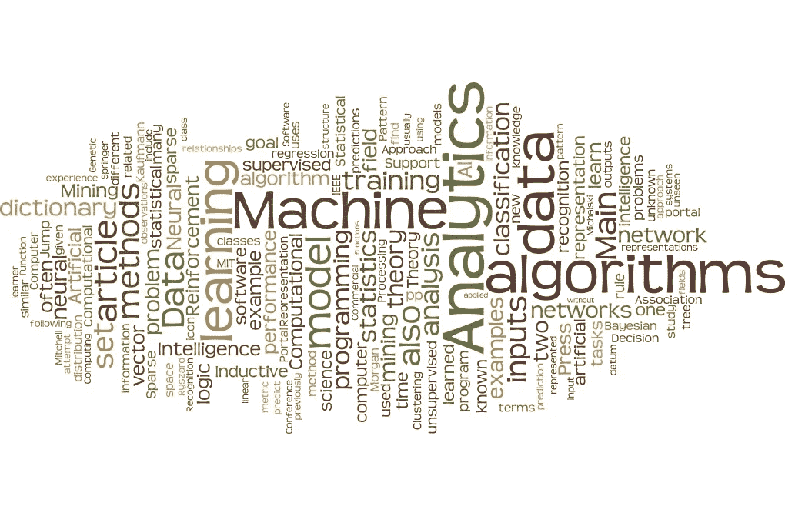
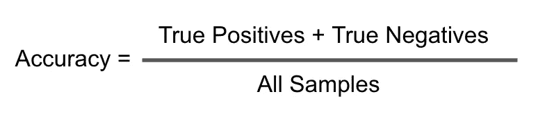
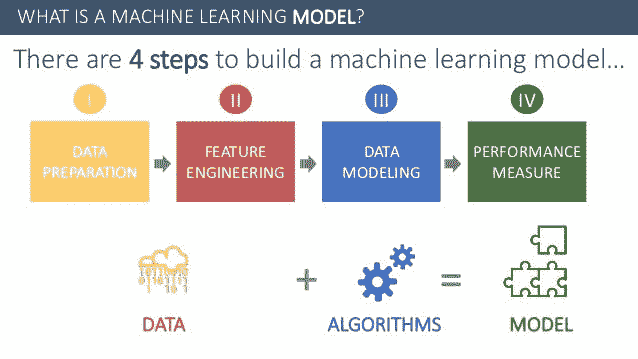
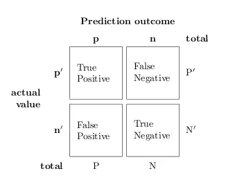
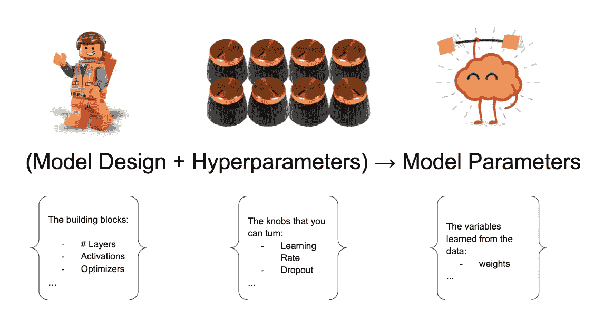
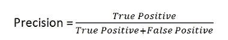

# 机器学习术语

> 原文：<https://medium.com/analytics-vidhya/machine-learning-buzzwords-ddf5fd491825?source=collection_archive---------16----------------------->

**准确度**:监督分类机器学习模型的评价指标。它是正确预测的数量与模型的预测数据点数量的比率。

**算法:**“为执行特定任务而设计的一组步骤/指令序列。例如，准备特定菜肴所采取的步骤/程序。在机器学习领域，这只是解决数学问题的独特描述或步骤。机器学习算法帮助模型如何将输入映射到一组输出。

是啊，没错。一个**模型**与一个**算法**截然不同。一个**算法**是一组用于**模型**的指令，而模型是算法实际执行的动作的结果。用专业术语来说，它是一个过程的数学表示。

让我们用更简单的术语来分解它。假设我想煮咖啡。因此，为了实现这一权利，我必须遵循一些说明/步骤？太好了！我还需要一些实现这一目标所需的配料/物品，如咖啡豆、水等。让我们称这些配料加上实际产量(咖啡)——‘数据**’。所以理想情况下，数据有一些输入(配料)和期望的输出(咖啡)。太好了！现在，我将遵循的实际制作咖啡的一系列步骤(获取咖啡豆、放入咖啡机、加水、冲泡等过程)是“**算法**”。我只是用了多种方法中的一种来准备咖啡。其他人，有相同的配料(**数据)，**可能用其他方法(不同的**模型)做出更好的咖啡。****

**总而言之，**

*****模型=算法+数据*****

**"用数据训练一个**算法**产生一个**模型."****

****

****偏差:**这是模型的预测值和实际值之间的差异:**

****分类:**这是监督机器学习方法的一个子类，其中数据点被分组为作为输出的类，使用决策边界来分隔每个类。**

****

**二元分类**

****混淆矩阵**:模型的准确度和精确度的度量。这通常是对分类问题的一种性能度量。它是通过实际值和预测值的表来计算的，其中计算了真阳性、假阳性、假阴性和真阴性。**

****

**混乱矩阵**

****交叉验证:**一种独特的重采样/重排技术，用于评估机器学习模型。训练集被分成几个组/折叠(k-1 个折叠)，估计每个折叠的平均误差。因此，例如，如果选择的 k 值为 5(即 k =5)，模型将在 k-1 次折叠(即 4 次)上训练，并在最后一次折叠(省略)上验证。它也被称为**【K 倍交叉验证】****

****数据:**收集信息/事实，测量/观察，并以给定格式(文本、图像、视频)存储。**

****深度学习:**使用神经网络方法的机器学习的子集。这个分支使用的算法旨在模仿人类大脑的结构和功能。**

****

****探索性数据分析:**顾名思义，它是一种**‘探索性’**的方法，用于仔细分析数据以获得洞察力，探索数据的特征，寻求理解所呈现的信息。听说过“ ***审问你的数据，它会和你分享它的秘密*** ”这句话吗？这只是第一步。这是机器学习工作流中如此重要的一步，因为它有助于建立更有效的模型。**

****假阴性:**假阴性是模型在应该是阳性的时候错误预测或输出阴性结果的次数。一个例子是一个模型，当它应该是一个阳性预测时，却给出了一个阴性的癌症诊断。**

****假阳性**:假阳性是一个模型错误地预测或输出一个应该是阴性结果的阳性结果的次数。回到癌症的例子，假阳性是当模型对癌症的诊断为阳性时，而它应该是阴性预测。错误的肯定结果。**

****特征:**这些是数据集中观察到的数据点的特征。让我们回到前面的“制作咖啡”的例子。在该示例中，需要一些配料来实现输出(咖啡)。配料(输入)和咖啡(输出)统称为数据。在这个例子中，这些成分与特征同样为人所知。它们是人们观察到的制作咖啡的基本要求。**

****特征工程:**这是将一个数据集中的两个或两个以上的特征组合起来，形成一个新的模型有用特征的过程。这通常是基于关于问题陈述的一些领域知识来完成的。由于某种先前的知识或直觉，数据集中的要素被组合以形成新的要素，这通常是提高模型性能所需要的。有时，它不一定是两个或更多特性的组合，它可能是从一个特性派生出一个新特性。例如，从出生年份导出年龄特征，或者将日期列拆分为不同的特征，例如月、日、年、时间(以分钟、小时或秒为单位)、周末、工作日、节假日等等。**

****超参数:**算法设置，类似于为了信号清晰而调谐射频。这些设置具有模型内置的默认值。但是，可以对它们进行调整，以获得最佳的模型性能。例如，模型的学习率。**

****

****学习率:**一个可调整的超参数，决定了模型训练和学习新概念的速度。**

****损失函数:**这是单个训练集中误差的计算。它是预测值和实际值的平均差值之和。总的目标是最小化损失函数。**

****机器学习:**机器学习是人工智能的一个子集，它为计算机提供了在没有显式编程的情况下进行学习的能力。正是对计算机算法的研究，赋予了机器执行任务、思考、学习的能力，并通过一系列例子自动改进。**

****异常值:**这些数据点与其他数据点存在显著差异或遵循不同的模式。这在研究趋势时非常有用，是欺诈检测中非常重要的概念。但是，请注意，并非所有的异常值都是有用的。想象一下，有一个数据集，其中有一个体重为-20 公斤的成年人的记录。这既不可能也不相关，需要一些预处理。**

****过度拟合:**高方差和高偏倚的结果。这仅仅是一个模型记住了训练集而在测试集上表现不佳的情况。训练误差通常较低，而测试误差较高。**

****精度:**模型误报的度量。在某些情况下，假阳性被认为比假阴性风险更大。**

****

**例如，建立垃圾邮件/火腿分类的模型。假阳性，即模型错误地预测一封不是垃圾邮件的邮件是垃圾邮件的次数。想象一下，一封非常重要的电子邮件进入了垃圾邮件文件夹。不好吧！！**

****预处理:**准备适合机器学习模型的原始数据的过程。**

****召回:**对假阴性数量的一种度量。精确的反义词。在假阴性比假阳性更有害的情况下最有用。**

****正则化:**添加一个参数以防止模型过度拟合的过程。**

****回归:**监督机器学习方法的另一个子类，其中产生的输出/预测是连续值，而不是类**

****训练集:**用于训练算法的数据部分/集合。包含映射到样本输出/标签的功能。**

****测试集:**用于测试模型学习程度的数据部分。它只包含没有样本标签的特征。**

****真阴性:**这是模型正确预测正确标签/类别的反面的次数。比方说，需要一个模型来预测泰坦尼克号悲剧的幸存者的数量，并且它正确地预测了那些真正不是幸存者的人的数量，即那些已经死亡并且没有存活下来的人。**

****真阳性:**这是模型正确预测实际标签/类别的次数。让我们回到泰坦尼克号的例子，真正的正面将是模型正确预测幸存者的次数。**

**真阳性和真阴性主要应用于与分类相关的问题。**

****验证集:**为最终评估模型而留出的一部分数据。**

****拟合不足:**低方差和高偏差的结果。这是模型没有在训练集上正确学习的情况，因此不能做出重要的预测。对于给定的问题，当没有足够的数据点来训练算法时，通常会出现这种情况。或者训练集和测试集没有被适当地随机化。**

****方差:**这是预测值的随机/分散程度，即它们在图上彼此相距多远。**

**结束注释:**

**本文的目的是解释机器学习中的一些常用术语。请参考下面的链接，以便更好地理解这些概念。希望你发现这足智多谋。**

**感谢阅读！！**

**资源和进一步阅读**

** [## 机器学习中的模型参数和超参数—有什么区别？

towardsdatascience.com](https://towardsdatascience.com/model-parameters-and-hyperparameters-in-machine-learning-what-is-the-difference-702d30970f6) 

[机器学习中模型和算法的区别](https://www.quora.com/What-is-the-difference-between-machine-learning-model-and-ML-algorithm/answer/Prashanth-Ravindran?srid=dZyb)

 [## 特征和标签有什么区别？

### 前提:基础统计学和接触 ML(线性回归)可以用一句话来回答——他们很像…

stackoverflow.com](https://stackoverflow.com/questions/40898019/what-is-the-difference-between-a-feature-and-a-label/40899529#40899529)  [## 理解偏差-方差权衡

### 每当我们讨论模型预测时，理解预测误差(偏差和方差)是很重要的。有一个…

towardsdatascience.com](https://towardsdatascience.com/understanding-the-bias-variance-tradeoff-165e6942b229)  [## 机器学习介绍——初学者算法

### 了解最常见的机器学习算法、它们的用例以及对它们进行分组的方法

medium.com](/better-programming/introduction-to-machine-learning-algorithms-for-beginners-b2851739c11e)**