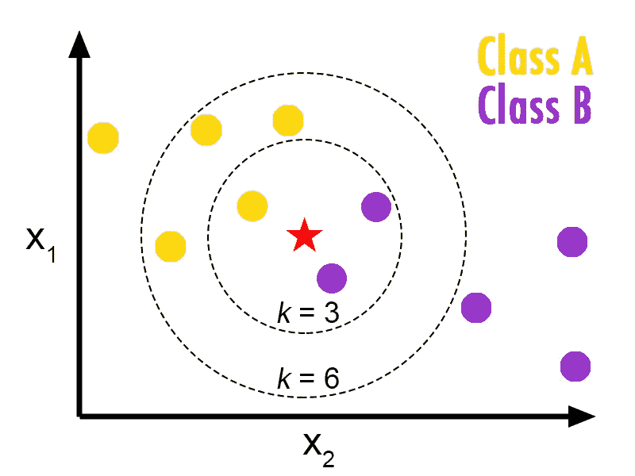
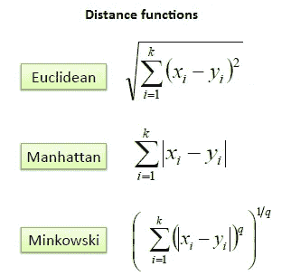

# 机器学习备忘单-K 近邻算法

> 原文：<https://medium.com/analytics-vidhya/machine-learning-cheat-sheet-k-nearest-neighbors-algorithm-93462a66831?source=collection_archive---------8----------------------->

美国宇航局在 [Unsplash](https://unsplash.com?utm_source=medium&utm_medium=referral) 拍摄的照片

*大家好*👋*，*

如今，机器学习及其应用正与日俱进。我们每天都很难回忆起与机器学习相关的基本概念。

*因此推出机器学习算法备忘单系列，我们将在其中回顾与机器学习算法相关的核心概念，这将有助于您解决任何数据科学面试或项目。*

*这将是一个点对点的解释，用于快速修改和理解机器学习算法。*

> 所以抓紧了……..

> **K 近邻算法**

> *“物以类聚，人以群分。”*

*   KNN 是一种简单的机器学习算法**，属于监督学习技术**。KNN 算法既可用于**分类问题，也可用于**回归问题，但在工业中广泛用于**分类**。
*   KNN 算法基于新数据点和可用案例之间相似性的**假设**。它将新数据点预测到与可用类别最相似的类别中。

*   案例通过其邻居数据点的多数投票进行分类。案例相对于类别的分配是通过其 K 个最近邻来完成的，这些最近邻通过距离函数来测量。

[来源](https://www.saedsayad.com/k_nearest_neighbors.htm)

*   K-NN 算法**存储所有可用数据，并基于相似性对新数据点进行分类。**这意味着当新数据出现时，可以通过使用 K- NN 算法将其轻松分类到一个良好的套件类别中。
*   在**连续特征的情况下，将遵循上述距离技术**，但是对于分类特征，必须使用**汉明距离。**
*   为了给你的数据选择正确的 K 值，算法应该**迭代运行，算法应该能够很好地概括测试数据，以便做出更好的预测。选择正确的 K 值也必须减少算法中的错误数量。**

> **KNN 算法的优点**

*   **简单易行**实施
*   KNN 算法解决了**分类、回归问题，并在推荐系统中用作 KNN 搜索。**
*   预测前无需训练，**新数据可以无缝添加**，不会影响算法的准确性。

> **KNN 算法的缺点**

*   KNN 算法**不太适合大型数据集**。
*   **特征标准化和规范化**变得很重要，因为我们在训练 KNN 模型之前要处理距离测量。
*   KNN 对数据集中的**缺失值和异常值很敏感。**

> **应用**

*   推荐系统
*   信用卡评级预测
*   手写检测(如 OCR)、图像和视频识别。
*   贷款违约预测。

ℹ ***Scikit 学习实现的 KNN 算法可以在这里找到*******。****

*ℹ ***R 实现的 KNN 算法可以在这里找到*******。*****

> **有了以上信息，我希望你能更好地理解 KNN 算法。你也可以破解任何与 KNN 算法相关的面试问题。**

## **关于 ML 的下一个备忘单，算法请参考这个链接。**

## **请点击查看我其他与 ML/DL [相关的博客。](https://shashwatwork.github.io/blog/#)**

***如果你喜欢这个帖子，请跟我来。如果你注意到思维方式、公式、动画或代码有任何错误，请告诉我。***

***干杯！***