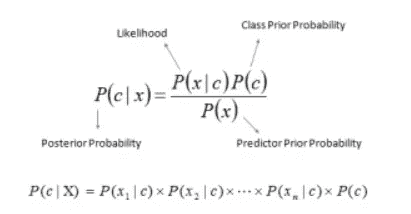

# 机器学习备忘单-朴素贝叶斯

> 原文：<https://medium.com/analytics-vidhya/machine-learning-cheat-sheet-naive-bayes-56a8ea5bb610?source=collection_archive---------9----------------------->

蒂姆·莫斯霍尔德在 [Unsplash](https://unsplash.com?utm_source=medium&utm_medium=referral) 上的照片

*大家好*👋*，*

如今，机器学习及其应用正与日俱进。我们每天都很难回忆起与机器学习相关的基本概念。

*因此推出机器学习算法备忘单系列，我们将在其中回顾与机器学习算法相关的核心概念，这将有助于您解决任何数据科学面试或项目。*

*这将是一个点对点的解释，用于快速修改和理解机器学习算法。*

> 所以抓紧了……..

> **朴素贝叶斯算法**

*   假设您必须构建一个机器学习分类器，以便手动分类**网页、文档、电子邮件或任何其他冗长的文本注释**。这就是朴素贝叶斯的用武之地。
*   朴素贝叶斯算法是**假设预测器之间存在独立性的监督学习分类算法。**
*   朴素贝叶斯分类器最流行的算法之一**根据相似性分组，基于流行的贝叶斯定理。**简单来说，朴素贝叶斯分类器假设一个类中特定特征的存在与任何其他特征的存在无关。

*   贝叶斯定理基本上是从 **P(c)，P(x)，P(x|c)** 计算出**后验概率 P(c|x)** 。在上面的等式中-

👉 *P(c|x)是给定预测值 x 的 c 类 w.r.t 的后验概率*

👉 *P(c)是类别 c 的先验概率*

👉 *P* ( *x|c* )是可能性，它是给定*类的*预测器*的概率。P* ( *x* )是*预测器*的先验概率。

> **何时使用朴素贝叶斯—**

*   训练数据的大小从**中到大。**
*   给定分类参数，**描述实例的属性应该是有条件独立的。**
*   如果你的训练数据中有**高维度**。

> ***纳维贝叶斯*** 的优势

*   当**输入要素为分类要素时，朴素贝叶斯算法更有效。**
*   相对于其他判别模型，如逻辑回归，朴素贝叶斯分类器**收敛更快。此外，它需要较少的培训。**
*   轻松快捷地实现测试数据的**类预测。对于多类分类问题，它也表现得很好。**
*   尽管需要一个**条件独立性假设**，朴素贝叶斯分类器已经在各种应用领域表现出良好的性能。

> **朴素贝叶斯的缺点**

*   在现实生活的数据集中，**我们几乎不可能得到一组完全独立的预测值**。所以独立预测者的概念在这里失效了。
*   朴素贝叶斯也被称为**糟糕的估计量，所以人们不应该完全依赖它的概率函数。**
*   朴素贝叶斯算法存在**“零频率”**的问题。需要用平滑技术处理的称为**。**

> ****申请****

*   ****情感分析-** 由于其在多类问题中的高效结果和独立的特征规则，主要用于文本分类。在现实世界中，脸书也用它来分析表达积极或消极情绪的状态更新。**
*   ****推荐系统-** 朴素贝叶斯与协同过滤相结合，给出了一个更好的推荐引擎，它可以预测用户是否喜欢某个给定的项目。**
*   ****文档分类** -谷歌使用文档分类来索引文档，并找到相关性分数，即 PageRank 机制将数据库中标记为重要的页面视为使用文档分类技术解析和分类的页面。**

**ℹ ***Scikit 学习实现的朴素贝叶斯算法可以在这里找到*******。******

**ℹ ***R 实现的朴素贝叶斯算法可以在这里找到*******。******

> **有了以上信息，我希望你能更好地理解朴素贝叶斯算法。你也可以破解任何与朴素贝叶斯算法相关的面试问题。**

## **ML 的下一个备忘单，算法请参考这个[链接](https://datasciencehub.medium.com/machine-learning-cheat-sheet-k-nearest-neighbors-algorithm-93462a66831)。**

## *****做结帐我其他与 ML/DL 相关的博客*** [***这里***](https://shashwatwork.github.io/blog/#) ***。*****

**如果你喜欢这个帖子，请关注我。如果你注意到思维方式、公式、动画或代码有任何错误，请告诉我。**

***干杯！***