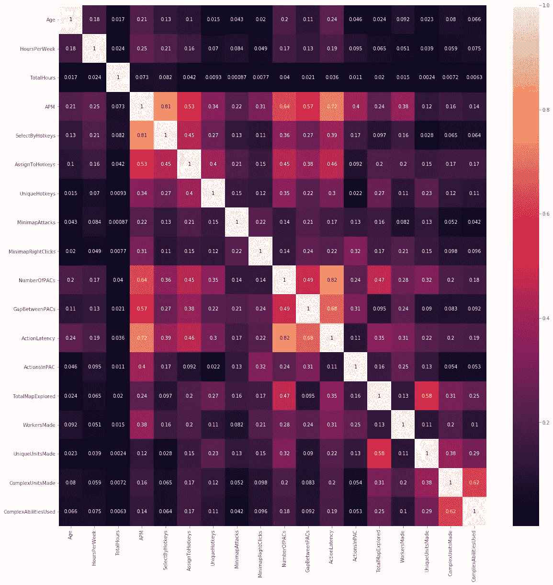
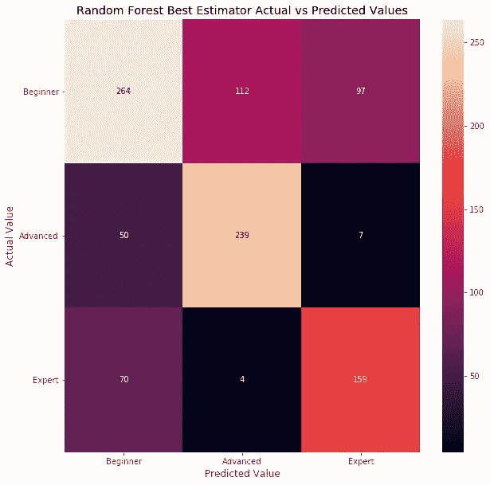
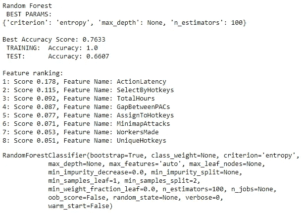

# 机器学习分类项目

> 原文：<https://medium.com/analytics-vidhya/machine-learning-classification-project-36244377c9c0?source=collection_archive---------18----------------------->

## 星际争霸 2 联赛分类

弗洛里安·奥利佛在 [Unsplash](https://unsplash.com?utm_source=medium&utm_medium=referral) 上拍摄的照片

我们又来了，结束的开始，但还有更多。
-托德·德伦格伦，*国际感*

六个模块中的第五个模块的期末专题。很难相信我就要结束这门课了。我并不觉得我学到了这么多，但是当我坐下来把这些都付诸实践的时候，我能如此迅速地找到我需要的信息来完成它，这是令人惊讶的。

所以，投入到这个项目中。这个项目是关于通过机器学习进行分类的。我选择的数据集是 Kaggle 上的 Skillcraft-Starcraft 数据集。([链接](https://www.kaggle.com/danofer/skillcraft/data#SkillCraft.csv))这个数据集包含了《星际争霸 2》7 个不同联赛的 3338 名玩家的信息:铜牌、银牌、金牌、白金、钻石、大师和特级大师。

这些功能包括关于玩家及其游戏的信息，包括从玩家的年龄和每周玩的时间以及总数，到他们在游戏中创建的独特单位的平均数量以及他们每分钟采取的行动数量。

# 目标

该项目的目标是使用这些功能创建一个模型，该模型可以根据球员的比赛风格和习惯来预测球员最终将进入哪个联赛级别。正如我稍后将在帖子中详述的那样，拥有七个独立的联盟使我的模型更难准确分类，所以我最终将我的职业数量减少到三个:初级(青铜、白银、黄金)、高级(白金、钻石)和专家(大师、特级)。

# 方法学

## 预处理

这个数据集的格式非常好，非常完整，所以我只需要做很少的数据清理工作，这样我就可以将联盟信息分离到一个目标数据库中，并将特征分离到他们自己的数据库中。从那里，我创建了一个测试规模为 30%的训练测试分割，给了我 1000 多个测试用例以及大约 2300 个训练用例。

由于一些明显的职业不平衡(特级大师级在任何给定时间最多有 200 名球员，而这个数据集只包含其中的 35 名球员，而白金级和钻石级在数据集内各有 800 多名球员)，我使用 SMOTE 综合平衡了我的训练集中的职业。

在那里，我使用来自 SKLearn 的标准定标器来独立地定标训练特征数据库和测试特征数据库，因为特征在规模和测量单位上变化很大，从毫秒到数千小时，到诸如点击和单元创建之类的事情。

## 模型创建

下一步是创建一些基线模型。我创建了一些不同的分类器实例及其相关的参数网格，然后使用 GridSearchCV 为每个分类器找到最佳的估计器。

基线模型包括随机森林(35.7%的准确率)、极端梯度提升(32.1%的准确率)、支持向量(34.6%的准确率)和一对 One Vs Rest 分类器，我对这些分类器没有太多的经验，只能在编写它们时学习。其中包括一个相对于静止的 XGBoost (30.7%的准确度)和一个相对于静止的 SVC (30.3%的准确度)。

## 型号改进…也许？

显然这些原始模型并没有那么好。我肯定想试着准确预测超过 1/3 的玩家。所以我的下一步是调整我输入的数据。最简单的方法是查看哪些要素具有多重共线性，并移除最差的要素。

训练特征集的相关矩阵

那么，从哪里开始修剪呢？嗯，我在我的随机森林分类器中包含了一个功能排名，因为它是迄今为止性能最好的，并最终调整了 APM(最差多重共线性)、NumberOfPACs(中间包多重共线性，功能排名低于 ActionLatency 和 GapBetweenPACs)和 ComplexUnitsMade(最低功能排名)。

这种调整并没有显著提高任何模型的性能，甚至降低了其中一些模型的精度。所以我尝试了主成分分析，它将模型的准确率全面降低到了 15–23%。那么接下来该怎么办呢？

## 类别微调

由于我的模型很难找出七个联赛中的哪一个最适合，我决定(根据我的导师的一些建议)限制我试图让这些球员适应的班级数量。因此诞生了三个玩家等级:初级、高级和专家。

在更改我的目标数据库以适应这些级别后，我重新分割了我的训练和测试数据，重新应用了 SMOTE 和缩放，并重新调整了我的模型。全面改进！我的随机森林现在达到了 65.2%的准确率，其余的在 51%到 61%之间。那么我们能不能用类似我以前用过的方法来改进它呢？

简短的回答是:有一点，但不是很多。PCA 又一次全面降低了数据，所以也许我做的方式不对，我觉得我需要再看一遍那个特别的部分来更新我的记忆。

然而，多重共线性修整确实将我的随机森林提高了将近一个百分点，达到 66%。和以前一样，我使用 65.2%森林的特性排名和相关矩阵来确定对模型影响最小的最差罪犯，幸运的是，这三个是相同的，所以重用这些代码非常容易。

## 我们还能提高更多吗？

我寻求改进的下一步是创建一个混淆矩阵，看看我的错误在哪里…

瞧，他们中的大多数都与初学者有关，要么被错误地归类为高级或专家，要么被错误地归类为初学者。我只有 11 例被列为专家的晚期病例，反之亦然。因此，我不确定调整阈值会对结果有多大影响，因为它可能会将一些错误的进阶者拉向初学者，但也可能会将更多的进阶者推向错误的初学者。

# 结果

正因为如此，我决定满足于我的 66%准确的随机森林，因为一个很大的原因:我相信问题在于游戏的玩法和联盟的确定方式。

使你成为大师的不仅仅是技术水平，还有奉献的时间和努力。每个人都从最低层开始，你赢得的每场比赛都会提高你的排名。

这意味着有些玩家可能会玩钻石级或大师级游戏，但全职工作、家庭需求和其他事情会阻止他们投入足够的时间来摆脱较低的等级。也有一些玩家，虽然他们的技能水平可能是银或金，但他们有足够的空闲时间(和运气)来玩游戏，并设法赢得足够的钱溜进白金。

# 未来的工作

我肯定想继续推进这个项目。我确实认为有一种方法可以调整那些初学者的错误分类，但我觉得唯一的方法是调整 TotalHours 和 HoursPerWeek 特性的权重，或者完全删除它们，假设它们是造成这种情况的原因。(更新:我运行了几个额外的模型，去掉了 TotalHours 功能，最终得到了相同的准确性，所以我想这不是罪魁祸首(或者不是唯一的罪魁祸首)。)

我最终还想回到最初的七个联赛，也许为每个等级创建一个单独的模型，将它们分类到各自的联赛中(一旦它们更准确一点)。

但那是另一个时间的问题。现在，我们开始模块 6 的冒险。我很兴奋，几周后，我将开始我的顶点项目，接近课程结束。焦虑肯定会爆发！