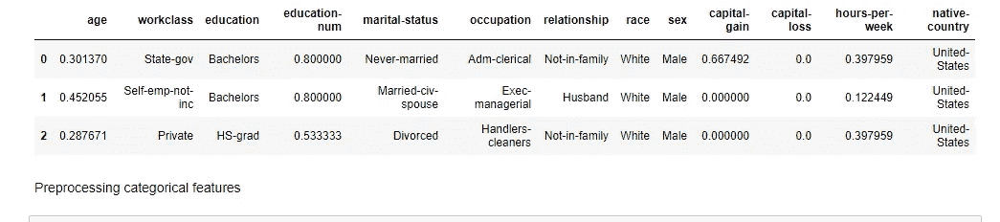

# 寻找年收入(Python 分类)

> 原文：<https://medium.com/analytics-vidhya/machine-learning-classification-project-finding-annual-income-python-66eba44ade53?source=collection_archive---------13----------------------->

## 通过 KNN、朴素贝叶斯、决策树、随机森林、GLM 逻辑回归，建立了一个机器学习模型来准确预测个人收入高于或低于 5 万英镑。我用过的包有 panda，numpy，matplotlib，sklearn。

来源:互联网

在最近的冠状病毒爆发中，大量的人在失业后报名参加了美国 1200 美元的刺激计划。受助人的条件之一是年收入低于 75，000 美元，这些都可以通过他们的年度税务报告获得。(Singletary，2020)尽管如此，仍有数量惊人的人没有纳税。了解未申报税收个人的潜在年收入可以帮助政府采取战略性措施来照顾他们并确保他们的银行储备规模。因此，政府将从机器学习模型中受益匪浅，该模型可以根据个人的人口特征来预测个人的收入。

在这个项目中，我们将使用五种不同的监督算法(KNN，朴素贝叶斯，决策树和规则，随机森林，GLM 和逻辑回归。)来自 1994 年美国人口普查的数据集。我们将在相互比较初步结果时选择最佳候选算法，并进一步优化所选算法，以最佳地模拟数据。我们这个项目的目标是最终提出一个模型，可以准确预测一个人的收入是高于还是低于 50，000 美元(分类-二元类)。根据 Inflationcalcualtor.com，1994 年的 5 万美元相当于 2019 年的 8.7 万美元。然后在这之后，未来的研究人员可以使用这个模型来申请当年的数据集。

这个项目的数据集可以从 UCI 机器学习知识库或 Kaggle 网站获得。罗恩·科沙维和巴里·贝克尔在*“提高朴素贝叶斯分类器的准确性:一种决策树混合”*(科沙维，1996)发表了他们的发现，该数据集是在他们的帮助下捐赠的。请记住，我们在这里研究的数据是由对原始数据集的微小更改组成的，比如删除`'fnlwgt'`特性以及缺少条目或条目格式不正确的记录。

## 数据

该项目中更改后的人口普查数据集约有 32，000 个入口点，每个入口点有 13 个要素。

## **特性**

`age`:年龄

`workclass`:工人阶级(私营、自营企业、自营企业、联邦政府、地方政府、州政府、无薪、从未工作)

`education_level`:教育水平(学士、部分大学、11 年级、HS-grad、Prof-school、Assoc-acdm、Assoc-voc、9 年级、7-8 年级、12 年级、硕士、1-4 年级、10 年级、博士、5-6 年级、学前班)

`education-num`:完成的教育年数

`marital-status`:婚姻状况(已婚-同居-配偶、离婚、未婚、分居、丧偶、已婚-配偶不在、已婚-配偶)

`occupation`:工作职业(技术支持、工艺修理、其他服务、销售、行政管理、专业教授、搬运工人、清洁工、机器操作员、行政文员、农业-渔业、运输-搬家、私人服务、保安服务、武装部队)

`relationship`:关系状态(妻子、亲生子女、丈夫、非家庭成员、其他亲属、未婚)

`race`:种族(白人、亚洲太平洋岛民、美洲印第安爱斯基摩人、其他人、黑人)

`sex`:性别(女，男)

`capital-gain`:货币资本收益

`capital-loss`:货币资金损失

`hours-per-week`:每周平均工作时间

`native-country`:本土国家(美国、柬埔寨、英国、波多黎各、加拿大、德国、美国外围地区(关岛-USVI 等)、印度、日本、希腊、中国、古巴、伊朗、洪都拉斯、菲律宾、意大利、波兰、牙买加、越南、墨西哥、葡萄牙、爱尔兰、法国、多米尼加共和国、老挝、厄瓜多尔、台湾、海地、哥伦比亚、匈牙利、危地马拉、尼加拉瓜、苏格兰、泰国、南斯拉夫、萨尔瓦多、特立尼达和多巴哥&多巴哥、秘鲁、香港、荷兰)

## **目标变量**

`income`:收入阶层(< =50K，> 50K)

## 导入库并加载数据

我们将首先导入数据集以及对我们的分析有用的必要 Python 库，如 numpy、pandas、IPython、matplolib、seaborn、visuals file。数据集的最后一列是最终的“收入”二元结果，其余的是特征

作者图片

# **I/探索性数据分析(EDA)和数据准备**

我们稍微研究了一下我们的数据集，看看每个群体中有多少人，以及年收入超过 50，000 美元的公民的百分比。我们还可以通过 seasborn.pairplot()函数获得数据集的可视化视图，以了解每个因素是如何相互影响的

作者图片

为了在机器学习算法中被接受，必须准备数据。否则，模型将做出不正确的预测。该过程包括数据的清理、格式化和要素缩放。

1/第一步是变换倾斜的连续特征。这是因为，如果范围未被归一化，则要素值的偏斜分布会使算法表现不佳。我们将数据分为要素和目标标签。然后我们可视化原始数据的偏斜连续。收入数据集具有两个偏态分布的特征:

*   资本收益
*   资本损失

作者图片

特征的分布向右倾斜。因此，我们对数据应用对数变换，以防止异常值对机器学习模型产生负面影响。然而，在处理 o 值时必须小心，因为 log(o)是不确定的。我们可以将这些值转换成大于 o 的小数值，以便很好地应用对数。

作者图片

2 第二步是通过数据换算使数字特征正常化。这种缩放最终不会改变特征分布的形状，但它确保了在应用五种模型时对每一个特征的平等处理。

作者图片

3/ 第三步是使用一键编码功能将“职业”或“种族”等分类因素转化为数字因素。通过这样做，算法将为与数字特征相似的分类特征的每个可能类别创建“虚拟”变量。但是，单热编码器不适合目标，因为这是一个复杂的过程，因此我们将手动将'< =50k '指定为 0，将'> 50k '指定为 1，以避免最终出现意外结果。由于 one-hot 编码功能，数据集从 13 个独特的特征调整为总共 103 个特征。

作者图片

4/ 第四步是将数据集以 80-20 的比例进行洗牌和拆分，分别用于训练测试

作者图片

# **二/建立预测模型**

考虑到我们数据的形状(30162 个数据点和 103 个独特的因素)，我们足够幸运，我们选择的所有模型都可以适当地处理大量的因素。为了正确访问每个模型，我们将比较每个模型的优点和缺点

> **a)K-最近邻算法**

**优点**:简单无训练期(被称为懒学)。研究人员可以无缝地添加新数据，而不会影响算法的准确性

**缺点** : KNN 与大型或高维数据集不兼容。该模型还需要特征缩放，并且对噪声数据、缺失值以及异常值高度敏感。(库马尔，2019 年)

**潜在应用:**搜索“相似”物品的应用

> **b)高斯朴素贝叶斯**

**优势**:最简单、最快的分类器之一，几乎不需要调整模型的超参数就能提供良好的结果。此外，它不需要大量的数据来进行有效的训练。

**弱点**:该模型对数据分布的形状做了非常强的假设。它还受到数据稀缺和持续问题的困扰，这些问题会导致整个预测不准确。一般建议不要用它来解决分类问题

**潜在应用:**自然语言处理(文本学习)

> **c)决策树**

**优点**:流程有可理解的规则，不需要太多计算就可以进行分类。它可以处理连续变量和分类变量，并为研究人员提供了一个明确的指示，哪些特征是重要的。(Geeksforgeeks，2019 年)

**缺点**:连续属性可能不是最适合模型的。对于许多类和相对少量的训练示例，它容易出错，并且训练成本相当高。

**潜在应用:**动物图像分类

> **d)随机森林**

**长处**:非常适合分类问题，因为它是决策树的集合体。随机森林也适用于高维空间和大量训练样本

**缺点**:在处理噪声数据时可能会过拟合

**潜在应用:**股票市场价格预测

> GLM 和逻辑回归

**优势**:响应变量可以有任何形式的指数分布类型，GLM 可以处理分类因素。解释结果相对容易，并且不容易过度拟合

缺点:它需要一个相当大的数据集。预测因子越多，样本量越大。GLM 对局外人很敏感

**潜在应用:**预测医疗费用

# **III/预测模型对比和模型优化**

> **a)型号对比**

在了解了五种模型的所有优点和缺点之后，我们继续比较结果并选择模型的优化过程。在对事件进行预测时，我们可以得到四种类型的结果:真阳性(TP)、【真阴性(TN)、假阳性(FP-第一类错误)和假阴性(FN-第二类错误)一般来说，基于上述类型的结果，有四种度量来判断模型的性能:

**准确性:**衡量预测与实际结果相比有多准确。

**Precision:** 告知我们被正确分类为某一类的事件的百分比。

**回忆(敏感度):**告知我们实际上属于某一类别的事件被我们归类为该类别的百分比。

**F1 得分:**表示精度和召回率得分的加权平均值，即精度和召回率得分的加权平均值(调和平均值)

来源:维基百科

由于我们的数据集是一个分类问题，在因子中有一些偏态分布，准确性本身不是一个合适的度量。相反，我们会寻找精确和回忆的数字。此外，由于我们搜索的是应该得到刺激支票救济的个人，因此模型精确预测收入超过 5 万美元的个人的能力比模型回忆起这些个人的能力更重要

作者图片

作者图片

根据上面的表格和图表，随机森林和逻辑回归具有最高的精确度和召回分数。尽管具有更高的精度分数，随机森林的性能几乎类似于逻辑回归的性能。对我们来说，在做出最终决定之前，改进模型并再次比较会好得多。另一方面，我们对朴素贝叶斯模型评分较低的原因之一是，该模型存在零频率问题，如果分类变量具有在训练数据集中未观察到的类别，则该模型将分配 0(零)概率，并且不进行预测。朴素贝叶斯的另一个问题是独立预测者的假设。因此，我们最终得到了朴素贝叶斯的糟糕结果。下面是决策树的图示

作者图片

我们将尝试了解特征选择如何影响这两个模型的性能，并应用具有不同参数的 K-fold 交叉验证和网格搜索来找到具有最佳参数的最佳模型。

> **b)车型优化**

**功能选择**

在像这样的数据集上执行监督学习时，一项重要任务是调查这些因素对最终预测性能的影响程度。通过提取仅在几个关键特征和目标变量之间的关系，我们可以随后消除噪声。原始数据集中有 13 个可用的要素，我们希望将它们减少一半。凭直觉，我们会选择年龄、教育程度、祖国、职业和每周工作时间等因素，因为它们通常是个人财务状况的最佳指标。然后，我们通过使用 AdaBoostClassifier 分类器绘制下图来检查我们的逻辑的准确性

作者图片

我们的直觉是部分准确的，因为年龄；每周工作时间和教育对一个工作者的经济状况有很大的影响。令人惊讶的是，我们未能确定“资本收益”和“资本损失”的重要性。

作者图片

在重新执行随机森林和逻辑回归后，我们见证了在两个预测模型中，与原始数据集相比，精简数据的准确性和 F 值都有所下降。考虑到在缩减数据集上对原始模型进行评估时获得的指标，最佳选择是继续使用原始数据集版本，因为它们产生了准确性和 F 分数的良好组合。

**K 倍交叉验证和网格搜索**

在这一步中，我们使用交叉验证(旋转估计)方法来验证模型的技术，方法是将数据集分割成许多折叠，并对其结果进行交叉测试。(Brownlee，2019)‘estimator’参数表示您用来拟合模型的对象(随机森林和逻辑回归的分类器)，而‘cv’验证您想要将训练集分成多少个折叠(通常为 10)。然后，我们基于 10 个小数据集样本计算 10 个不同准确度的均值和标准差，并相互比较。

作者图片

作者图片

交叉验证后，这两个模型的均值和标准差是相同的。可以肯定地说，我们在这两个模型中选择哪一个都不会有太大的差别。因此，我们可以只在随机森林模型上执行网格搜索，以选择能够产生最高可能精度的最佳参数。“n_estimators”有 10、30、100、300 之间的选项，而“criterion”有“熵”和“基尼”模型之间的选项

作者图片

最后，可以产生 0.844 准确度分数的最佳模型是‘准则’=‘熵’，‘n _ 估计量’=‘300’的随机森林

# **四/结论**

这个项目让我们不仅可以准确预测每个人的年收入，还可以了解每个模型在分类时的优势和劣势。建议未来的研究人员进一步改进模型，并根据问题的需要进行相应的调整

**Github:**[https://Github . com/lukastuong 123/Python-Projects/tree/master/Project-% 20 finding % 20 annual % 20 income % 20(Python-% 20 classification)](https://github.com/Lukastuong123/Python-Projects/tree/master/Project-%20Finding%20Annual%20Income%20(Python-%20Classification))

# **参考&来源:**

布朗利，J. (2019)。k-fold 交叉验证的简单介绍。从 https://machinelearningmastery.com/k-fold-cross-validation/[取回](https://machinelearningmastery.com/k-fold-cross-validation/)

**极客 forgeeks。** (2019 年 4 月 17 日)。决策树。从 https://www.geeksforgeeks.org/decision-tree/[取回](https://www.geeksforgeeks.org/decision-tree/)

**科哈维，R.** (1996)。提高朴素贝叶斯分类器的精度:决策树混合。 *KDD'96:第二届知识发现与数据挖掘国际会议论文集*， *8* ，202–207。从 https://www.aaai.org/Papers/KDD/1996/KDD96-033.pd[取回](https://www.aaai.org/Papers/KDD/1996/KDD96-033.pd)

**库马尔，N.** (2019)。机器学习中 KNN 算法的优缺点。检索自[http://the professionals point . blogspot . com/2019/02/benefits-and-missions-of-KNN . html](http://theprofessionalspoint.blogspot.com/2019/02/advantages-and-disadvantages-of-knn.html)

**Singletary，M.** (2020)。还在等你的刺激支票吗？你必须在周三晚上 12 点之前把你的银行信息交给国税局。从[https://www.washingtonpost.com/gdpr-consent/?取回 next _ URL = https % 3a % 2f % 2fwww . Washington post . com % 2f business % 2f 2020% 2f 05% 2f 11% 2f 等待你的刺激计划-检查你所拥有的直到下午 12 点-星期三-给国税局你的银行信息%2f](https://www.washingtonpost.com/gdpr-consent/?next_url=https%3a%2f%2fwww.washingtonpost.com%2fbusiness%2f2020%2f05%2f11%2fstill-waiting-your-stimulus-check-you-have-until-12-pm-wednesday-give-irs-your-bank-information%2f)

**https://archive.ics.uci.edu/ml/datasets/Census+Income[UCI](https://archive.ics.uci.edu/ml/datasets/Census+Income)**机器学习资源库