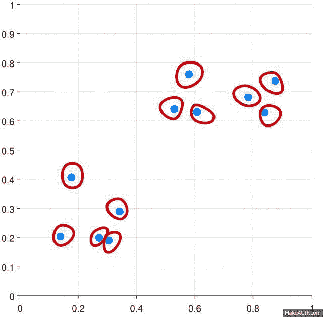

# 机器学习聚类技术

> 原文：<https://medium.com/analytics-vidhya/machine-learning-clustering-techniques-7f43da7b8ae3?source=collection_archive---------4----------------------->

聚类&以下机器学习聚类技术的类型

摘要

在本文中，我将使用数据科学来定义不同类型的聚类算法的基础。

聚类被定义为用于将数据点分组为组集合的算法，该算法基于将相似的数据点放在一个称为聚类的组中的原理。这种聚类方法分为硬方法(在这种情况下，每个数据点属于最多一个聚类)和软方法(在这种情况下，数据点可以属于多个聚类)。此外，存在多种类型聚类方法，例如分区聚类、分层聚类、基于密度的聚类、分布模型聚类、模糊聚类等。

概括地说，聚类技术的方法分为两种类型，即硬方法和软方法。在硬聚类方法中，每个数据点或观察值只属于一个聚类。在软聚类方法中，每个数据点不会完全属于一个聚类，相反，它可以是多个聚类的成员。它具有一组对应于在给定聚类中的概率的隶属系数。

目前，有不同类型的聚类方法在使用中，在本文中，我们将看到一些重要的方法，如层次聚类、分区聚类、模糊聚类、基于密度的聚类和基于分布模型的聚类。现在让我们用一个例子来讨论其中的每一个:

**1。分区聚类**

分区聚类是一种聚类技术，它将数据集分成一定数量的组。[例如，KNN 的 K 值，它将在我们训练模型之前决定]。它也可以称为基于质心的方法。在这种方法中，形成聚类中心[质心],使得当与其他聚类质心一起计算时，该聚类中的数据点的距离最小。这种算法最流行的例子是 KNN 算法。这就是分区聚类算法的样子

k 表示迭代

**2。层次聚类**

分层聚类是一种聚类技术，它将数据集划分为多个聚类，用户无需在训练模型之前指定要生成的聚类数。这种类型的聚类技术也称为基于连通性的方法。在这种方法中，不会对数据集进行简单的划分，但是它为我们提供了在一定距离后相互融合的聚类的层次结构。在数据集上完成分层聚类之后，结果将是数据点的基于树的表示[树形图]，这些数据点被划分为聚类。这是训练完成后，阶层式群集的样子

层次聚类过程如图所示。

在分区聚类和分层聚类中，我们可以注意到的一个主要区别是，在分区聚类中，我们会预先指定我们希望数据集被分成多少个聚类的值，而在分层聚类中，我们不会预先指定该值。

层次聚类和树状图

**3。基于密度的聚类**

在该聚类中，将根据数据图中的不同密度，通过分离各种密度区域来形成技术聚类。基于密度的空间聚类和噪声应用(DBSCAN)是这类技术中最常用的算法。该算法背后的主要思想是，对于聚类中的每个点，在给定半径的邻域中应该包含最小数量的点。到目前为止，在上面讨论的聚类技术中，如果你仔细观察，我们可以注意到所有技术中的一个共同点，即形成的簇的形状要么是球形的，要么是椭圆形的，要么是凹形的。DBSCAN 可以形成不同形状的聚类，这种类型的算法最适合于数据集包含噪声或离群值的情况。这是基于密度的空间聚类算法在训练完成后的样子。

**4。基于分布模型的聚类**

在这种类型的聚类中，通过识别聚类中所有数据点来自相同分布(正态、高斯)的概率来形成技术聚类。这类技术中最流行的算法是使用高斯混合模型(GMM)的期望最大化(EM)聚类。

基于分布模型的聚类

像层次聚类和划分聚类这样的普通聚类技术不基于形式模型，划分聚类中的 KNN 使用不同的 K 值产生不同的结果。由于 KNN 和 KMN 考虑聚类中心的均值，在某些情况下，高斯混合模型并不是最合适的。我们假设数据点是高斯分布的，这样我们就有两个参数来描述聚类均值和标准差的形状。以这种方式，为每个聚类分配一个高斯分布，以获得这些参数的最佳值(平均值和标准偏差),并且使用称为期望最大化的优化算法。这是 EM-GMM 训练后的样子。

**5。模糊聚类**

属于软方法聚类技术的一个分支，而上述所有聚类技术都属于硬方法聚类技术。在这种类型的聚类技术中，靠近中心的点可能是另一个聚类的一部分，其程度高于同一聚类边缘的点。属于给定聚类的点的概率是介于 0 到 1 之间的值。

pics Credits:([https://mahout . Apache . org/users/clustering/fuzzy-k-means . html](https://mahout.apache.org/users/clustering/fuzzy-k-means.html)

这种技术中最流行的算法是 FCM(模糊 C-均值算法)。这里，聚类的质心计算为所有点的平均值，并根据它们属于该聚类的概率进行加权。

我希望这篇简短的帖子能帮助你理清对这些沉重术语的基本理解。