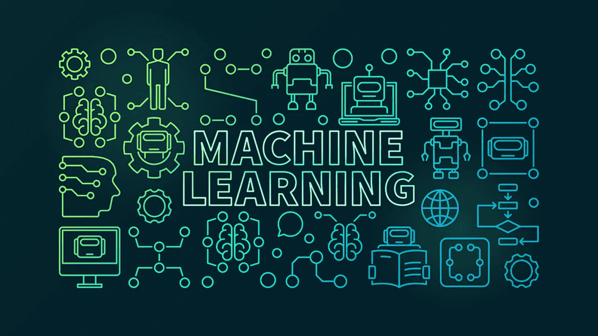

# 机器学习—数据预处理

> 原文：<https://medium.com/analytics-vidhya/machine-learning-data-prepossessing-661d18f063c3?source=collection_archive---------13----------------------->

制作机器学习模型最重要的一步是数据预处理。如果我们跳过数据预处理，那么创建的模型可能不会做出应有的准确预测。以下是数据集预处理中包含的步骤:

1.  处理丢失的数据
2.  处理分类数据
3.  分割…