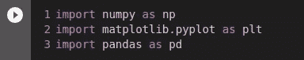
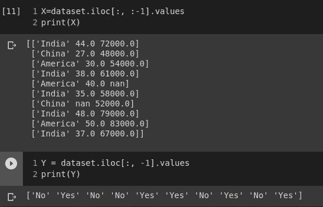
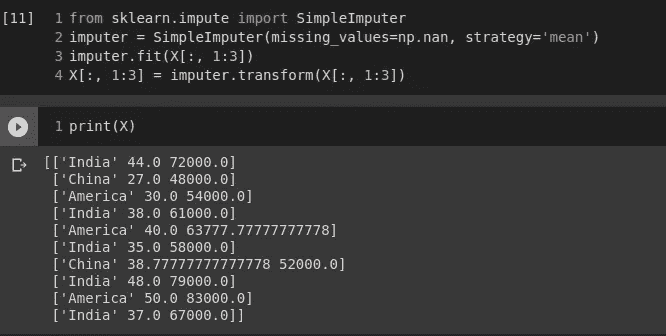
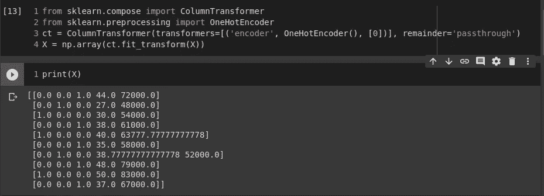
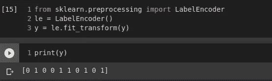
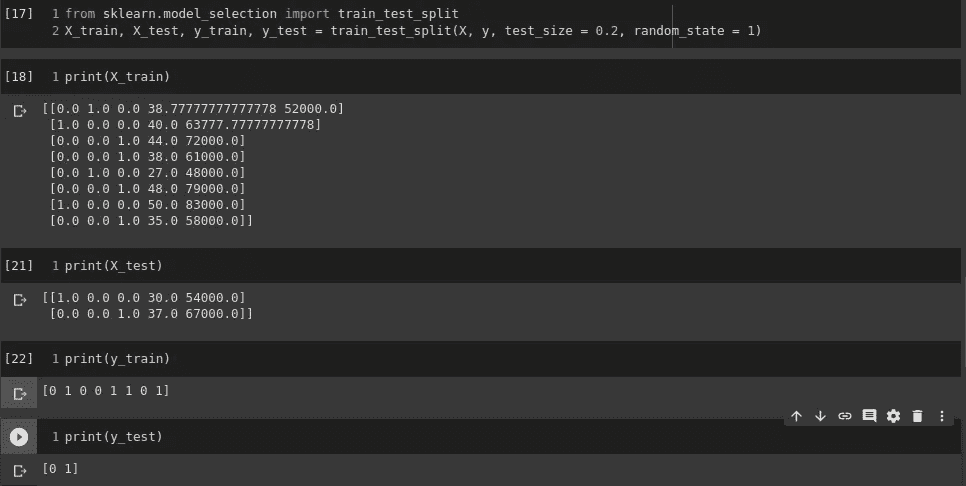
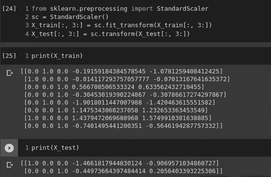

# 机器学习:数据预处理

> 原文：<https://medium.com/analytics-vidhya/machine-learning-data-preprocessing-5874289e922c?source=collection_archive---------23----------------------->

**数据预处理。*来源:谷歌图片***

如果我们把这与我们的现实生活联系起来，那将会很有趣。记住在烹饪一道菜之前先清洗然后切生蔬菜的任务。有点类似于这个任务。数据预处理是一种将原始形式的数据转换成更有用形式的方法。看起来很相似，对吗？这两个任务之间的唯一区别是，一个有助于烹饪美味的菜肴，另一个是机器学习模型，用于预测新观察的类别。事实上，对于大多数人来说，数据预处理这一步听起来并不有趣，但这是非常重要的第一步，因为每次构建模型时，都有数据预处理阶段要做。预处理步骤应该以这样的方式完成，即模型可以以正确的方式训练，因为模型的效率依赖于该步骤。

***数据预处理涉及的步骤:*** 这一步完全依赖于一些预处理工具:

1.  **导入库:**开始时，我们需要导入 3 个库(NumPy，Matplotlib，pandas)来开始预处理阶段。但是，什么是图书馆呢？库是模块的符号，它包含函数和类，通过这些函数和类你可以执行动作和操作。

I)*NumPy*——你需要这个库来处理数组。因为未来模型将需要阵列来实现。

ii)M*atplotlib*——你需要这个库来创建一些漂亮的图表。

iii) *pandas-* 该库不仅有助于导入数据集，还能创建特征矩阵和因变量向量。

**导入库。**

2.**导入数据集:**下面是导入数据集的步骤，这是一个重要的阶段。

**导入数据集。**

这里的数据集变量充当类似于数据集(Data.csv)的行和列的数据框。

i) *创建特征矩阵和因变量向量:*

**矩阵的特性。**

所有我们需要知道的是玩矩阵的索引，我们可以很容易地创建这两个特征矩阵。这里 x 作为自变量矩阵，Y 作为因变量向量。这两个特征矩阵将是进一步预处理的首要条件。

3.**注意丢失的数据:**一定要找出上图和包含值 NaN 的行，这些值表示丢失了值，它会影响模型的学习。

**缺失值替换为平均值。**

这可以通过多种方式完成，例如删除/忽略缺少值的行。但是，当丢失值的行数最多为 1%时，这是有益的。

其他方法是用该列的中值或平均值替换缺失值。

但是，最优选的是用该列的平均值( **Mean** )代替。这是在最佳数据科学库 scikit-learn 的帮助下完成的。

4.**编码分类数据:**上述特征矩阵包含具有字符串值的列，这很难处理和操作。因为计算机能很好地处理二进制值。所以，我们将把字符串值转换成二进制值。

i) *编码自变量:*

***自变量的编码。***

我们有三类数据，因此，编码值是:

“印度为 0，0，0”，“中国为 0，0，1”，“美国为 1，0，0”。

ii) *因变量编码:*

***因变量的编码。***

这里，我们有两类值，因此，编码值是:

“否为 0”和“是为 1”

5.**将数据集分为训练集和测试集:**在这一步中，我们致力于泛化。拆分的目的是为了避免过度拟合。**过度拟合**发生在模型学习训练数据中的细节和噪声，以至于对新数据的模型性能产生负面影响的时候。它优化了训练精度。我们需要我们的模型来很好地预测新观察(测试集)的结果，这类似于训练集。

**将数据集分为 80%的训练集和 20%的测试集。**

6.**特征缩放:**

要素缩放对于将各种数据纳入同一比例非常重要。它包括将特定范围内的数据标准化的步骤。

两种最常用的缩放技术是规范化和标准化。但是，我们更喜欢标准化技术。

***结论:*** *上述步骤非常重要，因为数据预处理是模型构建过程的支柱之一。我希望提到的细节将帮助许多初学者发展对数据预处理的理解。*