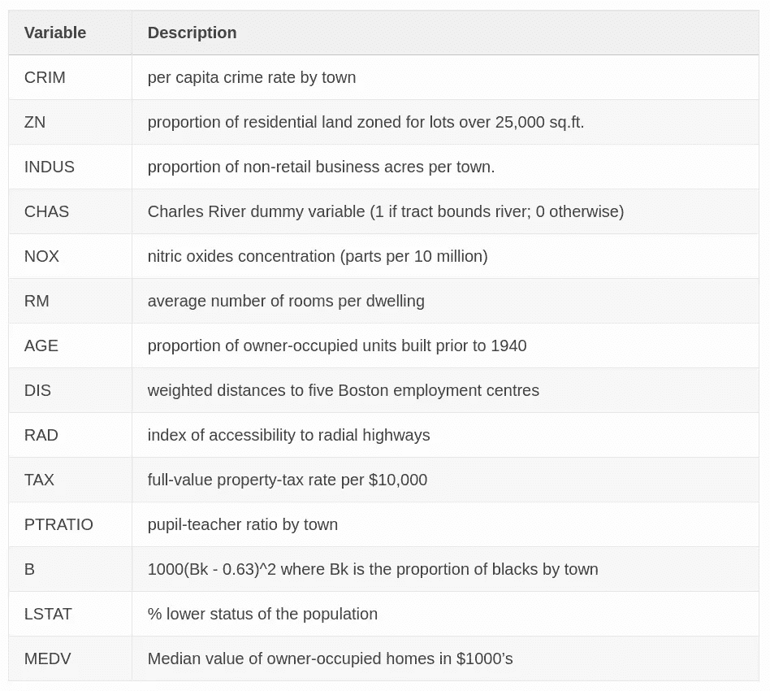
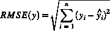

# 机器学习数据集之旅(2):波士顿住房

> 原文：<https://medium.com/analytics-vidhya/machine-learning-dataset-tour-2-boston-housing-d006834815c3?source=collection_archive---------23----------------------->


斯科特·韦伯在 [Unsplash](https://unsplash.com?utm_source=medium&utm_medium=referral) 上的照片

在这篇文章中，我将简要介绍波士顿住房数据集，并分享我的解决方案和一些解释。

> 被困在付费墙后面？点击[此](/analytics-vidhya/machine-learning-dataset-tour-2-boston-housing-d006834815c3?source=friends_link&sk=1063ddeeeb5a1383e92a3cf782751067)即可通过！
> 
> *TL；DR:你可以在我的*[*GitHub*](https://github.com/Cuda-Chen/machine-learning-note/blob/master/boston-housing/boston_xgboost.ipynb)*上查看我的作品。*

# 波士顿住房是什么？

该数据集由美国人口普查局收集的马萨诸塞州波士顿地区的住房信息组成。

下面显示了数据集中每个变量(列)的含义:



每个变量的描述

更多详情可以访问这个[网站](https://www.cs.toronto.edu/~delve/data/boston/bostonDetail.html)。

# 目标和评估指标

## 目标

*   预测`MEDV`的值

## 评估指标

*   RMSE，即



# 我的解决方案

*   虽然基于决策树的模型在表格数据上表现出色，但我会选择线性回归模型进行实践。具体我根据 sklearn 的[小抄](https://scikit-learn.org/stable/tutorial/machine_learning_map/index.html)选择套索回归。
*   我会在以后的日子里尝试线性回归，敬请期待！在以后的日子里，我还将演示如何使用更少的特性来产生类似的结果。
*   因为没有任何空值，所以我们不需要填充或删除缺少的值。
*   由于测试数据不包含基本事实，我们将使用交叉验证来训练模型。

# 逐步解释

## 1.准备数据并做一些解释

使用 pandas 的`info()`方法，我们发现所有的特征都是数字，所以不需要一键编码。

使用熊猫的`isnull()`方法，我们认识到不存在任何空值，所以不需要填充空值。

## 2.形象化

我想找出每个特性和价格之间的关系，所以我画了一些图来形象化这种关系。

因为有很多情节，你可以在这里看到[以清楚地查看结果。](https://github.com/Cuda-Chen/machine-learning-note/blob/master/boston-housing/boston_xgboost.ipynb)

## 3.检查特征重要性

也许我们不需要把每个特性都放入模型，所以我用 XGBoost 来寻找特性重要性。
许多基于决策树的模型具有发现特征重要性的能力，因为它们通过计算信息增益或基尼系数来分割数据。
运行 XGBoost 回归器后，我们得到以下结果:

```
xgbr**.**get_booster()**.**get_score(importance_type**=**'gain')

*# Out:* {'LSTAT': 1170.5912806284505,
 'RM': 407.86173977156585,
 'NOX': 114.57274366695417,
 'CRIM': 48.06237422548619,
 'DIS': 65.78717631524752,
 'PTRATIO': 109.93901440305558,
 'AGE': 26.895764984946428,
 'TAX': 56.70414882315789,
 'B': 30.702484215217385,
 'INDUS': 15.392935187827584,
 'CHAS': 45.74311416166666,
 'RAD': 18.774944386363632,
 'ZN': 9.174343283333334}
```

我们可以认识到最重要的三个特征:`LSTAT`、`RM`和`PTRATIO`。

# 4.建立模型

让我们用套索回归建立我们的模型！
我用参数`alpha=0.1`创建模型对象:

```
lasso **=** Lasso(alpha**=**0.1)
```

我还做了一个训练测试分割来训练模型，并使用分割的测试数据来产生预测。
然后我们获得`RMSE`值的`4.48`。让我们试试交叉验证是否能提高性能。

Scikit-learn 提供了名为`LassoCV()`的 Lasso 回归和交叉验证。经过训练，我们得到`RMSE`值的`4.37`。嗯，价值降低了。

## 5.产生竞争的结果

让我们将结果更新到 Kaggle，我们获得了`5.16976`的分数，在排行榜上排名第 4。这里可以看到排行榜[。](https://www.kaggle.com/c/boston-housing-dataset/leaderboard)

# 结论

在这篇文章中，我简要介绍了著名的波士顿住房数据集，并演示了我的解决方案的步骤。此外，我展示了我们可以使用带交叉验证的 Lasso 回归，但是性能没有提升。
下次巡演再见！

> *您可以在我的*[*GitHub*](https://github.com/Cuda-Chen/machine-learning-note/blob/master/boston-housing/boston_xgboost.ipynb)*上查看我的作品。*

*原载于 2019 年 12 月 28 日*[*https://cuda-Chen . github . io*](https://cuda-chen.github.io/machine%20learning/2019/12/28/machine-learning-dataset-tour-2-boston-housing.html)*。*

> 如果你有任何想法和问题要分享，请联系我[**clh 960524【at】Gmail . com**](http://clh960524@gmail.com/)。另外，你可以查看我的 [GitHub 库](https://github.com/Cuda-Chen)中的其他作品。如果你和我一样对机器学习、图像处理和并行计算充满热情，欢迎在 LinkedIn 上加我。