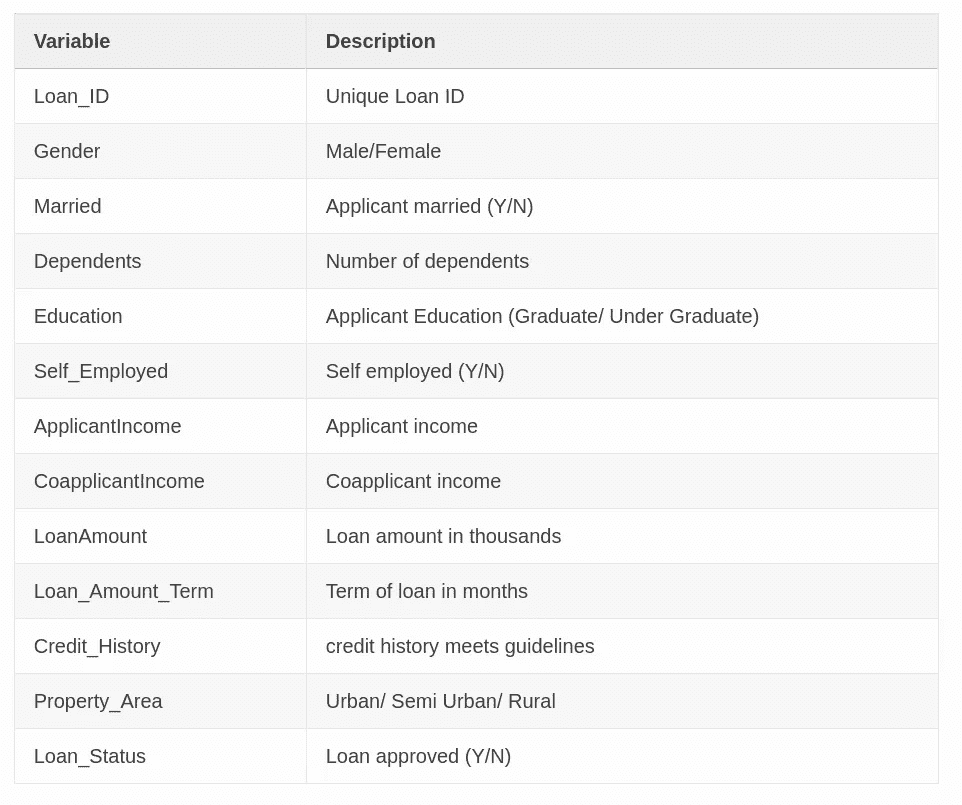
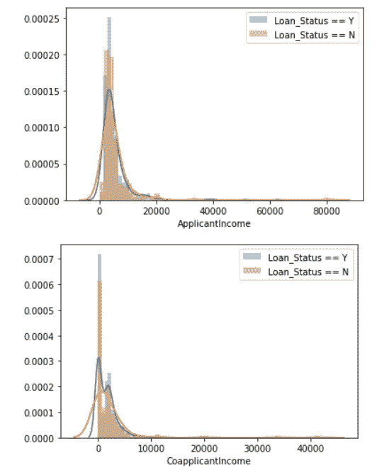
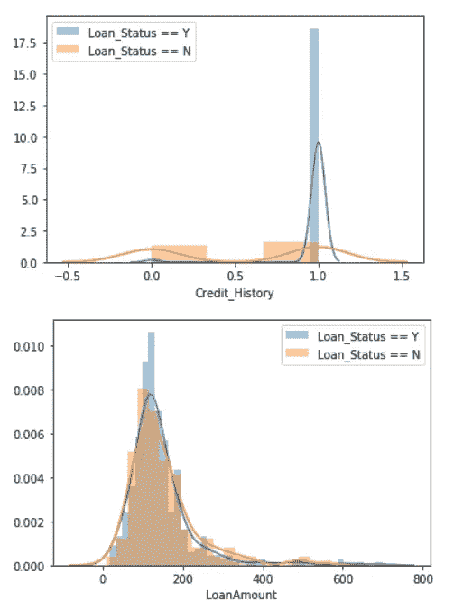
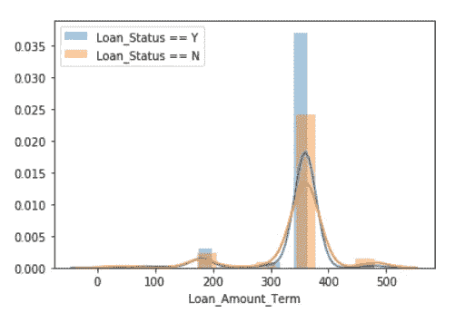
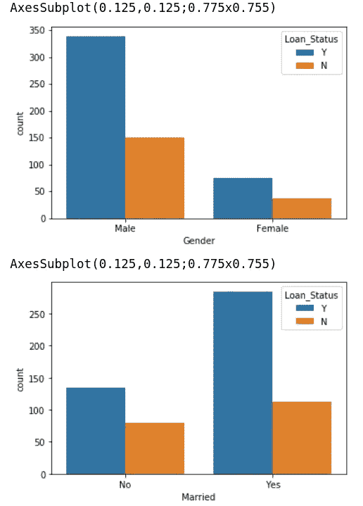
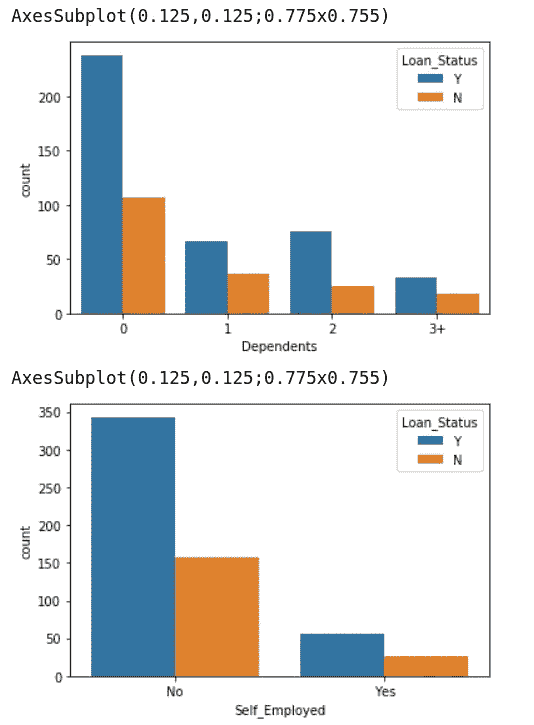
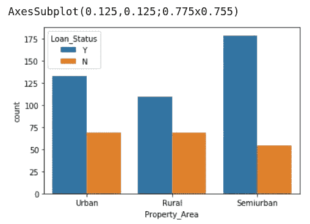

# 机器学习数据集之旅(3):贷款预测

> 原文：<https://medium.com/analytics-vidhya/machine-learning-dataset-tour-3-loan-prediction-b97335f9231f?source=collection_archive---------21----------------------->


照片由 [Cytonn 摄影](https://unsplash.com/@cytonn_photography?utm_source=medium&utm_medium=referral)在 [Unsplash](https://unsplash.com?utm_source=medium&utm_medium=referral) 上拍摄

在这篇文章中，我将简要介绍贷款预测数据集，并分享我的解决方案和一些解释。

> 点击[此链接](/analytics-vidhya/machine-learning-dataset-tour-3-loan-prediction-b97335f9231f?source=friends_link&sk=e0f6a76a2da8812def440c6e397763f3)通过付费墙。
> 
> *TL；DR:你可以在我的* [*GitHub*](https://github.com/Cuda-Chen/machine-learning-note/blob/master/loan-prediction/loan_predict.ipynb) 上查看我的作品

# 贷款预测数据集简介

由 Analytics Vidhya 提供，贷款预测任务是根据他们的状态决定我们是否应该批准贷款请求。每条记录包含以下变量及其说明:



每个功能的描述

更多详情可以访问官方[帖](https://datahack.analyticsvidhya.com/contest/practice-problem-loan-prediction-iii/)。

# 目标和评估指标

## 目标

*   目标是根据给定的条件批准/拒绝一个人的贷款。

## 评估指标

*   准确性，即您正确预测的贷款批准百分比。

# 我的解决方案

*   由于数据以表格形式提供，我将选择基于决策树的模型。
*   因为某些要素具有空值，所以我将使用删除具有空值的记录或填充一个值来代替。我最终选择**来填充缺失的特征值**，它在每个特征中出现的次数最多，因为训练数据很少。
*   由于测试数据不提供基本事实，因此将通过交叉验证训练数据来训练模型。

# 逐步解释

## 1.准备数据，做一些探索

使用熊猫的`info()`方法，我发现一些特征的类型是`object`:

1.  贷款
2.  性别
3.  已婚的
4.  受赡养者
5.  教育
6.  自营职业者
7.  房产 _ 面积
8.  贷款 _ 状态

使用熊猫的`isnull()`方法，我发现一些特征包含空值:

1.  性别
2.  已婚的
3.  受赡养者
4.  自营职业者
5.  贷款金额
6.  贷款 _ 金额 _ 期限
7.  信用记录

然后我使用`seaborn`来检查每个变量在 Loan_Status = 'Y' v.s. 'N '之间的分布:



综上所述，我做一些概述:

1.  Loan_ID 是不相关的(它不应该被视为一个特性，因为它只是每个记录的 ID)。
2.  Loan_Status 不应被视为特性，因为它是目标。
3.  Y/N 比率越高，贷款获得批准的可能性越大。

## 2.特征工程

我在这次任务中使用的特征工程方法包括:

1.  用`mode()`
    填充缺失值由于训练数据较少，我在 pandas 中用`mode()`方法填充缺失值。`mode()`方法将返回最常出现的值[1]。
2.  分类特征的一键编码
    在上一部分中提到，一些特征是分类类型的，所以我使用一键编码来表示该特征属于哪个类。
3.  对目标值进行标签编码
    我认为应用一热编码不适合表示目标值。因此，我采用标签编码来表示目标值的类别。

## 3.准备基线模型

在特征工程之后，我准备了默认的随机森林分类器来预测一个人是否会根据他的情况获得贷款批准。
同样，我应用交叉验证来评估分数，这个基线模型的准确率是 **75%** 。嗯，很简单。让我们试着通过调整它的超参数来改善它。

## 4.随机搜索的超参数搜索

为了找到模型的最佳超参数，我们可以使用以下两种方法:

> 随机搜索与网格搜索

随机搜索随机尝试超参数组合，网格搜索逐个尝试超参数组合。一般来说，网格搜索会产生更好的结果，但需要更多的时间来尝试组合。因此，我会使用随机搜索，在短时间内找到最佳组合。当然，我采用了`RandomizedSearchCV`，因为我使用了`sklearn`的随机森林分类器。

运行随机搜索后，我们可以使用`best_params_`对象获得最佳超参数:

```
{'n_estimators': 546,
 'min_samples_split': 2,
 'min_samples_leaf': 4,
 'max_features': 'sqrt',
 'max_depth': 10,
 'bootstrap': True}
```

然后，我使用这些参数创建一个随机森林分类器，这将在下一部分中提到。

## 5.训练和评估模型

在我们得到参数之后，我们可以创建一个性能比基线模型更好的模型。我还使用交叉验证来评估模型。
该模型的准确率为 **81%** ，比基线模型提高了 6%的准确率。听起来不错。

# 结论

在这篇文章中，我简要介绍了贷款预测数据集，并展示了一步一步的操作来展示我的解决方案。此外，我还证明了通过使用随机参数搜索来获得最佳超参数，我们可以将模型的性能进一步提高 6%。
下次巡演再见，拜拜！

> *您可以在我的* [*GitHub*](https://github.com/Cuda-Chen/machine-learning-note/blob/master/loan-prediction/loan_predict.ipynb) *上查看我的作品。*

# 参考

[1][https://pandas . pydata . org/pandas-docs/stable/reference/API/pandas。DataFrame.mode.html](https://pandas.pydata.org/pandas-docs/stable/reference/api/pandas.DataFrame.mode.html)

*原载于 2019 年 12 月 28 日*[*https://cuda-Chen . github . io*](https://cuda-chen.github.io/machine%20learning/2019/12/28/machine-learning-dataset-tour-3-loan-prediction.html)*。*

> 如果你有任何想法和问题要分享，请联系我[**clh 960524【at】Gmail . com**](http://clh960524@gmail.com/)。另外，你可以查看我的 [GitHub 库](https://github.com/Cuda-Chen)中的其他作品。如果你像我一样对机器学习、图像处理和并行计算充满热情，请随时在 LinkedIn 上添加我。