# 机器学习:决策树分类

> 原文：<https://medium.com/analytics-vidhya/machine-learning-decision-tree-classification-1a248e95bc03?source=collection_archive---------31----------------------->

我们大多数人都觉得决策树很难，但它是机器学习中最强大的技术之一。这很容易实现，属于监督学习技术。顾名思义，它是一棵树，但没有真正的根和绿叶。它是通过经历各种条件来构建树，形成称为头节点的根和称为末端叶的叶，从而将数据分解成小段。

> **决策树:**
> 
> 决策树以树结构的形式建立分类或回归模型。这是监督学习技术。他们有两种类型的决策树
> 
> 分类树。
> 
> 回归树。
> 
> 决策树是使用递归划分来构建。这种方法也称为分而治之。它将数据集分解成越来越小的子集，同时增量地开发相关的决策树。

*决策树是类似流程图的结构:*

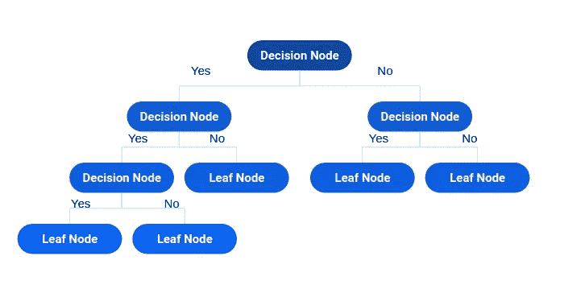

> 关于决策树分类结构的描述:
> 
> I)它是一个树状结构的流程图。
> 
> ii)内部节点表示特征。
> 
> iii)分支代表决策规则。
> 
> iv)最顶层的节点称为根节点。
> 
> v)叶节点以二进制(0，1)表示最终决策或结果，描述 0 表示不发生事件，1 表示发生事件。
> 
> 这种最终结构有助于决策。

但是，我们首先想到的是树的形成是如何发生的，以及它实际遵循的程序是什么？

*那么，我们来谈谈决策树算法——*

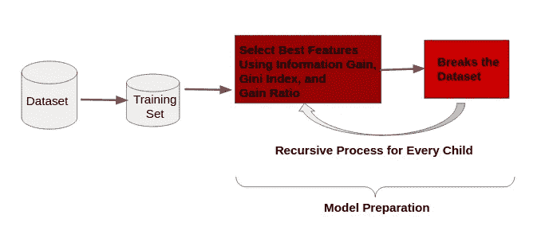

**决策树模型准备。**

*现在，让我们详细讨论每个特征选择步骤:-*

> ***信息增益:-***
> 
> *信息增益是熵的减少。信息增益根据给定的属性值计算数据集分割前的熵和分割后的平均熵之差。*
> 
> *数学实现-*

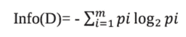

> *其中，Pi 是 D 中任意元组属于类 Ci 的概率。*

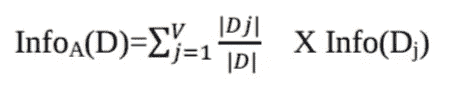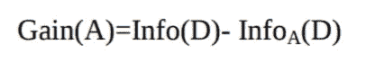

> *在节点 N()选择信息增益最高的属性 A Gain(A)作为分裂属性。*
> 
> ***增益比-***
> 
> *对于多结果的属性，信息增益是有偏的。这意味着它更喜欢具有大量不同值的属性。*

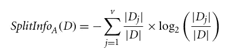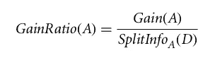

> *选择增益比最高的属性作为分割属性。*
> 
> ***基尼指数-***
> 
> *基尼系数考虑了每个属性的二元分割。你可以计算每个分区的杂质的加权和。如果属性 A 上的二元分割将数据 D 划分为 D1 和 D2，则 D 的基尼指数为:*

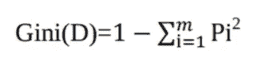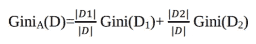

> *其中，pi 是 D 中一个元组属于类 Ci 的概率。*

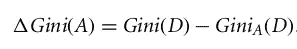

> *选择基尼系数最小的属性作为分裂属性。*

***我们来看一个例子——***

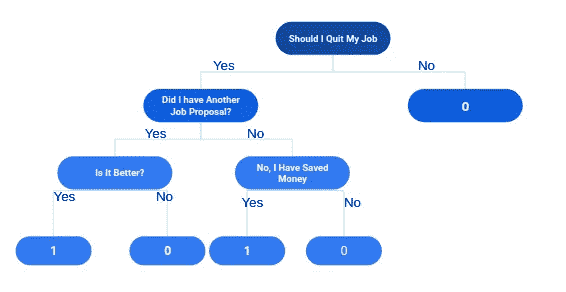

> **结论-**
> 
> 决策树很容易解释和可视化。它可以很容易地捕捉非线性模式。但是，对噪声数据敏感。它会过度拟合噪声数据。决策树偏向于不平衡数据集，因此建议在创建决策树之前平衡数据集。数据中的微小变化(或差异)会导致不同的决策树。这可以通过打包和提升算法来减少。

> 感谢您抽出宝贵的时间来阅读本博客！！！