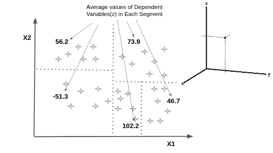

# 机器学习:决策树回归

> 原文：<https://medium.com/analytics-vidhya/machine-learning-decision-tree-regression-ff8563ffaf52?source=collection_archive---------16----------------------->

**基本决策树结构。来源:谷歌图片。**

M 我们大多数人都觉得决策树很难，但它是机器学习中最强大的技术之一。这很容易实现，属于监督学习技术。顾名思义，它是一棵树，但没有真正的根和绿叶。它是通过经历各种条件来构建树，形成称为头节点的根和称为末端叶的叶，从而将数据分解成小段。

***数据是如何分割成段的？我们很容易说数据被分割成段，但是，我们有没有想过这是如何发生的，为什么会发生？这个问题的答案在于两个重要的概念信息熵(E)和信息增益(IG)。***

***信息熵(E):*** 熵是指无序或不确定性。在这里，信息熵有助于找出决策树决定如何分割数据。这有助于维持决策的界限。

**熵的方程式。**

***信息增益(IG):*** 它衡量一个特定的特征给了我们多少关于类的信息。

> 信息增益是建立决策树的主要关键，信息增益最高的属性将首先被拆分。

**信息增益方程。**

> 完成上述所有步骤后，数据点的分段如下所示:

**分割线段。**

上面例子中的决策树看起来像是有 5 个终端叶子的流程图。

**决策树。**

> 末端叶中的值用于预测位于该段中的任何新观察值。上面描述了递归分割数据以形成决策树。

***实现:***

我们以数据集中的一个自变量和一个因变量为例。因此，我们可以很容易地绘制决策树图。

**导入库。**

> 导入的基本库，如 Numpy、Matplotlib 和 pandas。

**导入数据集。**

> 导入我们必须处理的数据集，并将自变量列值存储在 X 中，将因变量列值存储在 y 中。

**X 和 y 中的值。**

因为我们只有 10 个不同的值，所以我们不会将数据分成训练集和测试集。我们希望我们的模型能够学习数据中所有的值。

**训练回归模型。**

> 决策树回归模型在两个特征 X 和 y 上被训练

**回归模型结果的可视化。**

**薪资预测。**

> 以上回归正确地预测了位于 5 和 6 级位置之间的区段中的值。我们可以把结果与绘制的图表进行比较。这就完成了决策树回归的简单实现。

C ***结束语:*** 最后我们得出结论，决策树回归在预测或预报新观测值的输出方面起着重要的作用。它适用于更多数量的独立变量。但是，我们不能绘制图表，因为它会生成一个超过 3 维的图表。因此，决策树的形成遵循数据的递归分割。

> "非常感谢您抽出宝贵的时间阅读这篇关于决策树回归的博客. "