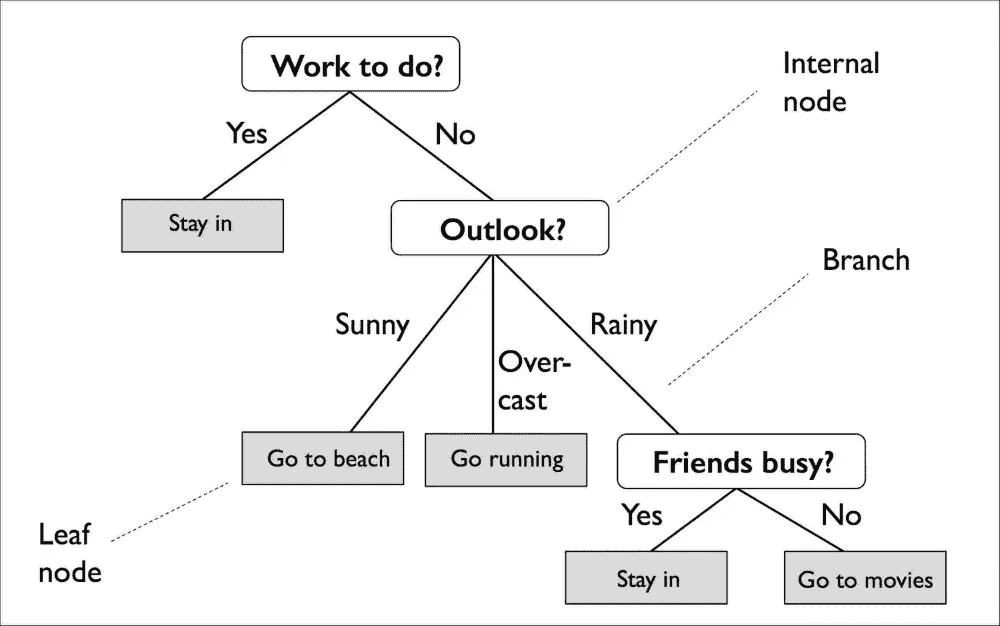
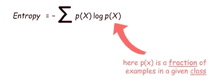
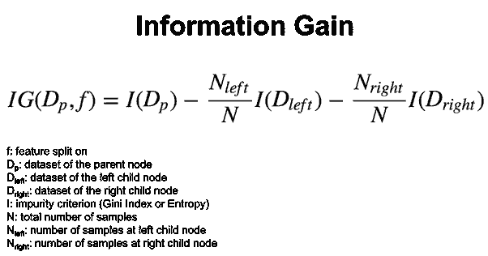
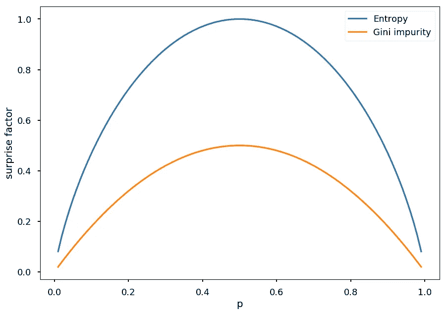

# 机器学习:决策树

> 原文：<https://medium.com/analytics-vidhya/machine-learning-decision-trees-78d9eb31c42a?source=collection_archive---------27----------------------->

这个博客涵盖了另一个有趣的机器学习算法，称为决策树及其数学实现。

在生活的每一个点上，我们都会做出一些决定来继续前进。同样，这种机器学习算法也会对提供的数据集做出相同的决策，并在每一步找出最佳的分割或决策，以提高准确性，做出更好的决策。这反过来有助于给出有价值的结果。

> 决策树是一种机器学习算法，它表示数据集的分层划分，以基于某些参数形成一棵树。

决策树的示例

现在，让我们讨论一些与决策树相关的基本术语。

1.  根节点:第一次分裂发生的起始节点称为根节点。换句话说，最顶端的节点被称为根节点。在上图中，“要做的工作”是根节点。
2.  内部节点:表示对属性进行测试的节点称为内部节点。它不分类也不持有阶级标签。它有助于进一步分裂，以实现叶节点。上图中，“Outlook？”是内部节点。
3.  叶节点:持有类标签的节点称为叶节点。在此节点之后，不能再进行进一步的拆分。
4.  分支:决策树中的分支代表在内部节点上进行的测试的结果。

# 数学实现

1.  **熵**:熵是指数据中的随机程度。所以，对于一个特定的节点，不管是根节点还是内部节点，我们都会计算熵。计算熵的公式是:

考虑二元分类“是/否”。对于一个节点，有 9 个是和 5 个否。所以，熵是:

E =-(9/14)log(9/14)—(5/14)log(5/14)
E = 0.94

可以看出这是一种高度的随机性。熵的范围从 0 到 1。所以，如果熵为 0，那就是纯除法，如果熵为 1，那就是不纯除法。熵应该尽可能低。

2.**信息增益**:简单来说，信息增益就是比较拆分前后样本的熵。计算特定节点的信息增益的公式是:

因此，该算法计算所有可能分裂的信息增益，并找出最佳分裂。信息增益最高的部门是最好的。

3.**基尼杂质**:基尼杂质与熵相同，用于计算分裂的纯度。大多数情况下，基尼系数优于熵，因为基尼系数易于计算，基尼系数的取值范围为 0-0.5。计算基尼系数的公式是:

从下图可以看出基尼系数杂质和熵的对比。

因此，决策树需要借助熵或基尼系数来计算总体信息增益。因为基尼系数在计算上是有效的，所以它是优选的。