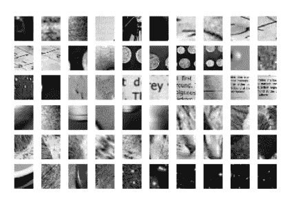

# 机器学习和深度学习指南

> 原文：<https://medium.com/analytics-vidhya/machine-learning-deep-learning-guide-11ad26e0854c?source=collection_archive---------2----------------------->

W 欢迎来到机器学习&深度学习指南的第 3 部分，在这里我们学习和实践机器学习和深度学习，而不会被概念和数学规则所淹没。

> [*第 1 部分:关键术语、定义和从监督学习(线性回归)开始。*](/analytics-vidhya/machine-learning-deep-learning-guide-part-1-4ba7ce8cf7eb)
> 
> [*第二部分:监督学习:回归(SGD)和分类(SVM、朴素贝叶斯、KNN 和决策树)。*](/analytics-vidhya/machine-learning-deep-learning-guide-db520c4797da)
> 
> *第 3 部分:无监督学习(KMeans，PCA)，欠拟合与过拟合以及交叉验证。*
> 
> [*第四部分:深度学习:定义、层次、度量和损失、优化器和正则化*](/analytics-vidhya/machine-learning-deep-learning-guide-da303a71b8e0)

# 学习目标

在这一部分，我们将结合实例讨论**无监督学习**以及如何与**有监督学习配合使用。**我们还将学习如何进行交叉验证，以及过度拟合和欠拟合之间的区别。


来源: [Scikit-Learn](https://scikit-learn.org/stable/tutorial/machine_learning_map/index.html)

# **无监督学习**

到目前为止，我们考虑监督学习，其中我们有一组特征(X)和标签(y ),我们希望学习从特征到标签的映射。在无监督学习中，我们只有特征(X ),我们希望在数据中找到模式。

正如第一部分中提到的，我们将无监督学习分为两个概念:

1.  **聚类**:将数据按照相似性进行分组。
2.  **降维**:降维压缩数据，同时保持其结构和有用性。

# **聚类**

根据相似性将数据分组。我们将考虑 [k-Means](https://scikit-learn.org/stable/modules/clustering.html#k-means) 进行聚类。它通过尝试将样本分成 n 组相等的方差来对数据进行聚类，从而最小化被称为*惯性*或类内平方和的标准。该算法要求指定聚类数。

> 你可以从[这里](https://www.kaggle.com/mohammadhatoum/unsupervised-learning-clustering?scriptVersionId=23776964)下载完整的 Kaggle 笔记本

1.**数据定义**:我们将使用[手写数字](https://archive.ics.uci.edu/ml/datasets/Optical+Recognition+of+Handwritten+Digits)数据集。

```
%matplotlib inline
from sklearn.datasets import load_digits
from sklearn.cluster import KMeans
import numpy as np
import matplotlib.pyplot as plt
import seaborn as sns; sns.set()  # for plot styling
from scipy.stats import modedigits = load_digits()
print(digits.data.shape)
```

> 结果:(1797，64)

2.算法选择:我们将使用 KMeans

```
kmeans = KMeans(n_clusters=10, random_state=0)
clusters = kmeans.fit_predict(digits.data)
print(kmeans.cluster_centers_.shape)
```

> 结果:(10，64)

让我们画出不同的结果

```
fig, ax = plt.subplots(2, 5, figsize=(8, 3))
centers = kmeans.cluster_centers_.reshape(10, 8, 8)
for axi, center in zip(ax.flat, centers):
    axi.set(xticks=[], yticks=[])
    axi.imshow(center, interpolation='nearest', cmap=plt.cm.binary)
```


数字结果

酷，它能够正确地识别大多数号码。如你所见，它不能识别 1 和 8。现在，为了能够测试准确性，我们将添加相应的标签。

```
labels = np.zeros_like(clusters)
for i in range(10):
    mask = (clusters == i)
    labels[mask] = mode(digits.target[mask])[0]
```

我们将测试 KMeans 模型的准确性。然后我们将绘制混淆矩阵。

```
from sklearn.metrics import accuracy_score
print(f"Accuracy for KMeans : {accuracy_score(digits.target, labels)}")
```

> 结果:平均值的精确度为:0。59660 . 68686868661

```
from sklearn.metrics import confusion_matrixprint(f"Confusion Matrix KMeans")mat = confusion_matrix(digits.target, labels)
sns.heatmap(mat.T, square=True, annot=True, fmt='d', cbar=False,
            xticklabels=digits.target_names,
            yticklabels=digits.target_names)
plt.xlabel('true label')
plt.ylabel('predicted label')
plt.show()
```


混淆矩阵 k 均值

# **降维(**特征消除)

听起来是这样的:我们通过消除特征来减少特征空间。我们将使用 [**【主成分分析】**](https://scikit-learn.org/stable/modules/generated/sklearn.decomposition.PCA.html) **。**这是一种技术，用于强调数据集中的变化和突出强模式。

> 你可以从[这里](https://www.kaggle.com/mohammadhatoum/dimensionality-reduction-pca?scriptVersionId=23776972)下载完整的 Kaggle 笔记本

1.  **数据定义:**我们将使用 Olivetti 人脸数据集[，该数据集包含一组于 1992 年 4 月至 1994 年 4 月在剑桥大学 T 实验室拍摄的人脸图像](http://www.cl.cam.ac.uk/research/dtg/attarchive/facedatabase.html)。

```
data=np.load("../input/olivetti_faces.npy")
labels=np.load("../input/olivetti_faces_target.npy")print(f"Shape of inputs: {data.shape}")
print(f"Shape of labels: {labels.shape}")
print(f"Unique values for labels: {np.unique(labels)}")
```

> 结果:
> 
> 输入的形状:(400，64，64)
> 标签的形状:(400，)
> 标签的唯一值:[0 1 2 3 4 5 6 7 8 9 10 11 12 13 14 15 16 17 18 19 20 21 22 23
> 24 25 26 27 28 29 30 31 32 33 34 35 36 37 38 39]

所以我们有 40 个人的 400 张照片。每个图像的尺寸为 64*64。

让我们看第一张图片。

```
imshow(data[0])
```


奥利维蒂形象

让我们重塑数据。

```
X=data.reshape((data.shape[0],data.shape[1]*data.shape[2]))
print("After reshape:",X.shape)
```

> 结果:
> 
> 整形后:(400，4096)

**2。训练/测试分割:**

```
from sklearn.model_selection import train_test_split
X_train, X_test, y_train, y_test=train_test_split(X, labels, test_size=0.25, stratify=labels, random_state=0)
print("X_train shape:",X_train.shape)
print("y_train shape:{}".format(y_train.shape))
```

> 结果:
> 
> x _ 火车形状:(300，4096)
> y _ 火车形状:(300，)

**3。算法选择:**我们将使用 PCA

```
from sklearn.decomposition import PCA
pca=PCA()
pca.fit(X)plt.figure(1, figsize=(12,8))plt.plot(pca.explained_variance_, linewidth=2)

plt.xlabel('Components')
plt.ylabel('Explained Variaces')
plt.show()
```


解释了组件的变化

如你所见，60 岁以后的数值是一样的。这意味着我们可以依赖 60 个重要组件。

**4。培训:**

```
n_components=60
pca=PCA(n_components=n_components, whiten=True)
pca.fit(X)
```

> 结果:
> 
> PCA(copy=True，iterated_power='auto '，n_components=60，random_state=None，
> svd_solver='auto '，tol=0.0，白化=True)

我们将绘制平均脸。也就是说，我们将基于计算出的 PCA 来取面部的平均值。

```
fig,ax=plt.subplots(1,1,figsize=(8,8))
ax.imshow(pca.mean_.reshape((64,64)), cmap="gray")
ax.set_xticks([])
ax.set_yticks([])
ax.set_title('Average Face')
```


平均脸

打印特征脸

```
number_of_eigenfaces=len(pca.components_)
eigen_faces=pca.components_.reshape((number_of_eigenfaces, data.shape[1], data.shape[2]))cols=10
rows=int(number_of_eigenfaces/cols)
fig, axarr=plt.subplots(nrows=rows, ncols=cols, figsize=(15,15))
axarr=axarr.flatten()
for i in range(number_of_eigenfaces):
    axarr[i].imshow(eigen_faces[i],cmap="gray")
    axarr[i].set_xticks([])
    axarr[i].set_yticks([])
    axarr[i].set_title("eigen id:{}".format(i))
plt.suptitle("All Eigen Faces".format(10*"=", 10*"="))
```


特征脸

使用 PCA 变换训练集和测试集。

```
X_train_pca=pca.transform(X_train)
X_test_pca=pca.transform(X_test)
print(f"Shape before {X_train.shape} vs shape after {X_train_pca.shape}")
```

> 结果:
> 
> (300，4096)之前的形状与(300，60)之后的形状

所以现在我们能够降低输入的维度。

**5。预测和评估:**我们将在应用 PCA 变换后使用 LogisticRegression 来研究模型的准确性。

```
from sklearn.linear_model import LogisticRegression
from sklearn import metricsclf = LogisticRegression()
clf.fit(X_train_pca, y_train)
y_pred = clf.predict(X_test_pca)print("Accuracy score:{:.2f}".format(metrics.accuracy_score(y_test, y_pred)))
```

> 结果:
> 
> 准确度得分:0.95

令人印象深刻的是我们得到了 0.95 的精确度。现在，我将让您通过使用 PCA 进行降维来尝试做同样的事情。这意味着加载数据，将其分成训练和测试，然后使用 LogisticRegression。

结果将是相同的精度 0.95，但是模型完成的时间将会长得多。

这是主要目标，在不影响精度的情况下减少尺寸并保留重要特征。

# **特征提取**

假设我们有十个独立变量。在特征提取中，我们创建十个“新”独立变量，其中每个“新”独立变量是十个“旧”独立变量的组合。然而，我们以特定的方式创建这些新的自变量，并根据它们预测因变量的程度对这些新变量进行排序。

> 你可以从[这里](https://www.kaggle.com/mohammadhatoum/unsupervised-learning-feature-extraction?scriptVersionId=23776981)下载完整的 Kaggle 笔记本

我使用了这本神奇的书中的例子: [Python 数据科学手册](http://shop.oreilly.com/product/0636920034919.do)。
实现也是由 [Jake VanderPlas](https://jakevdp.github.io/PythonDataScienceHandbook/05.14-image-features.html) 完成的。

我们将执行以下操作:

1.  获取一组人脸的图像缩略图，构成“正”训练样本。
2.  获取一组非人脸的图像缩略图，构成“负”训练样本。
3.  从这些训练样本中提取[Oriented Gradients(HOG)]([https://en . Wikipedia . org/wiki/Histogram _ of _ Oriented _ Gradients](https://en.wikipedia.org/wiki/Histogram_of_oriented_gradients))特征的直方图。
4.  在这些样本上训练线性 SVM 分类器。
5.  对于“未知”的图像，在图像上通过一个滑动窗口，使用该模型来评估该窗口是否包含人脸。
6.  如果检测重叠，将它们合并到一个窗口中。

**1。获取正面图像:**我们将使用野生 [(LFW](http://vis-www.cs.umass.edu/lfw/) )数据集中的标记人脸。这是从互联网上收集的名人的 JPEG 图片集，所有细节可在官方网站上找到:

```
%matplotlib inline
import matplotlib.pyplot as plt
import seaborn as sns; sns.set()
import numpy as np
from sklearn.datasets import fetch_lfw_people
faces = fetch_lfw_people()
positive_patches = faces.images
print(f"Shape of positive data {positive_patches.shape}")
```

> 结果:
> 
> 正数据的形状(13233，62，47)

所以我们有超过 13000 张图片。让我们绘制第一幅图像

```
from skimage.io import imshow
imshow(faces.images[0])
```


阳性图像样本

**2。获取负面图像:**现在我们将准备一些没有人脸的图像。我们将想象并使用 10 个类别(“相机”、“文本”、“硬币”、“月亮”、“页面”、“时钟”、“免疫组织化学”、“切尔西”、“咖啡”、“哈勃深度场”)

```
from skimage import data, transform,color, featureimgs_to_use = ['camera', 'text', 'coins', 'moon',
               'page', 'clock', 'immunohistochemistry',
               'chelsea', 'coffee', 'hubble_deep_field']
images = [color.rgb2gray(getattr(data, name)())
          for name in imgs_to_use]
```

让我们把它们和它们的标签一起标出来

```
for i,im in enumerate(images):
    print(imgs_to_use[i])
    imshow(im) 
    plt.show()
```


负像样本

现在我们将使用 [PatchExtractor](https://scikit-learn.org/stable/modules/feature_extraction.html#image-feature-extraction) ，它是图像的特征提取器。

```
from sklearn.feature_extraction.image import PatchExtractordef extract_patches(img, N, scale=1.0, patch_size=positive_patches[0].shape):
    extracted_patch_size = tuple((scale * np.array(patch_size)).astype(int))
    extractor = PatchExtractor(patch_size=extracted_patch_size,
                               max_patches=N, random_state=0)
    patches = extractor.transform(img[np.newaxis])
    if scale != 1:
        patches = np.array([transform.resize(patch, patch_size)
                            for patch in patches])
    return patchesnegative_patches = np.vstack([extract_patches(im, 1000, scale)
                              for im in images for scale in [0.5, 1.0, 2.0]])
print(f"Shape of negative data {negative_patches.shape}")
```

> 结果:
> 
> 负数据的形状(30000，62，47)

我们有 30，000 个不包含人脸的图像块。我们将绘制几个:

```
fig, ax = plt.subplots(6, 10)
for i, axi in enumerate(ax.flat):
    axi.imshow(negative_patches[500 * i], cmap='gray')
    axi.axis('off')
```



**3。合并图像并应用 HOG:** 现在将合并正面和负面图像。然后对他们使用猪。我们还将为有脸的图像添加标签 1，为没有脸的图像添加标签 0。

```
from itertools import chain
X_train = np.array([feature.hog(im)
                    for im in chain(positive_patches,
                                    negative_patches)])
y_train = np.zeros(X_train.shape[0])
y_train[:positive_patches.shape[0]] = 1
print(f"Shape after combining the images: {X_train.shape}")
```

> 结果:组合图像后的形状:(43233，1215)

**4。训练一个支持向量机:**我们将线性 SVC。

```
from sklearn.svm import LinearSVCmodel = LinearSVC(C=1.0, class_weight=None, dual=True, fit_intercept=True,
          intercept_scaling=1, loss='squared_hinge', max_iter=1000,
          multi_class='ovr', penalty='l2', random_state=None, tol=0.0001,
          verbose=0)
model.fit(X_train, y_train)
```

**5。获取新图像:我们将从 skimage 中获取宇航员图像。**

```
import skimage.data
test_image = skimage.data.astronaut()
test_image = skimage.color.rgb2gray(test_image)
test_image = skimage.transform.rescale(test_image, 0.5)
test_image = test_image[:160, 40:180]plt.imshow(test_image, cmap='gray')
plt.axis('off');
```


宇航员

*接下来，让我们创建一个窗口，迭代这个图像的小块，并计算每个小块的 HOG 特征:*

```
def sliding_window(img, patch_size=positive_patches[0].shape,
                   istep=2, jstep=2, scale=1.0):
    Ni, Nj = (int(scale * s) for s in patch_size)
    for i in range(0, img.shape[0] - Ni, istep):
        for j in range(0, img.shape[1] - Ni, jstep):
            patch = img[i:i + Ni, j:j + Nj]
            if scale != 1:
                patch = transform.resize(patch, patch_size)
            yield (i, j), patch

indices, patches = zip(*sliding_window(test_image))
patches_hog = np.array([feature.hog(patch) for patch in patches])
print(f"Patches Hog shape: {patches_hog.shape}")
```

> 结果:补丁猪形状:(1911，1215)

*最后，我们可以使用这些具有猪特征的面片，并使用我们的模型来评估每个面片是否包含人脸:*

```
labels = model.predict(patches_hog)
print(f"labels: {labels.sum()}")
```

> 结果:标签:49.0

**6。人脸检测:** *我们看到在近 2000 个补丁中，我们找到了 49 个检测。让我们使用我们所拥有的关于这些小块的信息来显示它们在我们的测试图像上的位置，把它们画成矩形:*

```
fig, ax = plt.subplots()
ax.imshow(test_image, cmap='gray')
ax.axis('off')Ni, Nj = positive_patches[0].shape
indices = np.array(indices)for i, j in indices[labels == 1]:
    ax.add_patch(plt.Rectangle((j, i), Nj, Ni, edgecolor='red',
                               alpha=0.3, lw=2, facecolor='none'))
```


人脸检测结果

如你所见，使用特征提取和 SVC，我们能够创建一个人脸检测模型。

# 过度拟合与欠拟合

考虑我们有两组数据。训练和测试设备。我们定义如下:

**拟合不足:**这是指模型未能捕捉到数据中的重要区别和模式，因此即使在训练数据中，它的表现也很差。当模型不够复杂，无法捕捉数据中的潜在趋势时，就会出现这种情况。

**过拟合:**是指模型与训练数据几乎完美匹配，但在测试和其他新数据上表现不佳。我们说它不能很好地概括看不见的数据。

**解决欠拟合:**

可以通过使用更多数据来避免欠拟合，也可以通过特征选择来减少特征，或者简单地继续前进并尝试替代的机器学习算法

**解决过拟合:**

之前我们使用[*train _ test _ split*](https://scikit-learn.org/stable/modules/generated/sklearn.model_selection.train_test_split.html#sklearn.model_selection.train_test_split)*创建*一个验证(维持)*集合*时提供了一个解决方案。*但这样做的缺点是，我们在模型训练中丢失了一部分数据。例如，如果我们使用验证大小 0.3，这意味着我们保留了 30%的训练数据。这有些运气，因为我们可能在训练时错过了一些重要的或有效的或新的数据模式。*

> **解决这个问题的方法是一个叫做* [*交叉验证*](https://scikit-learn.org/stable/modules/cross_validation.html) *(简称 CV)的过程。测试集仍然应该被保留用于最终评估，但是在做 CV 时不再需要验证集。
> 在称为 k-fold CV 的基本方法中，训练集被分成 k 个更小的集合(其他方法在下面描述，但通常遵循相同的原则)。**
> 
> **k 个“折叠”中的每一个都遵循以下程序:**
> 
> **1)使用 k-1 个褶皱作为训练数据来训练模型**
> 
> **2)生成的模型在数据的剩余部分进行验证(即，它被用作计算性能度量(如准确性)的测试集)。**

**

*[*k* 【褶皱】](https://scikit-learn.org/stable/modules/cross_validation.html)*

*为了评估交叉验证的结果，我们可以使用 [cross_val_score](https://scikit-learn.org/stable/modules/generated/sklearn.model_selection.cross_val_score.html#sklearn.model_selection.cross_val_score) 。这很容易使用，我们只需将 cv 参数设置为折叠次数。*

```
*from sklearn.cross_validation import cross_val_score
cross_val_score(model, X, y, cv=5)*
```

**

*来源: [Scikit-learn](https://scikit-learn.org/stable/auto_examples/model_selection/plot_underfitting_overfitting.html)*

# *偏差-方差权衡*

***偏差:**是用简化模型近似真实世界现象引入的误差量。这是训练集误差和人类水平误差或任何其他最佳误差或基本误差之间的差异。*

***方差:**是模型的测试误差根据训练数据的变化而变化的程度。它反映了模型对其接受训练的数据集特性的敏感性。*

*随着模型复杂性的增加，它变得更加灵活，它的偏差会减少(它在解释训练数据方面做得很好)，但方差会增加(它也不会一般化)。*

*从技术上讲，**欠拟合**发生在**偏高**的时候。**过度拟合**发生在我们有**高方差的时候。***

**

*[未拟合(高偏差)与过度拟合(高方差)](https://github.com/jakevdp/PythonDataScienceHandbook/blob/master/notebooks/figures/05.03-bias-variance.png)*

*最终，为了有一个好的模型，你需要一个具有**低偏差**和**低方差**的模型。这意味着我们需要找到最佳的超参数。我们已经在本系列的第二部分中提到过这一点，在那里我们使用了[GridSearchCV](https://scikit-learn.org/stable/modules/grid_search.html#grid-search)。*

```
*# Establish a model
model = SGDRegressor(learning_rate='optimal',penalty='l2')
from sklearn.model_selection import GridSearchCV
# Grid search - this will take about 1 minute.
param_grid = {
    'alpha': 10.0 ** -np.arange(1, 7),
    'loss': ['squared_loss', 'huber', 'epsilon_insensitive'],
}
clf = GridSearchCV(model, param_grid)
clf.fit(X_train, y_train)
print(f"Best Score: {round(clf.best_score_,3)}" )
print(f"Best Estimator: {clf.best_estimator_}" )
print(f"Best Params: {clf.best_params_}" )*
```

> *但是，有时绘制单个超参数对训练分数和验证分数的影响有助于发现估计量对于某些超参数值是过拟合还是欠拟合。
> 在这种情况下，函数`[validation_curve](https://scikit-learn.org/stable/modules/generated/sklearn.model_selection.validation_curve.html#sklearn.model_selection.validation_curve)`会有所帮助。*

**

*来源: [Scikit-Learn](https://scikit-learn.org/stable/modules/learning_curve.html#learning-curve)*

*我们还可以使用[学习曲线](https://scikit-learn.org/stable/modules/learning_curve.html#learning-curve)来查看添加更多的训练数据是否会提高我们模型的性能。我们还可以检查它是否存在偏差和方差。*

**

*来源: [Scikit-learn](https://scikit-learn.org/stable/modules/learning_curve.html#learning-curve)*

# *概述*

*我们已经到了本系列第 3 部分的结尾。在这一部分，我们能够了解到:*

1.  *基于 KMeans 的无监督学习聚类*
2.  *降维利用主成分分析(PCA)进行降维(特征消除)*
3.  *特征提取，并用它来创建一个人脸检测器*
4.  *过度拟合与欠拟合*
5.  *验证和交叉验证*
6.  *偏差-方差权衡*
7.  *验证曲线和学习曲线*

*在本教程的前几部分(1、2 和 3)，我们讨论了有监督和无监督机器学习的不同方面。在我们教程的第 4 部分，我们将从**深度学习开始。***

*感谢阅读！*

# *参考链接:*

1.  *[https://medium . com/analytics-vid hya/machine-learning-deep-learning-guide-part-1-4 ba 7 ce 8 cf 7 EB](/analytics-vidhya/machine-learning-deep-learning-guide-part-1-4ba7ce8cf7eb)*
2.  *[https://medium . com/analytics-vid hya/machine-learning-deep-learning-guide-db 520 c 4797 da](/analytics-vidhya/machine-learning-deep-learning-guide-db520c4797da)*
3.  *[https://github . com/jakevdp/python datascience handbook/tree/master/notebooks](https://github.com/jakevdp/PythonDataScienceHandbook/tree/master/notebooks)*
4.  *[https://sci kit-learn . org/stable/modules/clustering . html # k-means](https://scikit-learn.org/stable/modules/clustering.html#k-means)*
5.  *[https://archive . ics . UCI . edu/ml/datasets/Optical+Recognition+of+手写+数字](https://archive.ics.uci.edu/ml/datasets/Optical+Recognition+of+Handwritten+Digits)*
6.  *[https://www.kaggle.com/imrandude/olivetti](https://www.kaggle.com/imrandude/olivetti)*
7.  *[https://www . ka ggle . com/serkanpeldek/face-recognition-on-olivetti-dataset](https://www.kaggle.com/serkanpeldek/face-recognition-on-olivetti-dataset)*
8.  *[www.cl.cam.ac.uk/research/dtg/attarchive/facedatabase.html](http://www.cl.cam.ac.uk/research/dtg/attarchive/facedatabase.html)*
9.  *[https://hacker noon . com/supervised-machine-learning-linear-regression-in-python-541 a5d 8141 ce](https://hackernoon.com/supervised-machine-learning-linear-regression-in-python-541a5d8141ce)*
10.  *[https://sci kit-learn . org/stable/modules/cross _ validation . html](https://scikit-learn.org/stable/modules/cross_validation.html)*