# 机器学习和深度学习指南

> 原文：<https://medium.com/analytics-vidhya/machine-learning-deep-learning-guide-da303a71b8e0?source=collection_archive---------22----------------------->

W 欢迎来到机器学习&深度学习指南的第 4 部分，在这里我们学习和实践机器学习和深度学习，而不会被概念和数学规则所淹没。

> [*第 1 部分:关键术语、定义和从监督学习(线性回归)开始。*](/analytics-vidhya/machine-learning-deep-learning-guide-part-1-4ba7ce8cf7eb)
> 
> [*第二部分:监督学习:回归(SGD)和分类(SVM、朴素贝叶斯、KNN 和决策树)。*](/analytics-vidhya/machine-learning-deep-learning-guide-db520c4797da)
> 
> [*第三部分:无监督学习(KMeans，PCA)，欠拟合 vs 过拟合和交叉验证*](/analytics-vidhya/machine-learning-deep-learning-guide-11ad26e0854c) *。*
> 
> *第 4 部分:深度学习:定义、层次、度量和损失、优化器和正则化*

# **学习目标**

在教程的第 4 部分，我们将讨论**深度学习。**首先，我们会有深度学习和神经网络的定义。然后我们讨论两种主要的神经网络结构。之后，我们将列出与优化函数一起使用的主要误差和度量函数。最后，我们会写一个深度学习的例子。

# 定义

**深度学习**

在本指南的[第 1 部分](/analytics-vidhya/machine-learning-deep-learning-guide-part-1-4ba7ce8cf7eb)中，我们将[深度学习](/datadriveninvestor/difference-between-ml-ai-dl-23db64f7aa2)定义为机器学习的子集，它使用网状网络，工作方式类似于我们的大脑，技术上称为*深度神经网络*。
就像我们的大脑识别模式对事物进行分类，并从错误中学习一样——*深度学习也是如此*。它将未知数据与已知数据进行比较，从而对其进行相应的分类。

在第 3 部分[中，我们看到了一个无监督学习的例子，我们做了一些特征提取。深度学习具有学习多层表示的能力，是少数几种帮助我们自动提取特征的方法之一。可以假设较低层正在执行自动特征提取，很少或不需要程序员的指导。](/analytics-vidhya/machine-learning-deep-learning-guide-11ad26e0854c)

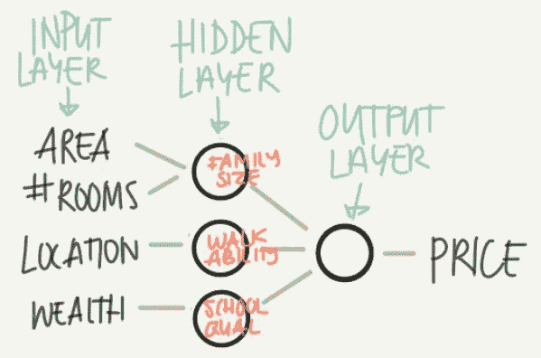

[神经网络示意图](https://www.slideshare.net/TessFerrandez/notes-from-coursera-deep-learning-courses-by-andrew-ng)

**神经网络**
神经网络是一类用层构建的模型。常用的神经网络类型包括卷积神经网络和递归神经网络。

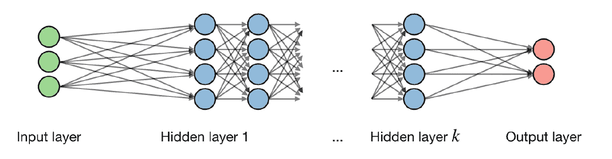

神经网络

*   **输入层:**代表我们输入神经网络的数据。
*   **输出层:**它生成我们的神经网络的输出。它能出去
*   **隐藏层:**是我们神经网络的核心。它可以输出二进制值(二进制分类)、属于一类的概率(多类分类)或连续值(回归)。如果我们有一层(或几层)，它被称为浅网络。否则它被称为深度神经网络(DNN)

单个神经元可能如下所示

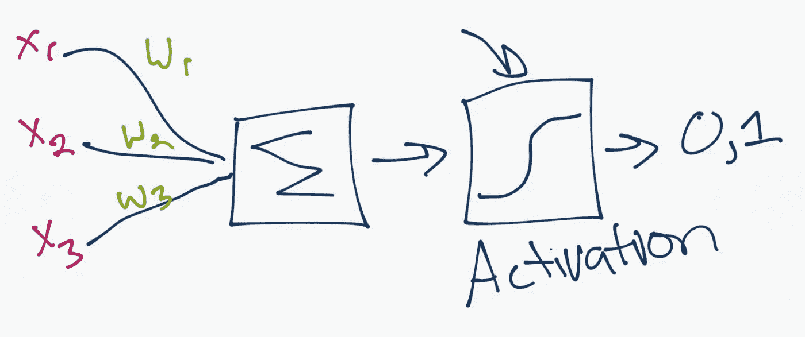

[单个神经元](https://pythonprogramming.net/introduction-deep-learning-python-tensorflow-keras/)

在每一层中，你都有输入数据，你 ***加权*** 它，并把它通过神经元中被称为激活函数的函数。它是所有值与某个值比较后的总和。如果你发射一个信号，那么结果是(1) out，或者没有发射任何东西，那么是(0)。然后加权并传递给下一个神经元，运行相同的功能。一旦我们到达输出层，我们生成我们的输出和 ***比较*** 以匹配您想要的输出并计算 ***损失/成本*** 。

将数据从一个神经元传播到下一个神经元(按顺序)的过程称为**前馈。** 基于损失，我们回溯并开始更新 ***权重*** 和 ***偏差*** 以最小化损失/成本。这个过程叫做 ***反向传播。***

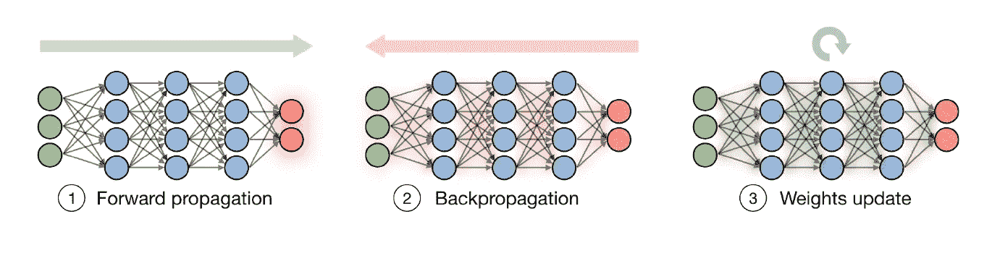

学习过程

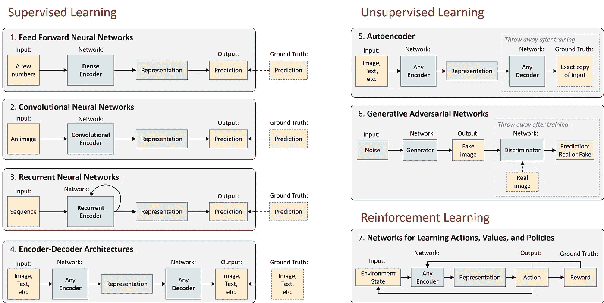

深度学习可以用于有监督的、无监督的或 RL。来源:弗里德曼等人| [麻省理工深度学习](https://deeplearning.mit.edu/)

既然我们已经看到了神经网络的结构。让我们来看一些神经网络的例子。

# **卷积神经网络**

卷积神经网络背后的思想是通过图像的移动滤波器(卷积)的思想。然后我们应用下采样(池化),选择一个区域并应用该区域中值的平均值或最大值。最后一层(输出)是生成输出的全连接层。

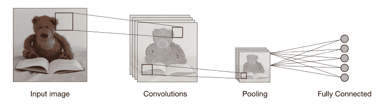

卷积神经网络(CNN)

CNN 主要用于**机器视觉**项目。但是，它仍然可以用于其他应用程序。

# 递归神经网络

> 递归网络是一种人工神经网络，旨在识别数据序列中的模式，如文本、基因组、手写、口语或来自传感器、股票市场和政府机构的数字时间序列数据。这些算法考虑了时间和顺序，它们有一个时间维度。

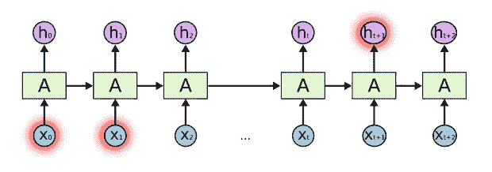

**长期依赖问题，每个节点代表一个 rnn 小区。**来源:Github

# **图层类型及功能:**

让我们考虑最重要和最常用的层:

*   **输入层**——按原样获取原始数据。
*   **卷积层**——这一层是卷积神经网络( **CNN)** 的核心构建模块，完成大部分计算。这一层计算输入中神经元和各种小块之间的卷积。
*   **池化层**—池化有助于我们在网络中前进时仅保留重要部分。池层在输入的每个深度切片上独立操作，并在空间上调整其大小。它使用最大值函数。
*   **全连接层(密集)**—该层计算最后一层的输出分数。结果输出的大小为 **𝟏×𝟏×𝑳** ，其中 l 是训练数据集类的数量。
*   **LSTM****长短期记忆网络——通常简称为“lstm”——是一种特殊的 RNN，能够学习长期依赖关系。**

**如前所述，隐藏层之间有一个激活函数，应用于前一层的输出。它增加了网络的非线性，因此它可以很好地推广到任何类型的函数。以下是最常见的几种:**

**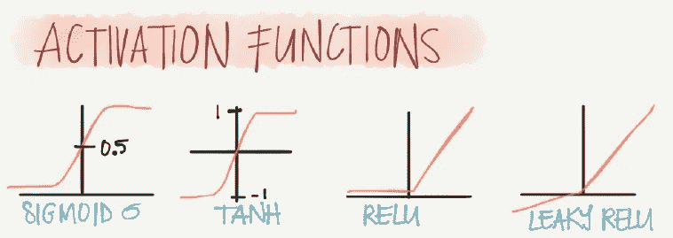**

**a.Sigmoid b.Tanh c .整流线性单元(ReLU) d .泄漏 ReLU**

# **指标和损失:**

**与**机器学习一样，**在深度学习中，我们使用损失函数来评估我们模型的错误，我们使用度量来评估性能。**

**以下是深度学习中使用的主要损失函数:**

****用于分类:****

*   **二元分类:二元交叉熵**
*   **多类分类:类别交叉熵和稀疏类别交叉熵**

****用于回归:****

*   **均方误差**
*   **平均绝对误差**

**以下是深度学习的主要指标:**

*   **准确(性)**
*   **平均绝对误差**

# **优化器:**

**它是使用反向传播来更新权重的函数。我们主要使用以下优化器。**

*   ****亚当:**自适应动量**
*   **均方根传播**
*   ****SGD** :随机梯度下降优化器**

# **正规化:**

**帮助网络归纳出它没有见过的数据。它用于解决过拟合问题:**

*   ****丢弃:**随机移除网络中的一些节点(以及输入和输出边)**
*   ****提前停止:**当验证集的性能下降时，停止训练(或者至少保存一个检查点)**
*   ****可用惩罚:
    L1 惩罚:**惩罚绝对重量。
    **L2 罚:**罚平方重量**

# ****足够的定义…开始编码****

**我们将实现**卷积神经网络(CNN)** 模型 [**Keras**](https://keras.io/) 。**

> ***你可以从* [*这里*](https://www.kaggle.com/mohammadhatoum/deep-learning-cnn) 下载完整的 Kaggle 笔记本**

**1.**数据定义**:我们将使用[**MNIST**](http://yann.lecun.com/exdb/mnist/)**数据集。我们将定义一些参数如下:****

```
**from __future__ import print_function
import keras
from keras.datasets import mnist
from keras.models import Sequential
from keras.layers import Dense, Dropout, Flatten
from keras.layers import Conv2D, MaxPooling2D
from keras import backend as K# Set few parameters to be used
batch_size = 128
num_classes = 10
epochs = 12
# input image dimensions
img_rows, img_cols = 28, 28#Load MNIST dataset the split it between train and test sets
(x_train, y_train), (x_test, y_test) = mnist.load_data()if K.image_data_format() == 'channels_first':
    x_train = x_train.reshape(x_train.shape[0], 1, img_rows, img_cols)
    x_test = x_test.reshape(x_test.shape[0], 1, img_rows, img_cols)
    input_shape = (1, img_rows, img_cols)
else:
    x_train = x_train.reshape(x_train.shape[0], img_rows, img_cols, 1)
    x_test = x_test.reshape(x_test.shape[0], img_rows, img_cols, 1)
    input_shape = (img_rows, img_cols, 1)**
```

****2.执行预处理:****

****a.规范培训和测试输入****

```
**x_train = x_train.astype('float32')
x_test = x_test.astype('float32')
x_train /= 255
x_test /= 255
print('x_train shape:', x_train.shape)
print(x_train.shape[0], 'train samples')
print(x_test.shape[0], 'test samples')**
```

> ****结果:****
> 
> ****x _ 训练形状:(60000，28，28，1)
> 60000 个训练样本
> 10000 个测试样本****

****b.将类别向量转换为二进制类别矩阵****

```
**y_train = keras.utils.to_categorical(y_train, num_classes)
y_test = keras.utils.to_categorical(y_test, num_classes)**
```

****3.建立模型****

```
**model = Sequential()
model.add(Conv2D(32, kernel_size=(3, 3),
                 activation='relu',
                 input_shape=input_shape))
model.add(Conv2D(64, (3, 3), activation='relu'))
model.add(MaxPooling2D(pool_size=(2, 2)))
model.add(Dropout(0.25))
model.add(Flatten())
model.add(Dense(128, activation='relu'))
model.add(Dropout(0.5))
model.add(Dense(num_classes, activation='softmax'))**
```

****4.绘制模型****

```
**from keras.utils import plot_model
plot_model(model)**
```

****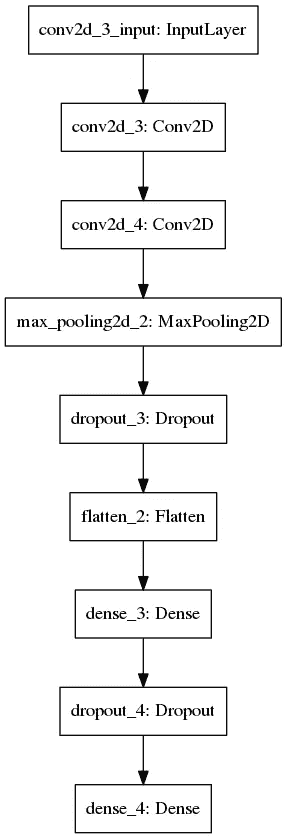****

****CNN 模型****

****5.为培训配置模型****

```
**model.compile(loss=keras.losses.categorical_crossentropy,
              optimizer=keras.optimizers.Adam(),
              metrics=['accuracy'])**
```

****6.为模型定型固定数量的历元(数据集上的迭代)****

```
**history = model.fit(x_train, y_train,
          batch_size=batch_size,
          epochs=epochs,
          verbose=1,
          validation_data=(x_test, y_test))**
```

****7.通过在测试模式下获取损失值和度量值来评估模型****

```
**score = model.evaluate(x_test, y_test, verbose=0)
print('Test loss:', score[0])
print('Test accuracy:', score[1])**
```

> ****结果:****
> 
> ****测试损耗:0.029843983797999968
> 测试精度:0.99000001****

****令人印象深刻的是，我们得到了 99.19%的准确率****

****8.绘制一个图像和我们的模型提供的标签****

```
**import matplotlib.pyplot as plt
image_index = 8855
plt.imshow(x_test[image_index].reshape(28, 28),cmap='Greys')
pred = model.predict(x_test[image_index].reshape(1, img_rows, img_cols, 1))
print(f"Label predicated by model: {pred.argmax()}")**
```

> ****结果:****
> 
> ****由模型预测的标签:5****

****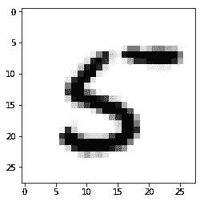****

****预测结果****

****9.为训练和测试绘制准确度和损失值****

```
**# Plot training & validation accuracy values
plt.plot(history.history['accuracy'])
plt.plot(history.history['val_accuracy'])
plt.title('Model accuracy')
plt.ylabel('Accuracy')
plt.xlabel('Epoch')
plt.legend(['Train', 'Test'], loc='upper left')
plt.show()# Plot training & validation loss values
plt.plot(history.history['loss'])
plt.plot(history.history['val_loss'])
plt.title('Model loss')
plt.ylabel('Loss')
plt.xlabel('Epoch')
plt.legend(['Train', 'Test'], loc='upper left')
plt.show()**
```

****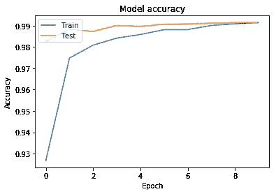****

****模型精度****

****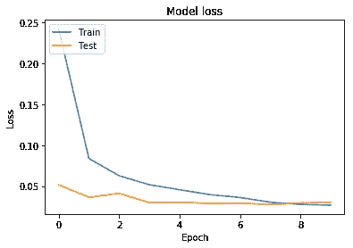****

****模型损失****

# ****概述****

****我们已经到了机器学习和深度学习指南系列的第四部分也是最后一部分的末尾。在这一部分，我们讨论了深度学习:**定义**，**层**，**度量**和**损失**，**优化器**和**正则化**。然后我们有了一个完整的**卷积神经网络(CNN)** 的例子。****

# ******下一步该怎么做，******

****我们整个指南的主要目标是帮助程序员和软件工程师开始使用 **ML/DL。**这只是一个切入点，如果你想深入这个领域，我建议你查看一下每个教程中提到的参考资料——尤其是 [Scikit-Learn](https://scikit-learn.org/) 和 [Keras](https://keras.io/) 。而最重要的是要靠自己**练习。******

****感谢阅读！****

# ****参考链接:****

1.  ****[https://www . tutorialspoint . com/python _ deep _ learning/python _ deep _ basic _ machine _ learning . htm](https://www.tutorialspoint.com/python_deep_learning/python_deep_basic_machine_learning.htm)****
2.  ****[https://stanford.edu/~shervine/](https://stanford.edu/~shervine/)****
3.  ****[https://python programming . net/introduction-deep-learning-python-tensor flow-keras/](https://pythonprogramming.net/introduction-deep-learning-python-tensorflow-keras/)****
4.  ****[https://www . tutorialspoint . com/python _ deep _ learning/python _ deep _ learning _ artificial _ neural _ networks . htm](https://www.tutorialspoint.com/python_deep_learning/python_deep_learning_artificial_neural_networks.htm)****
5.  ****[https://www . slide share . net/TessFerrandez/notes-from-coursera-deep-learning-courses-by-Andrew-ng](https://www.slideshare.net/TessFerrandez/notes-from-coursera-deep-learning-courses-by-andrew-ng)****
6.  ****[https://skymind.ai/wiki/lstm](https://skymind.ai/wiki/lstm)****
7.  ****[http://colah.github.io/posts/2015-08-Understanding-LSTMs/](http://colah.github.io/posts/2015-08-Understanding-LSTMs/)****
8.  ****[https://deeplearning.mit.edu/](https://deeplearning.mit.edu/)****
9.  ****[https://github . com/keras-team/keras/blob/master/examples/Mn ist _ CNN . py](https://github.com/keras-team/keras/blob/master/examples/mnist_cnn.py)****