# 机器学习和深度学习指南

> 原文：<https://medium.com/analytics-vidhya/machine-learning-deep-learning-guide-db520c4797da?source=collection_archive---------7----------------------->

W 欢迎来到机器学习&深度学习指南的第 2 部分，在这里我们学习和实践机器学习和深度学习，而不会被概念和数学规则所淹没。

> [*第 1 部分:关键术语、定义和从监督学习(线性回归)开始。*](/analytics-vidhya/machine-learning-deep-learning-guide-part-1-4ba7ce8cf7eb)
> 
> 第二部分:监督学习:回归(SGD)和分类(SVM、朴素贝叶斯、KNN 和决策树)。
> 
> [*第三部分:无监督学习(KMeans，PCA)，欠拟合 vs 过拟合和交叉验证*](/analytics-vidhya/machine-learning-deep-learning-guide-11ad26e0854c) *。*
> 
> [*第四部分:深度学习:定义、层次、度量和损失、优化器和正则化*](/analytics-vidhya/machine-learning-deep-learning-guide-da303a71b8e0)

# **学习目标**

在这一部分中，我们将继续讨论剩余的监督学习算法的例子，以及用于分类的相应误差和度量。


机器学习的类型及其用法

# **监督学习**——**随机梯度下降(SGD)回归器:**

在第 1 部分中，我们举例说明了如何创建我们的第一个回归模型——线性回归模型。现在我们将检查 SGD 回归器。

> 你可以从[这里](https://www.kaggle.com/mohammadhatoum/stochastic-gradient-descent-regressor)下载完整的 Kaggle 笔记本

我们还将按照我们提到的步骤来解决机器学习问题:

1.  数据定义
2.  训练/测试分割
3.  预处理
4.  算法选择
5.  培养
6.  预言；预测；预告
7.  评估模型的性能
8.  微调

1.  **数据定义:**我们将使用“[拥挤度](https://www.kaggle.com/nsrose7224/crowdedness-at-the-campus-gym)在校园体育馆”数据集。给定一天中的某个时间(可能还有一些其他特征，包括天气)，预测体育馆会有多拥挤。我们将下载数据并将其保存在文件夹 data 中，并将其命名为 crowdedness.csv

```
import numpy as np # linear algebra
import pandas as pd # data processing
df = pd.read_csv("data/crowdedness.csv")
```

打印各列以了解数据概况

```
print(df.columns.values)
```

> 结果:
> ['人数' '日期' '时间戳' '星期几' '是周末'
> '是假日' '温度' '是学期开始' '是学期期间'
> '月' '小时]]

打印数据的信息以查看每一列的类型

```
print(df.info())
```

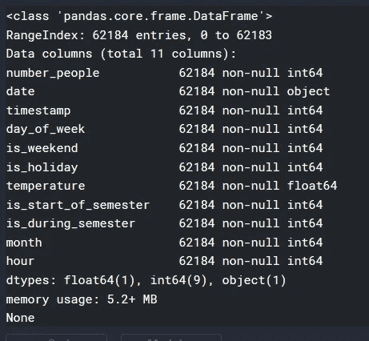

我们可以看到有一个浮动列是温度，更有趣的是有一个对象列是日期。

让我们打印前几行，看看我们能找到什么。

```
*print(df.head())*
```

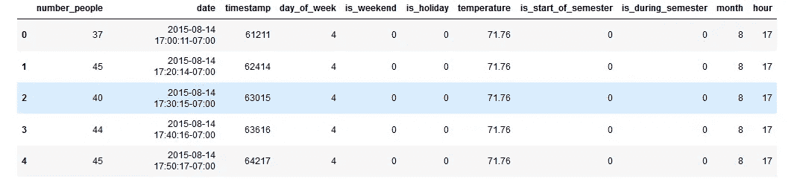

显示拥挤度数据集中的前五条记录

我们可以注意到，日期列是我们收集数据的日期和时间，时间戳也是如此。因此，为了确保我们将打印两列中的唯一值。

```
*print(df[‘date’].unique)*
```

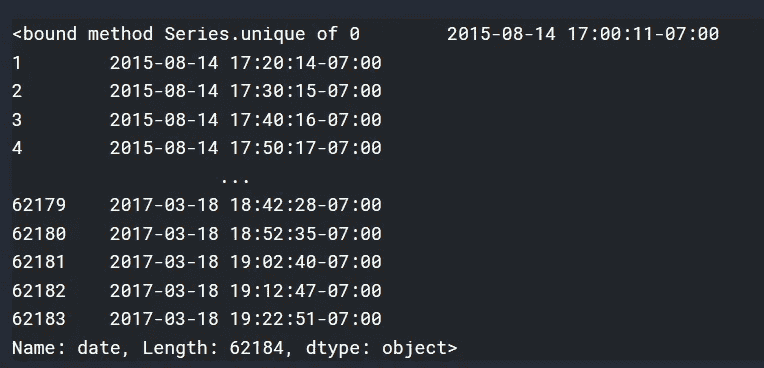

```
*print(df['timestamp'].unique)*
```

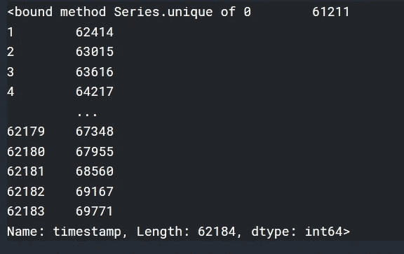

那么我们是对的，这意味着我们可以删除这两列

```
*df = df.drop(['date','timestamp'],axis=1)*
```

2.**训练/测试分割:**

```
# Extract the training and test data
data = df.values
X = data[:, 1:]  # all rows, no label
y = data[:, 0]  # all rows, label only# Extract the training and test data
data = df.values
X = data[:, 1:]  # all rows, no label
y = data[:, 0]  # all rows, label onlyfrom sklearn.model_selection import train_test_split
X_train_original, X_test_original, y_train, y_test = train_test_split(X, y, test_size=0.25, random_state=42)# View the shape (structure) of the data
print(f"Training features shape: {X_train_original.shape}")
print(f"Testing features shape: {X_test_original.shape}")
print(f"Training label shape: {y_train.shape}")
print(f"Testing label shape: {y_test.shape}")
```

> 结果:
> 训练特征形状:(46638，9)
> 测试特征形状:(15546，9)
> 训练标签形状:(46638，)
> 测试标签形状:(15546，)

**3。预处理:**我们将使用由 [Scikit-learn](https://scikit-learn.org/stable/modules/generated/sklearn.preprocessing.StandardScaler.html) 定义的 StandardScaler:通过**移除平均值**和**缩放到单位方差**来标准化特征。换句话说，分布将以 0 为中心，标准差为 1。我们使用这种方法使模型工作得更快，并将我们所有的特征缩放到同一个集合。

```
from sklearn.preprocessing import StandardScaler
# Scale the data to be between -1 and 1
scaler = StandardScaler()
scaler.fit(X_train_original)
X_train = scaler.transform(X_train_original)
X_test = scaler.transform(X_test_original)
```

为了更好地理解所发生的事情，考虑下面的代码来显示我们的训练集中前 60 条记录的温度。我将使用 [Matplotlib](https://matplotlib.org/)

```
# Import library
import matplotlib
import matplotlib.pyplot as plt
%matplotlib inline
matplotlib.style.use('ggplot')# Specify number of plot to be displayed and the figure size
fig, (ax1, ax2) = plt.subplots(ncols=2, figsize=(10, 10))# Set a title and plot the data
ax1.set_title('Before Scaling')
ax1.plot(X_train_original[:60,3])ax2.set_title('After Standard Scaler')
ax2.plot(X_train[:60,3])# Display the graph
plt.show()
```

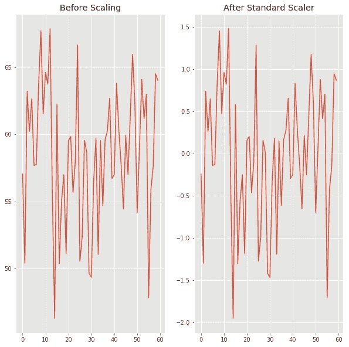

原始数据和缩放数据之间的比较

正如你所看到的，这两个图形具有相同的形状，但唯一的区别是 Y 轴上的值。在原始数据中，我们看到温度在 46.26 和 67.91 之间，而在缩放数据中，温度在-1.9505 和 1.47793 之间。

现在，让我们说这使得后台的计算更容易，导致模型运行更快。

# 重要注意事项:

我想请你注意下面的笔记:

1.  在将数据分成训练集和测试集之后，我们进行了预处理
2.  我们只在训练集而不是测试集上应用了 *fit* 。这意味着我们计算了训练集中数据的平均值和标准偏差，然后将其应用于训练集和测试集。

```
scaled_train =  (train - train_mean) / train_std_deviation
scaled_test = (test - train_mean) / train_std_deviation
```

这是机器学习中使用的标准程序，其背后的原因是我们希望将测试集视为新的和未知的数据。通过这种方式，我们将测试我们的模型在使用新的未知数据的实际应用中的表现。

**4。** **算法选择:**我们将 SGDRegressor 加上一些参数。

```
# Establish a model
from sklearn.linear_model import SGDRegressor
sgd_huber=SGDRegressor(alpha=0.01, learning_rate='optimal', loss='huber',penalty='elasticnet')
```

**5。培训:**

```
sgd_huber.fit(X_train, y_train)
```

**6。预测:**

```
y_pred_lr = sgd_huber.predict(X_test)  # Predict labels
```

**7。评估模型的性能:**

```
from sklearn.metrics import mean_squared_error, r2_score,mean_absolute_error# The mean squared error
print(f"Mean squared error: {round( mean_squared_error(y_test, y_pred_lr),3)}")# Explained variance score: 1 is perfect prediction
print(f"Variance score: {round(r2_score(y_test, y_pred_lr),3)}")# Mean Absolute Error
print(f"Mean squared error: { round(mean_absolute_error(y_test, y_pred_lr),3)}")
```

> 结果:
> 均方误差:348.267
> 方差得分:0.324
> 均方误差:14.617

**8。微调:**如你所见，方差较低。我们能做些什么来增加它吗？是的。记得在步骤 4 中，我们设置了一些参数(alpha、learning_rate、loss 和 penalty)让我们使用不同的值。

```
# Try different parameters
# Try different parameters
sgd_l2 = SGDRegressor(alpha=0.01,learning_rate='optimal', loss='squared_loss',
             penalty='l2')sgd_l2.fit(X_train, y_train)
print(f"Score on training set {round(sgd_l2.score(X_train, y_train),3)}")y_pred_lr = sgd_l2.predict(X_test)  # Predict labelsfrom sklearn.metrics import mean_squared_error, r2_score,mean_absolute_error# The mean squared error
print(f"Mean squared error: {round( mean_squared_error(y_test, y_pred_lr),3)}")# Explained variance score: 1 is perfect prediction
print(f"Variance score: {round(r2_score(y_test, y_pred_lr),3)}")# Mean Absolute Error
print(f"Mean squared error: { round(mean_absolute_error(y_test, y_pred_lr),3)}")
```

> 结果:
> 在训练集上的得分 0.506
> 均方差:249.126
> 方差得分:0.517
> 均方差:12.064

酷，误差减小，d，方差增大到 0.5 以上。但是这里最重要的问题是，我们如何知道要改变什么？答案是通过使用**超参数调整**。想法很简单，我们准备了几个 [*超参数*](https://scikit-learn.org/stable/modules/grid_search.html#grid-search) 的组合，并应用它们。然后我们看到最好的结果和参数。

```
# Establish a model
model = SGDRegressor(learning_rate='optimal',penalty='l2')
from sklearn.model_selection import GridSearchCV
# Grid search - this will take about 1 minute.
param_grid = {
    'alpha': 10.0 ** -np.arange(1, 7),
    'loss': ['squared_loss', 'huber', 'epsilon_insensitive'],
}
clf = GridSearchCV(model, param_grid)
clf.fit(X_train, y_train)
print(f"Best Score: {round(clf.best_score_,3)}" )
print(f"Best Estimator: {clf.best_estimator_}" )
print(f"Best Params: {clf.best_params_}" )
```

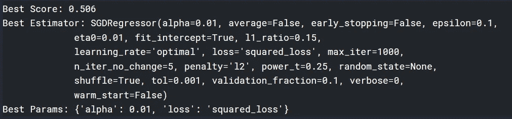

**那么接下来是什么**，到目前为止，我们看到了我们的 SGDRegressor 模型在数据集上的表现，它不是很好。怎样才能表现的更好？
一种方法是使用不同的参数范围，但我认为不会增加太多。
另一种方法是切换到不同的回归模型。RandomForestRegressor 是一个不错的选择。

请记住，我们的目标不是解决一个问题本身，而是拥有解决这些问题和挑战的知识、直觉、程序和工具。

# 监督学习—分类:

为了更好地了解这个主题，我们将考虑一个分类问题，然后使用和比较多种分类算法。

> 你可以从[这里](https://www.kaggle.com/mohammadhatoum/supervised-learning-classification)下载完整的 Kaggle 笔记本

1.  **数据定义:**我们将使用[泰坦尼克](https://www.kaggle.com/c/titanic/data)数据。在这个挑战中，我们被要求建立一个预测模型来回答这个问题:“什么样的人更有可能生存？”使用乘客数据(如姓名、年龄、性别、社会经济阶层等)

```
import warnings
warnings.filterwarnings("ignore")# Load the diabetes dataset
import pandas as pd
train_df = pd.read_csv("../input/titanic/train.csv")
test_df = pd.read_csv("../input/titanic/test.csv")
```

打印各列以了解数据概况

```
print(train_df.columns.values)
```

> 结果:
> ['PassengerId ' '幸存' ' Pclass ' '姓名' '性别' '年龄' ' SibSp' 'Parch'
> '车票' '票价' '舱位' '上船']

```
print(test_df.columns.values)
```

> 结果:
> ['PassengerId' 'Pclass ' '姓名' '性别' '年龄' ' SibSp' 'Parch ' '车票' '票价'
> '客舱' '上船']

让我们打印前几行，看看我们能找到什么。

```
train_df.head()
```

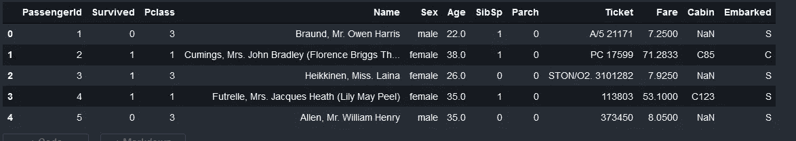

```
test_df.head()
```

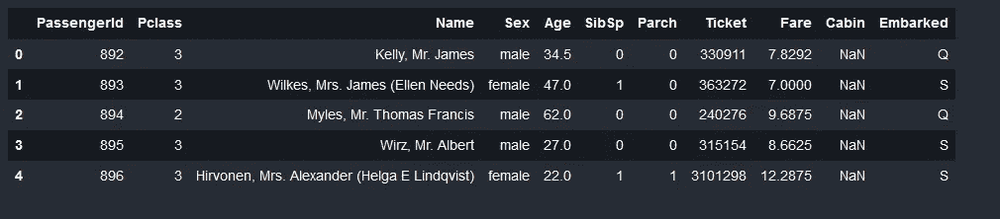

在给出结果的反馈之前，让我们打印数据的信息以查看每一列的类型，然后我们将为 type 对象的列调用 describe 函数。

```
train_df.info()
```

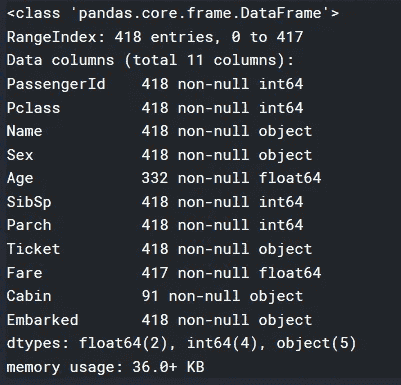

```
test_df.info()
```


让我们看看一些与 object 类型的字段相关的统计数据

```
train_df.describe(include=['O'])
```

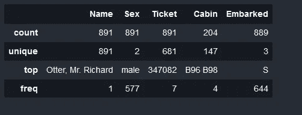

```
test_df.describe(include=['O'])
```

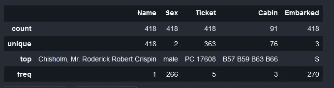

现在，我们将检查哪些要素具有空值

```
train_df.columns[train_df.isnull().any()]
```

> 结果:
> ['年龄'，'船舱'，'上船']

有趣的是，从上面，我们可以对数据有一些基本的了解。我们可以注意到:

1.  我们有 5 列类型对象:姓名、性别、机票、舱位和登机。
2.  PassengerId 是乘客的唯一 Id，因此应该删除它。
3.  这个名字似乎有独特的价值，它可能对生存有很低的影响，所以我们可能需要放弃它。我还注意到它包括一些头衔(先生、夫人、小姐……)，这些头衔可用于生成新的特征。但是现在，我们将忽略它。
4.  票是字母数字的。可能具有唯一的值，因此也可能被删除。
5.  我们有以下数据类型:
    *A .序数:幸存和 Pclass
    B .分类:性别和已登机
    C .离散:SibSp 和 Parch
    D .连续:票价和年龄
    E .字母数字:机票和舱位*

首先，让我们从特性名称中提取标题特性，这样我们就可以删除 Name。我会用 Kaggle 建议的[特征工程](https://triangleinequality.wordpress.com/2013/09/08/basic-feature-engineering-with-the-titanic-data/)方法。我也会删除 PassengerId。

```
import string
def substrings_in_string(big_string, substrings):
    for substring in substrings:
        if str.find(big_string, substring) != -1:
            return substring
    return np.nantitle_list=['Mrs', 'Mr', 'Master', 'Miss', 'Major', 'Rev',
                'Dr', 'Ms', 'Mlle','Col', 'Capt', 'Mme', 'Countess',
                'Don', 'Jonkheer']
train_df['Title']=train_df['Name'].map(lambda x: substrings_in_string(x, title_list))
test_df['Title']=test_df['Name'].map(lambda x: substrings_in_string(x, title_list))#replacing all titles with mr, mrs, miss, master
def replace_titles(x):
    title=x['Title']
    if title in ['Don', 'Major', 'Capt', 'Jonkheer', 'Rev', 'Col']:
        return 'Mr'
    elif title in ['Countess', 'Mme']:
        return 'Mrs'
    elif title in ['Mlle', 'Ms']:
        return 'Miss'
    elif title =='Dr':
        if x['Sex']=='Male':
            return 'Mr'
        else:
            return 'Mrs'
    else:
        return title

train_df['Title']=train_df.apply(replace_titles, axis=1)
test_df['Title']=test_df.apply(replace_titles, axis=1)#Drop the columns 'Name', 'PassengerId' and 'Ticket'
train_df = train_df.drop(['Name','PassengerId','Ticket'],axis=1)
test_df = test_df.drop(['Name','PassengerId','Ticket'],axis=1)
```

现在，从 Kaggle 提供的特征定义中，我们可以看到
“SibSp 是泰坦尼克号上兄弟姐妹/配偶的数量”和“SibSp 是泰坦尼克号上父母/子女的数量”
因此，让我们创建一个名为 Family_Size 的新特征，它将包含 SibSp 和 SibSp 的总和。

```
train_df['Family_Size']=train_df['SibSp']+train_df['Parch']
test_df['Family_Size']=test_df['SibSp']+test_df['Parch']
```

关于缺失的值，我有以下计划来填补:
1。年龄:我将使用年龄的数据平均值
2。小屋:我会用‘N’来填充它们。apollowed:只有两个缺少的值，所以我将使用 mode

此外，我将把年龄和票价从连续变量转换成分类变量。这可以使用熊猫库中的*[*剪切*](https://pandas.pydata.org/pandas-docs/stable/reference/api/pandas.cut.html) 功能来完成。*

```
*import numpy as np
from scipy.stats import modefor df in [train_df, test_df]:

    meanAge=np.mean(df.Age)
    df.Age=df.Age.fillna(meanAge)
    bins = (-1, 0,  50, 100)
    group_names = ['Unknown', 'Under_50', 'More_Than_50']
    categories = pd.cut(df.Age, bins, labels=group_names)
    df.Age = categories

    df.Cabin = df.Cabin.fillna('N')
    df.Cabin = df.Cabin.apply(lambda x: x[0])

    modeEmbarked = mode(df.Embarked)[0][0]
    df.Embarked = df.Embarked.fillna(modeEmbarked)

    df.Fare = df.Fare.fillna(-0.5)
    bins = (-1, 0, 8, 15, 31, 1000)
    group_names = ['Unknown', '1_quartile', '2_quartile', '3_quartile', '4_quartile']
    categories = pd.cut(df.Fare, bins, labels=group_names)
    df.Fare = categories*
```

*到目前为止，我们所做的是基本的特征工程。我们可以继续创建新的功能，或者检查功能之间的相关性和依赖性，但我们现在就离开它。*

*2.**训练/测试分割:***

```
*# Extract the training and test data
y = train_df['Survived']
X = train_df.drop('Survived',axis=1)from sklearn.model_selection import train_test_split
X_train,X_val,y_train,y_val = train_test_split(X,y,test_size= 0.2, random_state=0)# View the shape (structure) of the data
print(f"Training features shape: {X_train.shape}")
print(f"Testing features shape: {X_val.shape}")
print(f"Training label shape: {y_train.shape}")
print(f"Testing label shape: {y_val.shape}")*
```

> *结果:
> 训练特征形状:(712，10)
> 测试特征形状:(179，10)
> 训练标签形状:(712，)
> 测试标签形状:(179，)*

*3.**预处理:**现在是时候将 type 对象的字段转换成 numerics 了。这些是作为对象的字段。*

```
*train_df.describe(include=['O'])*
```

**

*特征:*性别，着手和头衔*很少有明显的价值。所以我们将使用[普通编码器。](https://scikit-learn.org/stable/modules/generated/sklearn.preprocessing.OrdinalEncoder.html) 这种方式得到的值将是整数如下:
1。性别:女性会被 0 代替，男性会被 1
2 代替。上船:C 会被 0 代替，Q 会被 1 代替，S 会被 2
3 代替。头衔:主人将被 0 取代，小姐将被 1 取代，先生将被 2 取代，夫人将被 3 取代*

*对于特征*年龄*和*票价*，我将使用[标签编码器](https://scikit-learn.org/stable/modules/generated/sklearn.preprocessing.LabelEncoder.html)*

```
*# Print top 10 records before transformation
X_train[0:10]*
```

*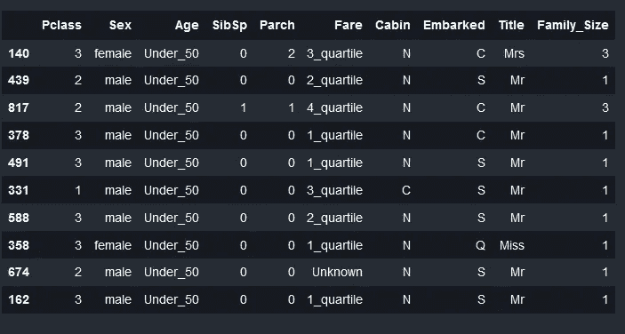*

```
*from sklearn.preprocessing import OrdinalEncoder
encoder_sex = OrdinalEncoder()
X_train['Sex'] = encoder_sex.fit_transform(X_train['Sex'].values.reshape(-1, 1))
X_val['Sex'] = encoder_sex.transform(X_val['Sex'].values.reshape(-1, 1))encoder_cabin = OrdinalEncoder()
X_train['Cabin'] = encoder_cabin.fit_transform(X_train['Cabin'].values.reshape(-1, 1))
X_val['Cabin'] = encoder_cabin.transform(X_val['Cabin'].values.reshape(-1, 1))encoder_embarked = OrdinalEncoder()
X_train['Embarked'] = encoder_embarked.fit_transform(X_train['Embarked'].values.reshape(-1, 1))
X_val['Embarked'] = encoder_embarked.transform(X_val['Embarked'].values.reshape(-1, 1))encoder_title = OrdinalEncoder()
X_train['Title'] = encoder_title.fit_transform(X_train['Title'].values.reshape(-1, 1))
X_val['Title'] = encoder_title.transform(X_val['Title'].values.reshape(-1, 1))from sklearn.preprocessing import LabelEncoder
features = ['Fare',  'Age']for feature in features:
        le = LabelEncoder()
        le = le.fit(X_train[feature])
        X_train[feature] = le.transform(X_train[feature])
        X_val[feature] = le.transform(X_val[feature])*
```

*现在我们将打印转换后的结果*

```
*# Print top 10 records after transformation
X_train[0:10]*
```

*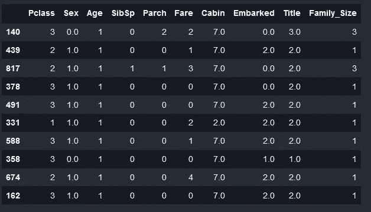*

*4.**算法选择:**我们将使用支持向量机([核 SVM](https://scikit-learn.org/stable/modules/generated/sklearn.svm.SVC.html) )、朴素贝叶斯([高斯贝叶斯](https://scikit-learn.org/stable/modules/generated/sklearn.naive_bayes.GaussianNB.html))、k 近邻([KNeighborsClassifier](https://scikit-learn.org/stable/modules/generated/sklearn.neighbors.KNeighborsClassifier.html))
和决策树([决策树分类器](https://scikit-learn.org/stable/modules/generated/sklearn.tree.DecisionTreeClassifier.html))然后比较结果。*

```
*from sklearn.svm import SVC
from sklearn.naive_bayes import GaussianNB
from sklearn.neighbors import KNeighborsClassifier
from sklearn.tree import DecisionTreeClassifiernames = ["Kernel SVM", "Naive Bayes", "K Nearest Neighbor",
         "Decision Tree"]classifiers = [
    SVC(kernel = 'rbf',gamma='scale'),
    GaussianNB(),
    KNeighborsClassifier(3),
    DecisionTreeClassifier(max_depth=5)]*
```

*5.**训练和预测:***

```
*# iterate over classifiers
for name, clf in zip(names, classifiers):
    clf.fit(X_train, y_train) 
    y_pred = clf.predict(X_val)
# Here we will add the error and evaluation metrics*
```

*6.**评估每个模型的性能:**这里我们将检查分类的错误和评估指标:*

*我们将使用 3 个函数:准确度 _ 得分*、*分类 _ 报告、*、混淆 _ 矩阵*。*这些定义来自 [Scikit-learn](https://scikit-learn.org/stable/modules/model_evaluation.html)**

1.  *[准确度分数](https://scikit-learn.org/stable/modules/model_evaluation.html#accuracy-score):计算准确度，正确预测的分数(默认)或计数(正常化=假)。*

*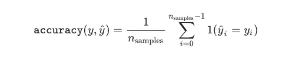*

*来源: [Scikit-learn](https://scikit-learn.org/stable/modules/model_evaluation.html#accuracy-score)*

```
*from sklearn.metrics import accuracy_scoredata = []
# iterate over classifiers
for name, clf in zip(names, classifiers):
    clf.fit(X_train, y_train)

    y_pred = clf.predict(X_val)
    print(f"Accuracy for {name} : {accuracy_score(y_val, y_pred)*100.0}")
    data.append(accuracy_score(y_val, y_pred)*100.0)models = pd.DataFrame({
    'Model': names,
    'Score': data})
models.sort_values(by='Score', ascending=False)*
```

*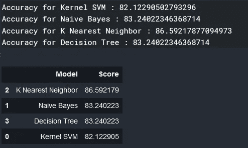*

*准确度结果*

*如您所见，K 近邻具有最高的准确性。*

*2.[分类报告](https://scikit-learn.org/stable/modules/generated/sklearn.metrics.classification_report.html#sklearn.metrics.classification_report):构建一个显示主要分类指标的文本报告([精度、召回率、f1 值和支持度](https://scikit-learn.org/stable/modules/generated/sklearn.metrics.precision_recall_fscore_support.html#sklearn.metrics.precision_recall_fscore_support))*

*a.精度(也称为[阳性预测值](https://en.wikipedia.org/wiki/Positive_predictive_value))是比率`tp / (tp + fp)`，其中`tp`是真阳性的数量，`fp`是假阳性的数量。精确度直观上是分类器不将阴性样品标记为阳性的能力。*

*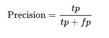*

*来源:[维基百科](https://en.wikipedia.org/wiki/Precision_and_recall)*

*b.召回(也称为[灵敏度](https://en.wikipedia.org/wiki/Sensitivity_and_specificity))是比率`tp / (tp + fn)`，其中`tp`是真阳性的数量`fn`是假阴性的数量。召回直观上是分类器找到所有肯定样本的能力。*

*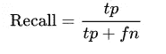*

*来源:[维基百科](https://en.wikipedia.org/wiki/Precision_and_recall)*

*c. [F1 得分](https://en.wikipedia.org/wiki/F1_score)是[精度和召回率](https://en.wikipedia.org/wiki/Precision_and_recall)的[调和平均值](https://en.wikipedia.org/wiki/Harmonic_mean)，其中 F1 得分在 1 时达到最佳值(完美的精度和召回率)，在 0 时最差。*

*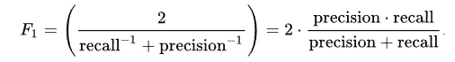*

*来源:[维基百科](https://en.wikipedia.org/wiki/F1_score)*

*d.支持度是`y_true`中每个类的出现次数*

```
*from sklearn.metrics import classification_report# iterate over classifiers
for name, clf in zip(names, classifiers):
    clf.fit(X_train, y_train)

    y_pred = clf.predict(X_val)

    print(f"Classification Report for {name}")
    print(classification_report(y_val, y_pred))
    print('_'*60)*
```

*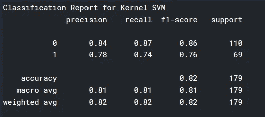*

*内核 SVM 的分类报告*

*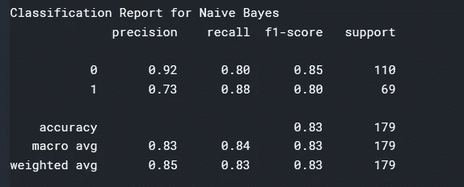*

*朴素贝叶斯分类报告*

*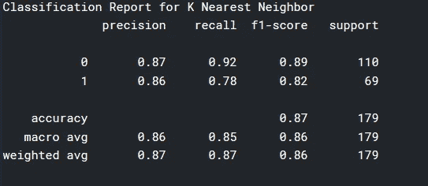*

*K 近邻的分类报告*

*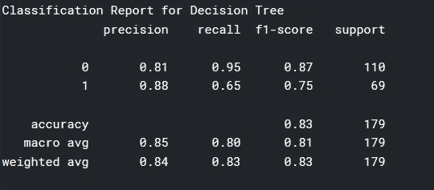*

*决策树的分类报告*

*3.[混淆矩阵](https://scikit-learn.org/stable/modules/generated/sklearn.metrics.confusion_matrix.html#sklearn.metrics.confusion_matrix)(也称为[误差矩阵](https://en.wikipedia.org/wiki/Confusion_matrix) )sc:是一种特定的表格布局，允许算法性能的可视化。它报告了*假阳性*、*假阴性*、*真阳性*和*真阴性的数量。**

*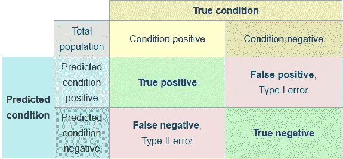*

*[混淆矩阵](https://en.wikipedia.org/wiki/Confusion_matrix)*

```
*# I will use the code from : [https://scikit-learn.org/stable/auto_examples/model_selection/plot_confusion_matrix.html](https://scikit-learn.org/stable/auto_examples/model_selection/plot_confusion_matrix.html)import matplotlib.pyplot as plt
from sklearn.utils.multiclass import unique_labels
from sklearn.metrics import confusion_matrixdef plot_confusion_matrix(y_true, y_pred, classes,
                          normalize=False,
                          title=None,
                          cmap=plt.cm.Blues):
    """
    This function prints and plots the confusion matrix.
    Normalization can be applied by setting `normalize=True`.
    """
    if not title:
        if normalize:
            title = 'Normalized confusion matrix'
        else:
            title = 'Confusion matrix, without normalization'# Compute confusion matrix
    cm = confusion_matrix(y_true, y_pred)
    # Only use the labels that appear in the data
    #classes = classes[unique_labels(y_true, y_pred)]
    if normalize:
        cm = cm.astype('float') / cm.sum(axis=1)[:, np.newaxis]
        print("Normalized confusion matrix")
    else:
        print('Confusion matrix, without normalization')print(cm)fig, ax = plt.subplots()
    im = ax.imshow(cm, interpolation='nearest', cmap=cmap)
    ax.figure.colorbar(im, ax=ax)
    # We want to show all ticks...
    ax.set(xticks=np.arange(cm.shape[1]),
           yticks=np.arange(cm.shape[0]),
           # ... and label them with the respective list entries
           xticklabels=classes, yticklabels=classes,
           title=title,
           ylabel='True label',
           xlabel='Predicted label')# Rotate the tick labels and set their alignment.
    plt.setp(ax.get_xticklabels(), rotation=45, ha="right",
             rotation_mode="anchor")# Loop over data dimensions and create text annotations.
    fmt = '.2f' if normalize else 'd'
    thresh = cm.max() / 2.
    for i in range(cm.shape[0]):
        for j in range(cm.shape[1]):
            ax.text(j, i, format(cm[i, j], fmt),
                    ha="center", va="center",
                    color="white" if cm[i, j] > thresh else "black")
    fig.tight_layout()
    return axclass_names = np.array([0,1])np.set_printoptions(precision=2)# iterate over classifiers
for name, clf in zip(names, classifiers):
    clf.fit(X_train, y_train)

    y_pred = clf.predict(X_val)

    print(f"Confusion Matrix for {name}")
    # Plot non-normalized confusion matrix
    plot_confusion_matrix(y_val, y_pred, classes=class_names,
                          title='Confusion matrix, without normalization')
    # Plot normalized confusion matrix
    plot_confusion_matrix(y_val, y_pred, classes=class_names, normalize=True,
                          title='Normalized confusion matrix')
    plt.show()
    print('_'*60)*
```

*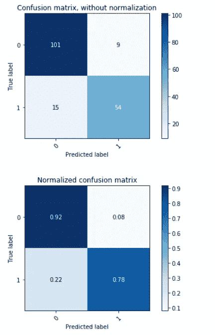*

*K 近邻的混淆矩阵*

***那么下一步是什么**，如果我们想提高性能，我们可以改变每个算法使用的参数(例如在 KNeighborsClassifier 中使用不同的 *n_neighbors)或者我们可以使用不同的算法，例如[随机森林](https://scikit-learn.org/stable/modules/generated/sklearn.neighbors.KNeighborsClassifier.html)或 [XGBoost](https://xgboost.readthedocs.io/en/latest/) 。**

# ***重述***

*我们已经到了本系列第 2 部分的结尾。在这一部分，我们能够了解到:*

1.  *第二个回归模型:**随机梯度下降(SGD)回归器***
2.  *我们数据集的预处理:StandardScaler，OrdinalEncoder 和 LabelEncoder。*
3.  ***数据分析**和**特征工程。***
4.  ***超参数调谐。***
5.  *用于监督学习的基本算法——分类:支持向量机、朴素贝叶斯、k-最近邻和决策树。*
6.  *用于分类的不同误差和矩阵:*****分类矩阵*****混淆矩阵。*******

*****在我们教程的第 3 部分，我们将讨论**非监督学习**以及如何将其与**监督学习一起使用。**我们还将学习如何进行交叉验证，以及过度拟合和欠拟合之间的区别。之后，我们会做一个关于强化学习的简报。然后就可以从**深度学习开始了。*******

*****感谢阅读！*****

# *****参考链接:*****

1.  *****[https://www . ka ggle . com/nsrose 7224/crowded ness-at-the-campus-gym](https://www.kaggle.com/nsrose7224/crowdedness-at-the-campus-gym)*****
2.  *****[https://sci kit-learn . org/stable/modules/grid _ search . html # grid-search](https://scikit-learn.org/stable/modules/grid_search.html#grid-search)*****
3.  *****[https://sci kit-learn . org/stable/modules/generated/sk learn . ensemble . randomforestregressor . html # sk learn . ensemble . randomforestregressor](https://scikit-learn.org/stable/modules/generated/sklearn.ensemble.RandomForestRegressor.html#sklearn.ensemble.RandomForestRegressor)*****
4.  *****【https://www.kaggle.com/c/titanic/data *****
5.  *****[https://triangle inequality . WordPress . com/2013/09/08/basic-feature-engineering-with-the-titanic-data/](https://triangleinequality.wordpress.com/2013/09/08/basic-feature-engineering-with-the-titanic-data/)*****
6.  *****[https://www . ka ggle . com/startup sci/titanic-data-science-solutions](https://www.kaggle.com/startupsci/titanic-data-science-solutions)*****
7.  *****[https://www . ka ggle . com/Jeff d23/sci kit-learn-ml-from-start-to-finish](https://www.kaggle.com/jeffd23/scikit-learn-ml-from-start-to-finish)*****
8.  *****[https://pandas . pydata . org/pandas-docs/stable/reference/API/pandas . cut . html](https://pandas.pydata.org/pandas-docs/stable/reference/api/pandas.cut.html)*****
9.  *****[https://sci kit-learn . org/stable/modules/generated/sk learn . preprocessing . ordinalencoder . html](https://scikit-learn.org/stable/modules/generated/sklearn.preprocessing.OrdinalEncoder.html)*****
10.  *****[https://sci kit-learn . org/stable/modules/generated/sk learn . preprocessing . label encoder . html](https://scikit-learn.org/stable/modules/generated/sklearn.preprocessing.LabelEncoder.html)*****
11.  *****[https://sci kit-learn . org/stable/modules/generated/sk learn . SVM . SVC . html](https://scikit-learn.org/stable/modules/generated/sklearn.svm.SVC.html)*****
12.  *****[https://sci kit-learn . org/stable/modules/generated/sk learn . naive _ Bayes。GaussianNB.html](https://scikit-learn.org/stable/modules/generated/sklearn.naive_bayes.GaussianNB.html)*****
13.  *****[https://sci kit-learn . org/stable/modules/generated/sk learn . neighbors . kneighborsclassifier . html](https://scikit-learn.org/stable/modules/generated/sklearn.neighbors.KNeighborsClassifier.html)*****
14.  *****[https://sci kit-learn . org/stable/modules/generated/sk learn . tree . decision tree classifier . html](https://scikit-learn.org/stable/modules/generated/sklearn.tree.DecisionTreeClassifier.html)*****
15.  *****[https://sci kit-learn . org/stable/modules/model _ evaluation . html](https://scikit-learn.org/stable/modules/model_evaluation.html)*****
16.  *****[https://sci kit-learn . org/stable/modules/model _ evaluation . html # accuracy-score](https://scikit-learn.org/stable/modules/model_evaluation.html#accuracy-score)*****
17.  *****[https://sci kit-learn . org/stable/modules/generated/sk learn . metrics . classification _ report . html # sk learn . metrics . classification _ report](https://scikit-learn.org/stable/modules/generated/sklearn.metrics.classification_report.html#sklearn.metrics.classification_report)*****
18.  *****[https://sci kit-learn . org/stable/modules/generated/sk learn . metrics . precision _ recall _ fs core _ support . html # sk learn . metrics . precision _ recall _ fs core _ support](https://scikit-learn.org/stable/modules/generated/sklearn.metrics.precision_recall_fscore_support.html#sklearn.metrics.precision_recall_fscore_support)*****
19.  *****[https://en . Wikipedia . org/wiki/Positive _ and _ negative _ predictive _ values](https://en.wikipedia.org/wiki/Positive_and_negative_predictive_values)*****
20.  *****[https://en.wikipedia.org/wiki/Precision_and_recall](https://en.wikipedia.org/wiki/Precision_and_recall)*****
21.  *****[https://en.wikipedia.org/wiki/Sensitivity_and_specificity](https://en.wikipedia.org/wiki/Sensitivity_and_specificity)*****
22.  *****[https://en.wikipedia.org/wiki/F1_score](https://en.wikipedia.org/wiki/F1_score)*****
23.  *****[https://en.wikipedia.org/wiki/Harmonic_mean](https://en.wikipedia.org/wiki/Harmonic_mean)*****
24.  *****[https://sci kit-learn . org/stable/modules/generated/sk learn . metrics .混淆 _matrix.html#sklearn.metrics .混淆 _matrix](https://scikit-learn.org/stable/modules/generated/sklearn.metrics.confusion_matrix.html#sklearn.metrics.confusion_matrix)*****
25.  *****[https://en.wikipedia.org/wiki/Confusion_matrix](https://en.wikipedia.org/wiki/Confusion_matrix)*****
26.  *****[https://sci kit-learn . org/stable/auto _ examples/model _ selection/plot _ confusion _ matrix . html](https://scikit-learn.org/stable/auto_examples/model_selection/plot_confusion_matrix.html)*****