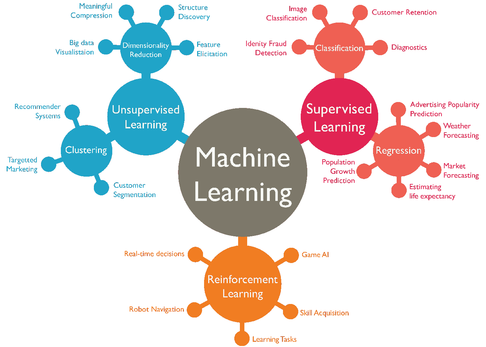

# 机器学习和深度学习指南

> 原文：<https://medium.com/analytics-vidhya/machine-learning-deep-learning-guide-part-1-4ba7ce8cf7eb?source=collection_archive---------4----------------------->

## 第 1 部分:关键术语、定义，以及从监督学习(线性回归)开始

> 第 1 部分:关键术语，定义，从监督学习开始(线性回归)。
> 
> [*第二部分:监督学习:回归(SGD)和分类(SVM、朴素贝叶斯、KNN 和决策树)。*](/analytics-vidhya/machine-learning-deep-learning-guide-db520c4797da)
> 
> [*第三部分:无监督学习(KMeans，PCA)，欠拟合 vs 过拟合，交叉验证*](/analytics-vidhya/machine-learning-deep-learning-guide-11ad26e0854c) *。*
> 
> [*第四部分:深度学习:定义、层次、度量和损失、优化器和正则化*](/analytics-vidhya/machine-learning-deep-learning-guide-da303a71b8e0)

A *几乎每个想要开始学习或从事机器学习和深度学习的人都会被淹没在:理论概念、大量数学规则或大量不必要的细节中。在本教程中，我们将能够理解几乎所有与机器学习和深度学习相关的概念。此外，我们将执行动手的例子，以建立一些与计算机视觉，语音识别和人工智能游戏代理相关的酷模型。之后，你将能够参加一些机器学习挑战，也许你可以获得高排名。*

# 介绍

在教程的这一部分，我们将首先澄清人工智能、机器学习和深度学习之间的混淆。然后，我们将继续了解不同类型的机器学习，并开始为每种类型创建示例。我们将在不深入定义和概念的情况下做到这一点。


来源:[英伟达](https://blogs.nvidia.com/blog/2016/07/29/whats-difference-artificial-intelligence-machine-learning-deep-learning-ai/)

# 什么是人工智能(AI)、机器学习(ML)、深度学习(DL)？

[人工智能](https://www.tutorialspoint.com/artificial_intelligence_with_python/index.htm) (AI)是机器展示的智能，与人类展示的智能形成对比。

[机器学习](https://www.tutorialspoint.com/artificial_intelligence_with_python/artificial_intelligence_with_python_machine_learning.htm) (ML)可以定义为计算机科学领域，更具体地说是人工智能的一种应用，它为计算机系统提供了利用数据学习和根据经验改进的能力，而无需显式编程。

[深度学习](/datadriveninvestor/difference-between-ml-ai-dl-23db64f7aa2)(机器学习的子集)的工作方式与我们的大脑类似，使用网状网络，技术上称为*深度神经网络*。
就像我们的大脑识别模式来分类事物，并从错误中学习一样——*深度学习也是如此*。它将未知数据与已知数据进行比较，从而对其进行相应的分类。

现在我们知道了区别，我们将开始讨论机器学习，之后我们将开始讨论深度学习。



机器学习的类型及其用法

# 机器学习算法

机器学习可以分为以下几类:

1.  *监督学习*
2.  *无监督学习*
3.  *强化学习*

**I)监督学习:**

数据被标记为，对于每个输入 x，我们有相应的输出 y

它主要分为两个概念:

1.  **回归**:预测连续数值。那栋房子会卖多少钱？
2.  **分类**:估计离散值，并分配一个标签。它是一只猫还是一只狗？

这里有一些在监督学习中使用的流行算法。

**A.** **回归:**

1.  线性回归:我们试图找到输入和输出之间的“线性”关系。假设我们在二维空间上工作，我们在 X 轴上绘制输入，在 Y 轴上绘制输出。那么线性回归将是最佳拟合数据点的直线。
2.  [**随机梯度下降**](https://scikit-learn.org/stable/modules/sgd.html#regression)**【SGD】回归器:**它实现了一个简单的随机梯度下降学习例程，支持不同的损失函数和惩罚来拟合线性回归模型。SGD 回归器非常适合处理大量训练样本的回归问题(> 10.000)。

**b .**分类:

1.  **支持向量机(SVM):** 主要用于分类问题。它使用一个多维超平面将数据分类。
2.  [](https://www.tutorialspoint.com/artificial_intelligence_with_python/artificial_intelligence_with_python_machine_learning.htm)****:**是一种分类算法。它假设一个类中某个特定特性的存在与任何其他特性的存在无关。**
3.  **[**k-最近邻**](/machine-learning-for-humans/supervised-learning-3-b1551b9c4930) **:** 它被广泛用于解决分类问题。其思想是通过寻找 *k* 个最近数据点标签的**平均值**来标记测试数据点 *x* (如果变量是连续的(或者**模式**如果它们是分类的)。**
4.  ****决策树:**多用于分类。顾名思义，我们在每个分支(决策节点)上画一棵树，我们根据独立变量分割数据。还有基于决策树构建的高级算法，比如基本上是决策树集合的随机森林。**

****

**[监督学习的算法](/deep-math-machine-learning-ai/different-types-of-machine-learning-and-their-types-34760b9128a2)**

****II)无监督学习:****

**到目前为止，我们考虑了数据被标记的情况。有时候，数据是没有标注的。这里我们将训练模型来预测相应的标签。**

**它主要分为两个概念:**

1.  ****聚类**:根据相似性将数据分组。**
2.  ****降维**:降维压缩数据，同时保持其结构和有用性。**

**这里有一些在无监督学习中使用的流行算法。**

****a .**聚类:**

**[**K-means**](https://scikit-learn.org/stable/modules/clustering.html#k-means) :通过尝试将样本分成 n 组等方差，最小化称为*惯性*或类内平方和的标准，对数据进行聚类。该算法要求指定聚类数。**

****B.** **降维:****

****主成分分析:**是一种技术，用于强调数据集中的变化和突出强模式。它需要两种技术:**

1.  ****特征消除:**顾名思义:我们通过消除特征来减少特征空间。**
2.  **[**特征提取**](https://towardsdatascience.com/a-one-stop-shop-for-principal-component-analysis-5582fb7e0a9c) **:** 说我们有十个自变量。在特征提取中，我们创建十个“新”独立变量，其中每个“新”独立变量是十个“旧”独立变量的组合。然而，我们以特定的方式创建这些新的自变量，并根据它们预测因变量的程度对这些新变量进行排序。**

****

**无监督学习:[聚类](http://Clustering)**

# **最后，一些编码**

**在进入强化学习之前，是时候做一些编码了。**

**请记住，我们的主要目标是解决机器学习和深度学习的问题和挑战。为此，我们将遵循以下步骤:**

1.  ****数据定义**:我们有一些数据。该数据由用变量 X 表示的输入或特征和*有时是*输出组成，后者是要从模型中提取的由变量 Y 表示的标签或预测。**
2.  ****训练/测试分割**:我们将数据分割成训练和测试(稍后我们将介绍开发测试，但让我们坚持基础)**
3.  ****预处理:**我们对每个数据集进行一些预处理、清除和校正。**
4.  ****算法选择:**我们将根据问题的类型以及算法的好处和用途，使用一种或多种算法。该型号有一些*参数*可以设置。**
5.  ****训练:**我们’*在训练集上训练’*我们的算法。也就是学习从特征(x)到标签(y)的映射。在这个阶段，模型的权重被更新。**
6.  ****预测**:我们用*“更新权重”*在测试集上测试我们的模型**
7.  ****评估模型的性能**:我们得到一个特定的度量标准(例如准确性)来评估我们的模型。**
8.  ****微调**:根据性能结果，我们开始*调整*并更新我们的参数，以提高精度并降低损耗。然后，我们重复步骤 4-6 进行一些迭代，或者直到精度和损失变得一致。**

**我们将使用 python 和一个[***sci kit-Learn***](https://scikit-learn.org/)，它是一个开源的 Python 库，使用统一的接口实现了一系列机器学习、预处理、交叉验证和可视化算法。**

# ****监督学习-线性回归:****

> **你可以从[这里](https://www.kaggle.com/mohammadhatoum/linearregression-example?scriptVersionId=23239900)下载完整的 Kaggle 笔记本**

1.  ****数据定义**:我们将使用 [***波士顿房屋数据***](https://archive.ics.uci.edu/ml/machine-learning-databases/housing/housing.data) 。我们希望根据一些 [***属性***](https://archive.ics.uci.edu/ml/machine-learning-databases/housing/housing.names)*来预测房价，如城镇人均犯罪率、25，000 平方米以上地段的住宅用地比例。英尺，每个住宅的平均房间数，等等。我下载了该文件，将其重命名为 boston.csv，并添加了以下行作为文件的标题:
    "CRIM "、" ZN "、" INDUS "、" CHAS "、" NOX "、" RM "、" AGE "、" DIS "、" RAD "、" TAX "、" PTRATIO "、" B "、" LSTAT "、" MEDV "***

```
*# Load the diabetes dataset
import pandas as pd
boston = pd.read_csv('data/boston.csv')y = boston['MEDV']
X = boston.drop('MEDV',axis=1)#View the top 5 rows
boston.head())*
```

******

***显示波士顿数据集中的前五条记录***

*****2。训练/测试分割:**由于数据集非常小，我们将把它分成 10%用于测试，90%用于训练***

```
*# Split train and test setfrom sklearn.model_selection import train_test_split
X_train,X_test,y_train,y_test = train_test_split(X,y,test_size= 0.1, random_state=0)# View the shape (structure) of the data
print(f"Training features shape: {X_train.shape}")
print(f"Testing features shape: {X_test.shape}")
print(f"Training label shape: {y_train.shape}")
print(f"Testing label  shape: {y_test.shape}")*
```

> ***结果:
> 训练特征形状:(455，13)
> 测试特征形状:(51，13)
> 训练标签形状:(455，)
> 测试标签形状:(51，)***

*****3。** **预处理:**我们不需要做任何数据预处理**。**但是在后面的例子里会用到**。*****

*****4。算法选择:**我们将使用线性回归***

```
*#Linear Regression
from sklearn.linear_model import LinearRegression
from sklearn.metrics import mean_squared_error, r2_score,mean_absolute_error
lr = LinearRegression(normalize=True)*
```

*****5。** **训练:**简单来说我们调用函数 fit，给它 X_train 和 y_train 作为参数。***

```
**lr.fit(X_train, y_train) # Fit the model to the data**
```

*****6。预测:**我们简单地称之为预测***

```
**y_pred_lr = lr.predict(X_test)  # Predict labels**
```

*****7。** **评估模型的性能:*****

```
*# The mean squared error
print(f"Mean squared error: { mean_squared_error(y_test, y_pred_lr)}")# Explained variance score: 1 is perfect prediction
print(f"Variance score: {r2_score(y_test, y_pred_lr)}")# Mean Absolute Error
print(f"Mean squared error: { mean_absolute_error(y_test, y_pred_lr)}")*
```

> ***结果:
> 均方误差:41.72457625585755
> 方差得分:0.5149666667***

*****8。微调:**在这个阶段我们不会做任何微调。让事情变得简单顺利。***

# ***错误和指标:***

***从上面的第 7 步可以看出，我们使用了 3 个函数: *mean_squared_error、r2_score、*和 *mean_absolute_error。*但是各自是什么意思呢？我们将再次使用 [Scikit-learn](https://scikit-learn.org/stable/modules/model_evaluation.html) 中的定义***

1.  *****均方误差:**是与平方(二次)误差或损失的期望值相对应的风险度量。***

******

***来源:https://scikit-learn.org***

*****2。r 得分，决定系数:**表示模型中已被自变量解释的方差(占 y 的)比例。它提供了一个拟合优度的指标，从而通过解释方差的比例来衡量模型预测未知样本的可能性。***

******

***来源:https://scikit-learn.org***

*****3。平均绝对误差:**是与绝对误差损失或 L1-范数损失的期望值相对应的风险度量。***

******

***来源:[https://scikit-learn.org](https://scikit-learn.org)***

# ***概述***

***我们已经到了本系列第 1 部分的末尾。在这一部分，我们能够了解到:***

1.  *****人工智能** ( **AI** )、**机器学习** ( **ML** )和**深度学习** ( **DL** )的区别。***
2.  ***最流行的机器学习类型:**有监督的**、**无监督的**和**强化的**。***
3.  ***监督学习的不同概念:**回归**和**分类。**以及一些流行的回归算法的定义:**线性回归**和**随机梯度下降** **(SGD)回归器。**用于分类:**支持向量机、** **朴素贝叶斯、****【k-最近邻】、**和**决策树。*****
4.  ***无监督学习的不同概念:**聚类**和**降维。**以及一些流行的聚类算法( **K 均值)**和降维算法 **(** **主成分分析)**的定义***
5.  ***解决机器学习和深度学习问题与挑战的步骤:
    *1。数据定义
    2。训练/测试分割
    3。预处理
    4。算法选择
    5。训练
    6。预测
    7。评估模型的性能
    8。微调****
6.  *****回归中常用的**误差和度量**:均方差**、 **R 得分**(决定系数)、平均绝对误差**。*****

***最后，我们有一个如何使用[***Scikit-Learn***](https://scikit-learn.org/)*的实际操作示例，并且我们执行了一个完整的**线性回归示例。******

****在第 2 部分中，我们将继续讨论剩余的监督学习算法的例子，以及用于分类的相应误差和度量。我们还将对我们的数据进行一些预处理，我们将学习一些新概念，如交叉验证、过拟合和欠拟合。****

****感谢阅读！****

# ****参考链接:****

1.  ****[https://www . tutorialspoint . com/artificial _ intelligence _ with _ python/index . htm](https://www.tutorialspoint.com/artificial_intelligence_with_python/index.htm)****
2.  ****[https://www . tutorialspoint . com/artificial _ intelligence _ with _ python/artificial _ intelligence _ with _ python _ machine _ learning . htm](https://www.tutorialspoint.com/artificial_intelligence_with_python/artificial_intelligence_with_python_machine_learning.htm)****
3.  ****[https://medium . com/datadriveninvestor/difference-between-ml-ai-dl-23 db 64 f 7 aa 2](/datadriveninvestor/difference-between-ml-ai-dl-23db64f7aa2)****
4.  ****[https://scikit-learn.org/stable/modules/sgd.html#regression](https://scikit-learn.org/stable/modules/sgd.html#regression)****
5.  ****[https://medium . com/machine-learning-for-humans/supervised-learning-3-b 1551 b9c 4930](/machine-learning-for-humans/supervised-learning-3-b1551b9c4930)****
6.  ****[https://sci kit-learn . org/stable/modules/clustering . html # k-means](https://scikit-learn.org/stable/modules/clustering.html#k-means)****
7.  ****[https://towards data science . com/a-一站式主成分分析-5582fb7e0a9c](https://towardsdatascience.com/a-one-stop-shop-for-principal-component-analysis-5582fb7e0a9c)****
8.  ****[https://archive . ics . UCI . edu/ml/machine-learning-databases/housing/housing . data](https://archive.ics.uci.edu/ml/machine-learning-databases/housing/housing.data)****
9.  ****[https://archive . ics . UCI . edu/ml/machine-learning-database/housing/housing . names](https://archive.ics.uci.edu/ml/machine-learning-databases/housing/housing.names)****