# 机器学习开发生命周期

> 原文：<https://medium.com/analytics-vidhya/machine-learning-development-life-cycle-dfe88c44222e?source=collection_archive---------4----------------------->

在本文中，我将尝试涵盖机器学习项目的生命周期。机器学习模型开发工作流程将在各个阶段进行介绍。在本文中，我们将对著名的泰坦尼克号数据集进行分类任务，以预测泰坦尼克号乘客的存活率。该数据集包含一些在“皇家邮轮泰坦尼克号沉没”的致命事故中的乘客的信息。

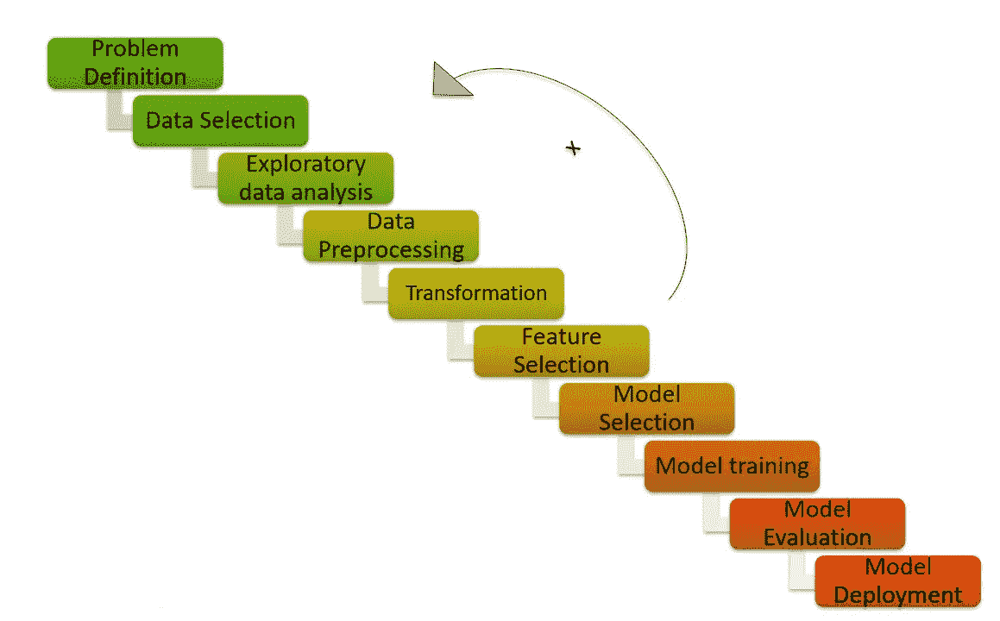

点火，TCS

上图几乎涵盖了以连续方式系统和正确开发 ML 模型所需的所有阶段。让我们详细讨论所有阶段(除了部署阶段)。

# 问题定义

如前所述，问题的定义是预测泰坦尼克号乘客的存活率。这将基本上是一个对两类人的分类任务:*幸存*或*未幸存。*

# 数据选择

数据集是著名的泰坦尼克号数据集，报名参赛后可以从 [Kaggle](https://www.kaggle.com/c/titanic) 下载。

# 探索性数据分析

该过程是提供初始数据分析和数据调查的关键过程之一，并使用汇总统计和图形表示提供重要的见解和数据特征。

训练数据集包含 891 行和 12 列，其中 1 列是因变量，其他 11 列是自变量。数据集中的一个示例如下:

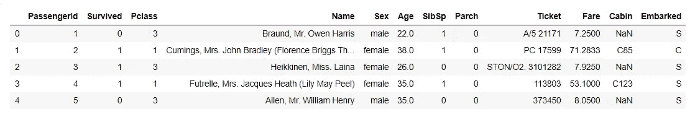

每列的简短描述如下:

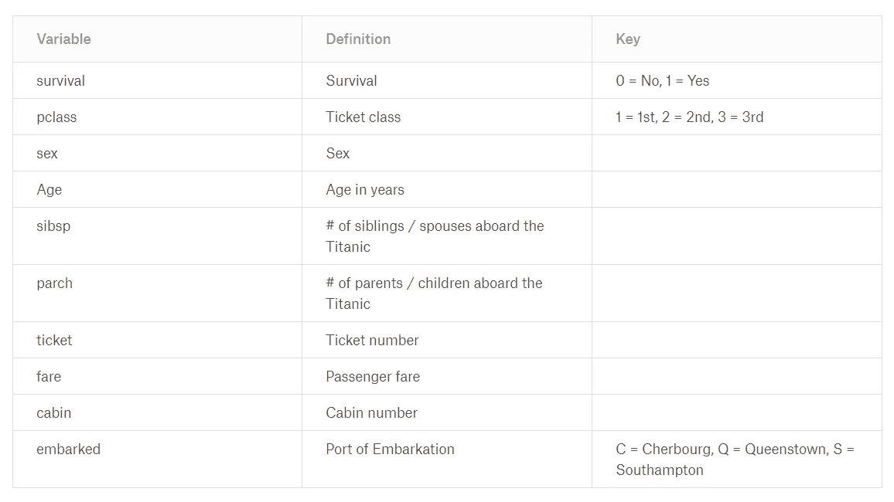

[卡格尔](https://www.kaggle.com/c/titanic/data)

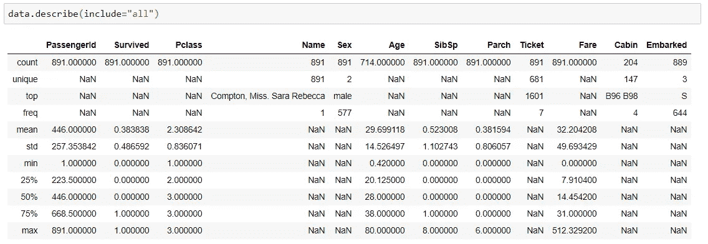

*   数据有整数、浮点和对象值
*   由于计数不等于行数，数据在年龄、客舱和登机列中具有空值
*   对于对象类型列，数值运算以 NaN 形式返回

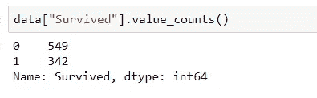

*   它显示目标变量中的唯一值计数，即幸存值
*   它显示在给定数据集中的 891 个数据中，342 个幸存，549 个没有

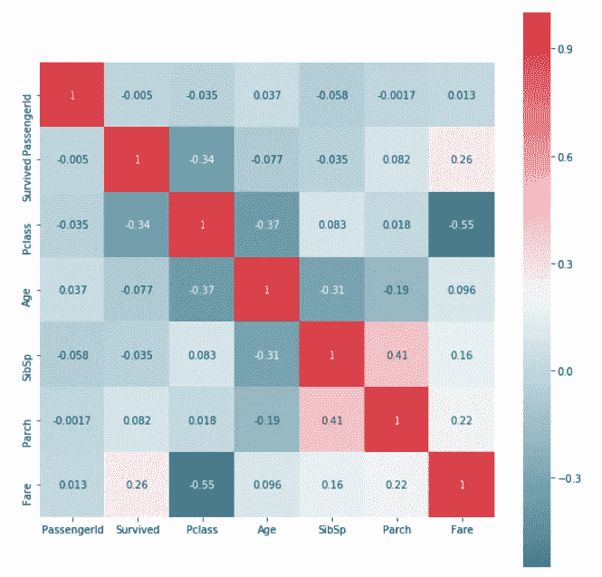

这是数据的数字列的相关矩阵。

*   可以推断，Parch 与 SibSp 具有良好的相关性
*   幸存与票价有很好的相关性

# 数据预处理

可以看出，数据转换经常与数据预处理结合在一起。但是，这里我们将分别执行这两个过程。

我们要做的第一件事是找出哪些列缺少值

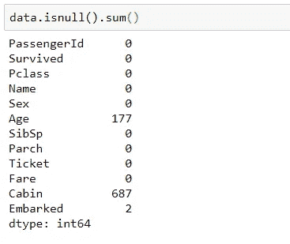

因此，年龄、客舱和已登船的值为空，其中客舱中几乎 80%的数据为空(让我们看看我们可以从中找到一些见解或删除它)

现在，让我们用称为插补的适当值来填补缺失值。

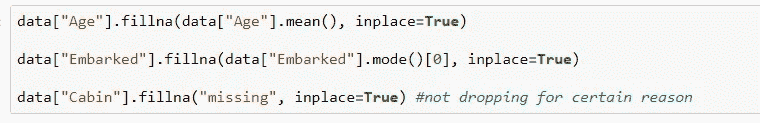

这里涉及第二个过程是处理连续和嘈杂数据，即年龄和票价。这里我们将使用宁滨方法将连续变量转换为分类变量。

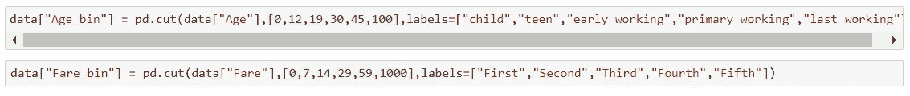

在分析了年龄和费用之后，bin 被分别创建为 Age_bin 和 Fare_bin。创建 5 个 bin，每个 bin 至少包含总数据的 5%(有关详细信息，请访问 [github](https://github.com/vishal1905/ML_Development_Life_Cycle/) repo)。

# 数据转换

在这个过程中，我们将发现是否可以从现有的列中提取一些有用的见解，并将这些列转换为对模型有用的特定方式

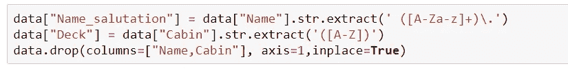

数据中姓名一栏都是唯一的，但是可以看到所有姓名前面都有英文敬语(先生、夫人、主人等。)也称为称呼语，可以作为一个范畴变量。同样从船舱中，我们可以提取出船上可用的甲板值。然后我们取主要出现的称呼值，如先生、夫人、主人、小姐，其余的(女士、医生、船长)为其他。类似地，在 deck 中，缺失的 deck 值被赋予任意值作为 z。

# 特征选择

在特征选择中，这里我们将使用属性相关性分析(ARA)。

> 属性相关性分析阶段的任务是识别对客户流失影响最大的属性(特征)。通过属性相关性分析，显示出与流失(流失=“是”或“否”)相关的最大分离能力的属性将被选为建立预测流失模型的最佳候选。

属性相关性分析用于流失模型开发，但也可用于分类任务，以找出哪些特征最适合分类模型。在 ARA 中，我们将使用 ***【证据权重】【WOE】******【信息值】(IV)*** 。

**证据权重**

根据[www.listendata.com](http://www.listendata.com)，WOE 定义为:

> 证据的权重表明了自变量相对于因变量的预测能力。由于它是从信用评分世界演变而来的，它通常被描述为区分好客户和坏客户的一种方法。**“不良客户”**指拖欠贷款的客户。**“好客户”**指还贷的客户。

并且 IV 被定义为:

> 信息值是在预测模型中选择重要变量的最有用的技术之一。这有助于根据变量的重要性对其进行排序。

计算 WOE 和 IV 的公式为:

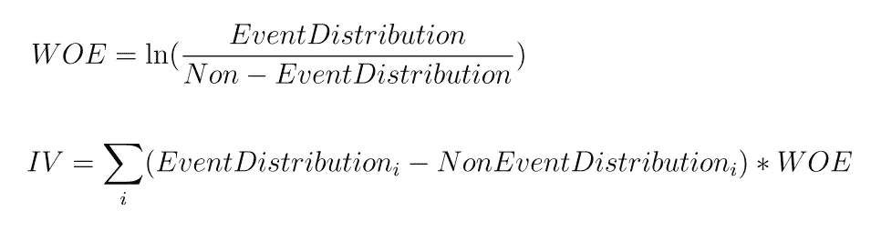

计算 WOE 和 IV 有一些先决条件。它们是:

*   数据中不应有任何缺失值
*   不应该有任何连续的列。如果存在连续特征，则应使用宁滨将其转换为分类变量
*   每个创建的 bin 至少应包含总数据的 5%

为了计算 WOE 和 IV，让我们自己来做，而不是使用一些软件包。

让我们计算转化过程后所有特征的 WOE 和 IV。IV 值为:

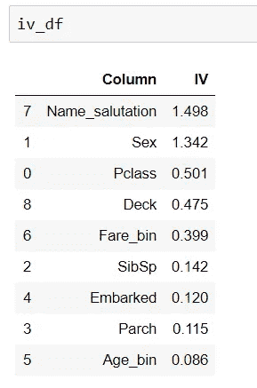

你可能想知道，IV 被选中做模特的资格标准是什么。与 IV 相关的规则是:

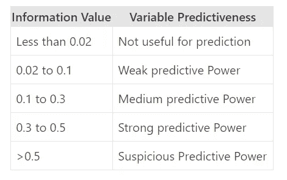

第四规则

根据给定的 IV 规则，我们选择了 IV 大于 0.1 的列。

在选择特征之后，我们可以将特征转换成分类变量，这将有利于模型训练。

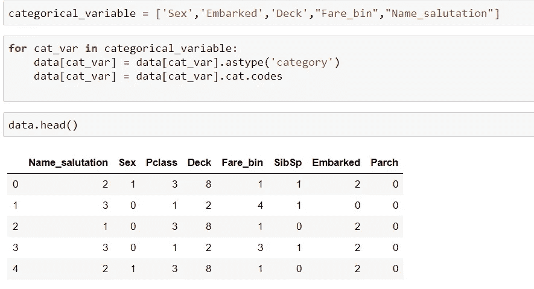

# 模型选择、模型训练和模型评估

这里，对于模型选择，我们采用了各种集成分类器，如决策树、随机森林、bagging、xgboost 等。我们对每个模型进行了训练，并对每个模型的评估指标进行了比较。对于评估指标，我们采用了准确度、精确度和召回率。

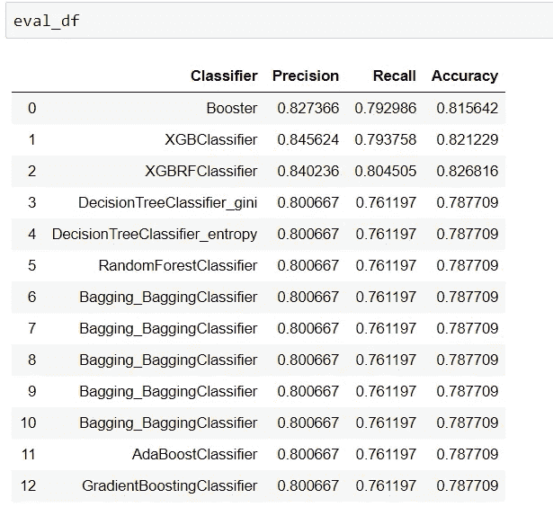

从上面的比较中，我们发现 XGBoostRandomForest 分类器在 titanic 数据集上的效果最好，准确率为 82.7%，精确度为 84.0%，召回率为 80.0%。

代码请访问 github repo。

 [## vishal 1905/ML _ 开发 _ 生命周期

### 此时您不能执行该操作。您已使用另一个标签页或窗口登录。您已在另一个选项卡中注销，或者…

github.com](https://github.com/vishal1905/ML_Development_Life_Cycle/) 

请浏览[https://Neptune . ai/blog/life-cycle-of-a-machine-learning-project](https://neptune.ai/blog/life-cycle-of-a-machine-learning-project)了解更多关于 ML 生命周期的见解。

**其他文章**

*   [超分辨率氮化镓(SRGAN)](/analytics-vidhya/super-resolution-gan-srgan-5e10438aec0c)
*   [深度卷积 GAN(DCGAN)](/analytics-vidhya/dcgan-447a629170ec)