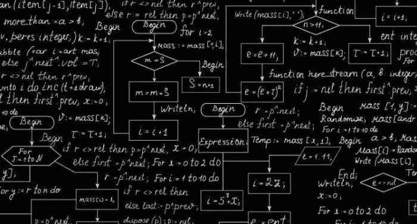
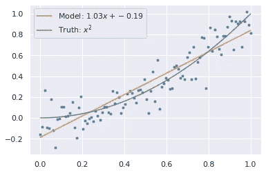
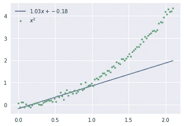
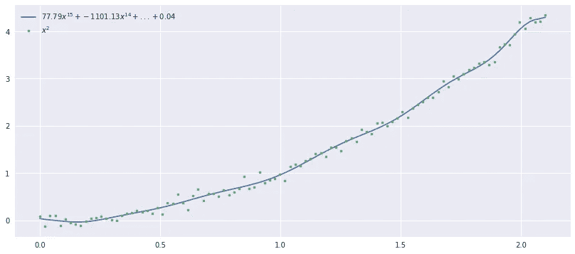
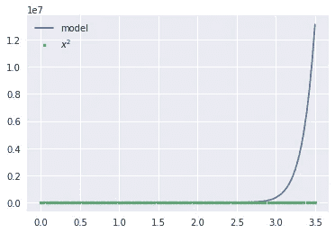

# 机器学习困难

> 原文：<https://medium.com/analytics-vidhya/machine-learning-difficulties-1bf93dde0ea5?source=collection_archive---------20----------------------->



机器学习模型的一个主要问题是，它们不够灵活，无法处理泛化。让我们用两个例子来想象这个问题，在第一个例子中，我们使用的数据范围是 1。

**数据范围 1 的模型性能:**

```
X = np.linspace(0, 1, 100)
exp = np.random.choice([2, 3])
y = X**exp + np.random.randn(X.shape[0])/10
p = np.polyfit(X, y, 1)
z = np.poly1d(p)
plt.plot(X, y, '.')
plt.plot(X, z(X), label=r"Model: ${:.2f}x + {:.2f}$".format(*p))
plt.plot(X, X**exp, label=r'Truth: $x^{}$'.format(exp))
plt.legend();
```



这个模型在这个范围内工作得相当好。

让我们尝试更大范围的数据，即 1.9

**数据范围 1.9 的模型性能:**

让我们为更宽的数据范围绘制这个函数。

```
X = np.linspace(0, 1.9, 100)
y = X**exp + np.random.randn(X.shape[0])/10
plt.plot(X, z(X), label=r"${:.2f}x + {:.2f}$".format(*p))
plt.plot(X, y,'.', label=r'$x^{}$'.format(exp))
plt.legend();
```



我们可以看到，该模型在数据范围 1 内表现得非常好，但在第二个示例中，我们可以看到，它不能很好地概括范围 1 之外的特征。为了解决这个问题，我们应该确保我们将要进行预测的数据应该包含良好的抽样分布。机器学习中的问题是在看不见的数据上寻找模式。

我们可以通过添加更多的参数来解决这个问题。让我们试试吧

```
np.polyfit(X, y, 14)
z = np.poly1d(p)
plt.figure(figsize=[14, 6])
plt.plot(X, z(X), label=r"${:.2f}x^{{15}} + {:.2f}x^{{14}} + ... + {:.2f}$".format(*p[[0, 1, -1]]))
plt.plot(X, y,'.', label=r'$x^{}$'.format(exp))
plt.legend();
```



现在看起来很酷。但是当你看到直线拟合时，它正试图拟合数据中的微小波动。让我们再次尝试再次概括它

```
X = np.linspace(0, 3.5, 100)
y = X**exp + np.random.randn(X.shape[0])/10
plt.plot(X, z(X), label=r"model")
plt.plot(X, y,'.', label=r'$x^{}$'.format(exp))
plt.legend();
```



嗯，如果天气看起来还不错的话？不，它的表现又很糟糕。这就是过拟合的情况。在这种情况下，我们做得太灵活了，以至于无法适应数据中的噪声。这是不可概括的。

在接下来的文章中，我将与你分享如何处理这种过度拟合。