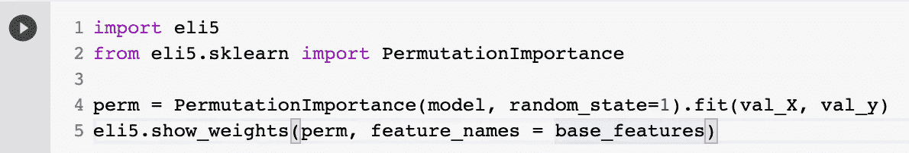
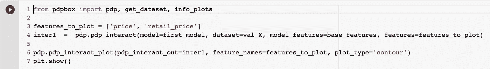

# 机器学习的可解释性:电子商务销售(案例研究)

> 原文：<https://medium.com/analytics-vidhya/machine-learning-explainability-e-commerce-sales-case-study-7265168db40f?source=collection_archive---------21----------------------->

## 用电子商务销售数据集解释 ML

来源:[https://www . pro translate . net/blog/en/how-to-do-e-commerce-in-MENA-MENA 101/](https://www.protranslate.net/blog/en/how-to-do-e-commerce-in-mena-mena101/)

我将与我的媒体分享更多我在数据科学方面的学习，这样，我将能够通过写我所学的来理解更多。

(注意:我仍在学习，我阅读的大部分资料都是英文的，这不是我的第一语言。所以如果我理解错了，请纠正我！你的纠正对我来说意义重大😊)

这一次，我将把 Kaggle 在他们的一门免费机器学习课程中提供的机器学习可解释性技术应用于一个不同的数据集。

我在这里使用的有趣数据集([https://www . ka ggle . com/jmmvutu/Summer-products-and-Sales-in-ecommerce-Wish](https://www.kaggle.com/jmmvutu/summer-products-and-sales-in-ecommerce-wish))是关于电商 Wish(【wish.com】)的夏装销售情况。数据集提供了包含各种组件的产品列表，包括评级、销售业绩和许多其他功能。每一个组成部分都可以看出相互关系。

数据集中提供的一个问题是产品质量、价格和成功之间的关系

我将尝试应用 ML 可解释性技术来回答这个问题(也许会看得很透彻？).不管怎样，我们走吧！希望有见地！:)

# **机器学习的可解释性**

解释机器学习的方法通常用于从模型中提取洞察力。获得这些见解可以提高机器学习的性能，以便在未来获得最佳数据。比如如何提高模型的准确性，如何有效地收集数据，如何做出决策，防止数据泄露，以及建立信任，因为你可以完整地解释你的模型。

# **1。** **特征重要性**

为了查看特性的每个影响，我将使用排列重要性。该方法在模型拟合后应用。这种方法的思想是，当一个列的值随机放置时，查看该列对预测的影响程度。使用排列重要性的步骤是训练模型，然后改组一列以进行预测，查看它因随机放置而遭受的损失函数，然后对另一列重复改组。

**第一步。训练模型**

你可以尝试更多功能，但我使用的是数据中的一些主要功能，如产品和商家评级、零售价格和销售价格、产品是否使用广告促销、国际运输可用性、每个产品上的徽章(本地产品、产品质量和快速运输)，以及商家是否有个人资料图片。我在这里使用的目标是产品售出的数量。随机森林将是数据训练的模型。

**第二步。使用排列重要性**

我们可以引入 eli5 模块来使用排列重要性函数。为了详细说明 Permutation Importance 做了什么，它将首先洗牌一列并得到预测。从这个预测中，它将会看到，由于改变这一列的值，函数损失了多少。这种方法将在其他列中重复，然后我们可以比较每个损失函数，并查看每个特征在影响预测中的权重。

毫不奇怪，来自产品和商家的评级是人们在购买时考虑的最重要的特征，这也表明消费者对产品质量的评价不仅仅是质量标志。我们还可以看到，国际航运可用性也很重要，这也表明 Wish 拥有许多国际用户。但令人惊讶的是，价格并没有比评论影响更大。人们追求的不仅仅是价格，更多的是质量。

# **2。部分依赖图**

其次是部分依赖情节。如果说排列特征告诉我们什么特征对预测影响最大，那么部分依赖图告诉我们**它是如何影响预测的。就像排列一样，PDP 在模型拟合后使用。**

**在这种方法中，我将再次使用随机森林模型，但只使用排列重要性中最重要的特征。**

****

**有了这个模型，我们可以通过使用 pdpbox 库([https://github.com/saucecat/pdpbox](https://github.com/SauceCat/PDPbox))来查看与 PDP 的相关性。**

****

**图表上的注释(在我们看到它之前):Y 轴表示预测的变化，蓝色阴影表示置信度。**

****国际航运****

****

**我们可以看到，产品运往的国家越多，产品销售的机会就越大。**

****价格****

****

**令人惊讶的是，价格高的产品有更大的机会卖出去。**

**评级**

****

**在评级方面，我们可以看到对销售没有特别的影响，但评级低的产品销售机会低。**

****商户评级****

****

**商家评级的影响比我想象的要大，评级越高，顾客就越有信心购买产品。如果商家的评分最低为 4.0，客户通常会很有信心。**

**不仅仅是一个特性的重要性，我们还可以看到两个特性之间的相互作用是如何影响销售的。我来试试评分和价格的互动。**

********

**我们可以看到，一个产品即使价格很低，也不太可能被轻易卖掉。有趣的是，大多数低价产品都卖得不好，我想人们正在通过夏季的价格寻找更多的质量？**

# ****3。SHAP(沙普利加法解释)****

**最后一个会是 SHAP。SHAP 所做的是分解过去预测的每个特征的影响。我曾经在图像处理上尝试过 SHAP，它能够判断图像上的哪个位置对结果有很大影响。这种方法最有助于在医学图像上准确地从器官图像的异常部分中判断出致病的部位。更多关于 SHAP 的信息可以在这里了解:[https://towards data science . com/one-feature-attribution-method-to-possible-rule-them-all-Shapley-values-f3e 04534983d](https://towardsdatascience.com/one-feature-attribution-method-to-supposedly-rule-them-all-shapley-values-f3e04534983d)。**

**在这种情况下，SHAP 能够说出每个因素是如何导致预测的。例如，我选取了具有如下特征的验证集的一行:**

****

**对于这一行，产品销售的预测概率为 0.63。我将应用 SHAP 来解释每个特征如何影响预测。**

********

**导致预测增加的特征值显示为粉红色，其可视大小显示了特征影响的大小。从图中可以看出，导致预测的最重要因素是商家评级，其次是国际航运数量和评级，价格影响不大。**

**更进一步，SHAP 能说出概要情节中每个特征的重要性。在这一步中，我将使用验证集来获得预测。验证集的每个值由点的三个特征表示。垂直显示的是什么特征，颜色显示的是该行的高值还是低值，水平显示的是该值的影响导致的预测值是高还是低。**

********

**从上面的总结图中可以提取很多信息。但有两件事是显而易见，低评级和高国际航运可用性对预测结果影响很大。**

**最后，ML 解释技术为模型的改进提供了极大的便利。在这种情况下，为了更好地提高销售，商家可以专注于改善影响最大的功能，如客户满意度和国际运输。他们可以建立更多的客户信任，因此商家的评级可以提高，因为这也是最重要的功能之一。**

**你可以在我的 Github 上找到完整的代码:[https://Github . com/emmanuellaanggi/machine-learning-explability-of-ecommerce-sales](https://github.com/emmanuellaanggi/machine-learning-explainability-of-ecommerce-sales)**

**感谢您的阅读！**