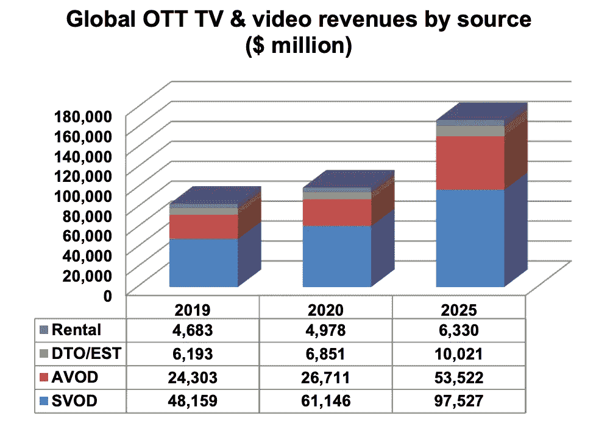
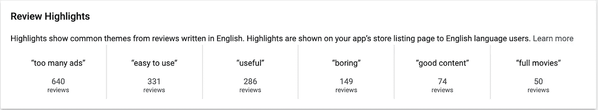
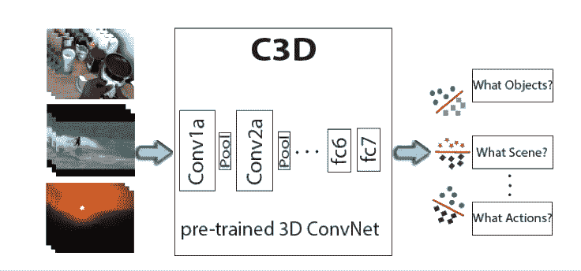
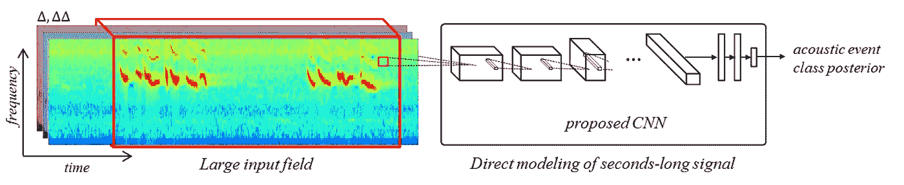
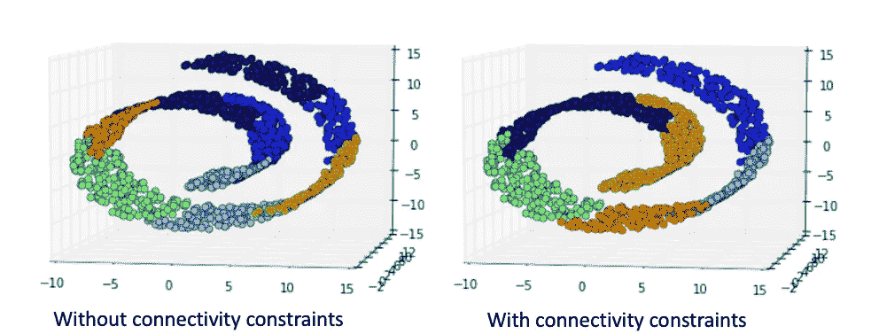
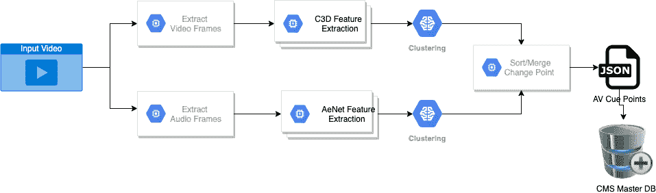
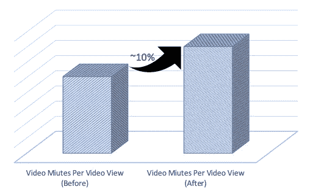
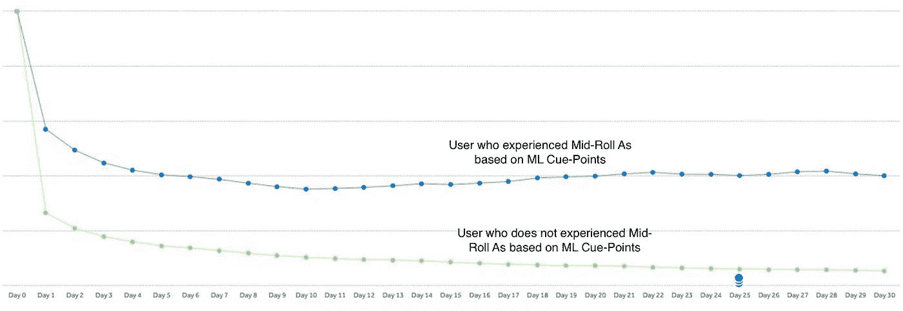

# 广告的机器学习

> 原文：<https://medium.com/analytics-vidhya/machine-learning-for-ads-2c68137defd1?source=collection_archive---------18----------------------->

图片来源:[https://www.digitaltvresearch.com/ugc/press/254.pdf](https://www.digitaltvresearch.com/ugc/press/254.pdf)

大多数采用免费增值业务模式的 OTT 公司需要在 SVOD 和 AVOD 之间找到合适的平衡点来实现增长。SVOD 是基于**订阅的**视频点播，用户拥有无广告体验，而 AVOD 是基于**广告的**视频点播，用户需要耐着性子看完广告。每个 SVOD/AVOD 都需要非常不同发展战略，每个国家都有自己的挑战。对于 AVOD 的业务，我们希望进入一个高用户保留率和高广告收入的区域。用户保持率受主要因素的影响，如内容覆盖面和多样性、个性化、视频观看体验、广告体验等。平台上的广告收入受主要因素影响，如选择、持续时间、频率、**位置**、观看体验(广告开始时间、缓冲等)。在这篇文章中，我们描述了如何使用机器学习，更具体地说，通过根据场景变化提示点正确放置中置广告，我们将广告的负面影响降至最低，这有助于增加内容消费，也导致了留存率的增加。

来自 Google play-store 控制台的评论亮点

场景变化(镜头过渡)是数字视频中镜头之间过渡的自动检测，从传统的启发式方法到最近的基于机器学习的方法，在视频处理领域有着长期活跃的研究历史。

我们的场景变换算法基于无监督的机器学习，并且使用音频/视频特征。

[时空视频特征](https://vlg.cs.dartmouth.edu/c3d/)在视频识别任务(对象、场景和动作)中学习，并基于 3d 网络，如下图所示。学习用于识别任务的 3d 网络的一些主要挑战是巨大的计算成本、捕获长上下文和较少注释的数据集。数据少的问题已经在一定程度上得到解决，因为许多领先的人工智能组织已经开源了少量数据集，例如，谷歌发布了 [youtube8m](https://research.google.com/youtube8m/) ，其中有 610 万个视频，~4K 类，3 个标签/视频。对于我们的算法，我们依赖于 C3D 时空特征，并且使用具有 50%时间重叠的 [OpenCV](https://opencv.org/) 从输入视频中提取每秒 16 个视频帧，导致每秒 4096 个特征。

image credit:[https://research . FB . com/blog/2014/12/c3d-generic-features-for-video-analysis/](https://research.fb.com/blog/2014/12/c3d-generic-features-for-video-analysis/)

对于音频功能，我们使用了 [AENet](https://arxiv.org/abs/1701.00599) 架构，该架构也使用 ConvNet 作为基本构建模块。首先使用 [FFMPEG](https://ffmpeg.org/) 从视频容器中提取音频，转换成声谱图，然后输入 CovNets 进行特征计算，如下图所示。

https://arxiv.org/pdf/1701.00599.pdf

在特征计算之后，应用时间约束[和沃德链接的凝聚聚类](https://en.wikipedia.org/wiki/Hierarchical_clustering)(即聚类内方差最小化)。基于平均轮廓系数选择聚类的数量。基于音频和视频提示点(聚类)之间的差异对它们进行排序和重新分级以供消费。重新排序的提示点连同音频和视频时间戳一起被存储为视频元数据。

以下示例显示了对合成数据进行有约束和无约束聚类的差异。由于视频中有许多帧/音频样本随着时间的推移而重复，因此对聚类应用时间约束非常重要。

image credit:[https://sci kit-learn . org/stable/auto _ examples/cluster/plot _ ward _ structured _ vs _ unstructured . html](https://scikit-learn.org/stable/auto_examples/cluster/plot_ward_structured_vs_unstructured.html)

场景变化生产流程(仅生成)

对于植入式广告放置用例，提示点通过后端服务传递给客户端，并最终根据业务植入式需求进行覆盖。我们还使用抢先计算虚拟机来降低每个视频生成提示点的成本，这需要仔细选择检查点来降低开销。

对于手动基准测试，我们从每个类型中随机选择了几个标题，发现我们的精度在 5 到 85%之间，即前 5 个场景的正确率为 85%。我们还运行了一个中置广告 A/B 实验，并发现那些中置广告由基于 ML 的提示点驱动的磁贴的消耗有了实质性的改善(~ **10%** )，并且还看到了~ **40%** 更好的保持。

A/B 中每次视频观看的视频分钟数改进

A/B 的保留视图

我们正在不断探索新的功能，以提高我们场景变化算法的精确度，如脸书人工智能研究(FAIR)团队的 [SlowFast Networks，减少提示点生成时间，并开始迈向广告选择的下一个任务，即基于用户活动和广告与视频之间相似性匹配的个性化广告。](https://github.com/facebookresearch/SlowFast)