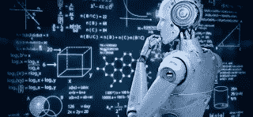
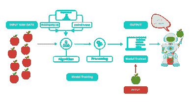
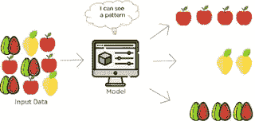
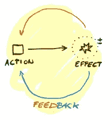

# 面向初学者的机器学习

> 原文：<https://medium.com/analytics-vidhya/machine-learning-for-beginners-630d1cc26ca3?source=collection_archive---------24----------------------->

# 什么是机器 learning❓

我们可以在搜索引擎上看到很多定义，但我们可以简单地这样说

“机器学习是用数据来回答问题”

一般来说，人类从他们过去的经历中学习，并试图在我们的未来实施这些经历。如果机器也像人类一样思考和行动，那么它可以被命名为“机器学习”。

这里你可能会产生一个疑问"*机器如何像人类一样思考和行动？*💭"

嗯，答案是“没有”。机器不能像人类一样思考和行动，但机器可以完成任何任务，即使人类不可能完成，因为它的高计算能力。

让我问你一个问题，

取 100000000 个数字的列表。它包含重复的值。你能找到数字 5 在列表中重复出现的次数吗(手动)？

不，我们不能。但是如果我们用逻辑训练机器，它可以在几秒钟内完成。

我们可以将上述情况视为机器学习的一个简单例子，现在您距离机器学习的世界只有几步之遥。让我帮助你到达那里😉。

## 数据

在机器学习中，我们需要庞大的数据集，这些数据集是训练机器的来源，在这个计算机世界中，互联网上有大量可用的数据。是时候划分数据集了。一般来说，我们会将 80%的数据视为训练数据，剩下的 20%视为测试数据，我认为这对你也是合适的。

*让我们深入主题……*

有许多机器学习技术，在这里你可以找到其中三种被广泛使用的技术。

1.监督学习👀

2.无监督学习🙈

3.强化学习👮

# 监督学习

让我们考虑一个装有苹果的盒子。这个盒子数据连同一些属性如形状和大小被提供给机器。然后机器用这些标记的数据进行训练。

将来，如果我们给机器提供一些具有相似属性的输入，那么它可以很容易地说

“这是一个苹果🍎".我们可以说，监督学习需要数据，也需要颜色、形状、大小等标签。，所以监督学习👀获得这个名字是因为它需要一个管理者来训练机器。

监督学习的应用:

1.  生物扫描仪

2.语音识别

3.垃圾邮件检测

# 无监督学习

现在我们有一辆卡车🚚里面有一些水果，像苹果、芒果和西瓜。这里的水果都是混合的。现在，这些混合数据被输入到机器中，然后机器会尝试理解这些混合数据中的模式，并将它们分成不同的组。

所以这里我们不提供任何种类的标签，如形状、颜色、尺寸等。，到机器。这意味着我们不需要这个模型的主管。所以我们称这个模型为无监督学习🙈。

无监督学习的应用:

1.产品评论分类(语义聚类)

2.电子商务网站中的产品推荐

# 强化学习

这个模型与你遇到的模型不同。该模型基于试错策略或反馈机制。在这个模型中，我们需要一个代理👮以在输出端提供反馈。

## 让我给你讲个故事，

有一天，你去超市，你需要买小麦粉，你知道它像一种粉末，但你发现有两种包装，它们看起来都很相似。你知道如果你拿错了包，你可能会受到惩罚，因为你妈妈正在家里等着你😐。所以，你拿起一包面粉，问售货员这是不是小麦粉，他可能会告诉你“是/不是，先生/女士”。所以你可以找到真正的小麦粉包。最后你从惩罚中被解救出来😂。

从那时起，你就不会忘记面粉是什么样子了。在这里，销售人员就像我们的代理人，帮助我们做出正确的选择，而你是从销售人员那里获得反馈的机器。

# 结论

最后，机器学习是发展最快的技术，你可以在这个领域找到很多就业机会。

通过阅读这篇文章，你为机器学习领域打下了基础，如果你发现这个领域很有趣，你可以成为机器学习领域的大师。

谢谢你😇。