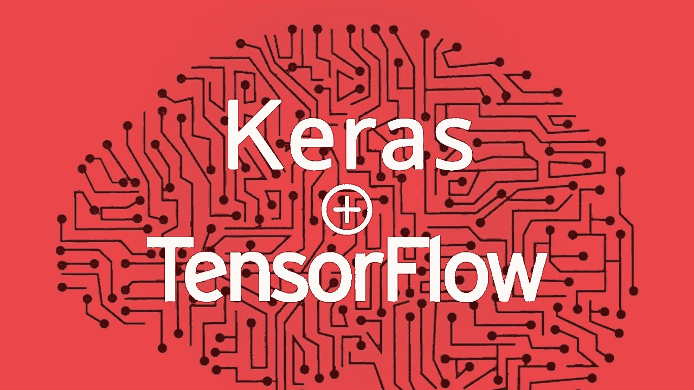
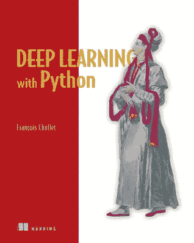
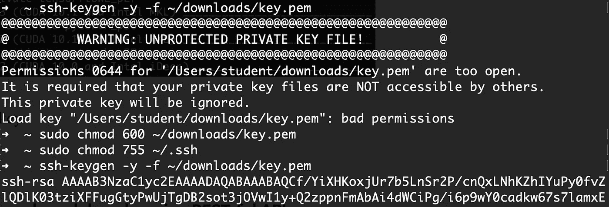
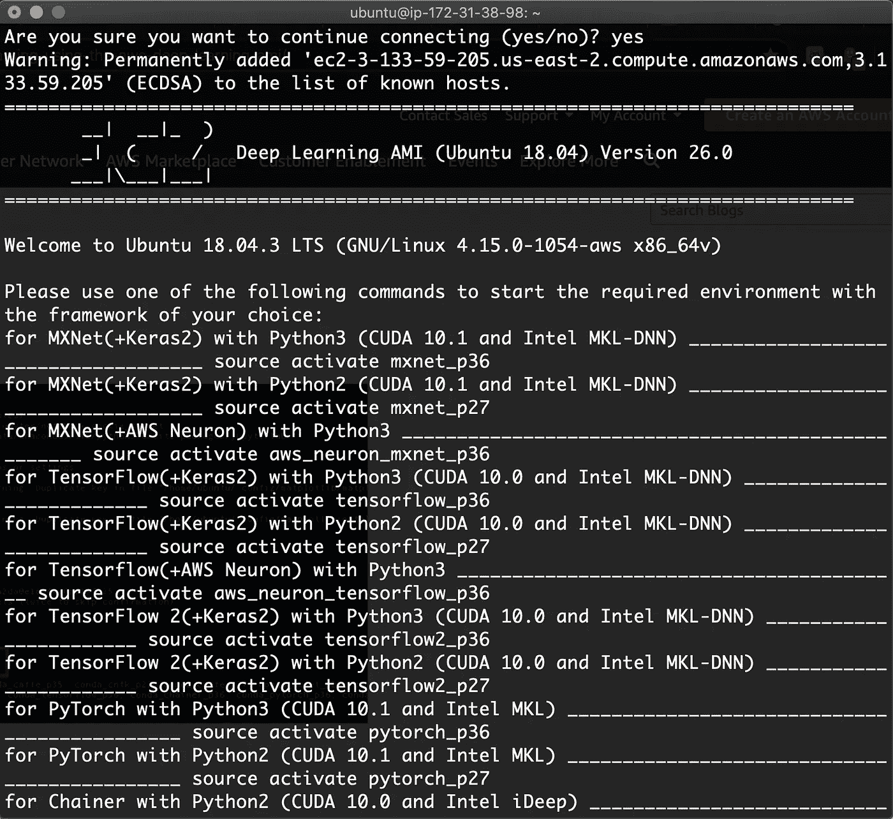

# 面向初学者的机器学习

> 原文：<https://medium.com/analytics-vidhya/machine-learning-for-beginners-84c23e090b18?source=collection_archive---------25----------------------->

> 如何设置 AWS EC2 机器学习实例以了解更多关于 Keras 模型和 jupyter 笔记本的信息。



## 机器学习的四个学习领域

根据 [TensorFlow 的网站](https://www.tensorflow.org/resources/learn-ml)，机器学习有四个学习领域:**“编码、数学、ML 理论，以及如何从头到尾建立自己的 ML 项目。”**

你会在他们的网站上找到三个课程——第一个是机器学习的基础，第二个是深入研究 ML 的理论方面，第三个是专注于 ML 的 JavaScript。

我从[的第一门课程](https://www.tensorflow.org/resources/learn-ml/basics-of-machine-learning)、【TensorFlow 的机器学习基础、开始，对四个学习领域(编码、数学、ML 理论、构建自己的项目)有了扎实的理解。

一旦你对这些积木感到舒适，你可能会想要走向第三个课程。如果您精通 JavaScript 和 MVC 框架，您可以利用 TensorFlow 网站上预先训练的模型，用它们构建一些简单的 web 应用程序！

## “第一步:了解 ML 是什么”

TensorFlow 的第一份课程表上列出的推荐读物是《K [时代的创造者 Francois Chollet 的《用 Python 进行深度学习》一书。](https://keras.io/)



TL；大卫:这本书的前四章应该足够让你开始了。

**第 1 章**介绍了重要的深度学习概念，如*输入、层、标签、目标、反向传播、*等。

> “深度学习是机器学习的一个特定子领域:一种从数据中学习表示的新方法，强调学习越来越有意义的表示的连续层。”— Francois Chollet，用 Python 进行深度学习，第 8 页。

您还将了解 ML 领域和统计学(如概率建模)之间的关系，这是早期需要学习的重要课程。ML 试图实现的大部分目标一直是统计学领域的目标，但是随着计算能力的增加，我们提高研究方法速度的能力也在增加。我建议你在继续之前完整地读完这一章。

**第 2 章**通过 ML 的张量、矩阵和微积分介绍了神经网络的数学构建模块，而**第 3 章**介绍了一些可用于训练你自己的神经网络的工具。

通读 **2.3** 对于理解数据在机器学习中是如何表示的非常有用(提示:张量)。然而，我发现自己在没有应用这些知识的情况下，无法理解日益复杂的主题，例如，通过尝试 Chollet 提供的许多示例。

在这一点上，我发现跳到第 3 章并阅读第 3 节“设置深度学习工作站”是有帮助的在回到本书之前，有一些关于如何建立正确环境的指导。

## 设置您的 AWS 工作区

除非你有一台游戏电脑和/或 NVIDIA GPU，否则你的电脑可能不是承受机器学习实验冲击的理想环境。我决定选择 AWS EC2 GPU 实例。我的第一步是按照[这篇教程学习如何连接到 AWS 实例](https://aws.amazon.com/blogs/machine-learning/get-started-with-deep-learning-using-the-aws-deep-learning-ami/)。实例是位于世界某处的服务器。我的在俄亥俄州。不错！

确保你创建了一个*PEM*key——这一步非常重要。pem 键将允许您通过 SSH magic 访问 AWS 服务器。我摆弄了一下——这很有趣——但是当我试图进入亚马逊教程的下一步时，我收到了一条错误信息。

```
WARNING: UNPROTECTED PRIVATE KEY FILE!
```

我想测试我的私钥，比如检索 AWS 实例的密钥对的公钥。

为此，我恢复了安全设置。

```
$ sudo chmod 600 ~/downloads/key.pem
$ sudo chmod 755 ~/.ssh
```



如果您遇到 pem 键错误，请尝试重新启动。

成功了！我连接到我的 AWS 实例。



确保使用 SSH 隧道命令来连接未来的实例。

```
$ ssh -L localhost:8888:localhost:8888 -i key.pem ubuntu@[the-public-DNS-address-changes-every-time]
```

按照 AWS 教程中的最后几个步骤，您应该很快就可以在浏览器中访问 jupyter 笔记本。🎉

现在，克隆到教材的 Github repo 来访问所有的练习。

```
$ git clone [https://github.com/fchollet/deep-learning-with-python-notebooks.git](https://github.com/fchollet/deep-learning-with-python-notebooks.git) cd deep-learning-with-python-notebooks
```

我想将我的 EC2 实例的后端改为 tensorFlow，所以我按照 Keras 提供的[教程中的步骤操作。我首先在我的本地机器上实现本教程中的步骤，以防万一我必须在 jupyter 笔记本上测试一些东西而不必打开 EC2 实例。我的本地机器有一个. keras 文件夹，但是没有 keras.json，所以我必须创建一个。](https://keras.io/backend/)

```
$ cd $HOME/.keras
$ touch keras.json
$ vim keras.json
```

关于 vim 的快速提醒——按 I 插入文本，完成后按 ESC，按 wq(写/退出)保存工作并退出 vim。

```
{ 
     “image_data_format”: “channels_last”, 
     “epsilon”: 1e-07, 
     “floatx”: “float32”, 
     “backend”: “tensorflow” 
}
```

回到我的 EC2 实例，当我试图运行第一个 jupyter 笔记本代码时，我得到了错误。我意识到 tensorFlow 没有安装(或激活？)在我的 EC2 实例。如果您发现自己处于同一条船上，首先通过列出为 Python 2 (pip)和 Python 3 (pip3)安装的 pip 包，检查您的实例是否有 Keras 和 tensorFlow。

```
$ pip list
$ pip3 list
```

然后，如果它不存在，用下面的命令激活 tensorFlow。

```
$ source activate tensorflow_p36
```

你现在应该能够按照课本上的例子，在你的 jupyter 笔记本上一点一点地训练模型。不错！🙌